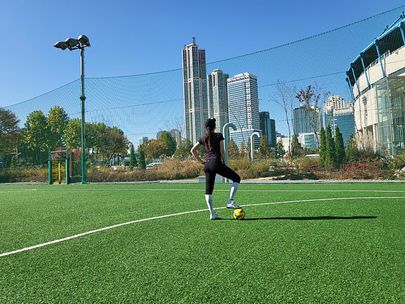
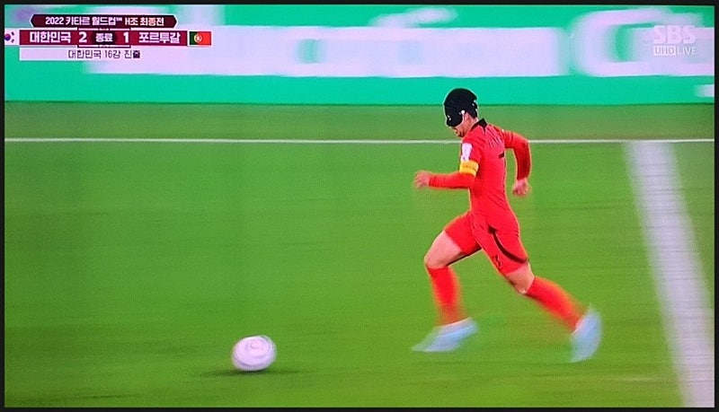
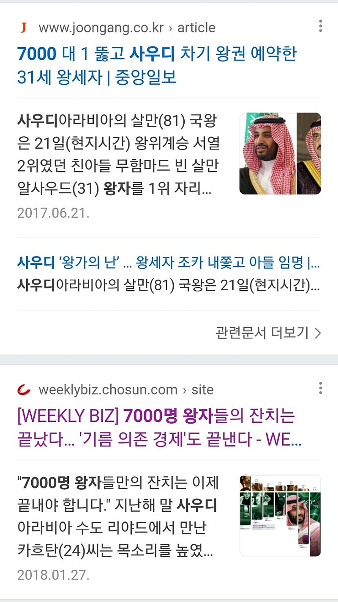
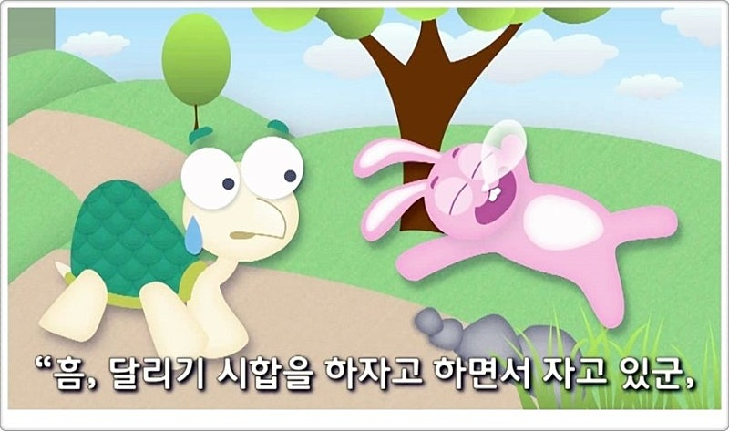

# “진짜 내가 부자 될수 있을까?” 의심을 가지고 있는 분께

- 원천 ID: EPR-CAFE-1039
- 작성자: 주는사란
- 작성일: 2022-12-24T23:38:38.773000+09:00
- 원문: https://cafe.naver.com/ranschool/1039
- 수집일: 2026-09-21
- 텍스트 정리: HTML 문단 순서 유지, 빈 문단·제로폭 공백만 제거. 원본 HTML·JSON 별도 보존. 이미지는 아래에 모아 보관하며 원래 배치는 HTML에서 확인.

## 원문 본문

<!-- P001 -->
최근에 월드컵이 끝났습니다. 우리나라가 16강을 진출한것 부터 ‘월드컵의 기적’이라는 일이 꽤 있었습니다.저는 축구를 굉장히 좋아해서 일주일에 두번 풋살을 하고, 영국축구리그(EPL)는 빠짐 없이 보는데요. 축구에서는 기적 이랄 만한 일이 꽤 자주 일어납니다. 거의 꼴등팀이 1등팀을 이기기도 합니다.

<!-- P002 -->
돈버는 것도 똑같다고 생각합니다.

<!-- P003 -->
제 주위에는 사회적으로 ‘똑똑하다’는 기준을 갖춘 사람들이 꽤 많습니다. 근데 웃긴건, 똑똑한 순서대로 돈을 잘버는게 아닙니다. 저는 제 친구중에 제일 똑똑하지 않습니다. 아니 어쩌면 하위권일거라 생각합니다. 근데 돈을 아마 제일 잘벌겁니다.(자랑 죄송합니다)

<!-- P004 -->
아마 이 글을 보신 분들도 주위사람을 생각해보세요. 똑똑한 순서대로 돈을 잘 벌고 있나요? 그렇지 않을겁니다. 물론 똑똑이란 기준은 돈을 잘버는데에 ‘도움’을 주는것은 맞습니다. 근데 도움 그 이상도 그 이하도 아닙니다.

<!-- P005 -->
어떻게 했길래 축구에서 약팀이 강팀을 이길수 있었을까요?

<!-- P006 -->
어떻게 했길래 안 똑똑한 사람이 똑똑한 사람보다 더 잘 살 수 있었을까요?

<!-- P007 -->
약팀이 강팀을 이길수 있는 방법

<!-- P008 -->
축구이야기를 자꾸해서 죄송한데요. 축구를 보면 인생과 비슷합니다. 축구에서 약팀이 강팀을 상대할때 쓰는 전략이 있습니다. 점유율(팀에서 공을 가지고 있는 비율)은 포기합니다. 쉽게 말해 공을 많이 잡으려고 노력하지 않습니다. 왜냐면 잡으려고 간다고 해서 잘 뺏기도 어려울뿐아니라, 체력이 소진되서 뭘 해볼수가 없거든요.

<!-- P009 -->
대신, 상대방이 실수할때까지 기다리다가 역습을 노립니다. 얼마전 월드컵 조별리그에서 우리나라와 포루투갈 경기 전략도 이랬습니다. 포루투갈은 솔직히 이길수 없는 상대였습니다. 그래서 우리나라는 점유율은 포기하고 상대가 실수할때까지 기다렸다가 역습 할 기회를 잡고 있었습니다. 그리고 실제로 상대방이 실수할때 손흥민이 역습으로 가져가서 황희찬에게 패스해 2-1 역전 승리를 하고 16강 진출을 했습니다.

<!-- P010 -->
안 똑똑해도 부자가 될수 있는 방법

<!-- P011 -->
전 세계사람을 똑똑함으로 줄 세울수 있다고 해보겠습니다. 과연 소득이 그 순서대로 동일할까요? 그렇지 않을겁니다. 뭐 이건 똑똑함 뿐 아니라 외모도 마찬가지 입니다. 요즘은 얼굴로도 먹고 살수 있는 시대입니다. 그렇다고 예쁘고 잘생긴 순으로 세웠을때 재산이나 버는 소득이 똑같을까요? 당연히 그렇지 않을 겁니다.

<!-- P012 -->
누구는 똑똑했기때문에 부자가 되지만, 누구는 똑똑하지 않아도 부자가 됩니다. 반면, 또 누구는 똑똑해도 부자가 안됩니다.

<!-- P013 -->
도대체 뭐 때문일까요?

<!-- P014 -->
누구에게나 때와 기회가 온다

<!-- P015 -->
옛날말에 이런말이 있습니다. 누구에게나 인생에 3번 기회가 있다. 여러분은 혹시나 그 기회를 몇번이나 놓치셨나요? 놓치셨다면 왜 놓치셨나요?

<!-- P016 -->
최근에 카페글을 보니 ‘절박’하다는 분들이 계셔서 꼭 하고 싶은 말이 있었습니다. 낙심이나 절망이나 포기할 필요가 없습니다. 어짜피 누구에게나 기회는 옵니다. 지금 놓쳤을수 있습니다. 근데 어짜피 또 옵니다. 심지어 축구경기 90분안에도 역습찬스는 최소 4-5번은 무조건 오는걸요? 우리 인생을 평균 수명 80년만 잡아도 역습 찬스가 몇번이나 올수 있을까요? 말 안해도 잘 아실거라 생각합니다.

<!-- P017 -->
조심해야 할 것

<!-- P018 -->
근데 여기서 중요한 사실이 있습니다. 제가 말씀드린 기회란건 꼭 좋은 기회만 말하는 것은 아닙니다. 나쁜 기회(위기)도 옵니다. 누구에겐 그 시기가 지금일수 있습니다. 쉽게 말해 지나쳐야 하는 기회도 온다는 겁니다. 좋고 나쁜 시기는 누구에게나 있습니다.

<!-- P019 -->
이번엔 이렇게 생각해 보겠습니다. 여러분이 지금 당장 원하는 수준만큼의 부자가 될수 있습니다. 근데요. 그렇게 바라던 부자가 되었는데, 마약에 빠진다거나 아니면 정말 소중한 사람이 돈 때문에 안좋은 길로 가게 되었다고 해보겠습니다. 그래도 부자가 되고 싶으신가요? 아닐겁니다.

<!-- P020 -->
사우디에는 왕자가 7700명이 넘습니다. 모든 왕자들은 매년 몇만불의 돈을 받습니다. 너무 부럽죠? 우리가 원하는 경제적 자유? 아니 그걸 넘어서 슈슈슈퍼 금수저 입니다. 근데 아이러니하게도 왕자들중에 제대로 인생을 사는 사람이 없습니다. 대부분은 마약에 중독되어 있거나, 방탕한 생활만 하다보니 행복 자체를 모른다고 합니다. 심지어 그중 한명이 왕이 되면 왕이 된 사람은 다른 왕자들이 자기 자리를 위협할까봐 다른 왕자들을 거의 다 죽이려고 하기때문에 피신생활만 해야한다고 하네요. 이래도 부러우신건….아니시죠?

<!-- P021 -->
축구에서 역습을 할때 주의해야할게 있습니다. 역습 기회인줄 알고 나갔다가 제대로 슈팅까지 못하면 상대방이 역으로 역습하기때문에 바로 골이 먹힙니다. 혹은 역습기회를 살려서 나갔는데 실력이 부족해서 공이 뺏겨도 바로 골이 먹힙니다. 그리고 그렇게 골이 먹히면 팀 분위기가 엉망이 되고 큰 골차이로 지게됩니다.

<!-- P022 -->
반대로, 제대로된 역습기회를 살리면 팀 사기는 미친듯이 올라가며,  우리나라처럼 16강 진출이라는 엄청난 기적이 생기기도합니다.

<!-- P023 -->
제가 말씀드리고 싶은 결론은 이렇습니다.

<!-- P024 -->
인생에 기회와 때는 언제 올지 모릅니다. 우리는 개똑똑하고 미친듯이 예뻐서 얼굴로 먹고살 정도가 아닙니다. 인정해야 합니다. 그리고 지금까지 안 좋은 기회를 좋은거라고 착각하고 잡았을수도 있습니다.

<!-- P025 -->
우리가 잘 아는 이야기중에 토끼와 거북이 이야기가 있습니다. 토끼는 당연히 거북이를 이길줄 알았습니다. 근데 아시다시피 토끼는 졌습니다.

<!-- P026 -->
그럼 과연 토끼와 거북이가 다시 경주를 한다면 토끼가 이길수 있을까요? 저는 꼭 그렇지 않을수 있다고 생각합니다. 토끼가 뛰다가 넘어져서 다리가 부러질수도 있고, 이번에는 알람까지 맞추고 잤는데도 못 일어날수도 있는거거든요. (너무 억지인가;;ㅎㅎ)

<!-- P027 -->
인생은 모릅니다. 덧셈 뺄셈 하듯이 꼭 인생이 노력한 만큼 +가 되는게 아니듯 지금 내가 엄청난 악조건에서 시작한다고 해서 늦은것도 아닙니다. 지금까지 살면서 인생이 꼭 내 생각대로..내 예상대로.. 가지 않는다는건 잘 알고 계실거라 생각합니다.

<!-- P028 -->
그래서 우리의 인생전략은 이렇습니다. 기회를 보고 역습찬스를 노리는 것입니다. 근데요. 역습 기회가 맞는지를 파악할 능력과 역습기회가 왔을때 실수하지 않고 공을 골대까지 가져가서 골을 만들수 있는 능력이 있어야 합니다.

<!-- P029 -->
이런 능력은 어떻게 만드나요?

<!-- P030 -->
이야기가 길어졌는데 진짜 이것만 이야기 하고 마무리 하겠습니다. 이 2가지 능력을 만들어 주는 기초중의 기초 한가지를 말씀드리겠습니다. 같은 위기 앞에서 어떤 반응을 선택할거냐입니다.

<!-- P031 -->
지금 제주도에 강풍이 불어서 비행기가 결항이 많이 되었다고 합니다. 비행기가 결항이 되면 사람들 반응은 두개로 나뉩니다.

<!-- P032 -->
“나 좀 더 쉬라는 이야기구나, 좀더 쉬다가야지”

<!-- P033 -->
또는

<!-- P034 -->
“아씨..빨리 가야되는데, 결항 안된 비행기가 뭐지 미치겠네”

<!-- P035 -->
비행기 결항이 다 똑같이 되도 사람마다 반응이 다릅니다. 반응은 내가 선택하는 것입니다.

<!-- P036 -->
여러분은 지금 어떤 반응을 선택하셨나요?

## 본문 이미지

## 원문에 포함된 링크

- #
