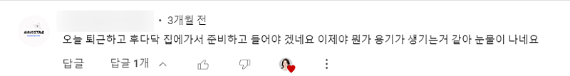
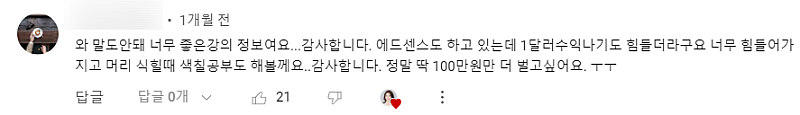
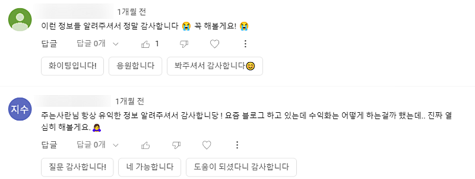
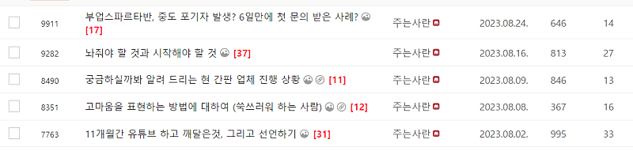
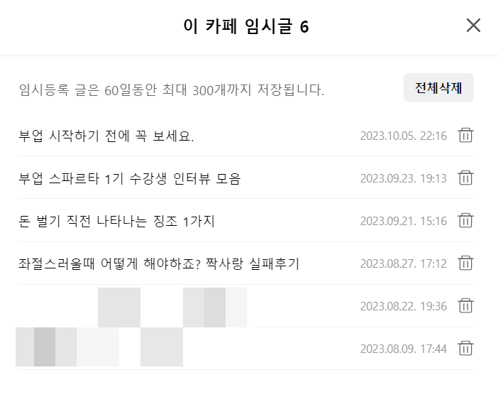
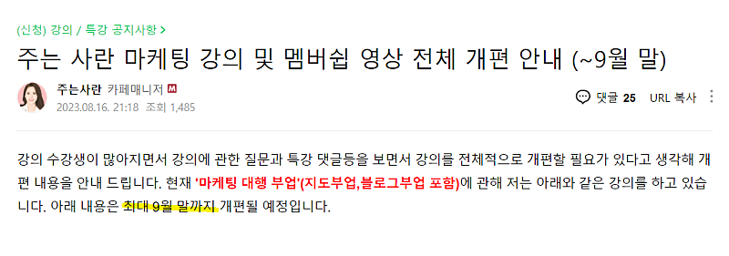
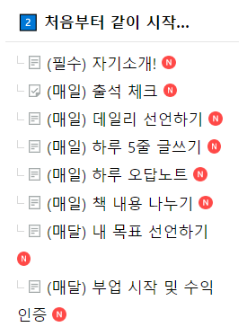

# "해야지" 병에 걸린 분들에게

- 원천 ID: EPR-CAFE-12148
- 작성자: 주는사란
- 작성일: 2023-10-06T12:49:39.690000+09:00
- 원문: https://cafe.naver.com/ranschool/12148
- 수집일: 2026-09-21
- 텍스트 정리: HTML 문단 순서 유지, 빈 문단·제로폭 공백만 제거. 원본 HTML·JSON 별도 보존. 이미지는 아래에 모아 보관하며 원래 배치는 HTML에서 확인.

## 원문 본문

<!-- P001 -->
부업을 알려드리다보면, 이런 댓글이 많이 달립니다.

<!-- P002 -->
이번엔 진짜 해볼게요

<!-- P003 -->
아마 이 글을 읽은 분들도 제가 소개한 부업을 최소 1개는 보셨을 겁니다. "해야지" 라고 생각한것 중에 몇개를 해보셨나요? (혼내는거 아닙니다 ㅎㅎ) 저는 이런걸 "해야지" 병이라고 부릅니다. "해야지, 해야지" 하는데 결국 못하는 거죠.

<!-- P004 -->
오늘 글에서는 이 "해야지" 병을 치료하는 방법을 알려드리겠습니다. 제가 지금 막 두달간 걸린 "해야지" 병을 치료했거든요. 아마 "이 부업 진짜 해야지" 라고 생각했다가 못하고 있는 "해야지"병 환자(표현이 격한점 양해 부탁드립니다ㅎㅎ) 분들은 이 글을 읽으시면 바로 치료가 되실겁니다. 제가 그랬거든요.

<!-- P005 -->
종종 저도 오해를 받는데요. 영상에서 보시면, 제가 의지력과 실행력이 개 쩔어 보이는데 그렇지 않습니다. 원래 영상이란건 좋은 모습만 보여주는거 아니겠어요? ㅎㅎ 속지마세요 ㅎㅎ

<!-- P006 -->
저는 최근 두달간 "해야지" 병에 걸려있었습니다.

<!-- P007 -->
그 중 첫번째로는, "카페에 글 써야지" 라고 생각하고 있었는데요. 몰랐는데 오늘 보니 제 마지막 카페 글이 벌써 한달 반이 넘었네요. 심지어 마지막 글은 강의 관련 글이고, 제 생각을 적는 글은 두달 가까이 됐어요. 두달동안이나 "글 써야지" 하고 있었던 겁니다.

<!-- P008 -->
나름 핑계를 대보자면, 부업스파르타반 강의랑 블로그 강의 수정때문에 바빴구요. 나름 글을 쓰려고 카페에 와서 끄적거리긴 했어요. 임시글을 6개나 저장해 놓고 마음에 안 들어서 발행을 안했네요 ㅋㅋㅋㅋㅋㅋㅋㅋ

<!-- P009 -->
두번째로는, 블로그 강의와 플레이스 강의 수정을 9월 말까지 한다고 했는데요. 사실 아직도 다 못했어요;; (죄송합니다) 나름 핑계를 대 보자면, 처음에는 수정하고 싶은 몇가지 부분만 하려고 했는데요.......................막상 하다보니 마음에 안드는 구석이 많은거예요. 그래서 제 강의를 스스로 다시 다 들어보고, 자막도 좀 더 바꾸고, 영상도 다시 찍고....................어쩌고............하다보니 10월 초네요;;

<!-- P010 -->
플레이스 강의(지도부업 강의)도 문의가 많은데, 제가 지금 개편 하고 있거든요. 근데 또 막상 보니깐 수정하고 싶은게 많아요...........................보면 볼수록 더 수정하고 싶고.................거의 블랙홀이예요.

<!-- P011 -->
결론은 저도 지금 "해야지" 병에 걸린 환자라는 의미입니다. 하지만 전 방금 치료 되었어요. 이 글이 올라갔다는건 첫번째 "해야지" 병을 치료했다는 의미일 거구요. 두번째로, 블로그 강의는 일요일이면 수정이 거의다 완료 됩니다. (일주일간 편집기간이 끝나면 수강생분들 기준 다음주면 수정된걸 보실수 있을거예요) 마지막으로 플레이스 강의는 아직 공지 조차 못 올렸는데요. 그건 오늘 알려드릴 이 방법으로 바로 치료에 들어갈 예정입니다. 일단 그 방법을 알려드릴게요.

<!-- P012 -->
그 방법은 '번개치기' 입니다. 번개치기가 뭐냐면, 벼락치기보다 더 센거예요 ㅋㅋㅋㅋㅋㅋㅋㅋㅋ어릴때 벼락치기 많이 하셨죠? 그겁니다. 근데 그걸 더더더 촉박하게 시간을 잡아두고 그 시간까지 미친듯이 하는겁니다. 지금 제가 이 글도 '번개치기'로 하고 있어요. 제가 지금 이 글을 쓰기 시작한 시간은 오후 12시 20분 입니다. 근데 제가 12시 50분에 필라테스 수업을 예약해 놨어요. 지금 사무실인데, 사무실에서 필라테스까지 가는데 5분이 걸려요. 그럼 저는 45분에 글을 끝내야겠죠? 지금 여기까지 쓰니깐 벌써 39분이네요.

<!-- P013 -->
번개치기를 하면 장점은 시간이 촉박해서 미친듯이 할수 있어요. 저도 어제 이 글을 쓰려고 2시간을 생각했는데, 못쓰고 오늘 새로 썼습니다. 근데 지금 완성했거든요. 물론 어제 글보다 더 마음에 안듭니다. 근데 그냥 발행하려구요.

<!-- P014 -->
물론 번개치기의 단점도 있습니다. 바로 수정할게 많다는 거죠. 빨리했으니깐 당연한거죠. 근데 그럼 어떤가요? 수정하면 되죠. 지금 이 글도 수정할게 많네요;;

<!-- P015 -->
지금 43분이라 마무리 지어야 하는데요. 이 글을 쓰다보니 또 아이디어가 생각났어요. 지금 제 블로그 강의 수강생 분이 500명이 넘고, 플레이스 강의 수강생 분이 100분이 넘는데요. 다들 "해야지" 병에 걸리신것 같아서 이걸 이 '번개치기' 로 치료해 드려야 겠어요.

<!-- P016 -->
옛날에 제가 학원할때 했던건데, '번개치기 스터디'라고 해서 애들을 방 하나에 다 가둬놓고 공부 다 안하면 안 내보냈거든요ㅋㅋㅋㅋ 그렇게 아예 가둬놓고 '번개치기 스터디' 로 시간 정해놓고 플레이스랑 블로그를 한 일주일간 빡시게 해보는거죠. 마케팅 대행사 창업반 어떻게 할지 고민하고 있었는데, 이렇게 하면 되겠어요. 이 아이디어는 좀더 디벨롭 해서 다시 글을 써보겠습니다.

<!-- P017 -->
여러분은 어떤 "해야지" 병에 걸리셨나요? 고치고 싶다면 언제 벼락치기를 할건지 오늘 당장 언제 할건지 '데일리 선언하기'를 해보시는건 어떨까요?

<!-- P018 -->
앗 49분이네요. 필라테스 늦었으니 일단 발행하고 나중에 수정하도록 하겠습니다. 뿅

## 본문 이미지

## 원문에 포함된 링크

- #
