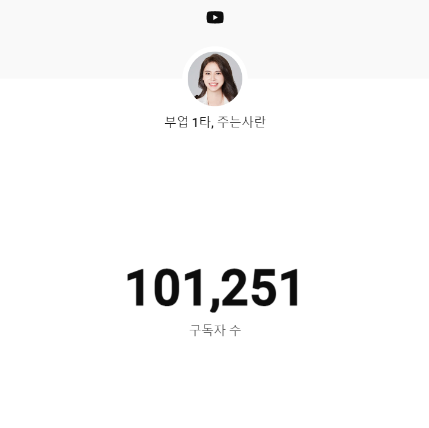
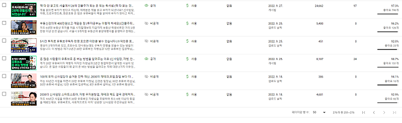

# 주는사란 유튜브 10만 기념 선언하기

- 원천 ID: EPR-CAFE-12228
- 작성자: 주는사란
- 작성일: 2023-10-08T19:24:21.137000+09:00
- 원문: https://cafe.naver.com/ranschool/12228
- 수집일: 2026-09-21
- 텍스트 정리: HTML 문단 순서 유지, 빈 문단·제로폭 공백만 제거. 원본 HTML·JSON 별도 보존. 이미지는 아래에 모아 보관하며 원래 배치는 HTML에서 확인.

## 원문 본문

<!-- P001 -->
드디어 구독자 10만이 넘었습니다. 너무 감사합니다.

<!-- P002 -->
첫 영상 업로드 일을 보니 이제 막 1주년이 넘었네요.

<!-- P003 -->
제가 카페 글을 쓸 때는 제 이야기 보다는 글을 읽는 분에게 도움되는 글을 적으려고 하는데요. 오늘은 1년간 유튜브 10만을 만들면서 배운 몇가지 것들에 대해 스스로 정리해보는 시간을 가질까 합니다. 추가로 다음 1년간의 계획도 세워보려구요. 원래 계획 이런걸 공개하는게 좀 부담스러워서 일기로만 적는데, 꼭 해내야겠다는 생각에 적어봅니다.

<!-- P004 -->
<1년간 배운것>

<!-- P005 -->
1.  인생이 바뀔거라는 착각

<!-- P006 -->
1년 전에 이런 생각을 했습니다. "구독자 10만이 된다면 인생은 바뀔거야" 뭔가 구독자 10만에 대한 환상이 있었던것 같아요.

<!-- P007 -->
근데 현실은 달라진게 아무것도 없습니다. 달라진게 있다면, 13평짜리 사무실이 생겼다는 정도? 회사에 대해 같이 이야기 할수 있는 직원이 늘었다는 정도? 지나가다가 아~주 종종 알아본다는 정도?

<!-- P008 -->
돌아보면 저는 10년간 환상속에 살았던것 같아요. 학원할때는 "20살에 60평짜리 학원을 하면 멋있어 보이겠지?" "25살에 벤츠 끌면 있어보이겠지?"  돈도 그랬어요. "월 천만원 벌면 얼마나 행복할까?" "월 1억 벌면 더이상 일 안해도 되겠지?"

<!-- P009 -->
현실은 달랐어요. 대학을 다니면서 학원을 운영한다는건 멋있어 보이는게 아니라, 대학생활과 돈을 바꾸는거였구요. 25살에 벤츠를 끌면 있어보이는게 아니라 카푸어가 된다는 의미였어요. 월 천만원 벌면 행복할줄 알았는데, 그만큼 일을 더 해야한다는 의미였구요. 월 1억을 벌면, 일은 1억원 어치를 하는데 부가세 10% 소득세 약 40% 등등 세금을 더 많이 낸다는 의미였어요. 책임감은 1억원어치인데 말이죠.

<!-- P010 -->
물론 착각을 했기 때문에 그 '기대'로 실행력을 높일수 있었던 것도 같아요. 근데 이젠 착각 대신 계획을 세우기로 했어요. 그 계획중 일부는 맨 아래에 있습니다.

<!-- P011 -->
2. 초심 잃기

<!-- P012 -->
최근에 한 댓글을 봤습니다.  "초심을 잃으신것 같아요. 구독취소합니다" 상처가 안됐다면 거짓말이지만, 멘탈이 약한편인데도 생각보다는 큰 상처는 아니었어요. 왜냐면 초심을 안 잃었거든요.

<!-- P013 -->
근데 오히려 이 글을 보고 이제 초심을 잃어야겠다고 생각했어요. 처음에는 구독자 한분한분을 기억하고 댓글을 달아주는것에 집중했어요. 근데 이제는 그러지 말아야겠어요. 아무리 노력해도 모두를 만족시킬순 없거든요. 어쩔수 없이 제가 도움을 드릴수 있는 분들에게만 선택적으로 드릴수 밖에 없을것 같아요. 오히려 모두를 만족할수 있을거란 욕심이 모두를 만족시킬 수 없다는걸 알았거든요.

<!-- P014 -->
대신 진짜 제가 도움드릴수 있는 분들을 찾아서 제대로 도움드리고 싶어요. 그래서 앞으로 소개하는 부업의 퀄리티도 신경쓰구요. 이미 런칭한 강의도 지속적으로 리뉴얼하구요. 새로 오픈하고 싶은 강의도 제대로 선별을 해서 도와드려야겠어요.

<!-- P015 -->
3. 더하기 세계와 곱하기 세계

<!-- P016 -->
저는 요즘 '돈버는 것' 에 관한 모든 의사결정은 딱 이걸로만 하고 있습니다. 자세한 내용은 이전에 글에 썼으니 참고해주세요.

<!-- P017 -->
최근에 큰 깨달음 얻은 후, 11개월간 복잡했던 마음이 너무 편안해졌습니다. 약 2주정도 이 깨달음대로 실천했더니 경제적으로도 약 2.3배 정도 수익이 늘어났습니다. ...

<!-- P018 -->
cafe.naver.com

<!-- P019 -->
4. 사랑하기

<!-- P020 -->
좀 오글거리지만, 저는 이번 1년간 사랑하는 법을 배운것 같아요. 특히 함께 하는 팀원을 사랑하는 방법을요. 저는 지금 민석님과 대환님 (0원에서 300만원 30일 챌린지 출연함) 두분과 사무실을 쓰고 있어요. 민석님은 이제 저랑 일한지 1년이 됐구요. 대환님은 이제 3개월차예요. 그외에 마케팅 대행사를 전담해주고 있는 직원과 프리랜서분도 있지만 일단 두분 이야기만 해볼게요.

<!-- P021 -->
저는 민석님과 만나기 전에 약 70명 넘는 직원을 고용해봤어요. 심지어 주는사란을 통해 알게된 구독자분 중에 총 7명을 채용했었구요. 지금은 그 중 민석님만 유일하게 남았네요. 근데 민석님과 함께한 1년동안 왜 제가 그전에 실패했는지를 배운것 같아요.

<!-- P022 -->
방금 말한 1년간 배운점이라고 말한 4가지 모두에 대해 민석님께 배운게 많아요. 아~주 가끔은 진짜 짜증나게 밉다가도, 꽤 종종 안쓰럽고, 가끔은 지켜주고(?) 싶기도 하고, 아주 높은 비율로 감사해요. 대환님과는 3개월밖에 같이 하지 않았지만, 배울점이 정말 많구요.

<!-- P023 -->
그래서 지금 직원을 채용하고 싶은데 무섭기도 합니다. 진짜 이분 두분 만큼이나 새로운 분에게 마음을 줄수 있을까? 라는 생각도 들구요. 뭐 두분은 어떤지 모르겠지만, 그냥 저는 이 두분 덕에 어떻게 사람을 사랑할수 있는지 배운것 같아요. 이게 가장 감사하구요.

<!-- P024 -->
생각보다 길어졌는데, 결론은 간단합니다. 1년간 배운게 참 많아요. 원래 제가 T라 이런 감성적인말 못하는데요. 주말 저녁이라서인지 1주년이라는 벅차오름 때문인지 모르겠는데 감성적이게 되네요.

<!-- P025 -->
감성적인 이야기는 여기까지만하고, 다음 1년의 계획을 세워봅니다.

<!-- P026 -->
<목표>

<!-- P027 -->
첫번째 목표.

<!-- P028 -->
얼마전에 민석님한테 물어봤어요. "민석님은 목표가 뭐예요?" 민석님이 그러시더라구요. "란님의 목표를 이뤄주는거요." 눈물 나진 않았는데, 감사했어요ㅋㅋㅋㅋㅋㅋㅋㅋ

<!-- P029 -->
여튼 그래서 제 첫번째 목표는 민석님 월급 개많이 주는거예요. 지금도 가능한 많이 드리려고 하는데, 그냥 더더더더 많이 주고 싶어요. 민석님은 돈때문에 일하는 스타일은 아닌데, 그냥 그래서 더 많이 주고 싶어요.

<!-- P030 -->
대환님도 3개월간 정말 0원에서 지금의 간판회사가 되기까지 키우느라 고생많으셨는데, 더 많이 가져가게 해드리고 싶어요. 그러려면 제가 좀더 빡세게 일해야겠네요;;ㅎㅎ

<!-- P031 -->
두번째 목표.

<!-- P032 -->
두번째 목표는 마케팅 대행사를 키우는거예요. 1년간 유튜브를 하면서 알게된건데요. 근데 유튜브 하는 것 만큼이나 사업하는 분들을 마케팅 해주고 그 회사를 같이 키우는것 자체가 너무 재밌더라구요. 부업스파르타반 하면서도 그렇구요. 같이 회사를 키우는 그런거요.

<!-- P033 -->
버는 돈만 봤을때는 마케팅 대행사 자체를 더 키울 필욘 없어요. 지금 너무 최적화 되어있거든요. 마음에 맞는 클라이언트, 원하는 만큼의 대행료, 맡고 있는 담당자까지. 만약 여기서 마케팅 대행사를 더 키우려면 고객사를 더 받아야하구요. 그러려면 직원도 더 채용해야하고, 또 그분들 교육해야하고... 이런게 솔직히 귀찮거든요. 그래서 그냥 딱 지금 버는 돈만 게속 벌면서 유지하려했는데요.

<!-- P034 -->
근데 1년간 유튜브 하면서 마음이 바뀌었어요. 제대로 키워볼거예요. 2024년 9월 말까지 약 50곳 정도 더 받을 생각이구요. 마케팅 유튜브도 키울 생각이고, 마케팅 대행사 직원도 8명 더 채용할 예정입니다.

<!-- P035 -->
1주년기념으로 배운점과 앞으로의 1년의 목표를 적어봤는데요. 오늘 글은 감성이 좀 충만하네요. 내일 되면 오글거려서 지울지 모르지만 일단 오늘은 발행해보겠습니다 ㅋㅋㅋㅋ

## 본문 이미지

## 원문에 포함된 링크

- #
- https://cafe.naver.com/ranschool/9282
