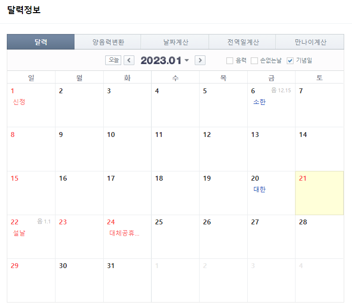
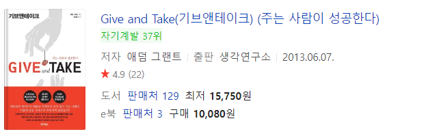
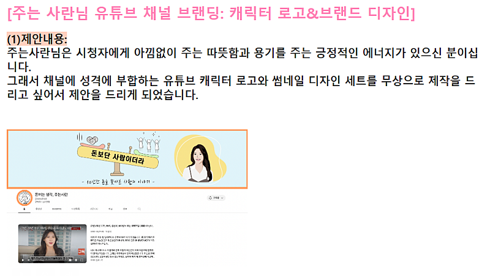
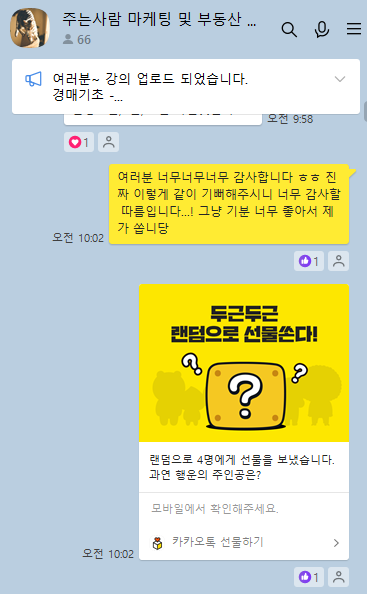
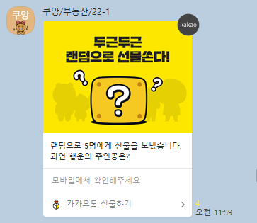

# 2023년 1월 22일, 부자될 사람과 아닌 사람 판별 가능한 날

- 원천 ID: EPR-CAFE-1226
- 작성자: 주는사란
- 작성일: 2022-12-30T18:24:56.990000+09:00
- 원문: https://cafe.naver.com/ranschool/1226
- 수집일: 2026-09-21
- 텍스트 정리: HTML 문단 순서 유지, 빈 문단·제로폭 공백만 제거. 원본 HTML·JSON 별도 보존. 이미지는 아래에 모아 보관하며 원래 배치는 HTML에서 확인.

## 원문 본문

<!-- P001 -->
2023년 1월 22일 무슨 날인지 아시나요?

<!-- P002 -->
설날입니다. ㅎㅎ 설날이 2023년에 부자될 사람과 아닌 사람을 어느정도 판별할수 있는날입니다. 어떻게 판별할수 있는지와 걸러지지 않기 위해서 해야하는 것을 알려드리겠습니다.

<!-- P003 -->
이 카페의 이름은 '기버'카페입니다. '기브앤테이크'라는 책에서 '주는사람 = 기버'에서 가져온 것인데요. 이 단어가 너무 좋아 제 유튜브 이름도 주는사람 + 제 이름의 '란' 을 합쳐서 '주는사란'으로 만들었습니다.

<!-- P004 -->
설날에 부자 될 사람 판별해준다더니 갑자기 카페 이름이랑 무슨 상관이야? 하실수 있는데요. 설날이 여러분이 기버가 될수 있는 날이기 때문입니다. 이 카페에 계신 분이라면 '왜 기버가 되야 부자가 되는지'는 아실거라 생각합니다.

<!-- P005 -->
그래서 2023년 1월 22일 이 날에 여러분이 '누구한테' '무엇을' '어떻게' 나누느냐가 여러분이 2023년 부자가 될수 있는지 아닌지가 나올겁니다.

<!-- P006 -->
어떻게 나눠야 할까

<!-- P007 -->
최근에 온 메일중 일부입니다. 제가 1편 영상에서 '로고 사업'을 썼다보니, 아래처럼 로고 디자인을 무료로 해주겠다는 분이 벌써 4분째인데요.

<!-- P008 -->
첫번째로 제게 제안 주신분에게는 제게 주신 로고의 약 3배 이상의 값어치를 드렸습니다. 제가 이렇게 이분께 보답드린 가장 큰 이유는 '먼저' 나눴기 때문입니다.

<!-- P009 -->
사실 이 4분 말고도 제게 '제안하기'로 연락오신 분들이 많습니다. 근데 대부분의 제안하기는 '나눔'이 아닌 '거래' 였습니다.

<!-- P010 -->
"제게 이런걸 알려주시면, 제가 이렇게 하겠습니다."

<!-- P011 -->
"제가 이렇게 할테니깐, 이렇게 해주시면 안될까요?"

<!-- P012 -->
그래서 사실 답변 드리지 않았습니다. (죄송합니다ㅠㅠ) 제가 제 유튜브 이름을 그렇게 지을만큼 중요하게 생각하는건 '나눔'입니다. 근데 나눈다는 사실 자체보다 더 중요한건 '순서' 거든요. 먼저 나누지 않으면, 나눔이 아닙니다.

<!-- P013 -->
제가 돈을 받고 강의를 하는걸 '기버'라고 생각하진 않을겁니다. 오히려 제대로 안하면 욕을 하고 환불을 하겠죠.  반대로, 제가 뭘 주겠다고 한적도 없는데 카페활동을 열심히 하는 분이 계시다고 해보겠습니다.(쿠앙님 광언니님 항상 감사합니다) 저는 너무 감사한 마음에 그분들께 소소한 선물을 드렸다고 해보겠습니다. 그럼 누가 '기버' 일까요? 카페활동을 열심히 해주신 분일겁니다. 제가 그분들께 받기만 한다면 테이커(받는것 만큼도 안 주는 사람)가 될것이고, 그분이 열심히 해주신 만큼 소소한 마음의 표시라도 했다면, 매쳐(받는것 만큼 돌려주는 사람)라도 된 것입니다.

<!-- P014 -->
무엇을 나눠야 하나요?

<!-- P015 -->
설날은 기버가 될수 있는날입니다. 카페에 보니깐 이런 글을 쓰신 분들이 있더라구요. "기버가 되고 싶어요" "열심히 해서 기버가 되겠습니다" "부자되서 나눌수 있었으면 좋겠어요"

<!-- P016 -->
기버는 아무런 노력이 없어도, 부자가 아니어도, 그냥 나누면 됩니다. 몇십만원짜리 몇백만원짜리를 나누라는 소리가 아닙니다. 몇만원 몇천원이어도 좋습니다. 아니면 손편지도 좋습니다. 그게 '기버'의 첫 걸음이거든요.

<!-- P017 -->
누구한테 나누죠?

<!-- P018 -->
제가 얼마전에 진짜 감동 받았던게 하나 있었는데요. 제가 수강생 단톡방에 1만 돌파하면서 랜덤 선물 이벤트를 했었습니다.

<!-- P019 -->
1기 수강생 분중에 한분이 "기버의 삶을 어떻게 살까?"고민하다가 제가 한걸 한번 따라해보겠다고 하면서 수강생 단톡방에 랜덤 선물을 쏘시더라구요. 사실 큰게 아니더라도 이런 고민을 하고 이렇게 실천하시는 것까지 한다는게 참 쉬운일은 아니거든요.

<!-- P020 -->
그렇다고 수강생 단톡방에 나누라는건 아니구요.ㅎㅎ 이렇게 나눈다는 것 자체가 받는 사람을 위해서가 아니라 주는 사람의 실행력을 바꾸는 거거든요. 그래서 누구에게 나누든 중요한게 아니라는걸 말씀드리고 싶었습니다.

<!-- P021 -->
그니깐 누구한테든 나누세요. 아무한테나~ 이 카페에 있는 분들에게 나누셔도 좋구요~ 아니면 저한테? ㅋㅋㅋㅋㅋㅋㅋㅋㅋㅋㅋㅋㅋㅋ(농담입니다 ㅎㅎ)

<!-- P022 -->
저도 여러분 덕분에 유튜브와 카페까지 운영해볼수 있는 기회를 얻어 너무 감사할 따름입니다. 아직 12월 이벤트, 연말이벤트 이정도 밖에 나눌수 있는 방법을 못찾았지만, 더 열심히 나눌수 있도록 하겠습니다~ 좋은 연말

## 본문 이미지

## 원문에 포함된 링크

- #
