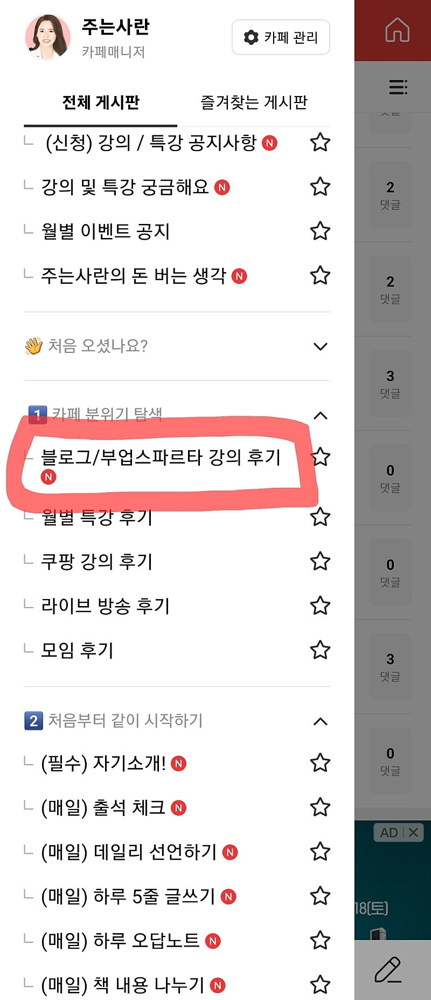
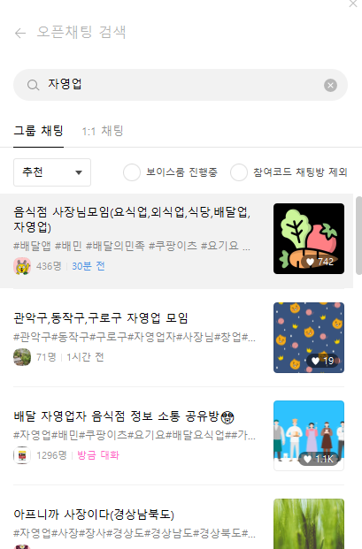
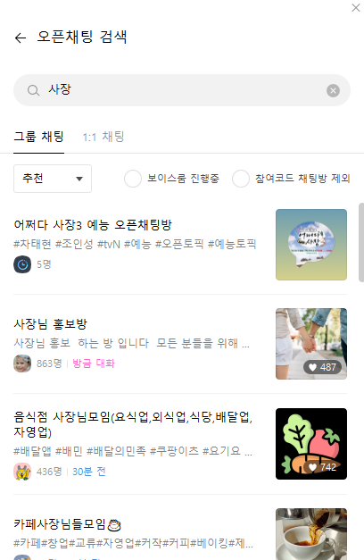
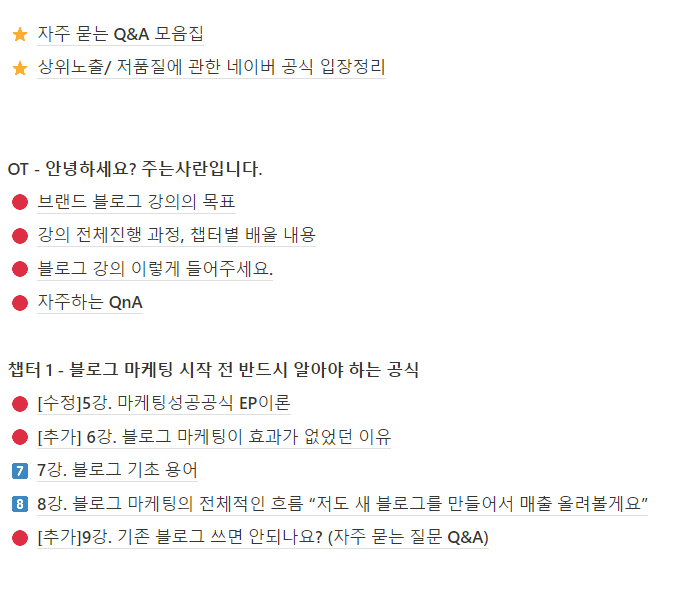
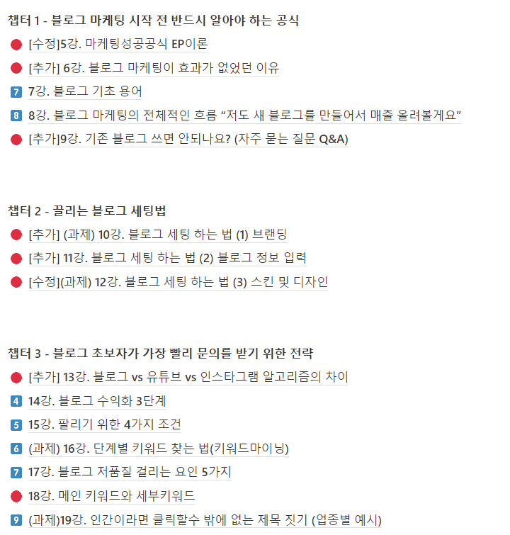
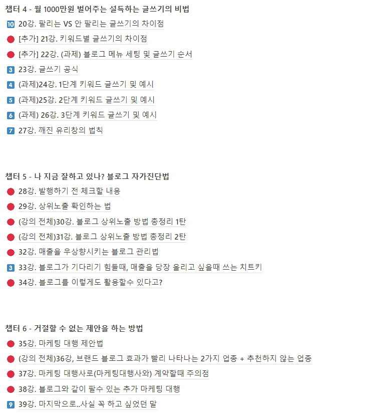
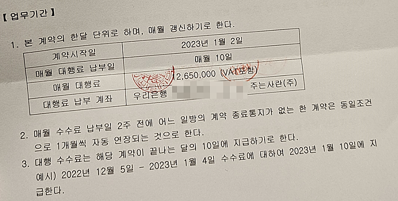
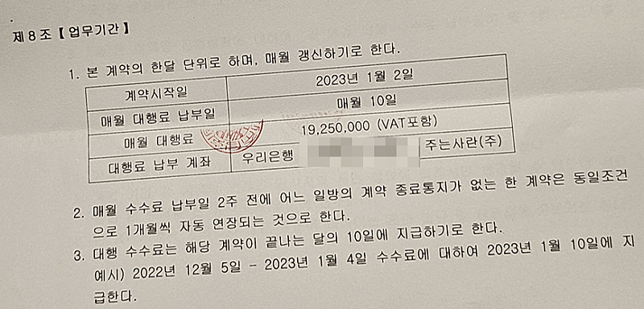
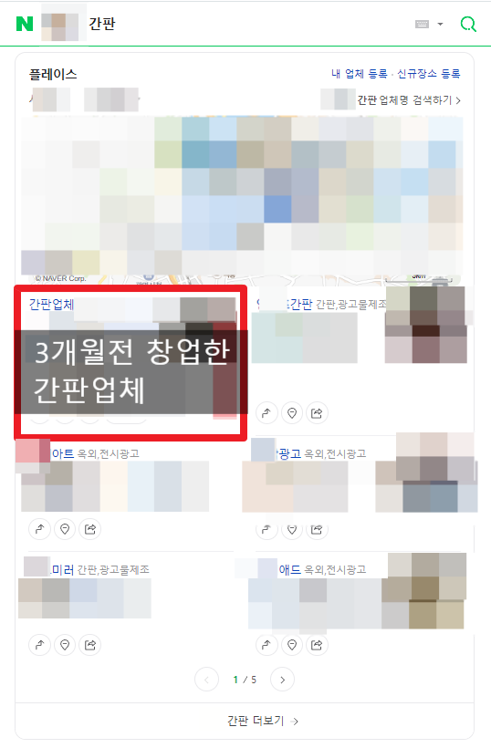
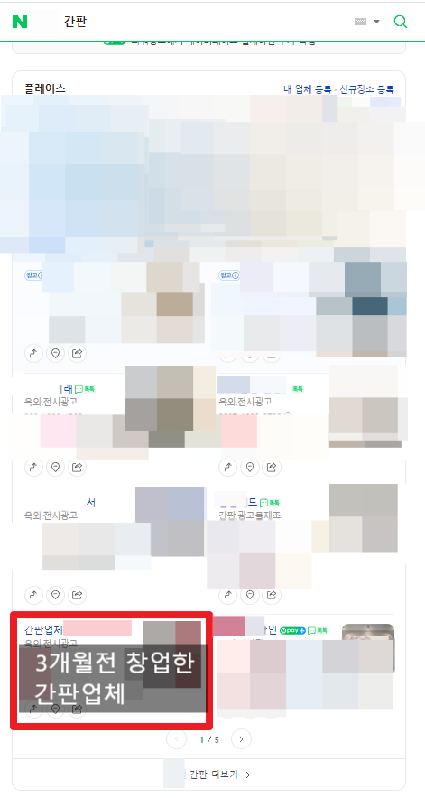

# 3시간 만에 마케팅 대행 계약 따내는 법

- 원천 ID: EPR-CAFE-12849
- 작성자: 주는사란
- 작성일: 2023-10-20T21:45:39.757000+09:00
- 원문: https://cafe.naver.com/ranschool/12849
- 수집일: 2026-09-21
- 텍스트 정리: HTML 문단 순서 유지, 빈 문단·제로폭 공백만 제거. 원본 HTML·JSON 별도 보존. 이미지는 아래에 모아 보관하며 원래 배치는 HTML에서 확인.

## 원문 본문

<!-- P001 -->
제가 마케팅 대행 부업에 대해 아주 자세하게 무료강의 3강에서 알려드렸는데요. 가장 어려워 하시는 딱 한가지를 뽑자면 이겁니다.

<!-- P002 -->
나한테 마케팅 계약을 맡길 업체를 못찾겠다

<!-- P003 -->
3시간 만에 마케팅 계약 따내는 방법 하나를 지금 바로 알려드릴게요.

<!-- P004 -->
제가 알려드린 방법대로 하고,

<!-- P005 -->
인증글을 카페에 올려주실분만

<!-- P006 -->
아래를 봐주세요 ㅎㅎ

<!-- P007 -->
인증은 '블로그 강의 후기 게시판'을 이용해주세요!

<!-- P008 -->
그 방법은 바로 오픈채팅방 입니다. 뻔하다구요? 딸수 있는 팁도 알려드릴게요.

<!-- P009 -->
카카오톡에 가시면 '오픈채팅방 검색' 창이 있습니다. 여기에 아래처럼 검색하세요.

<!-- P010 -->
마케팅을 맡기 위해서 공략해야할 사람은 누굴까요? 바로 자영업 사장님들 입니다. 자영업 사장님들이 있을만한 오픈채팅방에 다 들어가시면 됩니다. 그리고 여기에 홍보글을 써보는 겁니다.

<!-- P011 -->
여기서 바로 문의를 받을수 있는 팁 2가지를 알려드리겠습니다.

<!-- P012 -->
TIP 1

<!-- P013 -->
첫번째 팁입니다. 오픈채팅방마다 컨셉을 다르게 하세요. 어떤 오픈채팅방은 홍보가 되고, 어떤 방은 홍보가 안됩니다. 그래서 오픈채팅방의 성격에 맞춰서 컨셉을 다르게 하시면 됩니다.

<!-- P014 -->
그걸 알기 위해서는 입장하자마자 공지글이 있을텐데요. 그 공지글을 읽고 활동하셔야 합니다. 저라면, 같은 사장님 혹은 도움을 주려는 마케팅 대행사 느낌 이렇게 다양하게 할것 같습니다.

<!-- P015 -->
TIP 2.

<!-- P016 -->
그냥 홍보글 보다는 정보글을 쓰자.

<!-- P017 -->
제가 만약 이 글을 처음부터 끝까지 제 블로그 강의에 대한 내용만 썼다면 어떨까요? 아마 여기까지 안 읽으셨을겁니다. 오픈채팅방에 있는분도 똑같아요. 여러분의 홍보글은 읽고 싶은 사람이 없습니다. 그냥 블로그 마케팅해준다고 하지마시구요.

<!-- P018 -->
"나는 이런이런 식으로 글을 쓴다. 그래서 매출이 직접적으로 나름 3개월 정도면 효과를 볼 수 있다. 비교적 1,2달 만에 빨리 효과를 보는 업종은 이런 업종들이다."

<!-- P019 -->
이렇게 오픈채팅방에 도움이 되는 글을 써보세요. 그럼 이렇게 일주일만 계속해도 마케팅에 관심있다고 문의는 최소 1건이상 받을 겁니다. 물론 빠르면 3시간 안에도 받으실수 있을거예요.

<!-- P020 -->
실제로 수강생중에서 인터뷰까지 하신 가지가지님은 이걸로 처음 블로그 강의듣고나서 3주만엔가 첫 계약 따내고 거기서 입소문까지 나서 5개까지 늘리기도 했습니다. 그래서 사실 처음 한개만 따내면 그 이후로는 추천을 받아서 여러개를 따내기가 생각보다 쉽습니다.

<!-- P021 -->
▼ 가지가지님 인터뷰 영상 ▼

<!-- P022 -->
▼ 하루 1시간 부업해서 월 180만원 버는 블로그 글쓰기 방법▼https://www.youtube.com/watch?v=J3qVimaes6o&t=6s#주는사란 #부업 #알바 #부업 #돈 #돈버는법 #블로그 #블로그글쓰기 #네이버블로그 #체험단

<!-- P023 -->
youtu.be

<!-- P024 -->
▼ 가지가지님 수강인증 글 ▼

<!-- P025 -->
안녕하세요 가지가지하네 입니다 저는 마케팅 1기로 현재 블로그마케팅을 부업으로 삼고 있습니다 지난번에 블로그마케팅 강의 듣고 한달도 안돼서 매출 3000만원 찍었다고 후기...

<!-- P026 -->
cafe.naver.com

<!-- P027 -->
제가 지금까지 오픈채팅방을 통해 마케팅 계약 따내는 방법에 대해 말씀드렸는데요. 제가 알려드린 두가지 팁을 적용하셨다면 마케팅 대행 계약을 못따시진 않으셨을겁니다. 근데 여기 오픈채팅방을 언제까지나 계속 하긴 어렵다? 그럼 이런 곳도 이용하시면 되는데요.

<!-- P028 -->
본 내용은 브랜드 블로그 강의 리뉴얼 된 내용의 일부입니다. 대행 계약 따내는 2가지 방법을 더 리뉴얼 했습니다. 그외에도 아래와 같은 부분을 수정했습니다.

<!-- P029 -->
1. 자주묻는 Q&A 모음집 추가

<!-- P030 -->
: 1년간 약 600분의 질문 내용을 파트별로 요약 정리해 놓음

<!-- P031 -->
2. 상위 노출 / 저품질에 관한 강의 추가 및 네이버 공식입장 2023년 10월 버전으로 전면 업데이트

<!-- P032 -->
3. 총 20강 내용 수정 및 보완

<!-- P033 -->
4. 7강 추가 (약 4시간 분량)

<!-- P034 -->
본 온라인 강의는 103일간 수정 했습니다. 사실 이 시간에 유튜브 영상을 더 찍고, 마케팅 대행 한두곳을 더 맡아서 돈을 더 벌수도 있었습니다. 근데 브랜드 블로그 만큼은 누구보다도 아주 자세하게 제대로 가르칠 자신이 있어서요. 그런 모든 혼을 쏟고 싶단 생각이 있었습니다.

<!-- P035 -->
어쩌면 이미 마케팅 대행을 하고 계시기 때문에 더이상 강의가 필요 없을수도 있습니다. 근데 그래도 기존 분량에 약 2배 이상 추가하면서 최대한 최신 내용을 반영하려 애썼습니다. 현재 한달에 약 70개 정도 판매가 되고 있다보니, 매월 70분이상 이 강의를 듣고 정말 도움이 되었으면 해서요.

<!-- P036 -->
현재 기존 강의 수강생 분에게 전달드린 링크에 수정된 영상이 모두 업데이트 되었습니다. 온라인 강의의 장점은 평생 업그레이든 할수 있다는 것 같아요. 현재 네이버 플레이스 강의 (지도부업) 강의도 전면 개정하고 있는데요. 약 30일 뒤에 오픈할 예정입니다. (현재 얼리버드 판매중)

<!-- P037 -->
블로그와 플레이스 강의 전면 개편한 이유

<!-- P038 -->
제가 현재 오프라인 강의는

<!-- P039 -->
'부업스파르타반'

<!-- P040 -->
(저와 함께 아무것도 없는 상태에서 업종을 정해서 월 300만원 사업체를 만들어 보는 강의)

<!-- P041 -->
'마케팅 대행 창업반'

<!-- P042 -->
(저와 함께 업체 계약 따내는 것부터 해당 업체의 블로그 / 플레이스 세팅 및 관리까지를 해보는 강의)

<!-- P043 -->
를 하고 있는데요.

<!-- P044 -->
1년간 성공사례가 꽤 나왔기 때문에 굳이 수정할 필요가 없었을지도 모릅니다. 근데 최근들어 솔직히 불안감도 있었어요. 구독자가 10만이 넘고, 매월 70분이상 본 강의를 듣다보니, 블로그 강의를 들어보셨던 분이 있을수도 있을겁니다.

<!-- P045 -->
저는 제 강의가 단순히 강의로 끝나는게 아니고, 유튜브 부업소개 마지막에 항상 '따라하기' 영상을 하듯이 아예 보고 따라할수 있는 그런 강의를 만들고 싶었거든요.

<!-- P046 -->
솔직히 블로그를 쓴다는게 왠만한 의지로는 어렵습니다. 저도 처음에 그랬고, 지금도 여전히 이 카페 글 쓰는것 조차 힘들어요. 그래서 처음에는 수정기간을 2주로 잡았는데 거의 8배 이상 기간이 늘어났습니다.

<!-- P047 -->
무엇보다 부업스파르타반은 아예 한 회사를 차려서 상품을 만들고, 마케팅을 해서, 문의를 받아, 돈을 벌어보는 그런 반이다 보니 제 강의를 듣고 바로 해봐야되는데요. 그래서 강의가 좀더 상세하고 실전적이어야 한다고 생각했습니다. (현재 2기 진행중 / 3기 11월 중순 공지 업로드 예정)

<!-- P048 -->
현재는 저와 마케팅 계약부터 세팅 관리까지 같이 해보는, 마케팅 대행 창업반을 모집중(현재 1배수 지원함)인데요. 다음달에 시작할 예정이라 창업반을 준비하면서 강의를 다 수정하다 보니 더더더 실전적이어야 한다는 압박감도 있었습니다. 진짜 이 강의만 들으면 '마케팅으로 가게의 매출을 올리는 능력을 갖추기' 이게 되도록요. 근데 지금 다 수정하고보니 꽤나 만족스럽습니다. 물론 플레이스 강의 수정이라는 산이 하나 더 남았지만요 ㅎㅎ

<!-- P049 -->
근데 어쩌면 저는 강의 수정을 기다리고 있기도 했어요. 왜냐면 제가 처음 강의를 찍었던 10개월전에 비해 제 인생이 많이 바뀌었거든요.

<!-- P050 -->
이제 블로그로 왠만한 업종을 다 성공시켜봤어요. 이전에는 제가 운영했던 학원, 분양대행사, 전문직 마케팅정도 였는데요. 10개월간 유튜브가 크면서 별별 곳에서 다 의뢰를 받아서 해봤네요.

<!-- P051 -->
제가 해봤던 학원부터 한의원, 인테리어회사, 집수리, 간판회사, 건강기능식품, 화장품, 반려견 사료 까지 진짜 다 팔아봤습니다. 난생 처음 한 업체의 매출을 10억짜지도 올려봤어요. 저는 블로그로 몇천만원 짜리 계약도 했구요.

<!-- P052 -->
▼ 계약서 중 일부 ▼

<!-- P053 -->
뿐만 아니라 플레이스 마케팅을 3개월만에 서울지역의 80% 이상에 1페이지로 랜딩하면서 순수익 월 1000만원 이상의 간판업체도 키웠거든요.

<!-- P054 -->
원래 사람은 본인이 성공했던 방식이 정답이라 믿게 되잖아요. 그래서 그런지 저는 단언컨데 딱 한가지 기술을 가지라면 '마케팅으로 매출 올리는 방법' 이것만 갖겠어요. 10년간 자영업 하면서 개고생 했던게 그냥 이 기술 하나로 끝나버렸거든요.

<!-- P055 -->
그래서 여러분께 꼭 하라고 말씀드리는거예요. 여러분이 저랑 똑같이 한다고 해서 제가 돈을 더 못버는 것도 아니거든요 ㅎㅎ

## 본문 이미지

## 원문에 포함된 링크

- #
- https://youtu.be/27cyBifGsvo?si=YW3F4_NEByXGP_qH
- https://cafe.naver.com/ranschool/3444
