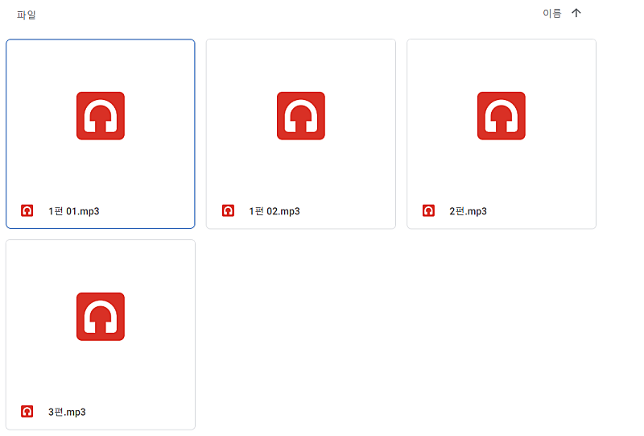
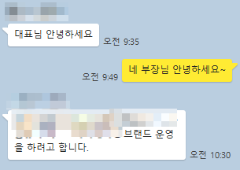
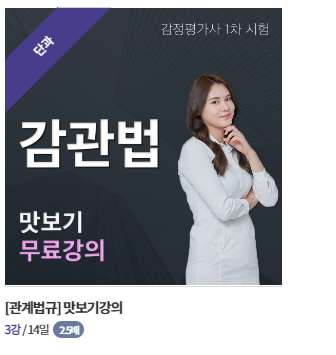
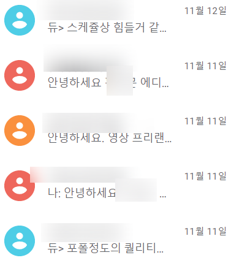
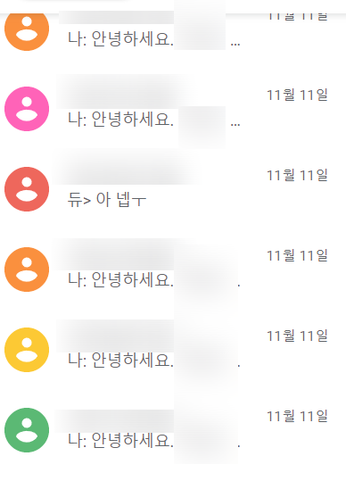
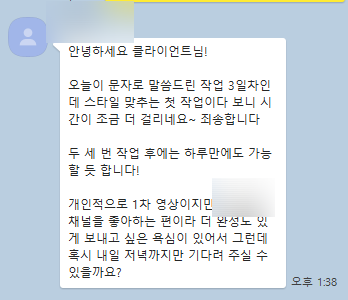
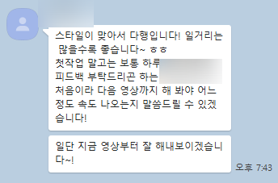

# 하고 있는 일을 130% 더 잘하게 보이는 방법

- 원천 ID: EPR-CAFE-146
- 작성자: 주는사란
- 작성일: 2022-11-19T17:10:18.737000+09:00
- 원문: https://cafe.naver.com/ranschool/146
- 수집일: 2026-09-21
- 텍스트 정리: HTML 문단 순서 유지, 빈 문단·제로폭 공백만 제거. 원본 HTML·JSON 별도 보존. 이미지는 아래에 모아 보관하며 원래 배치는 HTML에서 확인.

## 원문 본문

<!-- P001 -->
남자친구가 제게 농담삼아 하는 말이 있습니다.

<!-- P002 -->
너는 나빼고 다 친절하더라?

<!-- P003 -->
ㅋㅋㅋㅋㅋㅋㅋㅋㅋㅋㅋㅋㅋ팩트입니다...ㅋㅋㅋㅋㅋㅋㅋㅋㅋㅋㅋㅋㅋㅋㅋ미안행...;;ㅎㅎ

<!-- P004 -->
최근에 제가 큰 계약을 따냈습니다. 어디에 자랑할때가 없어 카페에 글 써봅니다. 이번 계약을 따내면서 배운게 참 많습니다. 그 내용중 일부에 대해 써보려 합니다.

<!-- P005 -->
제가 학원을 운영할때, 가장 자신있었던게 상담입니다. 학부모가 우리 학원에 오기만 하면, 무조건 결제시킬 자신이 있었습니다. 제가 실제 계산해 봤더니 100명 오면 98명정도는 그 달 안에 등록하게 만들었습니다. (2명은 뭐지... 아마 피치못할 사정이 있었을꺼야...라고 합리화를 했지만요;;ㅎㅎ)

<!-- P006 -->
이번 계약도 그랬습니다. 처음에 만났을때 태도가 애매했습니다. 저를 못 믿는 느낌이 들었고, 솔직히 저도 해본 분야가 아니라 좀 걱정도 됐습니다. 그래서 공부를 정말 많이 했습니다. 심지어 스스로 얼마나 바랬는지, 계약하는 꿈을 꿀 정도였으니까요.ㅋㅋㅋㅋㅋ 그리고 기획안을 정말 아주아주 자세하게 썼습니다. 기획안의 대략적 내용은 이렇습니다.

<!-- P007 -->
블로그를 어느 날짜에 어떤 키워드로 제목은 뭐라고 쓸거고, 내용은 뭐라고 쓸거다. 근데 지금 너네가 하고 있는건 이렇게 했는데, 그래서 효과가 없었던거다. 나는 이렇게 할거다. 왜냐면 지금까지 우리가 이런식으로 했을때 효과는 어땠고, 지금 너희 경쟁사 업체는 이렇게 하고 있는데 실제 효과를 보고 있다.

<!-- P008 -->
인스타는 운영을 안하고 있는거로 알고있는데, 경쟁사에서 이런식으로 했는데 매출이 잘 나오더라. 근데 우리는 이걸 이런 형태로 좀더 디벨롭해서 할거다. 그럴경우 경쟁사에 비해 매출은 최소 이정도 오를거다. 이정도 올리는데 기간은 이정도 들꺼다. 만약 그 기간내로 안되면 우리 스스로 그만두겠다. (어짜피 짤리겠지만...ㅎㅎ)

<!-- P009 -->
이렇게 말하니깐, 견적서 보내달라고 하더라구요. "그래서 됐구나" 싶었습니다.

<!-- P010 -->
혼자 생각으로는 "와 내 인생 드디어...피는구나" 싶었습니다.

<!-- P011 -->
이걸 어떻게 내가 증명해 보이지에 대한 생각에 하루종일 이 생각에 꽉 차서 담당자 배치부터 어떤식으로  꾸려나갈지 온갖 분들에게 다 소문을 냈습니다. 그렇게 행복회로를 돌리고 있는데 계약일 전날 저녁 해당 회사 부장님께 갑자기 전화가 왔습니다.

<!-- P012 -->
대표님 현재 마케팅 하려했던 브랜드가 중단될것 같아,

<!-- P013 -->
지금 계약 중단하면 저희가 해드려야 할 일이 있을까요?

<!-- P014 -->
저는 의연한척 "아닙니다. 괜찮습니다" 라고 대답했습니다. 전화를 끊고는 솔직히 실망? 아니 실망이란 표현도 부족할만큼 굉장히 우울했습니다. 별별 생각이 다 들더라구요.

<!-- P015 -->
" 브랜드를 그만둔다고? 매출이 나오고 있는곳을?"

<!-- P016 -->
" 아니야. 그냥 변명같아.. 어떤 부분이 부족했을까"

<!-- P017 -->
그렇게 거의 일주일 내내 우울했습니다. 진짜 어느정도 였냐면, 제 유일한 취미가 축구 보는건데, 축구를 봐도 집중을 못하겠더라구요....;; 근데 저는 이 기회를 포기할수가 없었습니다.

<!-- P018 -->
그래서 뭐라도 하고 싶어서, 돈도 안받고 아니 오히려 내 돈 투자해서 매출을 내보기로 했습니다. 저 혼자 해당 제품 유튜브 대본도 쓰고 편집자 비용도 부담해서 영상도 제작했습니다.

<!-- P019 -->
내가 다 해보고 매출 늘어난게 보이기만하면 그 회사 대표님께 가서 이야기 하면 안 맡길리가 없다고 생각했거든요. 그렇게 글을 3편, 영상 3편을 만들어 놓았는데, 아침에 해당 회사 부장님께 카톡이 왔습니다.

<!-- P020 -->
물론 아직 계약서를 쓰진 않았습니다. 다음주에 쓰기로 했는데, 정말 혹시나 또 바뀔지도 모릅니다?ㅋㅋㅋㅋ(제발 ㅠㅠ 그르믄 안돼ㅠㅠㅠ) 근데 이번 계약으로 배운게 있습니다.

<!-- P021 -->
1. 기회는 실력이 있는 사람에게만 온다.

<!-- P022 -->
2. 그러나, 실력만큼이나 태도가 더 중요하다.

<!-- P023 -->
기회를 잡는 법

<!-- P024 -->
준비된 자에게만 기회가 온다. 이런 오글거리는 말 있잖아요. 저는 진짜 이 말을 100% 아니 200% 공감합니다.

<!-- P025 -->
제 사례로 말하자면 끝도 없는데요. 몇개만 예로 들어보겠습니다.

<!-- P026 -->
1) 이번 계약도 그랬습니다.

<!-- P027 -->
이번에 맡은 회사는 누구나 말하면 알만큼의 브랜드입니다. 해당 회사 대표님이 제가 맡고 있는 다른 회사 (아예 다른분야) 마케팅한 블로그를 보고 저랑 만나고 싶다고 연락주셨습니다. 솔직히 처음에는 대단한 회사라고 했을때, 안 믿었습니다.ㅋㅋㅋㅋ

<!-- P028 -->
왜냐면 "그런사람이 나한테 왜 연락을??" 이런생각이 많았거든요. 나중애 들어보니, 블로그 글이 너무 마음에 들어서 도대체 어떻게 한건지 궁금해서 연락하셨다고 하시더라구요. 알고보니 그대표님도 이 브랜드를 하기전 블로그마케팅, 카페 마케팅을 하셨었더라구요.

<!-- P029 -->
마케팅이라는 실력을 가지고 있으니, 이런 대표님도 만날수 있었습니다.

<!-- P030 -->
2) 자청님 만날때도 그랬습니다.

<!-- P031 -->
제가 어떤 일을 했던 사람이라고 말하니깐, 한번 만나보고 싶다고, 만나자고 그러시더라구요. 나중에 알게 된건데, 하루에도 자청님에게 만나달라고 하는 사람이 수십명이었습니다. 근데 제가 학원, 음식점, 이자카야 등 한걸 듣더니 먼저 만나고 싶다고 해주셨습니다. 지금 생각하면 소름돋습니다. 이때 자청님을 안만났다면 저는 유튜브 세계에 대해 아예 몰랐을거고, 내 유튜브를 해야겠단 생각조차도 못했을겁니다.

<!-- P032 -->
그럼  이 카페도 없었겠죠??ㅋㅋㅋㅋ

<!-- P033 -->
3) 감정평가사 인강을 찍게된 계기

<!-- P034 -->
저는 감정평가사가 아닙니다. 혹시 아시는지 모르겠지만, 감정평가사는 전문직중 하나이며, 수입도 전문직 안에서도 높습니다. 예전에 제가 감평사 공부를 준비했던적이 있는데요. 그때 봤던 감평사 유튜버?분이 계셨습니다. 제가 자청님과 같이 동업할때, 사무실 바로 앞에 있는 스벅에 갔는데, 거기에 그 감평사 유튜버 분이 계시는거예요!!!! 그래서 제가 말을 걸었습니다 (원래 이렇게 제가 말거는 스타일은 아닌데, 너무 반가운 나머지...)

<!-- P035 -->
"혹시 감평사 아니세요? "

<!-- P036 -->
맞다고 하시더라구요. 그자리에서 2시간을 이야기하고, 그 후에도 따로 3번을 더 만났습니다. 그 분이 감평사 학원 오픈을 준비중이셨는데요. 제가 또 나름 학원 경력자(?) 아니겠습니까? 학원 이야기 하다가 제게 강사 자리를 제안해 주셨고, 그래서 감평 업계에 발을 담구게 되었습니다.

<!-- P037 -->
하 사진 왜케 뚱뚱하게 나오는건지..(아 원래 뚱뚱한건가;;ㅎ)

<!-- P038 -->
이거 말고도 정말 많은데요. 결론만 말하자면, 기회를 잡으려면 준비를 해놔야 한다고 생각합니다. 그게 뭐가 되었건요.

<!-- P039 -->
저도 다음 단계 도약을 위해, 유튜브, 인스타. 영어 이 3가지 공부하고 있습니다.

<!-- P040 -->
유튜브는 진짜 제 유튜브 뿐 아니라 아예 다른 분야도 키워보고 싶고,(내꺼나 똑바로 해야되나?;;ㅎㅎ) 인스타는 원래 정말 아예 모르거든요. 근데 이것도 커머스 쪽으로 해보고 싶고, 영어는 수능때 가장 못봤던 과목이라, 뭐 언제쓸진 모르겠지만 하려고 합니다. 욕심이 너무너무 많죠? ㅋㅋㅋ

<!-- P041 -->
뭐 해놓으면 제가 또 활용하는건 잘해서 뭐라도 하겠죠 ㅋㅋㅋ 해보고 또 알려드릴께요.

<!-- P042 -->
태도가 형편없으면,

<!-- P043 -->
실력도 말짱 도루묵

<!-- P044 -->
저는 일을 할때 실력도 중요하지만 똑같은 비율로 '태도'도 중요하다고 생각합니다. 이번 계약도 이미 대표님이 하신다고 한거라 태도를 이렇게까지 '을?'의 위치를 취할필욘 없었습니다. 근데 제가 거기에 자만해서 부장님께 애매한 태도를 유지했다면? 아마 지금 다시 기회가 오지 않았을거라 생각합니다.

<!-- P045 -->
제가 이번에 편집자를 구해보면서 느낀건데요. 참고로 제 채널 뿐 아니라 얼굴 안 나오는 다른 채널을 하고 있습니다. 그 채널 편집자분이 계셨는데, 솔직히 실력이 좀 부족해서 도저히 계속 함께 하기가 어려울것 같더라구요. 그래서 편집자분을 구하려고 진짜 아래 사진 말고도 거의 20명 넘게 연락 드렸거든요?

<!-- P046 -->
근데 보시면 아시겠지만, 답변 오는 비율이 10%도 안됩니다. 답변이 그날 오신 분은 20분 중에 1분? 밖에 없었습니다. 물론 그 분들이 이미 잘되서 그런걸수도 있겠죠. 근데 저는 편집자도 영업직이라 생각합니다. 근데 아무리 티오가 없더라도 "답변 자체를 안하는 분들은 뭘까?" 싶었습니다.

<!-- P047 -->
제가 학원할때도 보면, 지금 이미 잘된다고 응대 똑바로 안하고, "기다리실거면 기다리고 말거면 마세요~"이런 학원들이 있었거든요. 오래 못가더라구요.

<!-- P048 -->
지금 그날 당일에 유일하게 연랃온 한분과 같이 하고 있는데, 정말 피드백이 미쳤습니다!! 혹시나 늦게 되면 미리 연락하시는 것부터, 말하는걸 어떻게든 지키려는 마음이 느껴지고 무엇보다 수정 피드백에 대해서는 아주 철저히 반영해 주시더라구요..심지어는 실력도 솔직히 상위권입니다.(기분탓인가;;ㅎㅎ). 정말 너무 만족해서 다른것도 더 맡겨드리려고 하고 있습니다.

<!-- P049 -->
근데 생각해보면 이분은 잘할수 밖에 없는거죠.

<!-- P050 -->
왜냐? 애초에 이정도 태도라면 => 기존에 손님도 만족했을수밖에 없고 => 계속 맡겼을거고 => 많이 편집해봤을테고 => 그럼 실력이 오른다.

<!-- P051 -->
말이 길어졌는데요.

<!-- P052 -->
그냥 이번 계약을 통해 든 생각은

<!-- P053 -->
1. 실력을 올려야 겠다. 그냥 개 전문가가 되야겠다.

<!-- P054 -->
2. 자만하지말자.

<!-- P055 -->
3. 나는 대표가 아니라 사실 내 회사 영업직이다. 영업하는 사람의 태도가 별로면 바로 망한다.

## 본문 이미지

## 원문에 포함된 링크

- #
