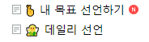

# 하루에 0.1% 똑똑해지는 방법

- 원천 ID: EPR-CAFE-1474
- 작성자: 주는사란
- 작성일: 2023-01-07T10:44:10.410000+09:00
- 원문: https://cafe.naver.com/ranschool/1474
- 수집일: 2026-09-21
- 텍스트 정리: HTML 문단 순서 유지, 빈 문단·제로폭 공백만 제거. 원본 HTML·JSON 별도 보존. 이미지는 아래에 모아 보관하며 원래 배치는 HTML에서 확인.

## 원문 본문

<!-- P001 -->
어제와 같이 살면 어제보다 나아지지 않는다.

<!-- P002 -->
그래서 오늘 어제와 다르게 살기 위해 뭘 해야할지 매일 아침 고민한다.

<!-- P003 -->
이거 너무 하고 싶은데, 같이 할 사람이 없어서요. 그래서 카페에서 같이 해보려구요.

<!-- P004 -->
그래서 만들었습니다. '데일리 선언' 메뉴

<!-- P005 -->
어제와 똑같이 사실분은 하지마세요 ㅋㅋㅋㅋㅋㅋㅋㅋㅋㅋㅋㅋㅋㅋㅋㅋㅋ

## 본문 이미지

## 원문에 포함된 링크

- #
