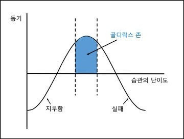

# 하다가 포기하지 않으려면

- 원천 ID: EPR-CAFE-14788
- 작성자: 주는사란
- 작성일: 2023-11-22T20:02:22.950000+09:00
- 원문: https://cafe.naver.com/ranschool/14788
- 수집일: 2026-09-21
- 텍스트 정리: HTML 문단 순서 유지, 빈 문단·제로폭 공백만 제거. 원본 HTML·JSON 별도 보존. 이미지는 아래에 모아 보관하며 원래 배치는 HTML에서 확인.

## 원문 본문

<!-- P001 -->
제가 이 카페를 시작할때 썼던 글 중 레벨에 관한 내용이 있습니다.(아래 첨부)

<!-- P002 -->
개인적으로 저는 부업이건 뭐건 돈을 벌거면 꼭 확인해야하는 부분이라고 생각하는데요. 이 내용은 제 뇌피셜로 작성한거였는데, 드디어 근거를 찾았습니다.

<!-- P003 -->
예를 들어 테니스를 좋아하는데 네 살짜리와 경기를 한다면 금방 테니스는 지겨워지겠죠. 경기는 엄청 쉽고 계속 득점할테니까요. 반대로 세레나 윌리엄스 같은 프로 테니스 선수랑 경기를 한다고 해도 빠르게 의지를 잃을겁니다. 매번 지니까요.

<!-- P004 -->
근데 만약 비슷한 수준의 사람과 테니스 경기를 한다면 어떨까요? 몇 포인트는 따고 몇 포인트는 잃겠죠. 승리의 기회도 몇 번 있을거구요. 그렇게  정신을 산만하게 만드는 방해물을 사라지고, 점점 게임에 집중하게 될겁니다. 이게 바로 관리 가능한 수준의 도전 입니다. 이런걸 '골디락스 법칙' 이라고도 부릅니다.

<!-- P005 -->
골드락스 법칙이란, 인간은 자신이 할 수 있는 적합한 일을 할 때 동기가 극대화되는 경험을 한다는거죠. 지나치게 어려워서도 안 되고, 지나치게 쉬워서도 안 됩니다. 딱 들어맞아야 해요.

<!-- P006 -->
참고글 -

<!-- P007 -->
오늘은 보통 사람들이 서울 건물주가 되기까지의 가장 보통의 방법을 적어보려합니다. 서울의 건물주가 되는 법은 경제적 자유를 이루는 방법과 같습니다. 결국 본질은 내가 '일을 ...

<!-- P008 -->
cafe.naver.com

## 본문 이미지

## 원문에 포함된 링크

- #
- https://cafe.naver.com/ranschool/8?tc=shared_link
