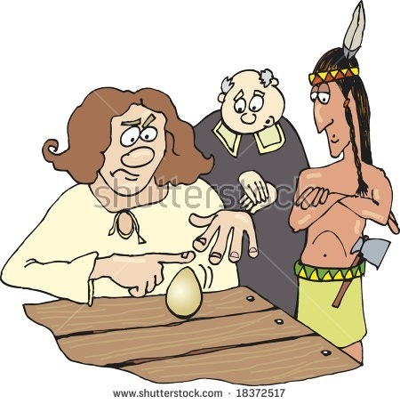

# 그게 뭐 대단한 일이라고

- 원천 ID: EPR-CAFE-15434
- 작성자: 주는사란
- 작성일: 2023-12-05T22:06:04.763000+09:00
- 원문: https://cafe.naver.com/ranschool/15434
- 수집일: 2026-09-21
- 텍스트 정리: HTML 문단 순서 유지, 빈 문단·제로폭 공백만 제거. 원본 HTML·JSON 별도 보존. 이미지는 아래에 모아 보관하며 원래 배치는 HTML에서 확인.

## 원문 본문

<!-- P001 -->
콜럼버스도 이런 말을 들었데요.

<!-- P002 -->
지구가 네모라고 믿고 있었던 시절, 지구 반대편으로 가는 행동은 미친 짓 이었을 거예요.

<!-- P003 -->
근데 콜럼버스는 서쪽으로 가면 인도가 나온다는 얘기를 믿고 (그 당시에는 인도를 찾는게 유럽인들의 목표였음) 항해를 떠납니다. 그러곤 인도는 아니지만, 아메리카 대륙을 발견하죠.

<!-- P004 -->
콜럼버스가 신대륙을 발견하고 유럽으로 돌아와 파티를 열었는데요. 그 자리에 몇몇이 "뭐 그리 대단한 일이라고" 빈정 거렸데요.

<!-- P005 -->
빈정상한 콜럼버스가 그들에게 달걀을 한번 세워보라고 했습니다. 당연히 아무도 세우지 못했죠.

<!-- P006 -->
아무도 세우지 못하자 콜럼버스는 달걀 한쪽 끝을 깨서 세웠습니다. 그걸 본 사람이 이렇게 말했어요. "그렇게 하면 누가 못 세우냐" 라구요.

<!-- P007 -->
그러자 콜럼버스는 말했죠.

<!-- P008 -->
누구나 할 수 있어도

<!-- P009 -->
누구도 하지 않았고,

<!-- P010 -->
누구도 생각하지 못했다구요.

<!-- P011 -->
이 이야기는 '콜럼버스 달걀 세우기' 라고 불리는 유명한 일화입니다. 저는 오늘 달걀을 세우지 못했어요. 반성하는 차원에서 써 봅니다.

## 본문 이미지

## 원문에 포함된 링크

- #
