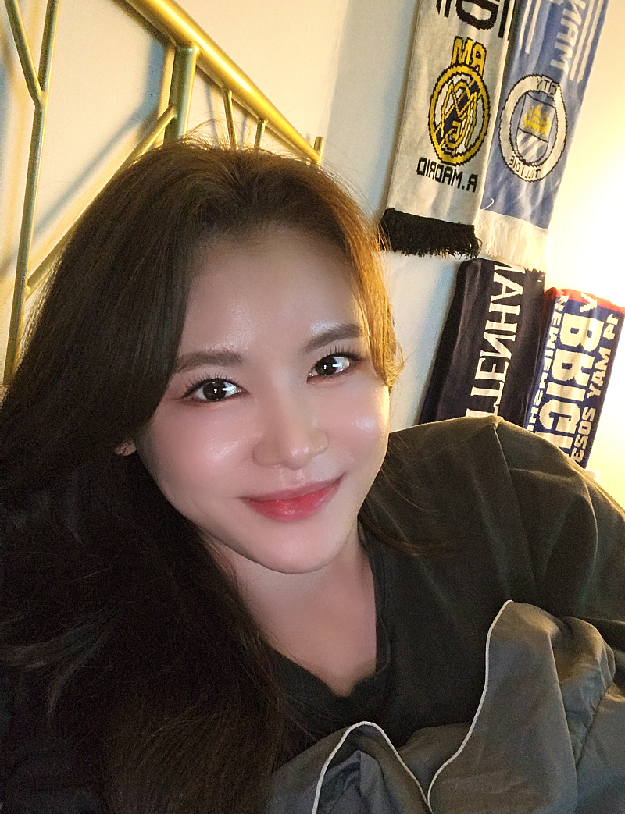
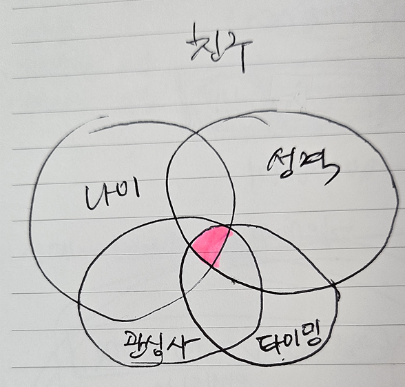
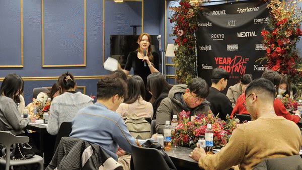
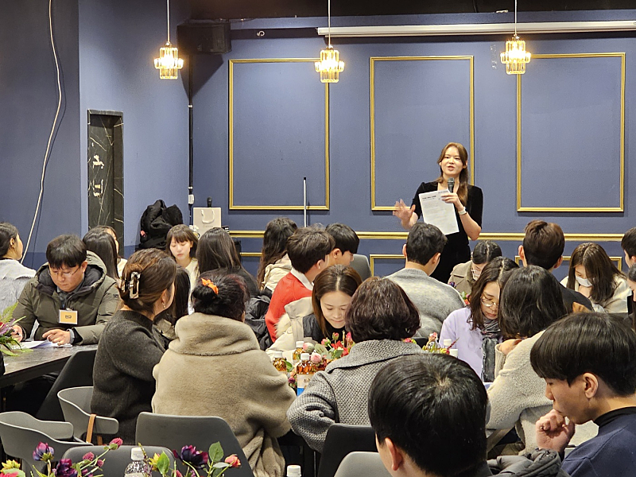
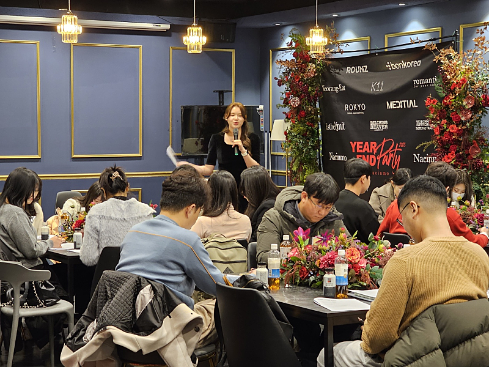
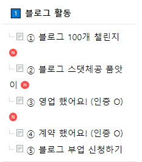

# 성인이 되면 친구 만들기 힘든 이유

- 원천 ID: EPR-CAFE-16109
- 작성자: 주는사란
- 작성일: 2023-12-18T12:26:43.783000+09:00
- 원문: https://cafe.naver.com/ranschool/16109
- 수집일: 2026-09-21
- 텍스트 정리: HTML 문단 순서 유지, 빈 문단·제로폭 공백만 제거. 원본 HTML·JSON 별도 보존. 이미지는 아래에 모아 보관하며 원래 배치는 HTML에서 확인.

## 원문 본문

<!-- P001 -->
어제 수강생 분기별 모임을 했습니다. 오랜만에 '행복'했습니다. 심지어는 친구를 굳이 만들지 않아도 된다는 생각에서 개인적으로 친구가 되고 싶은 분도 있었습니다.

<!-- P002 -->
총 54분이 참석해주셨는데요.

<!-- P003 -->
집에 돌아와서 생각해 봤어요. 모임이 왜이렇게 좋았는지를요. 그래야 더 열심히 할테니까요. 크게 두가지 이유가 있었습니다.

<!-- P004 -->
1. 관심사

<!-- P005 -->
성인이 되면 친구 만들기가 어렵잖아요. 같은 학교에 같은 과라도 가고 싶은 방향이 다르구요. 같은 회사에 같은 연봉이라도 생각하는 미래는 다르니까요. 심지어는 매 시기마다도 관심사가 달라지니 친구를 만드는게 쉽지 않습니다.

<!-- P006 -->
저도 친구라고는 고2 친구들과 교회친구들 이렇게 두 그룹(?) 말고는 없는데요. 이마저도 6개월에 1번씩 만나는 정도예요. 일하는 환경, 생각하는 것 자체가 다르니 어쩔 수 없는 것 같아요.

<!-- P007 -->
서로 친구가 된다는건 이제 꽤나 어려운 일이 됐어요.

<!-- P008 -->
뭔가 이런 느낌?

<!-- P009 -->
사실 나이, 성격, 관심사, 각자의 타이밍 이 4가지만 맞추기도 어려운데요. 이것 말고도 가장 맞추기 어렵다는 '느낌' 이런 요소들도 들어가니깐 더 어려워지는 것 같아요.

<!-- P010 -->
어제 오신분들은 이런 요소 중에 꽤나 많은 부분에서 비슷한 사람이 많았어요. 오신분들 끼리도 잘 맞는다는 느낌이 들어서 더 좋았구요.

<!-- P011 -->
사실 정확히 말해서는 이런 모든 요소를 생각하지 않게 됐어요. 바로 두번째 이유 때문인데요.

<!-- P012 -->
2. 굳이

<!-- P013 -->
성인이 되면 굳이 친구가 필요 없게 됩니다. 어쩌면 친구가 있다는게 더 불편할 때도 있었던것 같아요. 연애도 마찬가지인것 같아요. 30대가 되니깐 바뀌었어요. 20대에 연애를 안하면 "왜 안해?" 라고 했다면, 30대에는 "굳이 해야해?"라고 바뀐것 같아요.

<!-- P014 -->
이런 생각이 든다면 그건 아마 실패에 대한 두려움 때문일거예요. 많은 시간을 함께 했던 친구와 어느 순간 연락이 안된다던가. 소소한 일상을 나누던 친구와의 대화가 푸념으로 바뀐다던가. 많은 걸 주고 싶었던 연인이 변하는걸 본다던가.

<!-- P015 -->
이런걸 다 겪어 보면 더 경계하게 되죠. 근데 이상하게 그걸 다 알아도, '굳이'가 긍정적으로 변하는 순간이 있어요. 어떤 사람을 딱 보면, '굳이' 친구 하고 싶고, '굳이' 연애 하고 싶은거죠.

<!-- P016 -->
같이 했을 때의 보상이 희생을 넘어가는 순간이죠. 혼자 침대에서 뒹굴거리는 것 보다 친구나 연인을 만났을 때 더 행복할때요. 나 혼자서는 못 하는걸 같이 했을때 하게 되기도 하구요. 나뿐아니라 상대방도 같이 우상향 하는 느낌이 들때 행복한것 같아요. 그래서 '굳이' 같이 하고 싶은거죠.

<!-- P017 -->
원래 저는 그닥 나서는 스타일은 아니예요. 낯을 많이 가리거든요. 근데 어제는 억지로라도 모임을 다 만들어 드렸어요. 2030모임 3040모임 4050모임 이렇게요. 그러고는 저도 '굳이' 두달을 유지하면 밥을 사드리겠다고 했어요. 솔직히 집 와서는 아주 조금 걱정했어요. 안하고 싶은 분도 있을 수 있으니까요. 근데 그래도 잘한것 같아요.

<!-- P018 -->
'굳이' 블로그를 하게 하고 싶었거든요.

<!-- P019 -->
'굳이' 또 뵙고 싶었거든요.

<!-- P020 -->
'굳이' 친구가 되고 싶었어요.

<!-- P021 -->
그래서 '굳이' 모임을 시작했습니다.

<!-- P022 -->
어제 2030모임에 약 20분 / 3040모임에 약 10분 / 4050모임에 약 15분 정도 계셨는데요. '굳이' 돈을 벌기 위해 '굳이' 블로그를 하고 '굳이' 모임에서 같이 하실분들은 두달 뒤에 뵙겠습니다. ㅎㅎ 꼭 살아(?) 남으세요!

<!-- P023 -->
혹시나 어제 분기별 모임에 참석하지 못하셔서 '굳이' 모임에 들어가시지 못한 분들은 미리 아래 활동을 하고 계셔주시면, 운영진 및 조장 분들이 연락을 드리실 겁니다 ㅎㅎ

<!-- P024 -->
모임을 위해 고생해주시는 2030 모임 조장 혜린님, 가영님, 3040모임 조장 미진님, 4050 모임 조장 두연님 3분께는 이번 수익인증 후기 수상자인 예은님, 성원님과 함께 식사자리 마련할 수 있도록 하겠습니다!

## 본문 이미지

이미지 2: 로컬 보관 실패. [원래 이미지 주소](https://thumb2.photo.mybox.naver.com/3472531228837048660?type=m1280_1280_2&nocache=1044181712) — 수집 응답은 `_관리/이미지수집.json`에 기록.

## 원문에 포함된 링크

- #
