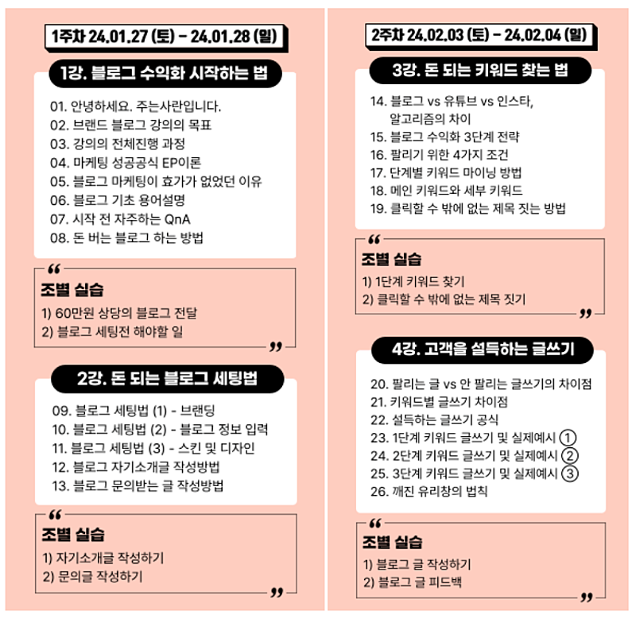
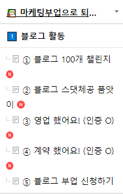

# 중수에서 고수가 되는 가장 빠른 방법

- 원천 ID: EPR-CAFE-17205
- 작성자: 주는사란
- 작성일: 2024-01-04T16:28:27.030000+09:00
- 원문: https://cafe.naver.com/ranschool/17205
- 수집일: 2026-09-21
- 텍스트 정리: HTML 문단 순서 유지, 빈 문단·제로폭 공백만 제거. 원본 HTML·JSON 별도 보존. 이미지는 아래에 모아 보관하며 원래 배치는 HTML에서 확인.

## 원문 본문

<!-- P001 -->
학원을 운영했을 때 일입니다.

<!-- P002 -->
저는 모든 반마다 조장을 뽑았어요. 조장은 매 시험이 끝날때마다 시험을 가장 잘 본 아이였죠. 조장의 역할은 간단합니다. 제가 바쁘면 다른 친구들에게 대신 그 문제를 설명해 주는거예요.

<!-- P003 -->
처음에는 조장으로 뽑힌 몇몇 아이들은 안 하겠다고 했어요. 자신의 공부 시간이 뺏긴다는 이유에서였죠. 그런 반은 반에서 중간?정도의 성적(10명중 4-5등)의 아이에게 조장을 맡겼습니다.

<!-- P004 -->
그렇게 딱 6개월이 지나자 재밌는 일이 일어났습니다.

<!-- P005 -->
중간 성적인데도 조장을 했던 아이들이 6개월만에 1등이 됐다는 겁니다. 원래도 1등이었는데 조장을 해준 아이들은 계속 1등을 유지했구요. 재밌게도 원래 상위권이었는데 조장을 거절했던 6명의 아이만 성적이 떨어졌습니다. 농담삼아 친구들은 "조장 안해서 그런거 아니야?" 라고 했죠.

<!-- P006 -->
이 이야기는 와전되어 학교에 이렇게 소문이 났었어요. "XX학원에서 조장을 하면 성적이 오른데" 라구요. 이어서 어머님들이 전화가 오셨어요. 조장을 시켜달라구요.ㅎㅎㅎㅎ

<!-- P007 -->
조장을 안하겠다고 했던 아이 6명이 이기적이게 보일 수도 있는데요. 사실 그렇진 않아요. 오히려 대단하죠. 시간의 중요성을 그 나이부터 알다니요. 그정도 욕심은 있어야 한다고 봅니다.

<!-- P008 -->
근데 제가 상위권 아이들에게 조장을 해달라고 한 이유는 다른 아이들을 위해서가 아니었어요. 사실 조장의 성적을 올리기 위해서였거든요.

<!-- P009 -->
대부분 상위권 아이들이 최상위권으로 가지 못하는 이유는 실수거든요. 몰라서가 아니라 '실수' 하는 거죠. 안다고 착각하는 것을 깨달으라는 것이었습니다. "나는 잘해" 라는 자신감을 경계하라는 의미였죠.

<!-- P010 -->
쉬워 보이는 문제를 풀어보지 않는게 대표적인데요. 그런 문제를 다른 아이들이 물어봤을 때, 알려주다보면 스스로 모르는 부분을 깨달을 수 있습니다. 무엇보다 다른 아이들이 자주 실수하는 부분을 보면 해당 부분에서 내 실수를 돌아보게되죠.

<!-- P011 -->
중위권 조장이 성적이 오른데에는 크게 2가지 특징이 보였어요.

<!-- P012 -->
1. 욕심이 생긴다.

<!-- P013 -->
=> 자기가 중위권이지만 조장이 됐다는 것에 스스로 자격지심이 있더라구요. 진짜 1등이 되서 조장이 되겠다는 욕심이 생기는 거죠.

<!-- P014 -->
2. 예/복습을 미친듯이 한다.

<!-- P015 -->
=> 어떻게든 아이들의 질문을 대답해주기 위해 더 꼼꼼히 구체적 공부하더라구요. 혹시나 질문의 답변을 못했을때는 쪽팔려서 나머지 공부도 자발적으로 하게되구요.

<!-- P016 -->
더 재밌는건 중위권 조장을 했던 반의 평균 성적 자체가 모두 올랐다는 겁니다. 수학을 어려워하던 아이들이 더 편하게 물어보게 되면서 공부를 더 열심히 하더라구요.

<!-- P017 -->
저는 학원을 운영했다보니 같이 해서 성적이 오른 아이들을 많이 봤어요. 일부로 짝을 지어서 멘토-멘티 시스템도 많이 했구요. 그래서 블로그/ 플레이스도 그런 문화를 만드려구요.

<!-- P018 -->
그 첫번째가 오프라인 강의 조별시스템입니다.

<!-- P019 -->
이번 1월에 오픈하는 블로그 오프라인 강의에도 잘하고 계시는 선배 수강생분을 섭외해서 팀 시스템을 운영해보려 합니다. 사실 이렇게 하려면 팀장도 섭외해야 하고, 팀장님들 교육도 해드려야 하고 등등 할일이 많아져서 할지 말지 고민을 했었는데요. 그래도 여러분에게 진짜 도움이 되려면 필요하다고 생각해서 하려고 합니다.

<!-- P020 -->
두번째는 카페 게시판이예요.

<!-- P021 -->
굳이 오프라인 강의 듣지 않으시더라도 할수 있도록 앞으로 카페 문화도 그렇게 바꾸려고 합니다. 서로 자신이 이룬것에 대해 알려주고 배우고 이런 문화요.

<!-- P022 -->
굳이 오지랖부리지 않아도 될것 같긴 한데 성격상 "할 수 있다"고 해놓고 책임 안 지는 모습 보이기 싫어서요. 이 게시판에 대한 고민만 거의 2주는 한것 같아요.

<!-- P023 -->
그 결과 현재 카페 게시판이 위처럼 변경 되었습니다. 아직은 참여자가 많지 않은데요. 아마 이 글이 올라가고 한 2주 뒤면 활성화 될것 같아요.

<!-- P024 -->
제가 굳이 말하지 않았는데도 열심히 하시는 분들 다 기억하고 있습니다.

<!-- P025 -->
1. 최근에 두번째 계약하신 빌리맘님 너무 축하드리구요.

<!-- P026 -->
2. 사업일기 정말 매일 쓰시는 정화님 진짜 고생 많으시고 응원합니다. 사실 정화님은 이미 잘 되실수 밖에 없지만요.

<!-- P027 -->
3. 이번에 계약하셔서 새로 업체 진행하시는 제르제르님 오프라인 강의때 해당 업체 운영하는거 도와드릴게요.

<!-- P028 -->
4. 사업일기와 40모임 운영하시는 무긍님 사업일기 재밌게 읽고 있습니다! 진행하는 업체에 꽃까지.. 센스에 역시 감탄합니다.

<!-- P029 -->
5. 블로그 챌린지 1등을 달리고 계시는 몽당님 글 너무 좋은데 스댓체공 하셔야 지수 올라가니깐 꼭 하시는걸 추천드려요! 블챌 1등 기대해 보겠습니다 ㅎㅎ

<!-- P030 -->
6. 한번도 얼굴 뵌적 없지만 열심히 활동해주시는 다쿤님 스댓체공부터 블로그 챌린지, 영업챌린지까지 딱 제가 하라는 루트 그대로 따라 해주시네요. 금방 성과 나실것 같습니다.

<!-- P031 -->
7. 마지막으로 연말 이벤트 1등 냉수한컵님 이글 읽으시면 선물 보내드려야 하니깐 카톡채널 연락주세요. 댓글 300개 쓰셨던데 정말 존경스럽고, 감사합니다.

<!-- P032 -->
8. 그 외에도 연말이벤트에 열심히 참여해주신 빌리맘님, 월천진님, 성화2님, 무긍님께 다시한번 감사인사를 드립니다.

<!-- P033 -->
이외에도 제가 다 말씀은 못 드렸지만, 카페에 계신 모든 분들과 열심히 제 글을 봐주시는 분들, 강의듣고 노력하시는 모든 분들 응원하겠습니다.

<!-- P034 -->
제가 현재 6개월 뒤 정도에 완성 예정인 마케팅 부업 최적화 시스템이 있는데요. 아마 이 시스템이 가동되면 마케팅 부업 탑티어들이 나올것 같아요. 마케팅 부업에 필요한 스킬 몇가지를 자동화 시킬거거든요. 그때까지 잘 하고 계시는 몇분은 별도로 연락해서 해당 시스템을 이용하실수 있도록 하려고 합니다.

<!-- P035 -->
P.S. 블로그 오프라인 강의를 마무리 하고 블로그 온라인 강의를 또또또 업데이트 하려고 합니다. 1년만에 4번째 수정이네요. 자랑하는거 싫지만, 진짜 블로그에서 만큼은 절대 따라올수 없는 강의로 만들 예정입니다. 빨리 수정하고 싶은데 시간이ㅠㅠㅠ

## 본문 이미지

## 원문에 포함된 링크

- #
