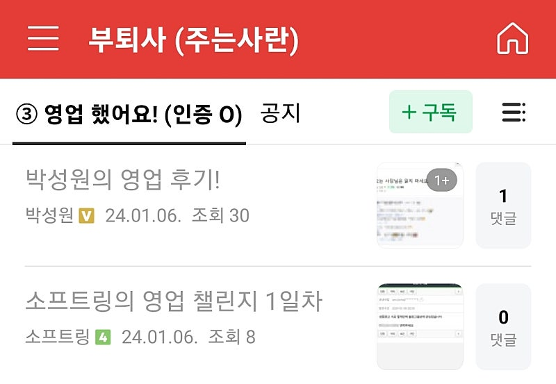
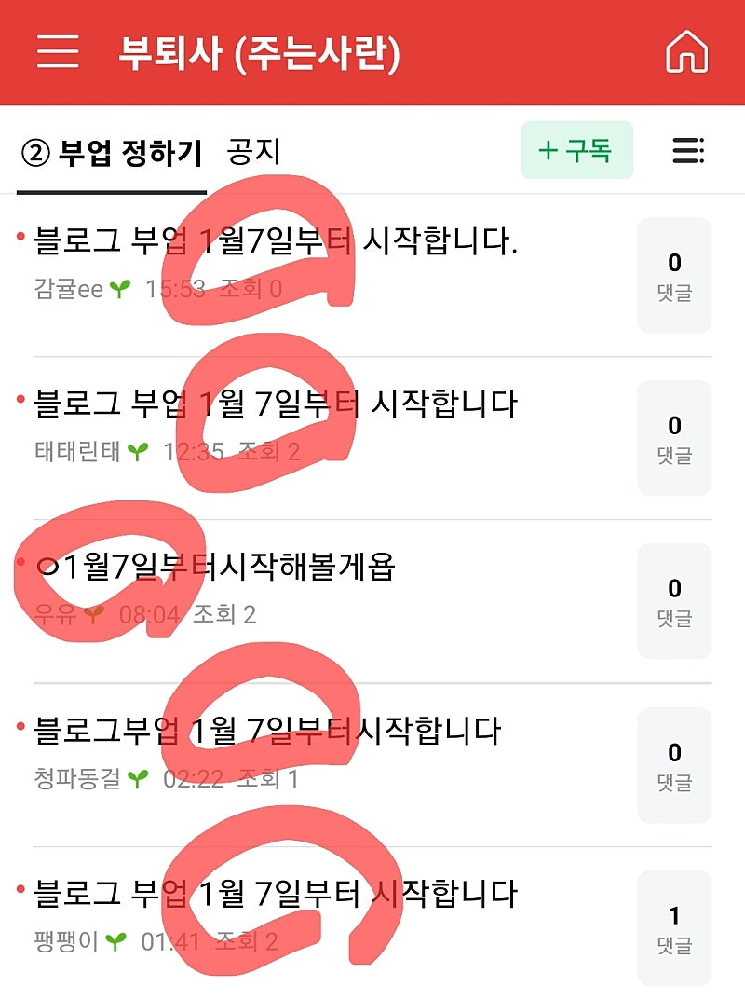

# 의지력 있어도, 새해목표 실패하는 이유

- 원천 ID: EPR-CAFE-17492
- 작성자: 주는사란
- 작성일: 2024-01-07T16:11:58.510000+09:00
- 원문: https://cafe.naver.com/ranschool/17492
- 수집일: 2026-09-21
- 텍스트 정리: HTML 문단 순서 유지, 빈 문단·제로폭 공백만 제거. 원본 HTML·JSON 별도 보존. 이미지는 아래에 모아 보관하며 원래 배치는 HTML에서 확인.

## 원문 본문

<!-- P001 -->
작심삼일은 저도 평생 숙제였어요. 1월 2일부터 저녁에 운동 간다는 마음 먹어놓고 1월 7일 지금 한번도 못갔죠. 작심삼일 2번했는데 실패했습니다.

<!-- P002 -->
그래서 오늘 왜 작심삼일에 실패했는지를 생각해봤어요. 혹시 벌써 새해목표 실패하셨다면 이 글이 도움 되실겁니다.

<!-- P003 -->
저는 어릴때부터 엄마한테 이런 말을 자주 들었어요. "왜 이렇게 의지가 없어!!!"

<!-- P004 -->
그래서 오죽하면 "사흘마다 결심하면 되지 않나" 그래서 사흘마다 새로 결심해 보기도 했죠.

<!-- P005 -->
근데도 못하더라구요 ㅋㅋㅋㅋ

<!-- P006 -->
알고보니깐 의지 문제가 아니었어요. 우선순위의 문제였죠. 내 안에 그 일에 대한 우선순위나 중요도가 없었더라구요.

<!-- P007 -->
예전에는 자책을 했어요. "나는 왜 이렇게 의지가 부족할까?" 근데 알고보니깐 의지가 약한 것도 아니였어요. 다른 일들은 꾸준히 잘 하고 있었거든요. 그냥 제가 그 일에 비중을 안 뒀을 뿐이예요. 다른 일에 비중을 더 둔거죠.

<!-- P008 -->
근데 "이건 내가 진짜 생사가 걸린 문제다. 죽고 사는 문제다." 라고 생각하니깐 하더라구요. 그렇게 처음 비중을 두고 몇번 반복하면, 나중에는 죽고사는 문제가 아니라도 습관이 되어있더라구요.

<!-- P009 -->
블로그가 그랬어요. 4년전만 해도, 초등학생때 일기 이후로 글을 써본적이 없었어요. 제가 블로그를 시작한지 4년째인데요.

<!-- P010 -->
"블로그는 내가 어떤 일을 하던 기본이다. 이것도 못하면서 돈 벌겠다는건 병신이다"

<!-- P011 -->
라고 생각했죠. 그걸 제가 믿게되니깐 4년동안 거의 매일 글을 계속 쓰게 되더라구요. 처음에 몇번은 노력이 필요했어요. 그래서 스터디를 만들어서 같이 했죠. 근데 거기서 잘한다 소리 듣고, 내 실력이 늘고 소득이 달라지는 것도 보이니깐 더이상 의지가 필요 없더라구요. 그냥 더 열심히 하게 됐어요.

<!-- P012 -->
유튜브도 똑같았어요. 유튜브를 해야한다고 3년전부터 알았어요. 채널을 개설해서 영상도 올려봤죠. 근데 조회수가 안나오니깐 하기가 싫은 거예요. 근데 결정적인 계기가 있었어요. 진짜 유튜브를 해야한다고 믿게 된 계기요.

<!-- P013 -->
제가 좀 싫어하는 사람이 있었는데, 그 사람이 유튜브 구독자를 좀 모으더니 나보다 돈을 잘 벌게 된거예요. "와 유튜브가 진짜 돈이 되구나" 진짜 믿게 됐죠.

<!-- P014 -->
처음에 일주일에 한번씩 일부로 그사람을 보러 갔어요. 자극이 되도록요. 그렇게 몇번 노력하니깐 그 뒤로는 댓글로 다들 잘한다고 해주고, 재밌으니깐 계속 하게 되더라구요.

<!-- P015 -->
원래 저는 실행력이 높은 사람이라구요? 10년간 11가지 일 해서 실행력은 좋아 보이는데 사실 팔랑귀예요. 저는 같은 일을 하면 금방 싫증을 내는 사람이거든요. 그래서 11가지 일을 하면서 조금 돈 벌리면 다른거 하고, 또 좀 뭐가 괜찮다고 하면 뭐하고 이러거든요. 한가지를 오래한건 블로그가 처음이예요.

<!-- P016 -->
호기심이나 미래에 대한 불안이 커서 한가지 일을 오래 못하거든요. 근데

<!-- P017 -->
"이 일이 진짜 내 인생을 바꾸는 일이다"

<!-- P018 -->
"진짜 내가 달라지네"

<!-- P019 -->
이게 분명하면 내가 하고 싶고 안 하고 싶고의 기준 자체가 없어집니다.

<!-- P020 -->
제가 금요일에 라방 했는데, 분명 과제를 드렸가든요? 근데 2분 하셨어요. 라방을 들은분이 300명 정도인데 10명도 안할거라고 말씀 드렸죠?

<!-- P021 -->
카페에도 보면 "언제부터 블로그 할게요" 하는 분들 있는데, 아마 쓰신 날짜부터 작심삼일이 되셨을거예요.

<!-- P022 -->
작심삼일에 시달리시는 분은 이렇게 해보세요.

<!-- P023 -->
1. 스스로에게 질문하기

<!-- P024 -->
'블로그/플레이스가 진짜 내 인생에 도움이 될만한가?'

<!-- P025 -->
'2,3일 하다가 그만 둘 일인가 아니면 1,2년 하다가 그만둬도 되는 일인가 아니면 이건 내가 안하면 평생 후회로 남을 일인가'

<!-- P026 -->
진짜 내가 평생 후회로 남을 일만 골라서 하면 어떨까 그런 생각을 합니다.

<!-- P027 -->
저도 블로그를 하게 된게, 갑자기 특별한 의지력이 생긴건 아니구요. 블로그의 중요성이 커졌기 때문에 내가 하는 어떤 일(외식하기, 친구만나기, 유튜브보기) 보다도 중요해져서 그 일을 꼭 해야된다는 마음이 생긴거죠. 그래서 처음에 친구들이 "굳이??다른게 낫지않아??" 라고 했지만 계속 할 수 있었던 것 같아요.

<!-- P028 -->
2. 같이 할 사람 찾기

<!-- P029 -->
작심삼일은 당연한 현상입니다. 졸리면 자야하는 것처럼요. 편안함에 대한 욕구는 다 있는거죠. 힘들면 쉬고 싶고, 막상 하려해도 어려우니깐 하기 싫고, 공부하는건 더 싫고, 남한테 아쉬운 소리하기 싫잖아요.

<!-- P030 -->
결국 ' 그 모든 상황을 이길만큼 내가 그 일의 필요성을 느끼고 있나' '그 일을 안하면 진짜 평생 후회할 것인가' 이게 중요한데요.

<!-- P031 -->
문제는 이걸 깨달아도 얼마 안가요. 그래서 좀 제발 같이 하라고 말씀 드리는거예요. 그래서 제가 이번에 오프라인 블로그 강의도 하려고 하는거예요. 팀원을 만들어 드리려구요.

<!-- P032 -->
3. 인정 받고 재미 붙이기

<!-- P033 -->
인간은 인정을 못 받으면 재미를 붙일 수 없다고 합니다. 그래서 같이 해야 오래할 수 있다고 말하는 거래요.

<!-- P034 -->
같이 하는 사람들로 부터 인정을 받아야 ' 내가 가는 방향이 제대로 가는건지'도 알게 되고 다른 일보다 블로그를 먼저 할 이유가 생긴데요.

<!-- P035 -->
저도 블로그 처음 할때 그거 보고 연락오신 학부모님들이 글 칭찬을 많이 해주니깐 계속 쓰게 되더라구요. 나중에는 오히려 돈 버는 수업은 하기 싫고 당장 돈 안되는 블로그글 더 쓰고 싶더라구요 ㅋㅋㅋㅋㅋ

<!-- P036 -->
카페에다가 서로 좀 자랑도 하고 댓글로 칭찬좀 많이 해주세요. 그래야 서로 더 하고 싶잖아요.

<!-- P037 -->
[적용해보기 예시]

<!-- P038 -->
1.  방금 "왜 운동을 꼭 해야하는지"에 관한 영상 4개 정독함.

<!-- P039 -->
=> 30대부터 운동 안하면 치매걸림

<!-- P040 -->
=> 부자들 중에 운동 안하는 사람 없음

<!-- P041 -->
=> 운동 해야 머리 빨리빨리 돌아감

<!-- P042 -->
2. 내일부터 원빈님(카페매니저님) 이랑 폴댄스 + 원빈님 남친분께 pt 받기로함.

<!-- P043 -->
=> 원빈님은 바프를 해보셨기 때문에 따라가면 됨

<!-- P044 -->
=> 헬스장 비용 내가 다 내줄거라 못하면 진짜 병신임

<!-- P045 -->
3. 내가 살빼면 원빈님 바프 비용 내주기로함.

<!-- P046 -->
=> 꼭 해주고 싶음. 나도 바프 찍을 것.

<!-- P047 -->
=> 식단이랑 살빠지는 과정 인스타 공유 예정

<!-- P048 -->
👇아래 라방 듣고 유일하게 과제한 두분에게 마구 칭찬 댓글 날려주세요 👇

<!-- P049 -->
300명중 2분 (상위 0.06%) 입니다.

<!-- P050 -->
이번 기회 놓치셨다면

<!-- P051 -->
다음 라방(1월10일) 신청하세요

<!-- P052 -->
새해 목표를 세우지 않으셨다면, 아래로 내리지 마세요. 딱 10초만 아무 종이에 떠오르는 것 3가지만 적어보세요. 핸드폰 메모장도 괜찮습니다. 10 9 8 7 6 ...

<!-- P053 -->
m.cafe.naver.com

## 본문 이미지

## 원문에 포함된 링크

- #
- https://m.cafe.naver.com/ranschool/17031
