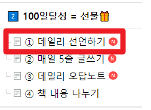
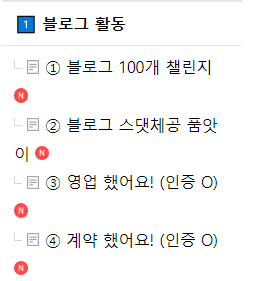
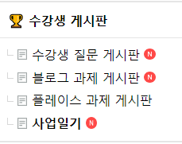

# 해야하는 일을 몰라서 돈 못 버는 건데요?

- 원천 ID: EPR-CAFE-17677
- 작성자: 주는사란
- 작성일: 2024-01-09T14:10:12.910000+09:00
- 원문: https://cafe.naver.com/ranschool/17677
- 수집일: 2026-09-21
- 텍스트 정리: HTML 문단 순서 유지, 빈 문단·제로폭 공백만 제거. 원본 HTML·JSON 별도 보존. 이미지는 아래에 모아 보관하며 원래 배치는 HTML에서 확인.

## 원문 본문

<!-- P001 -->
올해 저는 진짜 목표를 이뤄볼 생각입니다.

<!-- P002 -->
지금까지 매해 목표를 세웠지만, 매해 목표가 똑같았어요. 매번 이루지 못했으니까요.

<!-- P003 -->
그래서 요즘은 이 목표를 이루려면 어떻게 해야하는지에 대해 정리중인데요. 혹시나 저와 같은 분에게 드리는 글입니다.

<!-- P004 -->
1년간 유튜브를 한다면서 '돈 되는 일'(부업)에 대해 하루 최소 3시간씩 찾아봤다. 사실 나는 10년간 옆에서 누군가가 돈을 어떻게 버는지를 보고 따라하기를 즐겨했다. 그리고 매번 다짐했다.

<!-- P005 -->
"진짜 해야지"

<!-- P006 -->
사람들은 '해야하는 일'을 오해해서 '돈 받는 일' 혹은 '급한 일' 이라고 생각한다. 하지만 '해야하는 일'이라는건 그런 일이 아니다.

<!-- P007 -->
해야하는 일이란 '내 인생에 큰 영향을 주는 일'이다. 예를 들어, 블로그를 해야한다고 마음 먹었다 치자. 이때 그냥 감정적으로 "해야지" 라고 말하는 것은 바보짓이다. 어느 순간의 감정 때문에 "해야지"라는 말을 자주 하다보면, '해야하는 일'의 무게를 잃어버리기 때문이다.

<!-- P008 -->
"해야지"라는 말을 자주 하다보면, 실제로 해야하는 일을 할 수 없게된다. 보통은 그 일을 해도 내 인생에 큰 무리가 없을거라 생각해서다.

<!-- P009 -->
나도 한때는 "다이어트 해야지" "책 읽어야지" "영어공부 해야지" 라고 말만 잘했었다. 심지어는 '3개월간 다이어트 실패시 100만원' 을 걸고 했는데도 실패했다. 유튜브 댓글에도 "블로그 진짜 해야죠" 라는 댓글을 보면, 혹시나 "해야지"병에 걸리신건 아닐까봐 걱정이 된다. 돈을 벌기 위해선 '해야하는 일'만 해도 충분하다.

<!-- P010 -->
1년간 다양한 부업을 소개하면서 마음에 걸렸다. 돈을 버는 '다양한' 방법이 중요할까 라는 생각에서다. 나도 한 때는 환상이 있었다. '세상 어딘가에 대단한 색다른 부자가 되는 방법'이 있을거라고 말이다.

<!-- P011 -->
다이어트 세계도 비슷하다는 생각을 했다. 요즘 다이어트 방법이라고 치면 너무 많은 주장을 한다. "탄단지 비율을 지켜라" "지방함량을 높이는 키토제닉이 좋다" 등. 하지만 사실 원리는 똑같다. 건강한걸 먹고, 운동하라는 것이다. 물론 다이어트를 위해 최소한의 공부를 할 필요는 있다. 하지만, 꼭 다이어트를 실패한 사람이 더 특별한 방법을 찾으려고 여러 방법을 돌아다닌다. 바로 나였다.

<!-- P012 -->
돈을 못 버는 이유는 간단하다. 목표를 세웠지만 실패하는 이유도 똑같다. 우리가 이미 알고 있는 '해야하는 일'을 하지 않았기 때문이다.

<!-- P013 -->
그럼 왜 우리는 '해야한다고 생각하는 걸 하지 못했을까?'

<!-- P014 -->
첫번째는 해야하는 일의 양이다. 너무 많다. 직장에서 시키는 일, 부업, 블로그, 다이어트 모두 '해야만 하는' 일이다. 시간은 없고 해야하는 일은 많다.

<!-- P015 -->
두번째는 죄책감이다.  뭘 해야한다고 생각해도 "오 이거 괜찮네?"라는 감정으로 결정하다보면 결국 죄책감만 든다. 감정적으로 괜찮다고 느끼는 순간, "해야지"라고 너무 쉽게 마음 먹는다. 보통은 '팔랑귀' '자극유형'이 그러는데 둘다 나다.

<!-- P016 -->
올해 목표가 블로그와 다이어트라고 마음 먹은 사람이 있다고 해보자. 다이어트를 하기 위해서는 식단도 해야하고, 운동도 해야한다. 6시에 퇴근하고 집에 와서 샐러드를 먹고 운동을 갔다왔다고 해보자. 이때 블로그를 쓰기 위해 책상에 앉기란 현실적으로 어렵다. 해야하는 일을 실제로 할 수 있는지 생각해 보지 않는 것이다.

<!-- P017 -->
"해야지" 라고 마음 먹은 일을 하기 가장 좋은 방법은 조던피터슨이 말하듯 '상황분석' 이다. 내 상황에서 목표는 몇개까지 세우면 좋을지, 각각의 목표에 필요한 시간은 얼마정도인지, 이걸 하기 위해서는 내가 어떤걸 공부해야 하는지, 공부하는데 필요한 비용과 시간은 얼마인지 등이다.

<!-- P018 -->
(아래 영상 참조)

<!-- P019 -->
해야한다고 느낀 일을 꼭 해내려면 두가지가 필요하다. [상황분석 + 관리]이다. 그래서 내가 상황분석을 매일 하기 위해 '사업일기'(수강생) 를 쓰라고 하는 것이고, 혼자서는 계속 하기 힘드니깐 같이 관리하기 위해 카페에 글을 쓰라고 강조하는 것이다. 이 두가지를 계속하는 사람은 "해야겠다"고 생각한 일을 못 할리가 없다. 사업일기를 매일 쓰시는 정화님 (이래도 좋고 저래도 좋다)의 일기를 매일 보는데 매출이 늘어나는게 느껴진다. 나도 매일 일기를 쓰고 있다.

<!-- P020 -->
이건 모든 상황에서나 마찬가지다. 예를 들어, '블로그 글쓰기'라는 목표가 있다고 해보자. 그 목표를 이루기 위해서는 내가 매일 몇시에 쓸것인지, 주 몇번을 쓸것인지, '내 상황'에 대해 알아야 한다. 이걸 서로 댓글로 관리를 받으시라고 만든 게시판이 '데일리 선언하기' 이다. 또, 만약 쓰겠다고 마음 먹어놓고 쓰지 못했다면 왜 쓰지 못했는지 등을 반성해야 한다. 이걸 스스로 해보시라고 만든 게시판이 '사업일기(수강생), 데일리 오답노트(비수강생)' 이다.

<!-- P021 -->
결국 이 두가지만 잘해도 돈을 못 벌 일은 없다. 보통은 "해야지"라고 말만 하는 삶을 살아가며, 결국 못해서 자책하는 하루를 반복하게 된다. 그리곤 다른 부업을 찾다가 또 같은 순서를 반복하니 돈을 못 버는 것이다.

<!-- P022 -->
정리하면 이렇다.

<!-- P023 -->
1. 내 상황 분석

<!-- P024 -->
2. 데일리 선언

<!-- P025 -->
3. 실제 행동

<!-- P026 -->
4. 관리 받기

<!-- P027 -->
돈을 벌기 위해서는 '해야지'라고 말한 것만 하면 된다.

<!-- P028 -->
이 4가지 단계로 '해야하는 일'을 끝내면 된다. 2번은 하지 않더라도, 4번은 무조건 해야한다. 4번을 안하면 내가 뭘 잘 못하고 있는지, 내가 뭘 잘 하고 있는지 알길이 없다. 원래 본인이 한 것에 대해서 과대평가 하게 되어있기 때문에, 불특정 다수에게 객관적 평가를 받을 필요가 있다. 무엇보다 불특정 다수가 보는 곳에 나의 오늘 하루를 정리하는 것만 하더라도, 다음날 "해야지"라고 마음 먹는것에 엄청난 영향을 준다.

<!-- P029 -->
요즘에는 이 4번 항목의 중요성이 잘 알려져, '챌린지'(평균 10만원대) 라는 이름으로 돈을 받고 관리해 주는 곳도 많다. 개인적으로는 유료로라도 하는게 무조건 좋다고 생각한다. 가능한 이 카페에서 무료로 할 수 있도록 최근 카페 게시판도 개편했다.

<!-- P030 -->
평균 10만원대 챌린지를 무료로 할수 있도록 카페를 바꿨다. 적용해 보면 이렇다.

<!-- P031 -->
1. 내 상황 분석 : 그 일을 할 수 있는 상황인지 파악, 여러 목표 잡지 않기

<!-- P032 -->
2. 데일리 선언 : 그 일을 언제 할 것인지 선언

<!-- P033 -->
3. 실제 행동 : 블로그 100개 챌린지, 스댓체공 품앗이, 영업했어요, 계약했어요

<!-- P034 -->
4. 관리 받기 : 사업일기 (수강생), 데일리 오답노트 (비수강생)

<!-- P035 -->
*서로 댓글 달아주고 격려해주기

<!-- P036 -->
매일 이런 식으로 하다보면, "해야지"라는 대단한 의지가 없어도 습관처럼 하게 된다.

<!-- P037 -->
이 글을 보는 분이 2025년 01월 01일에 "올해는 했다고" 댓글이 달리기를 바라며 글을 적어봅니다. 저도 올해는 정말....해볼게요.

## 본문 이미지

## 원문에 포함된 링크

- https://cafe.naver.com/ArticleList.nhn?search.clubid=30781985&search.menuid=148&search.boardtype=L
- #

## 원본 HTML에 포함된 외부 게시물 메타데이터

외부 게시물의 현재 본문을 재수집한 것이 아니라, 카페 게시 당시 함께 저장된 제목·설명이다. 잘린 문구는 보완하지 않았다.

- 원문 링크: https://youtu.be/O9Gi--cvkQg?si=GF0YLQPbGqCoGObm

할 일을 매번 미루는 사람이 꼭 봐야 할 영상 (조던피터슨) (한영자막)

주요 메세지 요약▶ “마치 당신이 아끼는 사람과 협상하듯 그 사람이 생산적이고 충만한 삶을 살게 하고 싶다는 마음으로요! 그런 마음으로 일정관리를 해야 합니다.”▶ “Like you're negotiating with someone that you care for that you ...

