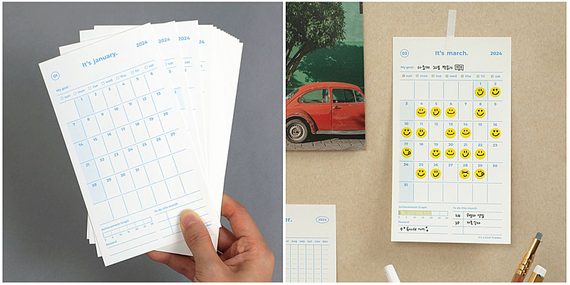
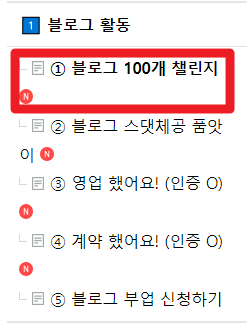
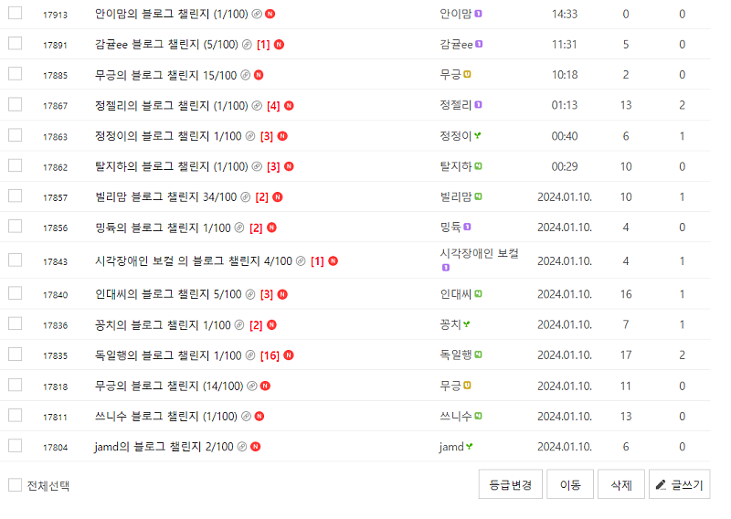
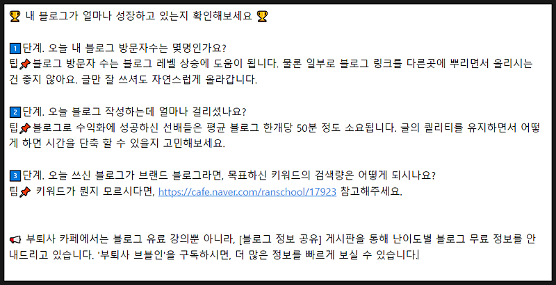

# 부업을 실패하는 사람들이 하는 부업

- 원천 ID: EPR-CAFE-17927
- 작성자: 주는사란
- 작성일: 2024-01-11T16:25:58.613000+09:00
- 원문: https://cafe.naver.com/ranschool/17927
- 수집일: 2026-09-21
- 텍스트 정리: HTML 문단 순서 유지, 빈 문단·제로폭 공백만 제거. 원본 HTML·JSON 별도 보존. 이미지는 아래에 모아 보관하며 원래 배치는 HTML에서 확인.

## 원문 본문

<!-- P001 -->
4년 전 블로그로 돈을 벌기 시작했을때, 나는 돈을 더 버는 '블로그' 보다 '학원 수업'에 더 많은 시간을 투자했다. 사실상 1/3정도 밖에 안되는 돈을 벌고 있었는데도 '학원 수업'을 놓기가 어려웠다.

<!-- P002 -->
나는 애써 '돈은 여러 곳에서 버는게 좋으니까'라고 합리화했다.

<!-- P003 -->
근데 최근 왜 이랬는지 깨달았다. 그건 바로 '시각화' 때문이다.

<!-- P004 -->
학원 수업을 놓기 어려웠던 이유는 간단하다.

<!-- P005 -->
1. 매일 아이들이 숙제를 해오는게 바로바로 보인다.

<!-- P006 -->
2. 8회당 수업료를 받아서, 하루에 한번꼴로 60만원씩 들어온다.

<!-- P007 -->
3. 블로그는 글의 갯수는 늘지만, 실제 내 글로 인해 문의가 늘어났는지 눈에 보이지 않았다.

<!-- P008 -->
부업을 시작해놓고 중간에 포기하는 이유는 간단하다.

<!-- P009 -->
"레벨과 성장속도가 눈앞에 보이지 않기 때문"

<!-- P010 -->
부업을 시작해 놓고, 매번 끝까지 못한다면 '시각화'가 가능한 부업을 해보기를 추천한다.

<!-- P011 -->
만약 내가 4년전 이 원리를 알았더라면 이렇게 적용해봤을거다.

<!-- P012 -->
1. 처음에는 블로그 갯수 채우기를 위주로 한다. 일주일에 몇개 이런식으로.

<!-- P013 -->
2. 매일 블로그 쓰는데 걸린 시간을 확인해본다. (글의 퀄리티를 유지하면서 시간 단축을 위해 노력한다)

<!-- P014 -->
3. 매일 블로그 방문자수를 적는다.

<!-- P015 -->
4. 키워드를 잡아서 쓴 경우, 일주일 뒤에 해당 키워드로 상위노출 되었는지 확인한다.

<!-- P016 -->
5. 브랜드 블로그의 경우, 매주 문의량을 체크한다.

<!-- P017 -->
이 카페에 적용해보면 이렇다.

<!-- P018 -->
1. 블로그 100개 챌린지를 한다.

<!-- P019 -->
2. 챌린지 글에 해당 블로그를 쓸 때 블로그 쓰는데 걸린 시간, 일간 방문자 수, 키워드 검색량 등 눈에 보이는 요소 확인해보기. (양식에 업뎃 완료)

## 본문 이미지

## 원문에 포함된 링크

- #
