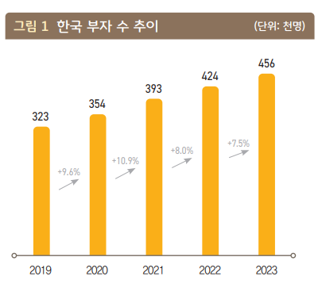
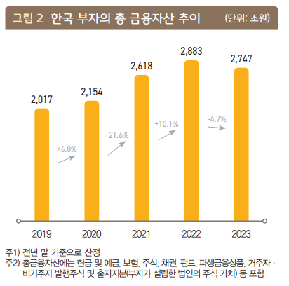
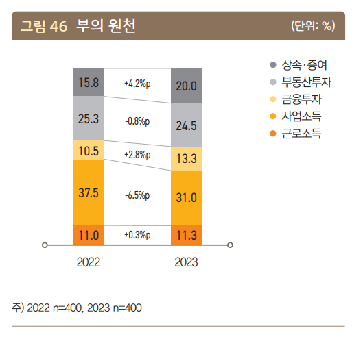
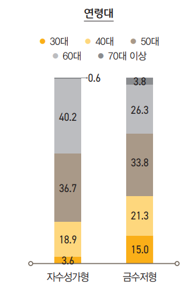

# 하루에 부자는 XX명씩 늘고 있다.

- 원천 ID: EPR-CAFE-18037
- 작성자: 주는사란
- 작성일: 2024-01-12T15:55:34.560000+09:00
- 원문: https://cafe.naver.com/ranschool/18037
- 수집일: 2026-09-21
- 텍스트 정리: HTML 문단 순서 유지, 빈 문단·제로폭 공백만 제거. 원본 HTML·JSON 별도 보존. 이미지는 아래에 모아 보관하며 원래 배치는 HTML에서 확인.

## 원문 본문

<!-- P001 -->
오늘 쇼츠를 쓰기 위해 몇가지 자료를 봤는데, 재밌는 사실이 있어서 적어본다.

<!-- P002 -->
1. 인구는 줄고 있는데, 부자는 늘고 있다.

<!-- P003 -->
KB그룹에서 발표한 자료에 따르면, 2022년 한국에서 '부자' 라고 말하는 사람은 42만 4천명이었다. 2023년 12월에 발표한 자료에 따르면 45만 6천명으로 작년대비 3만 2천명(7.5%)가 늘었다. 365일로 나눴을때 하루에 평균 87명씩 부자가 되고 있다는 소리다.

<!-- P004 -->
여기서 부자란 금융자산이 10억원 이상 보유한 개인을 말한다.

<!-- P005 -->
2019년이후 매년 약 3만~4만명씩 늘어왔다.

<!-- P006 -->
그니깐 2019년이후 현금 10억이 된 사람이 하루에 90명이상씩 생기고 있다는 것이다.

<!-- P007 -->
2. 부자 수는 늘었는데, 부자의 재산은 줄었다.

<!-- P008 -->
2022년에 부자들의 총 금융자산은 2883조원에서 2023년 2747조원으로 줄었다. 2019년 이후로 처음으로 줄었다고 한다.

<!-- P009 -->
코로나 이후 주식시장이 좋았다가 2022년 줄어들기 시작하면서 2023년 금리인상등의 영향이 있는것으로 보인다.

<!-- P010 -->
3. 돈을 모은 방법 1위는 사업소득이다.

<!-- P011 -->
보통 부자라고 하면 '금수저'를 떠올린다. 실제 부자들 중 '상속과 증여'로 돈을 가지고 있는 사람은 20%로 돈의 원천 중 3위에 이른다.

<!-- P012 -->
"금수저라 부자다"라는 말은 틀린 말은 아니지만, 그 방법만 있는건 아니라는 것이다. 오히려 놀랍게도 돈을 모은 방법 중 1위는 사업소득이다. 더 재밌는 것은 근로소득이 11.3%나 있다는 것이다. 사업도 결국 본인이 일을 해야한다.

<!-- P013 -->
결국 일을 해서 부자가 된 비율이 42.3%나 된다는 이야기다.

<!-- P014 -->
사업소득에는 매출규모가 큰 회사 뿐 아니라 개인사업자도 포함이 되었다. 생각보다 5인 미만의 소규모 사업장에서 부자가 된 사람도 꽤 있다는 것이다.

<!-- P015 -->
4. 자수성가형은 5060일때 빛을 발한다.

<!-- P016 -->
인스타, 유튜브에 보면 "20대인데 얼마 있어요" "30대인데 얼마 있어요" 라는 사람들이 많다. 그 기준이 택도 없는 경우가 많다. 개인적으로 나도 좀 조심하는 부분이다.

<!-- P017 -->
실제 조사결과에 따르면, 20대 30대에 자수성가해서 부자가 되는 경우는 3.6%정도다. 심지어 이 조사에서는 너무 적어서 20대는 조사 대상에 넣지도 않았다.

<!-- P018 -->
급할 필요 없다. 아직 한~참 남았다. 심지어는 70대 이상에 처음 부자된 사람들도 있다.

<!-- P019 -->
결론 -

<!-- P020 -->
1. 돈 버는 방법은 반드시 있다.

<!-- P021 -->
2019년 이후 하루에 90명씩 부자가 생기고 있다. 하루에 이 정도 부자가 늘어나고 있다면, 어쩌면 그 방법을 나만 모르는건 아닐까? 점검해볼 필요가 있다.

<!-- P022 -->
2. 일을 해서 돈을 모아야 한다.

<!-- P023 -->
부자들도 일을 하고 있다. 근데 내가 안 한다는건...?

<!-- P024 -->
3. 돈을 벌 수 있는 능력을 갖춰야 한다.

<!-- P025 -->
사업소득이 부자가 되는 방법 1위라는건 꽤나 희망적이다. 결국 내가 돈을 벌 수 있는 능력이 생기면 부자는 된다는 말이다.

<!-- P026 -->
4. 조급할 필요 없다.

<!-- P027 -->
자수성가형이 된 나이대 1위는 60대다. 와...나 진짜 많이 남았네? ㅎㅎㅎㅎㅎ

<!-- P028 -->
돈 버는 능력 갖추고 싶은 분은

<!-- P029 -->
제목 그대로 많은 분들이 영업을 힘들어하는 이유를 알려드리고 해결책을 제시하여 여러분들의 더 빠른 수익화를 도와드리려 합니다. 저는 과거 방문판매를 하며 최소 하루에 5...

<!-- P030 -->
cafe.naver.com

## 본문 이미지

## 원문에 포함된 링크

- #
- https://cafe.naver.com/ranschool/18036
