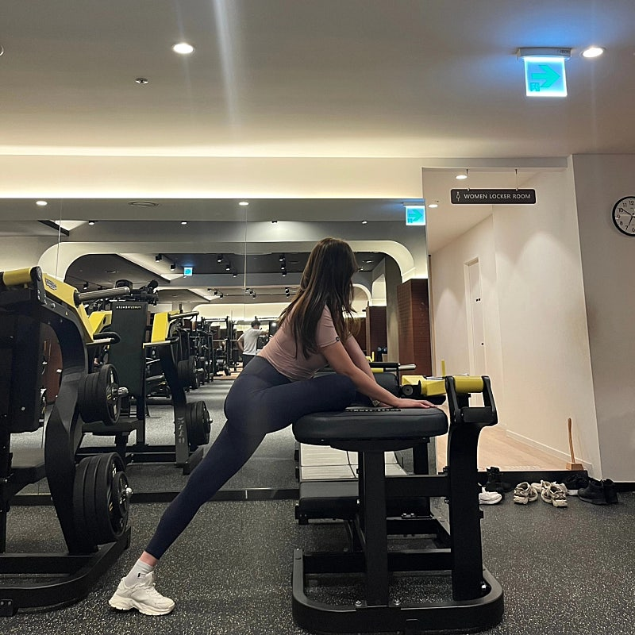
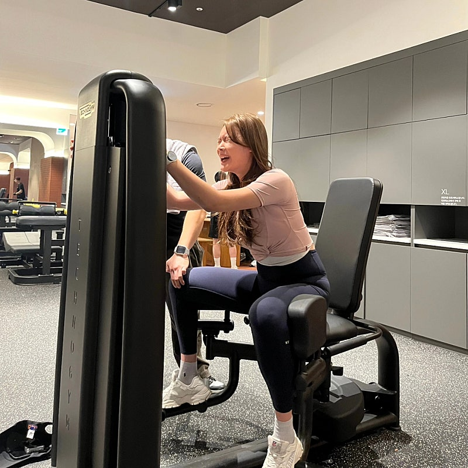
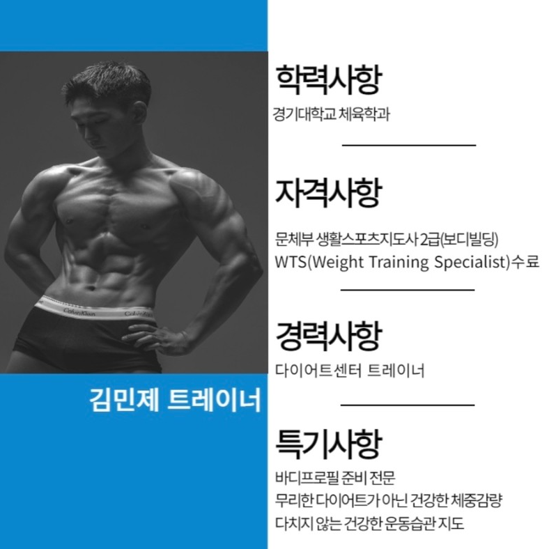
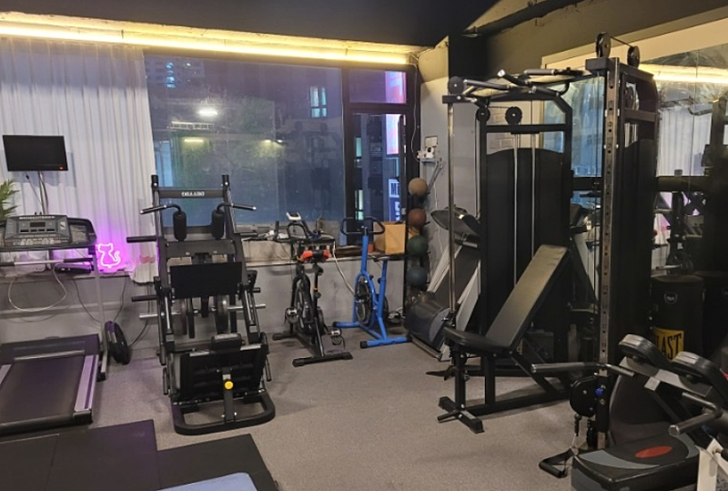
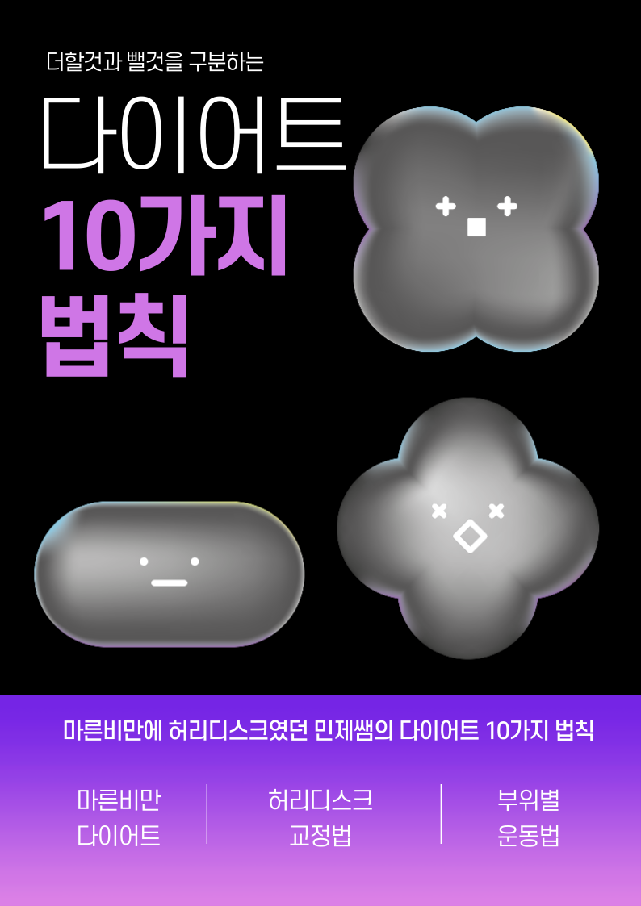
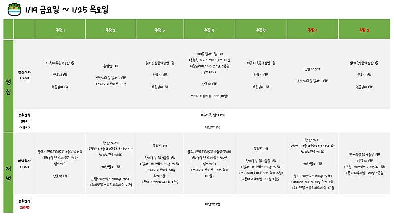
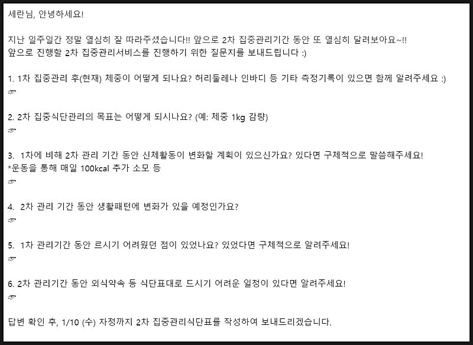
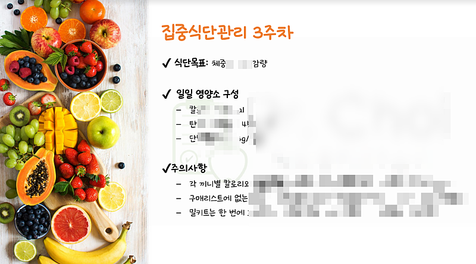
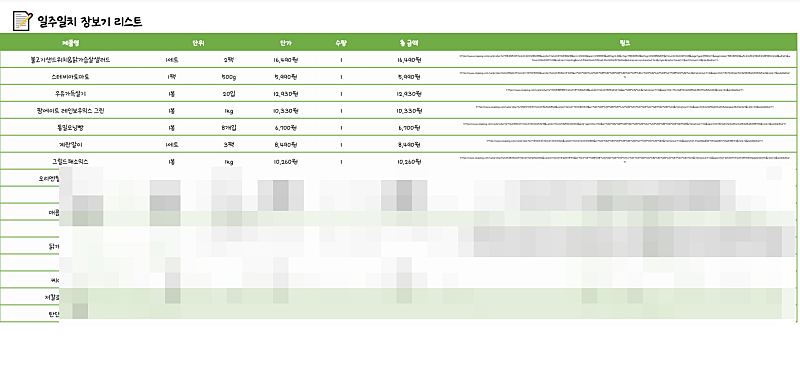
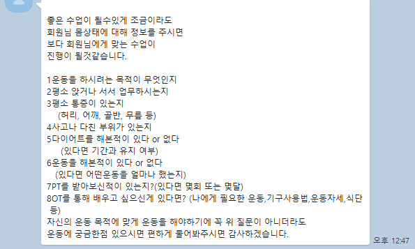

# 내가 만약 PT 트레이너를 한다면

- 원천 ID: EPR-CAFE-18672
- 작성자: 주는사란
- 작성일: 2024-01-19T16:01:37.607000+09:00
- 원문: https://cafe.naver.com/ranschool/18672
- 수집일: 2026-09-21
- 텍스트 정리: HTML 문단 순서 유지, 빈 문단·제로폭 공백만 제거. 원본 HTML·JSON 별도 보존. 이미지는 아래에 모아 보관하며 원래 배치는 HTML에서 확인.

## 원문 본문

<!-- P001 -->
저한테는 아주 특이한 습관이 있어요. 어딜 가든 두가지를 봅니다.

<!-- P002 -->
"저 사람은 어떻게 돈을 벌고 있나"

<!-- P003 -->
"나라면 어떻게 할 것인가"

<!-- P004 -->
사실 좀 괴로워요. 저도 이런걸 이제 그만 보고 싶은데, 자꾸 보여요. 음식점 말아먹고, 나중에 마케팅을 배워서 그런가봐요. 아쉬움이 있어서 저도 모르게 계속 생각하나 봅니다. 여튼 나중에 뭐든 하게 될지도 모르니 미리 정리해 봅니다.

<!-- P005 -->
최근에 저희 카페 매니저님 남자친구이자, 제 블로그강의 1기 수강생 민제님에게 PT를 받는데요. 진짜 잘 가르치시더라구요. 그래서 민제님 PT 홍보를 도와주려고 하는데요. 그 계획을 적어봅니다. "제가 만약 PT를 한다면"이라는 관점에서 한번 적어보겠습니다.

<!-- P006 -->
지금부터 저는 PT 트레이너라고 생각해보겠습니다. 저라면 이렇게 할거예요.

<!-- P007 -->
1. 시간제 헬스장을 빌릴거예요. 예를 들면 PT샵 (약 30평규모) 하는 분들에게 월세 일부를 내고 정해진 시간대를 빌리는 거죠. 헬스장에 취직할 경우 트레이너 개인이 따로 홍보활동 하는게 지극히 제한적이니까요.

<!-- P008 -->
그래서 저는 직접 홍보하는 방법을 택할 것 같아요. 장소를 정할 때는 기구의 다양성이 중요할 텐데요. 1인 PT샵은 기구가 너무 적을 수 있으니, 약 30평대 규모의 PT샵을 찾아 볼겁니다. 만약 원하는 자리가 도저히 없다면, 개인 홍보가 가능한 헬스장에 취직할 것 같습니다.

<!-- P009 -->
일단, 헬스장을 빌렸다고 가정하고 해볼게요. 그럼 이후부터는 헬스장 마케팅과 똑같이 하면 됩니다. *실제로 민제님은 이미 헬스장을 빌리셨습니다. 양천구에서 하실 예정이니 혹시 관심있으신 분들은 댓글 달아주시면 연락드릴거예요.

<!-- P010 -->
2. 첫번째로는 사업자를 낼거예요. 사업자가 있어야 네이버 플레이스 광고를 할 수 있으니까요. 헬스장에 취직했더라도, 사업자는 사장님하고 이야기 하면 낼 수 있습니다. (전대차 계약서 작성하면 됨)

<!-- P011 -->
3. 플레이스 심사받는 일주일동안은 아래 3가지를 할거예요.

<!-- P012 -->
1) 먼저, 10페이지짜리 운동법 pdf를 쓸거예요. 나이대별 / 몸무게별 / 고민하는 부위별 운동법을 쓰는거죠. 학원가면 교재를 주듯 저는 이 교재를 나눠줄 겁니다.

<!-- P013 -->
왜냐면 스스로 운동할 수 있어야 하니까요. PT를 그만두는 이유는 정해져 있습니다. 목표를 이루지 못했거나, 혹은 이뤄서 더이상 할 필요가 없는거죠. 목표를 이뤄서 그만두는 경우는 사실 거의 없습니다. 직장인들을 대상으로 조사한 통계에 따르면, PT를 시작 후 1개월 이내 포기한 비율이 71%나 된다고 하네요. 결국 목표를 이루지 못해서 PT를 그만두는 경우가 많죠. 아마 목표가 이뤄졌다면, 유지하기 위해서라도 계속 다니지 않을까 싶습니다. 이 목표를 이뤄주려면 일단 스스로 운동하는 방법을 알아야합니다. 헬스장에 오면 XX기구 몇분, XX기구 몇분 등 어떻게 운동해야 하는지 스스로 알아야 할겁니다.

<!-- P014 -->
▼ 전자책 표지 예시로 만들어봤어요 ㅎㅎ ▼

<!-- P015 -->
2) 식단표 양식(?)을 만들거예요. 실제 아래는 매주 제가 제공받는 식단표 입니다. 살을 빼려면 운동만큼이나 식단이 중요한데요.

<!-- P016 -->
보통은 PT쌤들이 식단 짜준다고 해놓고 짜주는 식단을 보면 사실상 할 수 없는 식단이예요. 닭가슴살, 밥, 고구마 등등 아주 조금이죠. 식단 체크도 실제 제대로 해주시는 분들은 거의 없는것 같아요.

<!-- P017 -->
핵심은 지속 가능한 식단일텐데요. 그 사람의 생활습관을 잘 파악 한 후 바로 장 볼 수 있도록 구매가능한 링크와 식단을 짜주면 좋을 것 같습니다.

<!-- P018 -->
이정도 식단표면 평균 한달에 20-30만원 별도로 비용을 받고 관리해 줍니다. 이런 식단 관리표를 제공해주면서, PT비용을 차라리 조금 올려서 받으면 될것 같아요.

<!-- P019 -->
그래도 초반에는 회원 유치를 위해 회당 4-5만원 정도로 하되, 위 식단관리까지 해주는거죠.

<!-- P020 -->
3) 헬스장 기구별 운동방법에 대한 간단한 영상을 촬영합니다. 이 영상은 블로그나, 플레이스 등에 올릴 영상이기도 하구요. 나중에 광고등을 하기 위해서는 영상이나 사진이 많이 필요하니 미리 찍어두면 좋을것 같아요.

<!-- P021 -->
4. 플레이스 심사가 나면, 플레이스 세팅을 합니다. (평균 3일) 블로그도 써야겠죠? 한 20개정도 쓰면 매출이 150정도는 나올것 같네요. 만약 사업자가 안되서 플레이스를 할 수 없다면, 파워링크까지 하면 될것 같습니다.

<!-- P022 -->
5. 문의가 온다면 이렇게 할게요.

<!-- P023 -->
1) 질문하기

<!-- P024 -->
아래는 실제 민제님이 수업전 제게 물어보신 질문입니다.

<!-- P025 -->
2) 전자책 전송

<!-- P026 -->
수업 전에 전자책 보고 올 수 있도록 보내주는거죠. 내가 하는 운동 스타일에 대해 알려주고, 수업전에 미리 맞는지 확인할 수 있도록요.

<!-- P027 -->
3) 1회 무료 수업

<!-- P028 -->
저는 PT 받을 때도 나름 까다로운 편인데요.

<!-- P029 -->
운동을 빡세게 해줬으면 좋겠어요. 마사지를 한다거나 이런건 싫거든요. 가끔 체형교정 한다면서 운동이 아니라 마사지만 해주시는 분들이 있더라구요. 민제님은 쉬는시간 없이 빡세게 해줍니다. 쉬는시간이 없어서 문제예요.....ㅋㅋㅋ

<!-- P030 -->
두번째로 저는 한번 수업마다 전신을 다하는걸 좋아합니다. 상체 복부 하체 모두요. 선생님마다 부위 한 군데만 하시는 분들이 있더라구요.

<!-- P031 -->
마지막으로는 근력, 유산소 다 하는게 중요하다고 생각해요. 짧게라도 끝나고 유산소를 시켜주는게 좋더라구요.

<!-- P032 -->
저처럼 까다로운 고객이 많지는 않겠지만 ㅋㅋㅋㅋㅋㅋㅋㅋㅋ 미리 원하는 운동방식이나 운동법등을 알려주는 느낌으로 하면 좋을것 같네요.

<!-- P033 -->
위 내용을 다 해볼순 없겠지만, 제 PT쌤 홍보 해보고 나중에 결과 올려볼게요.ㅎㅎ

<!-- P034 -->
마케팅 기초 글쓰기가 너무 어렵다면, 아래 글을 참고해보세요!

<!-- P035 -->
글쓰기에 정답은 없지만, 오답은 있다...! 고 저는 생각합니다. 글쓰기는 말을 문자로 옮겨 놓은 것이라 생각하는데요. 그래서 말을 잘하는 사람은 글도 잘 쓸 확률이 높다고 ...

<!-- P036 -->
cafe.naver.com

## 본문 이미지

## 원문에 포함된 링크

- #
- https://cafe.naver.com/ranschool/18673
