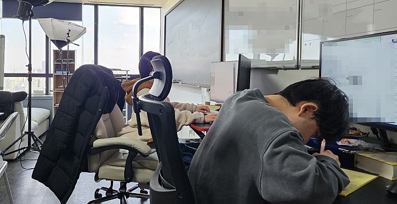
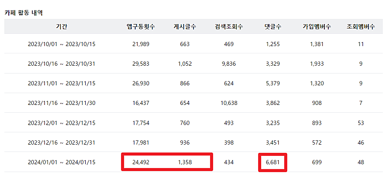
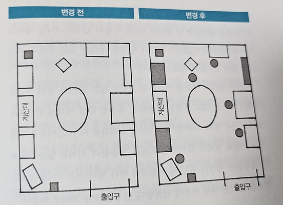

# 전 재산을 투자해서라도 사고 싶은 것

- 원천 ID: EPR-CAFE-18961
- 작성자: 주는사란
- 작성일: 2024-01-23T15:01:53.687000+09:00
- 원문: https://cafe.naver.com/ranschool/18961
- 수집일: 2026-09-21
- 텍스트 정리: HTML 문단 순서 유지, 빈 문단·제로폭 공백만 제거. 원본 HTML·JSON 별도 보존. 이미지는 아래에 모아 보관하며 원래 배치는 HTML에서 확인.

## 원문 본문

<!-- P001 -->
어제 백화점에서 호두과자를 한박스 샀다.

<!-- P002 -->
두개만 먹고 나머지는 사무실에 가져가기 위해 문 앞에 놨다. 문 앞에 놔둔 호두과자를 사무실에 가져가기 위해 챙겼다. 사무실 오는 길에 자연스럽게 호두과자 박스 안으로 손이 갔다. 호두과자를 먹고 싶다는 생각도 없었고 배가 고프지도 않았는데 호두과자를 먹었다.

<!-- P003 -->
우리 팀은 오후 2시면 모두 부퇴사 카페에 들어온다. 카페에 글을 남기기 위해서다. 2시에 그냥 카페에 글을 쓴다.

<!-- P004 -->
그렇게 2개월만에 카페 활동 점수가 2배 상승했다.

<!-- P005 -->
보스턴에 있는 한 병원에서 실험을 했다. 스스로 의지를 갖거나 동기를 변화시키지 않고도 병원 직원과 방문객들의 식습관을 더 낫게 만들수 있는 방법을 위한 실험이다.

<!-- P006 -->
식당 안 음료 배치를 바꾸는 것부터 시작했다. 연구자들은 냉장고마다 생수병을 추가해서 넣어두었고, 음식 배식대 옆에 생수병이 담긴 바구니를 놓았다. 주요 냉장고들 안에는 여전히 탄산음료가 있었지만, 모든 탄산음료 옆에 물도 놓았다.

<!-- P007 -->
어둡게 칠해져 있는 부분이 생수가 있었던 곳이다.

<!-- P008 -->
이후 3개월동안 병원의 탄산음료 판매는 11.4%p가 감소했다. 반면 생수 판매는 25.8%p 증가했다. 이후 연구자들은 음식에 대해서도 한가지 조정을 더 했고, 비슷한 결과가 나타났다.

<!-- P009 -->
특정 행동들은 특정한 환경 아래서 반복적으로 나온다. 도서관에서는 속삭이며 대화를 나누고, 어두운 길에서는 주변을 살피며 방어적 태도로 행동한다. 어떤 누구라도 인간이라면 그렇게 행동한다. 대부분의 행동은 대단한 동기가 필요하지 않다.

<!-- P010 -->
버튼을 누르면 불이 켜지듯 행동은 그냥 환경에 따라 일어난다.

<!-- P011 -->
나는 전재산을 쓰겠다.  배가 고프지 않아도 호두과자에 손이 가듯 아래 행동을 만들어 줄 수 있다면. 버튼을 누르면 불이 켜지듯 할 수 있게 만들어 준다면.

<!-- P012 -->
디저트를 사기 전에 내 핸드폰이 꺼진다. (삼성페이 못 쓰게) => ₩ 1천만원

<!-- P013 -->
헬스장 앞을 지나갈때 내 발이 자동으로 헬스장 안에 들어간다 => ₩ 3천만원

<!-- P014 -->
일기 쓰기 전까지 눈이 안 감긴다 => ₩ 1억원

<!-- P015 -->
죽을 때까지 매일 글을 쓴다 => $2억원

<!-- P016 -->
버튼 누르듯 영업하는 법

<!-- P017 -->
영업시 계약 확률을 올리시려면 강점을 부각시켜야 합니다. 근데 이게 말처럼 쉬우면 좋겠지만 사실 처음 영업을 해야지라고 마음을 먹게되면 사실 강점은 안 보이고 우리의 단점만 ...

<!-- P018 -->
cafe.naver.com

## 본문 이미지

## 원문에 포함된 링크

- #
- https://cafe.naver.com/ranschool/18867
