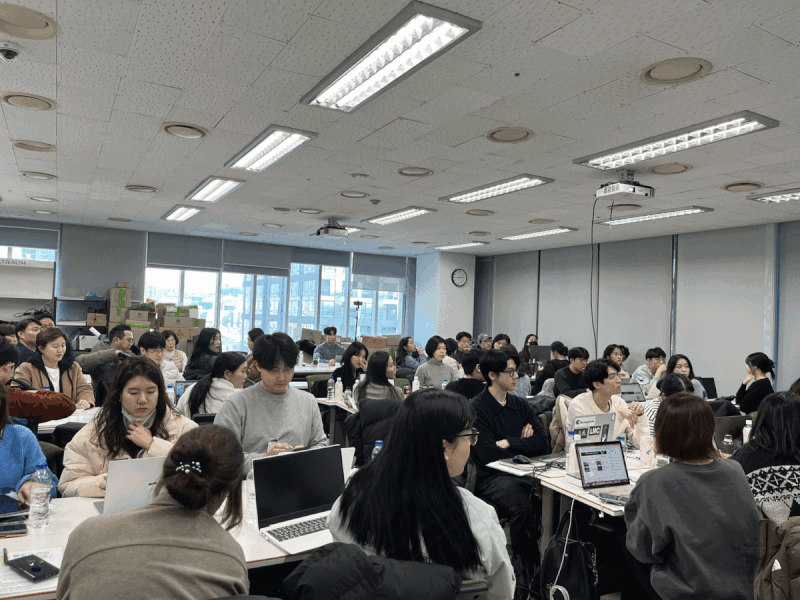
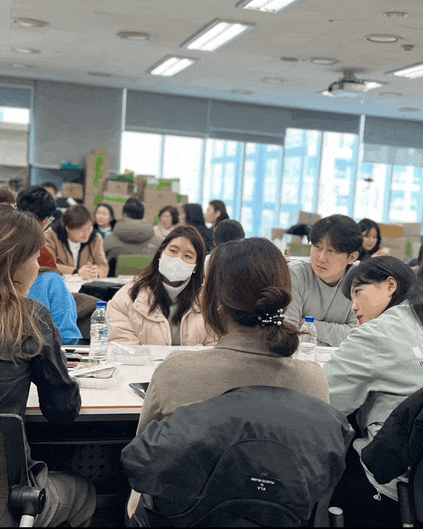
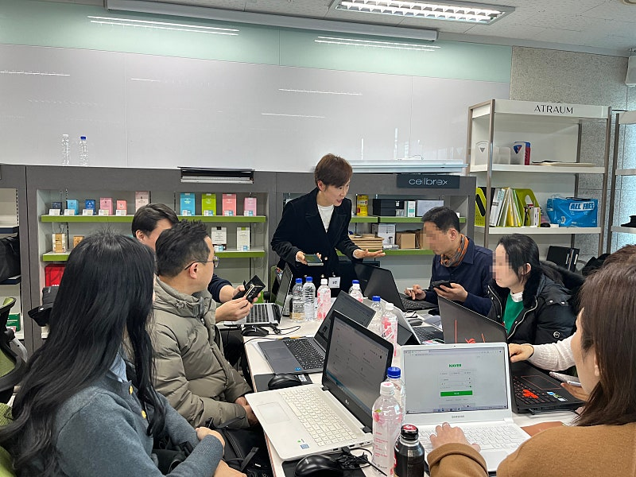
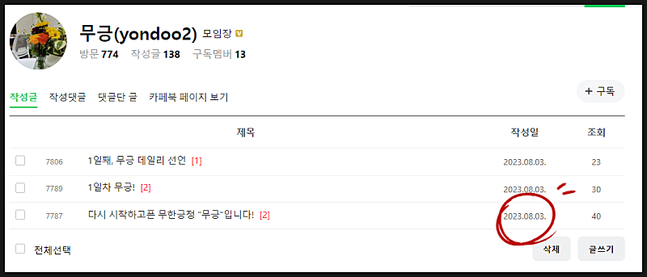
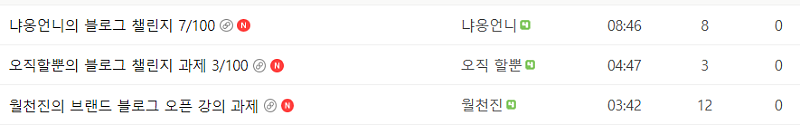

# 강사 10년차가 말하는, 결국 수익 내는 사람들의 특징

- 원천 ID: EPR-CAFE-19541
- 작성자: 주는사란
- 작성일: 2024-01-31T11:54:43.767000+09:00
- 원문: https://cafe.naver.com/ranschool/19541
- 수집일: 2026-09-21
- 텍스트 정리: HTML 문단 순서 유지, 빈 문단·제로폭 공백만 제거. 원본 HTML·JSON 별도 보존. 이미지는 아래에 모아 보관하며 원래 배치는 HTML에서 확인.

## 원문 본문

<!-- P001 -->
지난주 주말부터 오프라인 강의를 시작했습니다. 총 50분이 함께 했는데요. 강의를 하면서 몇가지 깨달은 내용이 있어서 정리해 봅니다.

<!-- P002 -->
오프라인 강의를 하다보면 수강생들의 눈이 보인다. 대다수 눈이 반짝 거린다. 물론 50명중 2명정도는 피곤한 나머지 눈이 감길것 같은 분도 있었다.

<!-- P003 -->
10년간 아이들을 가르쳤지만, 수업시간에 눈이 반짝거리는건 믿지 않는다(?) ㅎㅎ 대신 수업 외 시간에 어떻게 하는지를 더 믿는 편이다.

<!-- P004 -->
지난주 토요일, 일요일 2번을 하니깐 이름까지는 기억이 안나더라도 얼굴을 보면 어떤 분인지에 대한 느낌이 보인다. 여느 선생님이 그렇듯 잘 될 사람이 느껴진다. 그리고 보통 이 분들에게는 공통적으로 재미난 특징이 있다.

<!-- P005 -->
1. 잘 못 한다.

<!-- P006 -->
지난주 일요일 2번째 조별활동시간이었다. 앞에서 두번째? 세번째? 앉아계신 40대 정도 되보이시는 남자분이 있었다. 조별활동시간에 돌아다니면서 쓰신 글을 봤다. 그분은 글을 거의 처음 써보시는게 느껴졌다.

<!-- P007 -->
객관적으로 평가하자면 글 실력은 높지 않았다. 하지만 글 안에는 내가 말했던 내용을 어떻게든 넣으려고 하는게 보였다.

<!-- P008 -->
마지막에 잘쓰셨다고 생각한 글 2개를 읽었을때 , 그분의 글은 읽지 않았다. 그래도 확실한건 5-6개월 꾸준히만 하시면 원하시는 수익달성까지는 무난하실것 같다.

<!-- P009 -->
2. 핑계를 대지 않는다.

<!-- P010 -->
블로그를 한다고 강의 결제까지 해놓고 핑계를 대는 분들이 있다. 물론 이번 오프라인 강의에서는 보지 못했다. 보통 핑계는 뻔하다.

<!-- P011 -->
유형 1)

<!-- P012 -->
"저는 회사원이었어서 자영업자를 대상으로는 글을 못 쓰겠어요"

<!-- P013 -->
이 유형의 핑계를 대는 분들은 자신감이 없는 경우다. 당연히 그럴수 밖에 없다. 보통 직장생활을 오래한 분들은 '시키는 일을 착실히 해내는 것'이 중요하다고 배워왔다. 시키지 않는 일을 처음 해보려니 무서울 수 밖에 없다고 생각한다.

<!-- P014 -->
보통 일을 시키기 위해서는 일을 찾아야 한다. 일을 찾으려면 어떤 순간에 어떤 일을 해야할지를 알아야한다. 또 일을 찾아서 한다는건 그 일에 책임을 진다는 것이다. 아마 회사원이셨다면, 굳이 일을 찾는건 상사에게 욕을 먹는 일이다. 무엇보다 일을 찾아서 하더라도 그 일의 결과에 대해 책임질 용기가 없었을 것이다.

<!-- P015 -->
지난 주 조별 활동시간에 자신이 하는 마케팅에 대해 자기소개글을 써보라고 했다. 그중에는 처음부터 잘하는 분도 계셨다. 보통 자영업을 하신 분들이 처음에 잘 할 수 밖에 없다. 그래서 회사원분들이 처음에 잘하는 분들을 보고 겁먹기 마련이다.

<!-- P016 -->
개인적으로는 자영업 하셨던 분이나 직장생활 하셨던 분이나 각각 장단점이 있다고 생각한다. 보통 자영업 하셨던 분들이 처음에 치고 나가지만, 오래 못하시거나 다른 업종으로 확대를 못하는 경향이 있다. 자기가 경험하지 않았던 분야를 전략적으로 공부하는 법을 처음에 배우지 않아 나중에 힘든 경우다. 어느정도 블로그를 써보면 블로그가 쉽다고 느끼게 된다. 문제는 이때 다른 분야에 대해 공부를 더 해서 확장해 나가야 하는데, 처음에 자신의 업종으로만 해보면 공부하기가 싫어진다. 어느정도 위치에 올라선 뒤에 처음으로 돌아가는건 힘들기 때문이다. 근데 만약 이 단계를 넘어간다면 부스터가 달린다. 내가 그랬던것 같다.

<!-- P017 -->
직장생활 하셨던 분들은 처음에는 좀 오래걸린다. 자영업자의 마음 자체를 이해하기 어렵기 때문이다. "왜 이렇게 장사가 안되는데 대출을 받아가면서 버티고 있지? 그냥 회사 취직하는게 낫지 않나?" 자신의 삶의 방식을 대입하는 순간 어떤 공감이 안되면 글이 써질리가 없다. 내가 처음에 친구였던 브블인 을 가르칠 때 그 친구가 가장 힘들어한 부분도 이런 부분이었다. 알바생이 사장의 마음을 공감해서 글을 쓴다는건 당연히 쉬운일이 아니다. 하지만 이 마음을 공감하고 객관적인 시각으로 그 가게를 볼수 있는 순간 부스터가 달린다. 직장생활을 했던 분들은 체계적으로 일했던 경험이 있어 이후 개인적인 시간관리나 고객 컨트롤능력에서 더 빛을 발하는 경우가 많았다. 나는 보통 고객의 하나하나의 피드백에 굉장히 스트레스 받는 편인데, 브블인은 객관적으로 잘 응대하는 편이다.

<!-- P018 -->
유형 2)

<!-- P019 -->
"이정도나 해야된다고? 이래서 시간대비 돈이 되겠어?"

<!-- P020 -->
이런 생각을 하는 분들은 보통 현재 직장내 높은 위치에 있는 분들이다. 만약 온라인 강의를 듣지 않고 지난주에 처음으로 강의를 들은 분들도 이런 생각이 들수 있다.

<!-- P021 -->
보통 이런 분들이 말하는 핑계의 특징은 '효율성'이 있다는 것이다. 지금 내가 하는 일보다 효율적이지 못하니깐 새로 시작 하기 싫어진다. 지금 내가 하는 일보다 돈이 안되서, 지금 내가 하는 일보다 내가 못하니깐.

<!-- P022 -->
한 분야에서 높은 위치에 있다보면, 다른 분야는 생각하지 않게된다. 이게 깨지는 순간이 보통 40대 중후반부터인데 은퇴가 다가오기 때문이다. 혹은 은퇴가 아니더라도 육체적이나 정신적으로 버티기 힘든 순간이 오면 그제서야 다른 분야에 눈이 들어오기 시작한다. 이미 그걸 깨달았기 때문에 강의를 신청했을 거라고 생각한다.

<!-- P023 -->
근데 문제는 그래도 이런 마음이 불쑥 불쑥 찾아온다는 것이다.

<!-- P024 -->
이런 분에게 필요한 마음이 알바생 마인드다. 그냥 시키는 일을 하는 것이다.

<!-- P025 -->
한 분야에서 탑을 찍었다고해서 다른 분야에서 탑을 찍을 수 있다는 말이 아니다. 더 정확히 말하자면, 한 분야에서 탑을 찍었다는 이야기는 그 분야'만' 깊게 파고 들었다는 말이다. 그 말은 다른 분야에 대해서는 다른 누구보다도 모른다는 이야기다.

<!-- P026 -->
아쉽게도 보통 이런 분들은 이걸 인정하기 쉽지 않다. 근데 진짜 만약 이 마음을 깬다면, 이미 한번 높은 위치에 올라본 경험이 있어서 이후 부스터를 최소 4배 이상은 빠르게 하실 수 있을 것이다.

<!-- P027 -->
나도 한때 어리지만 법인 대표로 대접 받던 시절이 있었다. 그리곤 6개월뒤 이자 150만원과 함께 대학생으로 돌아갔다. 굉장히 괴로웠다. 다시 학교에 돌아가기 쪽팔렸다. 다시 전단지를 붙여서라도 과외를 구해야하는 현실을 마주하기 어려웠다. 그렇지만 했다. 그냥...닥치고 했다. 그리곤 3개월만에 빚 3천만원을 갚았다.

<!-- P028 -->
이런 점에서 남자친구 아버님이 굉장히 존경스럽다. 지금 만나고 있는 남자친구 아버님에 대해서 다 아는건 아니라 말하기가 조심스럽지만 굉장히 멋있으신 분이다.

<!-- P029 -->
아버님은 오랜세월동안 직장에서 높은 직급을 유지하셨다. 높은 직급이라는 의미는 월급을 많이 받는다는 말과 동시에, 회사 입장에서 인건비가 비싼 사람이란 의미다. 즉 회사가 어려워지면 가장 먼저 고려대상이 된다. 잘은 모르지만 아버님은 1년전 은퇴를 하셨다. 그 말을 듣는데 마음이 아팠다. 말은 못 하셨어도 은퇴 후 마음이 굉장히 힘드셨을거라 생각한다. 지금 딱 내 나이 부모님들이 2-3년전 은퇴를 하셨는데, 친구들을 만날때마다 부모님이 은퇴해서 마음이 안 좋다는 이야기를 많이 들었다.

<!-- P030 -->
하지만 아버님은 은퇴하시자마자 거의 바로 공인중개사 공부를 하셨다. 그외에도 몇가지 공부를 하셨다고 들었는데 너무 멋있었다. 무엇보다 지금도 가끔 일을 하러 가신다고 들었다. 한 분야에서 높은 직급에 있던 분이 다시 낮은 자세로 다른 분야의 일을 한다는건 굉장히 어려운 일이다. 그래서 아버님의 인생 2막이 기대된다.

<!-- P031 -->
지금 오프라인 강의 조교이신 무긍님도 그렇다. 무긍님은 교사생활을 오래하셨고 지금도 하고 계신다.

<!-- P032 -->
오늘 보니깐 무긍님이 이 카페에 가입하신 날이 2023년 8월이다. 이제 막 6개월차 되셨다.

<!-- P033 -->
무긍님이 처음에 하셨던 말이 기억이 난다.

<!-- P034 -->
"저는 아이들만 열심히 가르치면 될줄 알았어요. 다른일 하지 말라고 해서 안했어요. 근데 학교가 절 책임져주지 않더라구요. 알고보니 다른 선생님들도 몰래 뭘 하고 있더라구요 ㅎㅎ"

<!-- P035 -->
지금 무긍님은 1년간 휴직계를 내시고 시작한 결과, 6개월 만에 월 406만원 정도 수익을 내고 계신다.

<!-- P036 -->
안녕하세요! 무긍마케팅입니다! "예? 뭐라구요?" 이름을 바꿔야하나.. ? 하지만, "무긍님~~ " 나는 이미 무긍이라는 이름이 귀에 익어버렸다. 즉석에서 지...

<!-- P037 -->
cafe.naver.com

<!-- P038 -->
글 요약 -

<!-- P039 -->
1. 지금 잘 못하는 것보다 배운걸 하나라도 적용해 보려는게 중요하다.

<!-- P040 -->
2. 빠른 수익이 중요한게 아니고, 계속해서 더 많은 수익을 내기 위한 실력을 갖추는게 중요하다.

<!-- P041 -->
3. 살아온 환경마다 힘들게 하는 트리거(어느 특정한 동작에 반응해 자동으로 필요한 동작을 실행하는 것) 이 있을것이다. 그 트리거를 없애는게 핵심이다.

<!-- P042 -->
4. 유형별 트리거

<!-- P043 -->
경험 없는 분 - 경험 있는 분들의 글을 보고 낙담하는 것

<!-- P044 -->
경험 많은 분 - 공부하지 않고 자신의 경험으로만 글을 쓰려는 것

<!-- P045 -->
직장생활만 하던 분 - 시키는 일이 없다는 것에 대한 불안

<!-- P046 -->
회사에서 높은 직급에 있는 분 - 효율성이 생각나는 것, 처음부터 시작하는게 두려운 것

<!-- P047 -->
지금 과제가 어렵다면

<!-- P048 -->
과제가 많이 안 올라오는 것을 보니, 과제하느라 애쓰고 계시는것 같아서 적어봅니다. 이렇게 해보세요.

<!-- P049 -->
1. 지금까지 쓴걸 일단 발행하세요. 잘하는건 중요하지 않아요. 나중에 다시 쓰면 됩니다.

<!-- P050 -->
2. 지금까지 쓴게 없다면, 다른 분들의 과제를 정독해 보세요.

<!-- P051 -->
3. 그래도 어렵다면, 드린 예시글 그대로 본인 말로만 바꿔서 적어보세요.

<!-- P052 -->
4. 그것도 어렵다면, 예시글을 베끼셔도 괜찮습니다. 일단 그냥 하세요.

<!-- P053 -->
그냥 해봐야 점점 업데이트가 됩니다. 처음부터 잘할 생각하실 필요 없습니다.

## 본문 이미지

## 원문에 포함된 링크

- #
- https://cafe.naver.com/ranschool/15411
- https://cafe.naver.com/ranschool/18145
