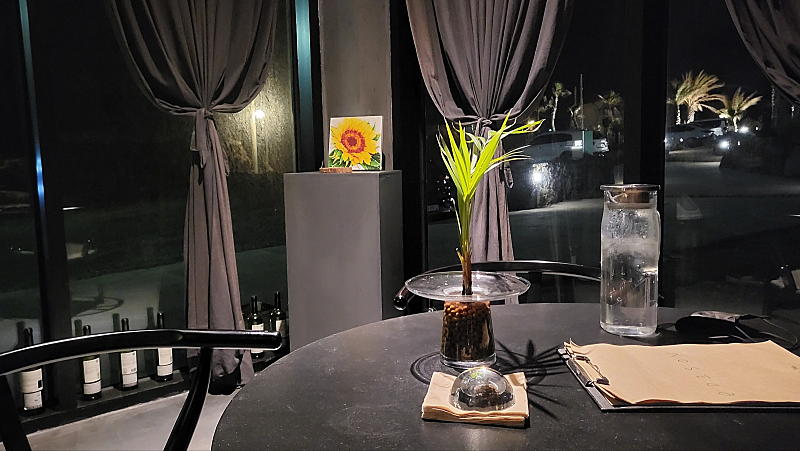

# 강박증

- 원천 ID: EPR-CAFE-1982
- 작성자: 주는사란
- 작성일: 2023-01-20T20:21:31.893000+09:00
- 원문: https://cafe.naver.com/ranschool/1982
- 수집일: 2026-09-21
- 텍스트 정리: HTML 문단 순서 유지, 빈 문단·제로폭 공백만 제거. 원본 HTML·JSON 별도 보존. 이미지는 아래에 모아 보관하며 원래 배치는 HTML에서 확인.

## 원문 본문

<!-- P001 -->
1기 블로그 / 부동산 강의를 하다보니 12월 1월이 훅 같다. 2-3개월간 유튜브랑 강의 한다고 너무 정신없이 흘러갔다. 2022년을 제대로 마무리 하지 못한것 같은 느낌에 일요일부터 2박 3일 제주도에 다녀왔다. 첫째날 밤 분위기 좋은 술집에 가서 남자친구랑 맥주 한잔을 하면서 물었다.

<!-- P002 -->
"자기야. 자기는 이번 2023년에 목표가 뭐야?"

<!-- P003 -->
"목표? 그런게 왜 필요해? 그냥 지금 일 최선을 다하면 되는거지"

<!-- P004 -->
순간 어이가 없었다. 아니 목표가 있어야 그걸 이루기 위해 뭔가를 노력하고 하는거 아닌가? 라는 내표정을 읽었는지, 남자친구는 눈치껏 AI와 같은 말투로 "음...자기는 목표가 뭔데?"라고 되물었다. 우리 둘은 한참을 웃었다. 참고로 내 남자친구는 S다ㅋㅋㅋㅋ

<!-- P005 -->
나는 목표가 없는 삶을 싫어한다. 뭔가 인생을 방황하는 느낌이 든달까?

<!-- P006 -->
쉽게 말해 '목표 강박증'이 있다. 이 강박증의 시작은 고3때부터 였다. 고등학교 3년동안 "너는 목표가 어디야?" 라는 질문을 최소 100번은 넘게 들은것 같다. 이런 질문을 100번 넘게 받다보면, 목표가 없으면 안될것 같은 기분이 든다. 그래서 사실은 어느 학교를 가고 싶은지 별다른 생각이 없음에도, 어디를 가고 싶다고 말하곤 했다.

<!-- P007 -->
이게 습관이 되서인지 20살 과외를 할때는 학원을 오픈하는게 목표였고, 21살 학원을 오픈해서는 학원 확장이 목표였다. 22살 학원을 확장하니 이젠 아이들 명수가 목표였고, 23살 내가 원하는 명수를 채우니 이제 다른 사업을 하는게 목표였다. 25살 빚이 있을땐 빚을 갚는게 목표였고, 빚을 갚고 나니 통장에 얼마를 모으는게 목표였다. 통장에 현금이 생기고 서울에 땅도 샀는데 지금은 내가 원하는 아파트를 사는게 목표다.

<!-- P008 -->
나는 목표가 없을때가 없었다. 정확히 말하면 목표가 없으면 안됐다. 목표가 내 삶의 이유였으니깐.

<!-- P009 -->
어제 요즘의 목표인 인스타 팔로워 1000명을 늘리기를 위해 인스타를 열심히 하고 있었다. 인스타에서 나랑 비슷한 유튜버들의 인스타를 팔로우하라고 추천해줘서 인스타를 보니깐 이런생각이 들었다. "나도 이렇게 인스타 인플루언서가 돼야지"라는 목표가 또 생겼다. 그리곤 남자친구에게 말했다.

<!-- P010 -->
"자기야. 내가 올해 안에 인스타도 유튜브처럼 활성화 시킬께"

<!-- P011 -->
남자친구가 대답했다. "굳이? 지금 충분해."

<!-- P012 -->
그 말을 듣는데 순간 멍했다. 맞다. 나는 굳이 인스타를 할 필요가 없다. 이미 유튜브도 4개나 하고 있고 충분했다. 남자친구는 아차 싶었는지 말을 이어갔다. "아니.. 내말은 하지 말라는게 아니고, 너무 힘들지 않겠어? 요즘 회사일도 할거 많잖아. 나는 쉬라는 뜻이었어"

<!-- P013 -->
기분이 나쁜게 아니었다. 그냥 스스로 내가 '목표 강박증'에 걸렸다는걸 깨달았다. 그리고 잠시 "목표가 있는게 진짜 좋은일일까?"라는 생각에 잠겼다.

<!-- P014 -->
결론은 이렇다. 목표가 있는건 좋다. 그러나 목표로 둔 '이유'가 중요하다. 나는 인스타그램 팔로워를 늘리고 싶었다. "왜?" "인플루언서 삶이 부러우니깐" 근데 만약 이런 이유로 계속 했다면, 목표를 못 이루면 좌절감에 힘들고, 이뤘다해도 더 부러운 인플루언서가 나타나면 또 힘들다.

<!-- P015 -->
그래서 이유를 바꾸기로 했다. "우리 직원들 월급올려주기 위해"

<!-- P016 -->
최근에 수강생중 3분이나 직원으로 채용했다. 그러면서 회사의 성장속도가 최소 6배 이상 빨라졌다. 그럴수 밖에 없었다. 왜냐? 이분들은 주말에도 일한다. 일하지 말라고 해도 일한다. 솔직히 나도 일 쉬는 스타일 아닌데, 이 분들은 더한다. 혼자 매일 고민하던걸 기존 분들 포함 6명이상이 매일 같이 고민하니 성장을 안할수가 없다.

<!-- P017 -->
정말 고맙고 행복하다. 굳이 따지자면 내 순수익은 줄었다. 근데 이 마저도 최소 3개월 내로는 다시 회복할것 같다. 이분들이 회사를 위해 노력하니 나는 이분들의 월급을 위해 노력하는게 맞다. 그래서 인스타를 해야하는 이유 뿐 아니라, 2023년 내 목표 자체가 '회사 직원분들의 월급 상승'이다.

<!-- P018 -->
나는 확신하건데, 이정도로만 간다면 1년안에 모든 직원분들께 어디가서 받지 못하는 월급을 드릴수 있을것 같다. 그래서 내가 인스타를 하는 이유, 내가 유튜브를 하는 이유는 이분들의 열정에 보답하기 위함으로 바꿨다.

## 본문 이미지

## 원문에 포함된 링크

- #
