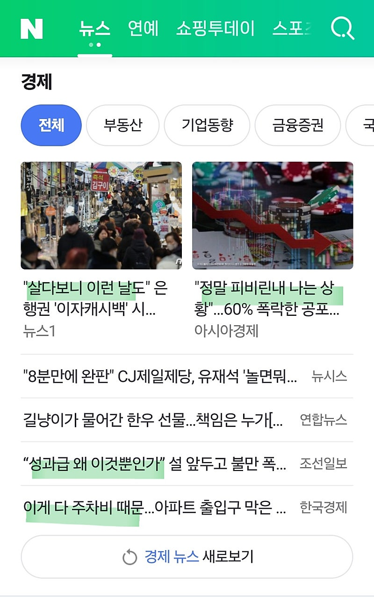
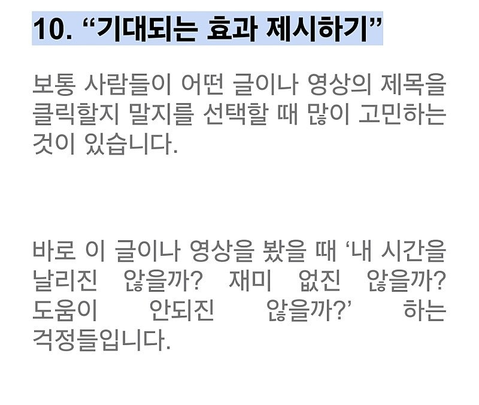
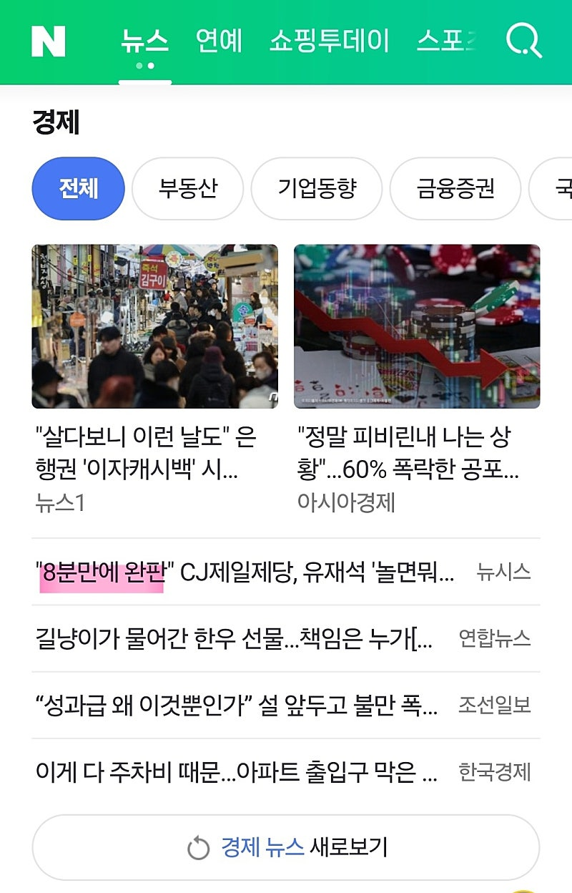
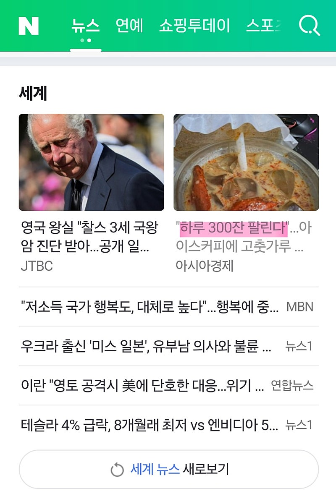
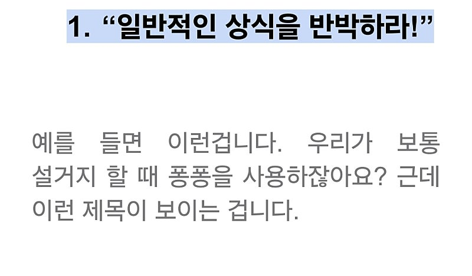
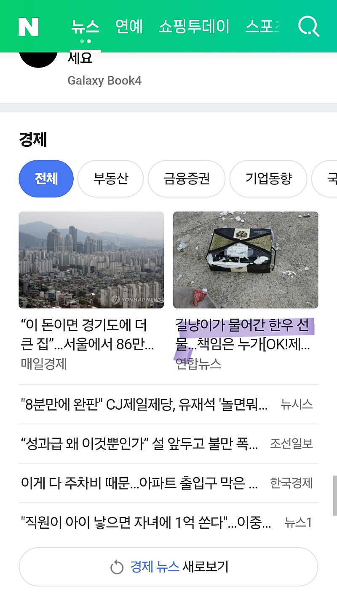
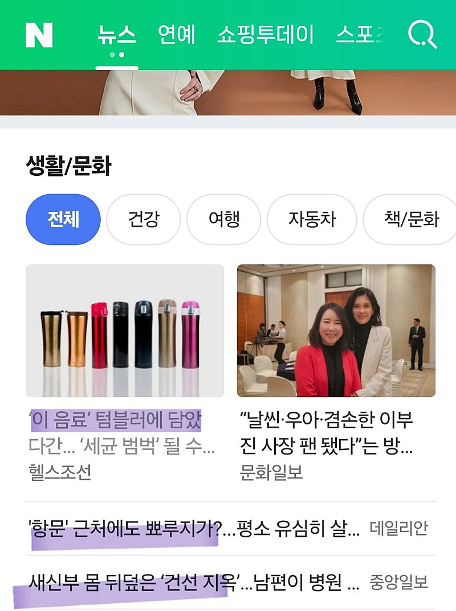
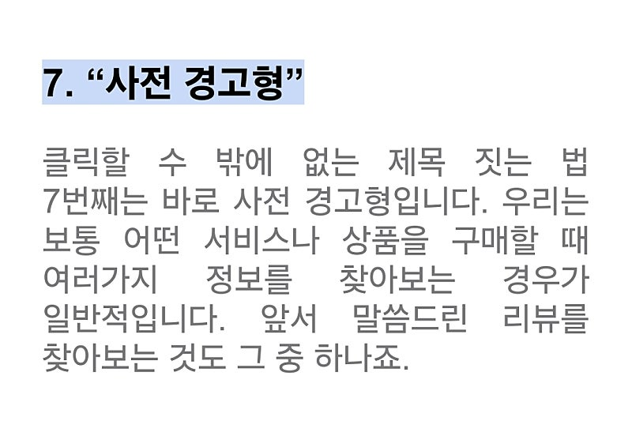

# 마케팅 부업으로 월 500 넘으려면 해야하는 아침루틴

- 원천 ID: EPR-CAFE-20038
- 작성자: 주는사란
- 작성일: 2024-02-06T10:07:33.137000+09:00
- 원문: https://cafe.naver.com/ranschool/20038
- 수집일: 2026-09-21
- 텍스트 정리: HTML 문단 순서 유지, 빈 문단·제로폭 공백만 제거. 원본 HTML·JSON 별도 보존. 이미지는 아래에 모아 보관하며 원래 배치는 HTML에서 확인.

## 원문 본문

<!-- P001 -->
세상을 보는 눈을 바뀌면 됩니다.

<!-- P002 -->
제가 항상 하는 말인데요. 그냥 보는 모든게 다 블로그에, 플레이스에, 인스타에, 유튜브에 어떻게 활용하면 좋을지 계속 머리가 돌아가고 있으면 돈은 알아서 오는 것 같아요.

<!-- P003 -->
저는 아침마다 네이버 뉴스를 보는데요. 뉴스를 보면서 블로그 제목(유튜브 썸네일, 쇼츠 제목등) 소스를 얻곤 합니다.

<!-- P004 -->
예를 들어보겠습니다.

<!-- P005 -->
첫번째로 자주 보이는 제목 형태는 상황 요약형 입니다.

<!-- P006 -->
극적인 상황을 요약해서 (좋은 극적임인지 안좋은 극적임인지 정도만 이야기함) 사람들의 궁금증을 유발한 다음 간단하게 해당 상황을 설명하고 있네요.

<!-- P007 -->
예시)

<!-- P008 -->
"살다보니 이런날도" 은행권 이자캐시백~

<!-- P009 -->
(좋은 극적임 암시) => 근거 설명

<!-- P010 -->
"정말 피비린내 나는 상황" 60%폭락 ~

<!-- P011 -->
(나쁜 극적임 암시) => 근거 설명

<!-- P012 -->
아쉬운 점은 이미 답을 말해준 경우 별로 클릭하고 싶진 않을것 같아요. 첫번째 예시의 경우 좋은거라고 생각했는데 뒤에 은행권이라는걸 보자마자 "아 뭐야 나랑 상관없네" 라는 느낌이 듭니다.

<!-- P013 -->
차라리 강의때 알려드린 제목템플릿 10번이 나을것 같습니다.

<!-- P014 -->
두번째는 궁금증 유발형입니다.

<!-- P015 -->
궁금할만한 사실을 알려주고 내가 말하고자 하는 바에 대해 힌트를 주는 형태네요.

<!-- P016 -->
예시)

<!-- P017 -->
"8분만에 완판" 놀면뭐하니~

<!-- P018 -->
8분만에 완판된게 뭐지???=> 놀면뭐하니에서 뭐 팔았나???

<!-- P019 -->
"하루 300잔 팔린다" 아이스커피에 고추가루~

<!-- P020 -->
하루에 300잔 팔리는게 뭐지??? => 커피에 고추가루라고??

<!-- P021 -->
아쉬운 점은 "하루 몇잔 팔린다" 라는 점이 어떤 사람한테는 "대박"이 될수도 있지만, 어떤 사람은 " 많이 팔리는건가" 싶을수도 있겠네요.

<!-- P022 -->
제목템플릿 1번이 나을것 같습니다.

<!-- P023 -->
세번째는 위협형입니다.

<!-- P024 -->
현실에서 일어날만한 위협적인 상황을 제시하고 해결책을 알려줄듯이 이야기하네요.

<!-- P025 -->
예시)

<!-- P026 -->
"길냥이가 물어간 한우선물" 책임은 누가~

<!-- P027 -->
길냥이가 물어갔다고?ㅋㅋㅋㅋ=> 진짜 그럼 누가 보상해주지??

<!-- P028 -->
"이 음료 텀블러 담았다간" 세균~

<!-- P029 -->
텀블러에 담았을때 세균이 생기는 음료가 있나??

<!-- P030 -->
"항문근처에 뾰루지가" 평소유심히~

<!-- P031 -->
ㅋㅋㅋㅋㅋㅋㅋ뾰루지가 났다고? => 그냥 웃겨서 보게됨

<!-- P032 -->
아쉬운 점은 2번과 마찬가지로 위협이 누군가에게는 될수도 있고 안될수도 있겠네요. 키워드마이닝을 잘 해야할것 같습니다.

<!-- P033 -->
제목템플릿 7번이 나을것 같습니다.

## 본문 이미지

## 원문에 포함된 링크

- #
