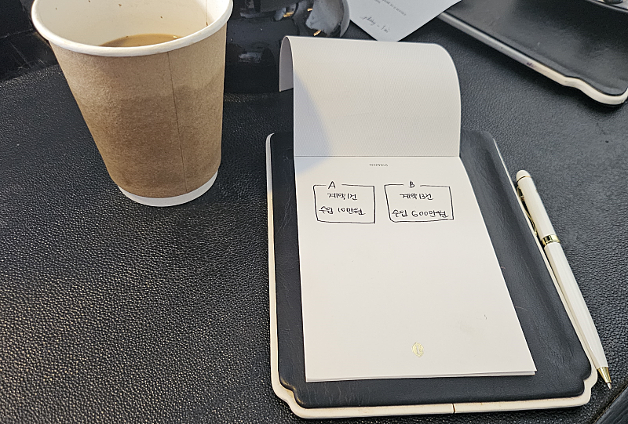
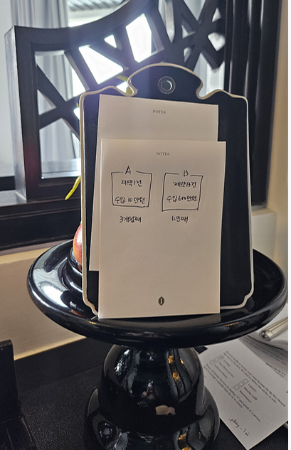
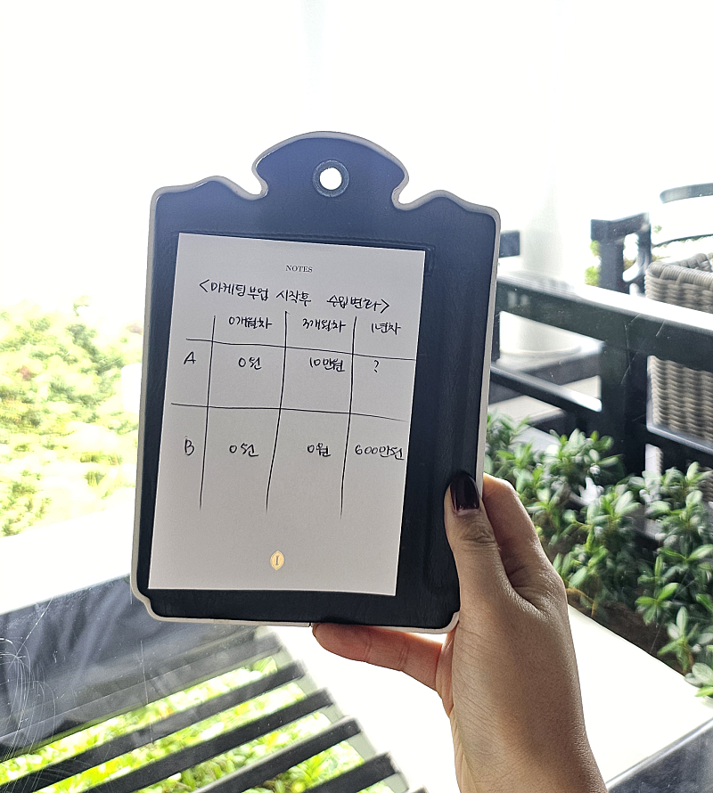
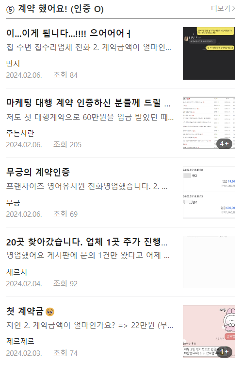
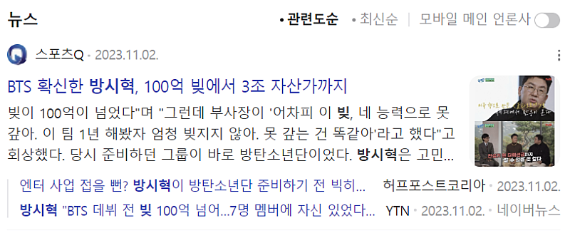

# 마케팅 부업으로 10만원 벌고 있는 사람의 실체

- 원천 ID: EPR-CAFE-20234
- 작성자: 주는사란
- 작성일: 2024-02-08T15:07:18.570000+09:00
- 원문: https://cafe.naver.com/ranschool/20234
- 수집일: 2026-09-21
- 텍스트 정리: HTML 문단 순서 유지, 빈 문단·제로폭 공백만 제거. 원본 HTML·JSON 별도 보존. 이미지는 아래에 모아 보관하며 원래 배치는 HTML에서 확인.

## 원문 본문

<!-- P001 -->
두명의 사람이 있습니다.

<!-- P002 -->
A 는 계약을 1건 했습니다. 수입은 10만원이죠. B 는 계약을 13건 했습니다. 수입은 600만원입니다.

<!-- P003 -->
여러분은 누가 되고 싶나요?

<!-- P004 -->
당연히 B가 되고 싶으실 겁니다.

<!-- P005 -->
그럼 이번엔 이렇게 생각해보겠습니다. 사실 A는 마케팅 부업을 시작한지 3개월 밖에 안됐습니다. B는 시작한지 1년 정도 됐죠. B가 3개월째 무렵에는 1건도 계약을 못했었습니다.

<!-- P006 -->
이번에는 누가 되고 싶으신가요?

<!-- P007 -->
A가 낫나? 싶으실거예요.

<!-- P008 -->
A와 B의 1년간의 실제 변화는 사실 이렇습니다.

<!-- P009 -->
B가 제 친구인 브블인의 이야기입니다.

<!-- P010 -->
요즘 카페에 계약인증이 많이 올라옵니다.

<!-- P011 -->
이 글들을 보면 볼수록 불안하신 분들이 있을거예요. 불안한 분들이 좀 더 불안하시라고 글을 써봅니다 ㅋㅋㅋㅋㅋㅋㅋㅋ농담이구요.

<!-- P012 -->
이 글을 쓰는 이유는 지금 혹시나 수익이 안나서 "나만 좀 못하나?" 라고 생각하는 분들께 드리고 싶은 말씀이 있어서인데요.

<!-- P013 -->
맞습니다. 진짜 딱 여러분만 못 하는 거예요.

<!-- P014 -->
아니 좀 더 정확히 말하자면, 여러분이 딱 '지금만' 못 하는 겁니다.

<!-- P015 -->
원래 결과는 어떤 '시점'을 기준으로 평가받게 되어있습니다. 지금 시점 기준으로 여러분은 못하고 있는게 맞아요. 근데 중간에 그만두지만 않는다면 '지금만' 못 하실거예요.

<!-- P016 -->
제가 처음 알려준 브블인도 그랬어요. 3개월째까지 못 했습니다. 정확히 말하면 글은 그래도 어느정도 쓸 줄 알게 됐어요. 3개월간 맨날 썼으니 당연하죠. 더 정확히 말하면 글을 엄청 잘쓰진 않았고 그냥 봐줄 정도 였습니다....ㅎㅎ

<!-- P017 -->
알려준지 3개월째에 브블인 말고 한명 더 남은 친구(A)가 있었습니다. 그 친구(A)는 심지어 브블인보다 먼저 계약을 했습니다. A는 대기업 다니던 친구였는데 오히려 계약을 하니깐 그만하고 싶다고 하더라구요. 3개월이나 했는데 겨우 수입이 10만원이라는 생각에 허탈했나봐요. 무엇보다 이제 진짜 회사 다니면서 매일 글을 써야 한다는 생각과 사장님과의 소통 등이 무섭다고 하더라구요.

<!-- P018 -->
브블인은 성격적으로 영업은 커녕 사장님과 소통에서도 문제가 많았습니다. 처음 영업을 해보라고 했더니 죽어도 못할것 같다면서 글을 다 써놓고 2주째 보내지도 않았구요. 답답하죠. 겨우 용기내서 10곳 제안서 보내서 1곳 연락 왔는데 상담할 자신 없다면서 미팅 취소한 적도 있습니다. 다시 생각해도 화가 나네요....그렇게 힘들게 계약해 놓고 한번은 글을 다 썼는데 원장님이 글 마음에 안든다고 환불해 달라고 하신적도 있었어요. 이때가 가장 큰 위기였죠. 안한다고 난리를 쳤습니다.

<!-- P019 -->
지금은 영업할 필요는 없어졌는데요. 그동안 성격이 많이 바뀌었습니다. 만날 필요 없어도 굳이 클라이언트를 만나더라구요. 거의 인생 개조 프로젝트였죠. 이런거도 할까봐요 ㅋㅋㅋ 자신있는데 ㅋㅋㅋ

<!-- P020 -->
제가 구독자 8만 넘었을때 A에게 연락 왔습니다. 다시 하려고 한다구요. 블로그 강의 아예 결제해서 듣겠다구요ㅎㅎㅎ 브블인이 지금 버는 금액을 듣더니 굉장히 아쉬워했습니다.

<!-- P021 -->
강의 문의를 하는 분들도 보면 "첫 수익까지 얼마나 걸리나요?" 를 여쭤봅니다. 이 질문이 대답하기 가장 애매합니다. 그 분이 어떤 분인지도 모르니까요.

<!-- P022 -->
강의 팔자고 가장 빨리 낸 분들의 이야기를 말하자니 나중에 좌절할게 보여서 그렇게 말하지도 않습니다. 굳이 그렇게 해서 팔면 나중에 책임지지도 못하구요.

<!-- P023 -->
그렇다고 또 너무 보수적으로 말하면 안 팔리겠죠? 근데 그래도 많이 들으시는거 보면 원빈님(카페 매니저)이 잘 상담해주시는것 같네요ㅎㅎㅎ

<!-- P024 -->
얼마전 방시혁님의 인터뷰를 봤습니다.

<!-- P025 -->
10년 전 빚이 100억 정도 있었다고 하더라구요. 지금은 BTS가 너무 잘되서 재산이 3조라고 하는데요. 지금 시점에는 방시혁보고 "대단하다"고 하지만, 10년 전만 하더라도 방시혁은 "빚쟁이" "사기꾼" 이었습니다.

<!-- P026 -->
결과는 바뀝니다.

<!-- P027 -->
'지금' 못했다고 해서 다음달에 못 한다는 법도 없구요. '지금' 잘한다고 해서 다음달, 내년, 3-4년 뒤에 잘하고 있다는 법도 없습니다.

<!-- P028 -->
첫 문의를 얼마나 빨리 받느냐는 중요하지 않습니다. 시간이 지났을때 '결국' 좋았던 선택을 하려면 두가지가 중요한데요.

<!-- P029 -->
1. 너무 뻔하지만 포기 하지 않는 것

<!-- P030 -->
2. 문의 경험을 쌓아나가는 것

<!-- P031 -->
포기하면 미래의 기회가 다 날라가는 거니깐 끝일거구요. 문의를 받아본 경험이 없으면 계약도 잘 안될뿐더러 계약 후 클라이언트 유지 관리 능력이 떨어집니다. 항상 강조하는 부분인데 블로그를 잘 쓰는 실력 만큼이나 고객관리를 하지 못하면 다 도루묵 됩니다.

<!-- P032 -->
부업스파르타반 했을때도 '문의를 가장 빨리 받은 분' 보다는 '문의를 받은 후 생긴 문제를 잘 대처하는 분' 이 지금도 더 수익을 잘 냅니다. 안그래도 조만간 부업스파르타반  오픈 (3월중) 할 예정인데요. 원래 부업스파르타반에서는 짧은 시간내에 실제 수익을 내는 것에 집중 했었는데요. 이번에는 좀 개정해서 저희랑 같이 하는 업종은 '문의 경험' 쌓는데 집중하고 나중에 어떤 어떤 업종이건 스스로 할 수 있도록 구성하려 합니다.

<!-- P033 -->
오프라인 강의 듣는 분들 지금 과제하느라 스트레스 받으실텐데 응원하겠습니다 :)

## 본문 이미지

## 원문에 포함된 링크

- #
- https://cafe.naver.com/ranschool/15411
- https://cafe.naver.com/ranschool/10993
