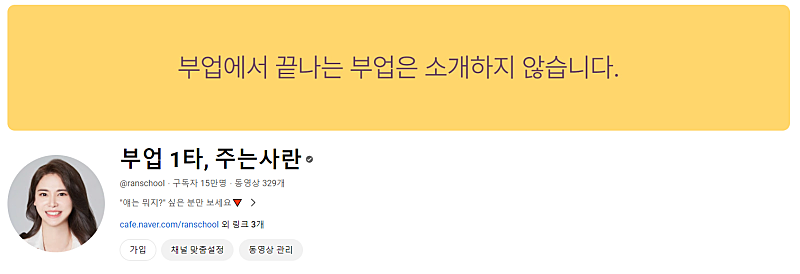
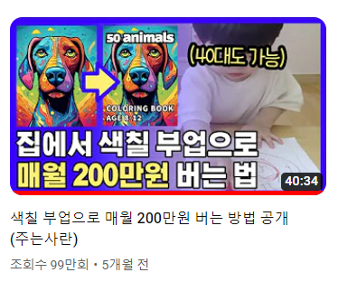
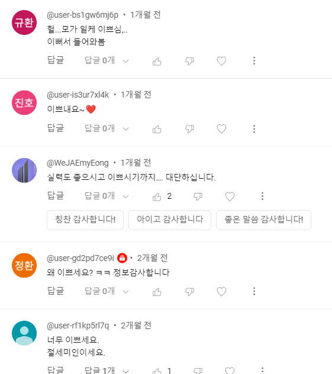
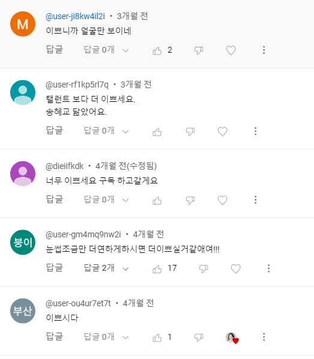
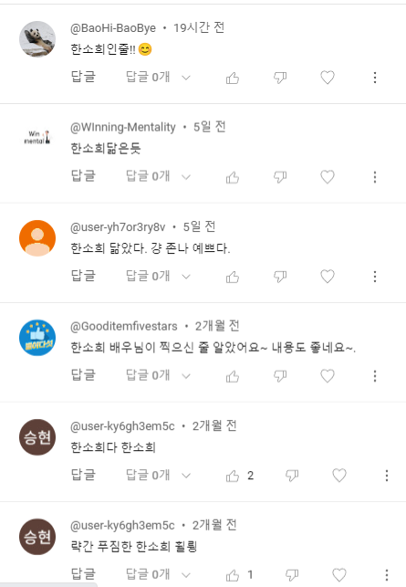
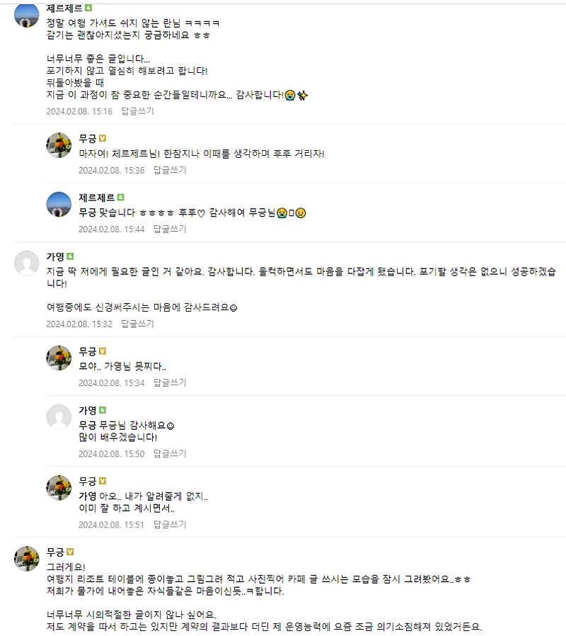
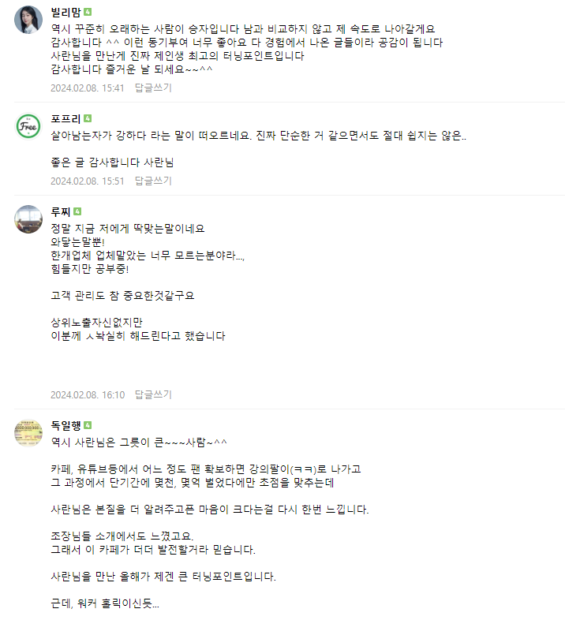
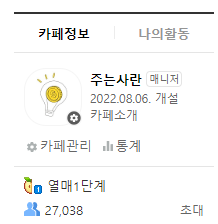
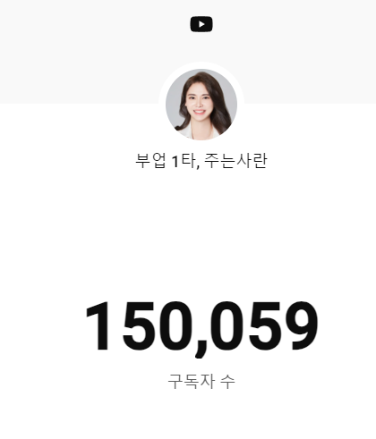

# 주는사란이 직접 보여주는 마케팅

- 원천 ID: EPR-CAFE-20383
- 작성자: 주는사란
- 작성일: 2024-02-10T19:50:40.967000+09:00
- 원문: https://cafe.naver.com/ranschool/20383
- 수집일: 2026-09-21
- 텍스트 정리: HTML 문단 순서 유지, 빈 문단·제로폭 공백만 제거. 원본 HTML·JSON 별도 보존. 이미지는 아래에 모아 보관하며 원래 배치는 HTML에서 확인.

## 원문 본문

<!-- P001 -->
혹시 제 유튜브 채널아트에 이런 글귀가 써져 있다는 걸 알고 계셨나요?

<!-- P002 -->
오늘 새벽 6시 인천공항에서 집으로 돌아오는 차에서 이 글귀를 봤습니다. 바보 같더군요. 개소리예요.

<!-- P003 -->
지나가다가 아주 가끔 저를 알아보는 분이 있습니다. 3-4개월에 한번정도요. 오늘도 본가에 가기 위해 케익전문점에 들렀는데 사장님이 알아보셨습니다. 알아보셔서 제가 다 놀랐어요 ㅎㅎ

<!-- P004 -->
저를 알아보는 분들이 꼭 하는 질문이 바로 이겁니다.

<!-- P005 -->
사란님이 소개한 부업 중 가장 괜찮은건 뭔가요?

<!-- P006 -->
근데 솔직히 저는 마케팅 부업 말고는 해보지를 않았어요. 그리고 다 별로라고 생각합니다. 제 영상중에 조회수 제일 잘나온 영상이 색칠 부업에 관한 건데요. 저도 소개하면서 신기하다고는 생각했는데 좋다고는 생각 안했어요.

<!-- P007 -->
그냥 문득 오늘 아침에 제 채널아트에 적힌 글귀를 보는데 좀 가식적이라는 느낌이 들었습니다. "부업으로 끝나는 부업은 소개 하지 않습니다" 라고 말해놓고, 떡하니 색칠부업이 조회수 1위라니 ㅎㅎㅎㅎㅎㅎㅎㅎㅎㅎㅎ웃기죠.

<!-- P008 -->
스스로 양심에 찔리는 마음 반과 바보 같다는 마음 반이 있었습니다.

<!-- P009 -->
생각해보면 제 생각에 동의한 분들 (마케팅 부업이 제일 낫다)은 이 카페에 가입하셨겠죠. 이미 마케팅 부업을 열심히 하고 계실거예요. 만약 그렇다면 솔직히 다른 부업은 찾을 필요가 없습니다. 그리곤 당연히 제 영상은 잘 안보시겠죠. 이게 앞뒤가 안 맞더라구요. 잘 안 보는 분들을 위한 영상을 계속 만들고 있었던 겁니다.

<!-- P010 -->
(물론 여전히 종종 댓글 달아주시는 빌리맘님 포함 몇분이 계십니다. 진짜 이런 분들에게는 정말 너무 감사합니다. 사랑합니다❤)

<!-- P011 -->
유튜브 댓글과 카페 댓글의 느낌만 봐도 차이를 알 수 있습니다.

<!-- P012 -->
(유튜브 댓글)

<!-- P013 -->
(카페 댓글)

<!-- P014 -->
물론 유튜브 댓글도 기분은 좋습니다 ㅎㅎㅎㅎㅎㅎㅎㅎㅎㅎㅎㅎㅎㅎㅎㅎ근데 카페 댓글과는 그 깊이에서 차이가 다른것 같아요.

<!-- P015 -->
댓글만 봐도 이 카페에 있는 분들은 진심으로 제가 도와드릴 수 있을것 같은데요. 제 유튜브를 봐주시는 모든 분께 감사한건 맞지만 그분들에게 제가 도와드릴 수 있는 건 "이런 부업이 있어요" 딱 여기까지 인것 같습니다. 그 이상은 제 영역이 아니예요. 저는 마케팅 부업 말고는 다른 거로 돈 벌어 본 적이 없거든요. (영상을 위해 몇가지 시도해봤던 적은 있었지만 진심으로 한건 아님) 제 유튜브만 보시는 분들에게 제가 할 수 있는 역할은 정보전달이 끝이죠.

<!-- P016 -->
그럼에도 계속 하는 이유는 첫번째는 돈이 되기 때문이고, 두번째는 그 중에서 카페까지 오는 분들을 만날 수 있다는 겁니다.

<!-- P017 -->
정리하자면 이렇습니다.

<!-- P018 -->
유형 1)

<!-- P019 -->
주는사란 유튜브를 본다 =>여러 부업을 알고 싶다 => 여러 부업을 듣다 보니 결국 마케팅 부업이 최고다 => 유형 2로 간다.

<!-- P020 -->
유형 2)

<!-- P021 -->
주는사란 유튜브를 본다 => 내 생각에 동의한다 (마케팅 부업을 해야지) => 카페에 온다 => 유튜브를 더 안본다 => 혹은 너무 찐팬이라 봐주신다. (감사합니다😍)

<!-- P022 -->
사실 유튜브는 마케팅적 관점에서 봤을때는 유형 1의 분들을 위한 영상을 찍어야 되죠. 근데 저는 이미 카페에 와서 제 영상을 잘 보지 않는 유형 2의 분들을 위해 찍고 있었더라구요.

<!-- P023 -->
제가 블로그 강의에서 EP이론 (노출과 설득)에 관해 주구장창 설명해 놓고 제가 똑바로 안하고 있었어요. 아... 바보 같다.

<!-- P024 -->
EP이론에 의하면 유튜브는 E(노출)의 역할이구요. 부퇴사 카페가 P(설득)의 역할인거죠. 이런 차원에서 최근 카페를 전면 리뉴얼 하면서 마케팅 부업을 하는 분들에게 필요한 모든 것들을 세팅해 놨구요. 사실 지금까지는 마케팅 입문자를 위한 카페의 성격이 강했는데요. 앞으로는 대행사로서 확장하는 방법과 희로애락(?)도 나눌 수 있는 카페로 더 발전시킬 예정입니다. 그 시작이 며칠 전에 올렸던 이 글이기도 하구요.

<!-- P025 -->
저도 첫 대행계약으로 60만원을 입금 받았던 때가 생각나네요. 너무 기뻤습니다. 근데 기쁨도 잠시 여러 생각이 떠오르게 됩니다. "세금 안내도 되나?" 대행계약을 하면 할수...

<!-- P026 -->
cafe.naver.com

<!-- P027 -->
그래서 앞으로 유튜브는 E의 역할에 충실하기로 했어요. 다 죽었어. 정보 전달자의 역할 '지대로' 해보겠습니다. 모든 부업을 다 소개하는 것을 목표로 할 겁니다. 노출을 극대화 해보겠습니다.

<!-- P028 -->
마케팅에서 E를 늘리기 위해서는 어떻게 대본을 써야 하는지 그 정석을 보여드리겠습니다. 다음주부터 올라오는 제 유튜브 대본을 제가 알려드린 글쓰기 공식과 비교해서 적용해보시면 글쓰기에 큰 도움이 되실것 같습니다.

<!-- P029 -->
두달 뒤에 제 구독자가 얼마나 늘었는지, 카페 회원수가 얼마나 늘었는지 봐보세요. 참고로 2024년 2월 10일 현재 카페 가입자수는 2만7038명 이구요. 구독자 수는 15만 59명 입니다.

<!-- P030 -->
노출 늘리기 전략 -

<!-- P031 -->
1. 3월까지 유튜브 영상 주 3회 업로드 / 인스타 하루 1-2개 업로드

<!-- P032 -->
2. 4월부터는 유튜브 영상 주 5회 업로드 목표

<!-- P033 -->
=> 인력 부족 할듯 / 다음달에 직원 채용 예정

<!-- P034 -->
아.... 썸네일도 바꿔야겠네요

## 본문 이미지

## 원문에 포함된 링크

- #
- https://cafe.naver.com/ranschool/20057
