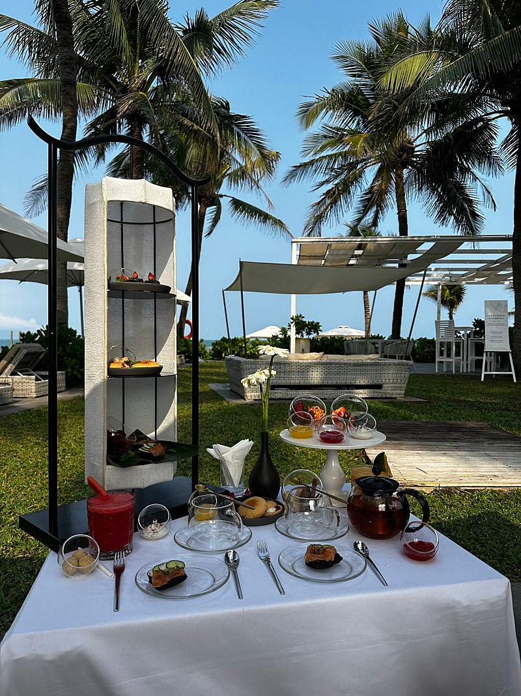
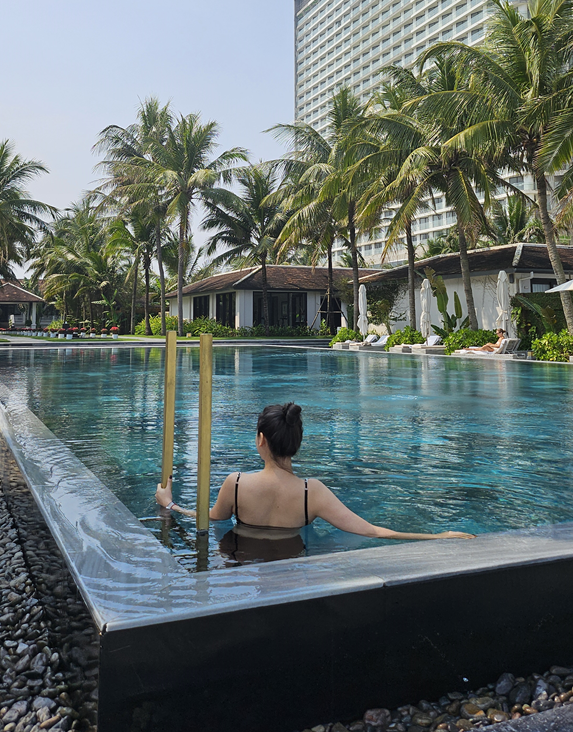
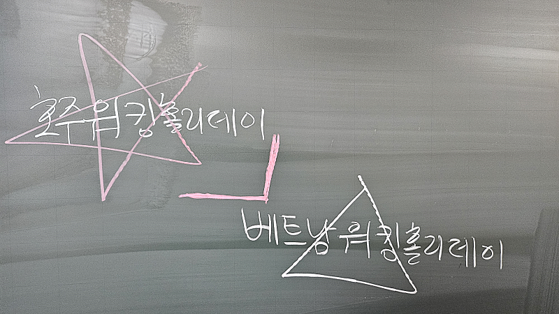
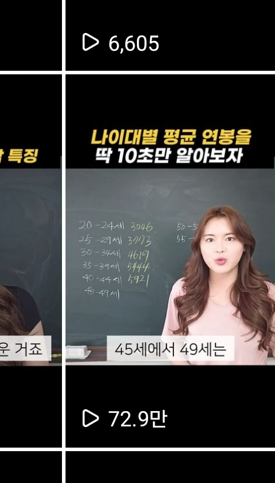
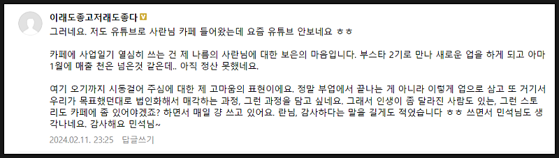
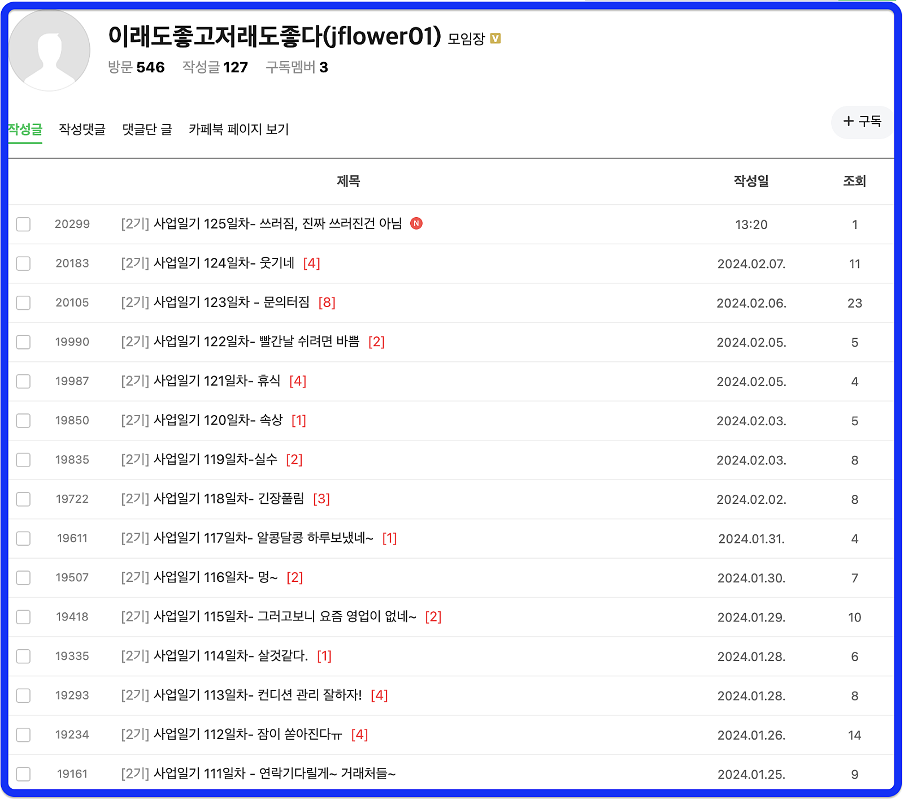

# 누워서 몸값 높이는 방법

- 원천 ID: EPR-CAFE-20479
- 작성자: 주는사란
- 작성일: 2024-02-12T16:54:13.640000+09:00
- 원문: https://cafe.naver.com/ranschool/20479
- 수집일: 2026-09-21
- 텍스트 정리: HTML 문단 순서 유지, 빈 문단·제로폭 공백만 제거. 원본 HTML·JSON 별도 보존. 이미지는 아래에 모아 보관하며 원래 배치는 HTML에서 확인.

## 원문 본문

<!-- P001 -->
4박 6일간 베트남 여행을 다녀왔습니다.

<!-- P002 -->
오질라게 먹었습니다.

<!-- P003 -->
영상에 나온 전체 음식 값의 합은 우리나라 돈으로 약 2만 6천원 정도인데요. 물가가 정말 싸더라구요.

<!-- P004 -->
돈을 쓸수록 이런 생각이 들었습니다.

<!-- P005 -->
돈의 가치가 다르구나. 실제 제 돈은 변한게 없습니다. 제 통장에 있는 돈은 여행 전과 후 똑같아요. 근데 제가 누릴 수 있는게 다르더라구요. 돈의 가치가 달라졌으니까요.

<!-- P006 -->
당연한 말인가요? 근데 이 원리를 '어떻게' 활용하느냐에 따라 아주 쉽게 내 몸 값을 올릴 수 있습니다.

<!-- P007 -->
물가 싼 나라에 가면 좋은게 있습니다. 먹고 싶은걸 마음대로 먹을 수 있죠. 집보다 훨씬 좋은 곳에서 묵을수도 있구요. 마사지도 실컷 받을 수 있습니다. 실제로 저는 하루에 2번씩 받았습니다. 4박 6일간 총 7번을 받았습니다.

<!-- P008 -->
내가 어디에 있느냐에 따라 내가 가진 것에 대한 가치가 다른거죠

<!-- P009 -->
활용해보면 이렇습니다. 내가 가진 것을 크게 2가지로 나눠보겠습니다. 돈과 시간.

<!-- P010 -->
돈의 가치가 높은 곳에서는 차라리 돈을 쓰고 시간을 적게 쓰는게 좋습니다. 시간의 가치가 높은 곳에서는 돈을 적게 쓰고 시간을 많이 쓰는게 좋죠.

<!-- P011 -->
대표적인 예시가 외국인 노동자 입니다. 자신의 나라보다 물가가 더 비싼 나라에 가서 일을 하고, 번 돈을 자기나라로 보냈을 때 가장 효율적이니까요.

<!-- P012 -->
근데 만약 한국 사람이 베트남 가서 알바를 한다면 어떨까요?

<!-- P013 -->
주위에서 호주 워킹홀리데이를 간다는 말은 들어봤어도, 베트남 워킹홀리데이 라는 말은 못 들어보셨을겁니다.

<!-- P014 -->
근데 어쩌면 우리가 그렇게 살고 있는지 모릅니다.

<!-- P015 -->
회사에서 일을 열심히 하고 오면 힘들죠. 그럼 블로그고 뭐고 그냥 눕기 바쁩니다. 월급 루팡을 하라는건 아니지만, 회사에서 모든 에너지를 다 써버리면 어떨까요? 마치 베트남 워킹홀리데이를 하는 것과 같습니다. 회사에서 바라보는 내 시간의 가치는 아마 최저시급도 안되니까요.

<!-- P016 -->
며칠전 인스타 릴스에 '나이대별 평균 연봉'영상을 올렸습니다. 조회수가 72만회가 나왔는데요.

<!-- P017 -->
덕분에 댓글에는 욕이 꽤나 있었습니다. 나는 평균도 안되는 인간이다. 이게 평균이 맞냐. 평균을 운운하는 너는 평균이냐. 세전이냐 세후냐 등등이요.

<!-- P018 -->
그럴 수 밖에 없죠. 평균연봉을 보면 꽤나 높은 편인데요. 현실은 그렇지 못한 경우가 많습니다. 최저시급도 못 받죠. 저 통계에는 내 시간의 값어치를 당당히 인정 받고 있는 사람들이 포함되어있거든요. 그래서 내 시간의 가치를 제대로 인정 받지 못하고 있다면 화가 날 수 밖에 없는거죠.

<!-- P019 -->
근데 만약 같은 시간을 회사 밖에서 쓴다면 어떨까요?

<!-- P020 -->
시간의 가치는 달라집니다. 회사에 있는 1시간과 집에서 부업한다고 글을 쓰는 1시간의 가치가 다르다는 겁니다. 근데 이상하게 우리는 야근은 밥 먹듯이 하면서 글쓰는 1시간을 내는걸 더 어려워 합니다. 보통 이런 분들이 하는 핑계가 의지가 없다고 하시는데요. 의지의 문제가 아닙니다. 시간의 가치가 다르다는걸 몰라서 그런거죠.

<!-- P021 -->
개인적으로 이 시간의 가치가 높은 분들을 보면 친해지고 싶어져요. 제가 정말 아끼는 분 중에 정화님이 계시는데요. 정말 정화님이야말로 시간의 가치가 굉장히 높아지신 분입니다.

<!-- P022 -->
정화님은 4개월전 부업스파르타 2기 수강생이신데요. 원래는 여러 일을 하셨었어요. 하지만 한계를 느끼셨었죠. 그 와중에 부업스파르타반을 함께하게 되셨는데요. 부업스파르타반에서 시작한 청소업체를 창업한 이후로 최근 월 천만원 가까지 도달하셨다고 하네요. 정말 축하드립니다.

<!-- P023 -->
정화님의 사업일기도 가능한 꼬박꼬박 읽고 있는데요. 정화님의 사업일기를 보면 125일째 시간의 가치를 높아지는게 느껴집니다. 이런 분 보면 진짜 너무 기분이 좋아져요. 가까이만 계셨으면 자주 만나고 싶은데 너무 아쉽네요.

<!-- P024 -->
시간내서 대구 한번 내려가야겠습니다.

<!-- P025 -->
이 글을 읽은 분들도 내 시간의 가치를 생각해보셨으면 좋겠습니다.

<!-- P026 -->
시간의 가치 올리는 구체적인 방법

<!-- P027 -->
지난 번 마케팅 제안서 양식을 공유드린적 있었는데요. 많은 분들이 이 제안서를 어떻게 변형해서 사용해야 할 지 몰라 질문을 많이 해주시더라구요. 그래서 오늘은 제안서 내용은 ...

<!-- P028 -->
cafe.naver.com

## 본문 이미지

## 원문에 포함된 링크

- #
- https://cafe.naver.com/ranschool/20477
