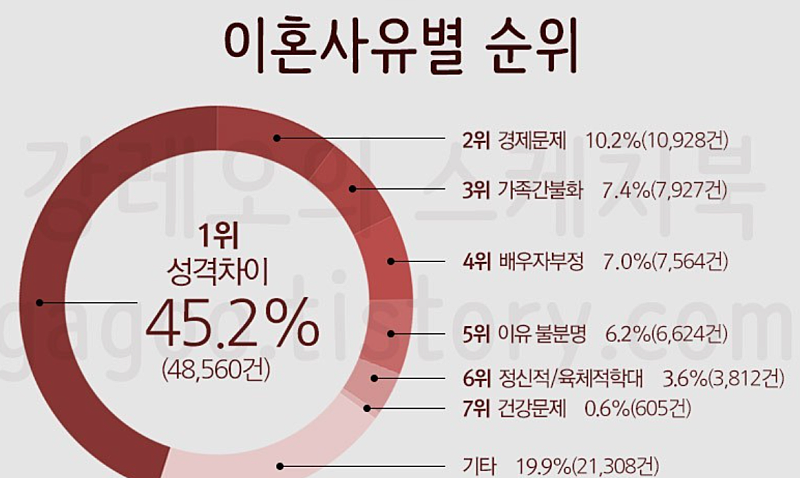
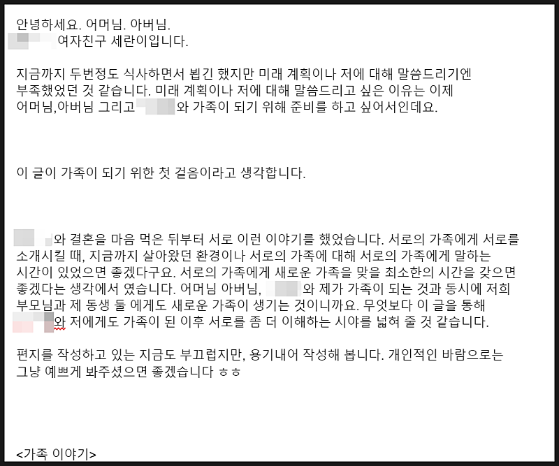
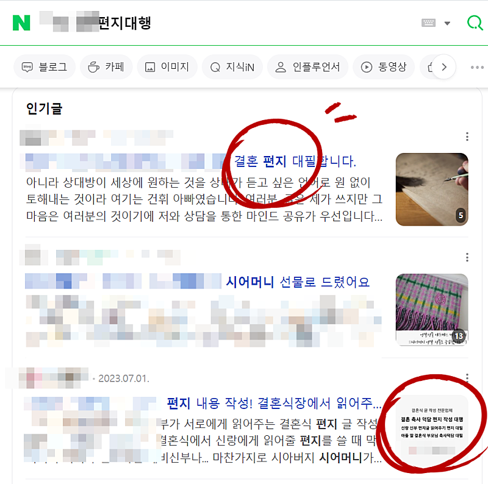

# 글쓰기로 돈 벌 수 있는 아이템 (블로그 아님)

- 원천 ID: EPR-CAFE-20705
- 작성자: 주는사란
- 작성일: 2024-02-15T11:26:57.013000+09:00
- 원문: https://cafe.naver.com/ranschool/20705
- 수집일: 2026-09-21
- 텍스트 정리: HTML 문단 순서 유지, 빈 문단·제로폭 공백만 제거. 원본 HTML·JSON 별도 보존. 이미지는 아래에 모아 보관하며 원래 배치는 HTML에서 확인.

## 원문 본문

<!-- P001 -->
내년에는 4년 만난 남자친구와 결혼을 할 예정입니다.

<!-- P002 -->
원래 결혼을 더 빨리 하고 싶었습니다. 물론 아무나와 결혼을 하고 싶은건 아니었구요. 희생을 받기보단 내가 희생할 마음이 드는 사람이랑 결혼하고 싶었습니다. 제 이런 마음을 잘 알고 같이 노력하는 사람이랑 결혼하고 싶었어요. 그런 사람을 만났구요.

<!-- P003 -->
갑자기 글쓰기로 돈 벌 수 있는 아이템을 알려주겠다고 해놓고, 결혼 이야기를 해서 안 맞다고 생각하실수 있는데요. 이걸 준비하다 보니깐 아이템이 생각나서 적어봅니다.

<!-- P004 -->
결혼 선배(?)님들의 이야기를 들어보면, 공통적으로 하는 말이 있더라구요. "결혼은 둘이 하는게 아니야. 가족 대 가족이 하는거야" 라구요. 그래서 저는 결혼을 하고 싶다는 마음을 가질 때 부터 이걸 준비해왔어요. "어떻게 해야 가족과 가족이 잘 합쳐질 수 있을까?" 하구요.

<!-- P005 -->
어찌보면 당연한 말 인것 같아요. 이혼사유에 '가족과의 불화'가 꽤 높은 순위를 차지하는 것도 그런 이유인 것 같구요.

<!-- P006 -->
생각해보면 연애하는 동안에 서로의 부모님을 만날 기회가 거의 없는 것 같습니다. 있다고 하더라도 그 자리에서 상대가 누군지 제대로 알만큼 충분한 시간을 보내기도 쉽지 않구요. 어색하게 밥 한끼 먹고 끝나버리죠. 저는 그래서 일부로 부모님이랑 밥 먹자고 여러번 말씀 드렸거든요. 가족이 되기 위한 준비(?) 라고 생각해서요. 이런 제 마음을 아는지 모르는지 남자친구한테 10번 넘게 말하면 1~2번 전달하더라구요???ㅎㅎㅎㅎㅎㅎㅎ 30번은 말한 끝에 겨우 2번 식사했습니다. 휴.

<!-- P007 -->
여튼 대부분의 부모님 입장에선 딸이나 아들한테 전해들은 몇마디로 새로운 가족이 생기게 되는거죠. 그러니 오해가 생길 수 밖에 없는 것 같습니다. 특히나 결혼 준비하기까지 많은 것들이 논의되야 하는데 전해들은 말로는 하기 어려운게 많으니까요. 그래서 주위 친구들을 보면 결혼 준비부터 서로에게 서운한 감정이 생기는 경우도 있더라구요.

<!-- P008 -->
그래서 저는 이 남자와 결혼생각이 든 순간부터 이 모든 것을 잘 준비하고 싶었어요. 그 중 하나가 서로의 부모님과 식사하는 것이었구요. 두번째로는 서로와 서로의 가족에 대해 글을 쓰는 것 이었습니다.

<!-- P009 -->
지난주에 베트남 여행을 갔었는데요. 지난주 부터 저와 남자친구 서로가 서로의 부모님에게 글을 쓰기로 했어요. 사실 이 글을 쓰는 이유에는 저희 아빠를 위한 것도 있었는데요. 저희 아빠는 굉장히 까다롭고 직설적인 사람이거든요. 차라리 아빠한테 모든걸 잘 정리해서 글을 써드리는게 좋을것 같았어요. 긴장된 상태에서 말로 이야기 하는 것 보다 오해없이 전달 될 수 있고 진심을 더 잘 전달할 수 있다는 생각이었거든요.

<!-- P010 -->
글은 이런 식으로 썼습니다. 이 글을 쓰는 이유와 제가 어떻게 성장해 왔는지, 저희 부모님은 어떤 가치관을 가진 분들인지, 저를 어떻게 지도해오셨는지, 지금까지 어떻게 부모님이 사셨는지, 그리고 제가 어떻게 살아왔는지, 그리고 지금은 우리 가족와 제가 어떻게 사는지, 마지막으로 앞으로 어떤 방향을 바라보고 저희(저와 남자친구)가 살아갈 것인지 등이예요.

<!-- P011 -->
민망하지만 앞부분 조금만 보여드릴게요.

<!-- P012 -->
사실 아직 다는 못 썼어요. 막상 쓰려니깐 굉장히 힘들더라구요?ㅎㅎ 제 인생 이야기를 다시 처음부터 해야하다보니... 처음 블로그 글쓰기할 때의 마음으로 돌아간 느낌이었습니다. 이번주에 과제 하시는 분들의 마음을 조금이나마 이해하게 되었습니다. ㅎㅎㅎㅎㅎ

<!-- P013 -->
근데 글을 쓰다보니 굉장히 좋았어요. 저 스스로는 제 인생을 돌이켜보게되었습니다. 앞으로 이 남자와 어떻게 가정을 꾸려갈지에 대해서도 돌이켜 보게 되더라구요. 한 말을 모두 지키지 못 할지도 모르지만, 그래도 최소한 이걸 드리는 순간 지켜야겠다는 생각으로 살아갈 수 있으니까요.

<!-- P014 -->
솔직히 남자친구가 쓴 걸 읽는데 너무 감동이더라구요. 서로에게도 서로의 마음이 더 잘 전달 할 수 있는 계기가 되는 것 같습니다.

<!-- P015 -->
이걸 쓰다보니 너무 좋아서 결혼을 앞둔 사람이라면 꼭 이걸 써보는게 좋겠다 라는 생각이 들더라구요. 사실 누군가에게 내 마음 그대로를 전달하는건 쉽지 않은 일이잖아요. 그걸 듣고 대신 적어드리는거죠. 물론 소설을 쓰면 안되겠지만요.

<!-- P016 -->
제가 블로그 글쓰기란 사실상 통역가가 되는 것이라는 말을 많이 하는데요. 브랜드 블로그는 사장님의 말을 통역해서 손님에게 보여주는거라면, 이건 사위와 며느리의 마음을 시부모님에게 통역한다랄까요? 혹은 결혼 상대 서로에게 통역해주는거죠.

<!-- P017 -->
검색해 보니깐 실제 그런 서비스를 하는 업체가 있더라구요. (어디 업체인지 공개하면 해당 업체가 난처할 수 있으니 가리기 처리 했습니다)

<!-- P018 -->
찾아보니 2~3개 업체 정도 있는것 같은데요. 저한테 블로그를 배우신 분이라면, 현재 업체 보다 잘 쓰실것 같아 적어봤습니다. 블로그로 홍보하기도 좋구요.

<!-- P019 -->
단점은 글쓰는 시간이 오래 걸릴 수도 있다는 점인데요. 그래서 그만큼 비용을 높게 책정하셔야 할 것 같습니다. 글쓰기 연습겸 부업으로 해보시면 좋을 것 같아 말씀드려요. 본업으로 하기에는 시간당 비용이 좋진 않습니다.

<!-- P020 -->
결혼 생각하면서 이런 생각이 드는걸 보면 사람 참... 안 변하네요ㅎㅎㅎㅎㅎㅎㅎ이런 나라도 괜찮겠니?ㅎㅎㅎㅎㅎㅎㅎㅎㅎ

## 본문 이미지

## 원문에 포함된 링크

- #
