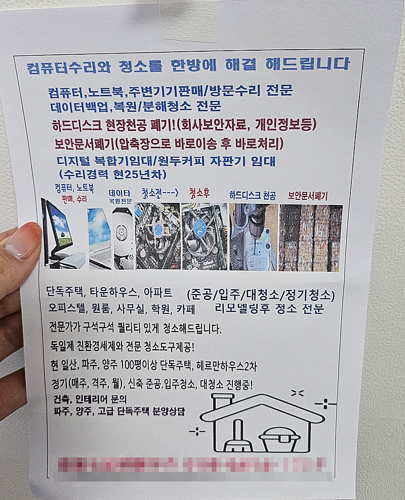
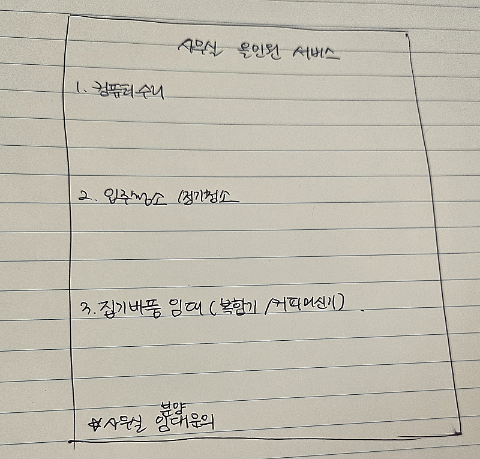

# 마케팅 퀴즈 1탄

- 원천 ID: EPR-CAFE-20821
- 작성자: 주는사란
- 작성일: 2024-02-16T15:01:44.267000+09:00
- 원문: https://cafe.naver.com/ranschool/20821
- 수집일: 2026-09-21
- 텍스트 정리: HTML 문단 순서 유지, 빈 문단·제로폭 공백만 제거. 원본 HTML·JSON 별도 보존. 이미지는 아래에 모아 보관하며 원래 배치는 HTML에서 확인.

## 원문 본문

<!-- P001 -->
오늘 저희 사무실 앞에 이런게 붙어있더라구요.

<!-- P002 -->
이 전단지에서 가장 별로인 부분을 골라보세요.

<!-- P003 -->
1.  제목 글씨가 너무 작다

<!-- P004 -->
2. 사진이 너무 작다

<!-- P005 -->
3. 글씨가 너무 많다.

<!-- P006 -->
4. 뭘 해주겠다는 건지 모르겠다.

<!-- P007 -->
5. 서비스의 결이 안 맞는다. (컴퓨터 수리 / 청소 / 복합기 임대 / 자판기 임대 / 건축 인테리어 문의 / 분양상담..????)

<!-- P008 -->
(위 전단지를 만든 사장님의 스토리 예상)

<!-- P009 -->
이 사장님은 아마 처음에 컴퓨터 수리를 할 줄 아셨을거예요. 컴퓨터 수리를 하다보니 컴퓨터가 더러웠던거죠. 그걸 청소하다보니깐 "어짜피 청소하는 김에 전체 청소를 한다고 해볼까?" 하고 입주청소등을 시작한거죠. 그렇게 청소를 하다보니 모든 집이나 사무실에는 복합기나 커피머신기가 많았나봅니다. 청소하면서 그 고객에게 "복합기나 커피머신기 영업해볼까?"라는 생각이 들었을 수도 있어요. 혹은 입주청소를 하다보면 이사오는 사람이나 가는 사람을 자주 만나게 되셨겠죠. 그러면서 부동산 업계를 알게되고 분양을 하면 돈을 많이 받을 수 있겠다. 뭐 여기까지 온것 같습니다.

<!-- P010 -->
.........................ㅋㅋㅋㅋ

<!-- P011 -->
솔직히 이 전단지를 어떤 생각으로 만들었는지 이해하기가 어려웠어요...탓한다기 보다는 너무 안타까웠습니다. 저거 만들고 인쇄하고 뿌리려면 그것도 다 돈인데 말이죠. 이해하고 싶어서 스토리를 지어봤습니다ㅠㅠ

<!-- P012 -->
위 5가지 선택지는 제가 마음에 안드는 부분을 다 적은건데요. 그중에서도 5번이 가장 마음에 안들었습니다.

<!-- P013 -->
한 업체가

<!-- P014 -->
컴퓨터 수리도 할 줄 알면서

<!-- P015 -->
청소도 해주고

<!-- P016 -->
복합기 / 커피머신기 임대를 하기도 하고

<!-- P017 -->
심지어 거기에 분양상담까지 한다?

<!-- P018 -->
만약 고객입장에서 한 업체가 이걸 다 한다는걸 안다면, 안 맡길것 같습니다. 저 중 한가지 분야만도 제대로 하기 쉽지 않으니까요. 만약 한 업체가 아니라 너무 큰 회사라 부서가 여러개 있는거라면, 전단지를 저렇게는 안 만들었을것 같아요.

<!-- P019 -->
그랬다면 차라리 이렇게??

<!-- P020 -->
이 것도 베스트는 아니긴 한데요. 저 전단지보다는 나을것 같아요. 사무실이면 사무실 결에 맞춰서 전단지를 만들고, 아파트면 아파트 고객 대상으로 전단지를 만드는게 문의가 더 오지 않을까 싶네요.

<!-- P021 -->
여튼 전단지를 지나가다가 일부로 받아보는 편인데요. 최근들어 받은 전단지중 가장 심각했습니다. 여러분도 전단지나 제안서 돌릴 때 꼭 이런 부분을 확인해 보셨으면 좋겠어요.

<!-- P022 -->
부업스파르타 3기로 또 청소업체 하려고 (다음주중 오픈예정) 준비중인데요. 저도 저희 사무실 건물도 전단지 만들어 돌려봐야겠네요.

<!-- P023 -->
대한민국 모임의 시작, 네이버 카페

<!-- P024 -->
cafe.naver.com

## 본문 이미지

## 원문에 포함된 링크

- #
- https://cafe.naver.com/ranschool/10993
