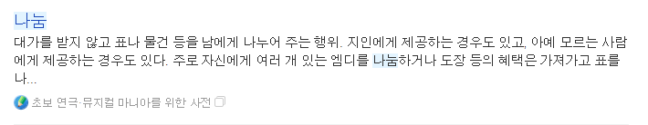
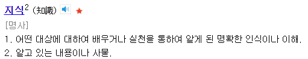
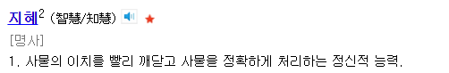

# 기버들이 부자가 될수 밖에 없는 이유를 드디어 찾았다.

- 원천 ID: EPR-CAFE-2103
- 작성자: 주는사란
- 작성일: 2023-01-25T18:52:44.730000+09:00
- 원문: https://cafe.naver.com/ranschool/2103
- 수집일: 2026-09-21
- 텍스트 정리: HTML 문단 순서 유지, 빈 문단·제로폭 공백만 제거. 원본 HTML·JSON 별도 보존. 이미지는 아래에 모아 보관하며 원래 배치는 HTML에서 확인.

## 원문 본문

<!-- P001 -->
지금까지 '나누면 결국 나한테 돌아온다' 라는걸 '경험'으로만 알고 있었습니다. 근데 오늘 집에오다가 생각나서 공유합니다.

<!-- P002 -->
근데 그 답을 알려드리기 전, 제 경험상 알고 있는 '기버 마인드'의 핵심을 먼저 나누겠습니다. 사실 아래 3가지가 진짜 답보다 더 중요합니다. 왜냐하면 아래 3가지 기버마인드를 모르는 사람은 사람들에게 제안을 똑바로 할리가 없고, 제안을 똑바로 못하는 사람은 당연하지만 돈을 잘 벌수가 없습니다. 그러니 아래 3가지 부터 꼭 복습하기를 추천드립니다.

<!-- P003 -->
1. 나눌때부터 '받을 것'을 염두하고 나누는 것은 나눔이 아니다.

<!-- P004 -->
아래는 나눔의 사전적 의미입니다. 결론은 이렇습니다. '받을것'(=대가) 를 염두하고 나누는 것은 '나눔'이 아니고, '거래'입니다.

<!-- P005 -->
2. '나한테 돌아온다'에서 '돌아온다'는 물질적으로 돌아온다는 의미가 아니다.

<!-- P006 -->
기버마인드를 악용하는 사람은 "그래 나중에 보상받겠지"라는 생각으로 나눕니다. 이럴바엔 차라리 안 나누는 것 보다 못 합니다. 제가 말한 '돌아온다'의 의미는 실패의 경험으로 돌아올수도 있습니다. 물질을 나눴다고 해서 물질로 돌아오는 것이 아니며, 시간과 재능을 나눴다고 해서 같은 형태로 돌아오는 것이 아닙니다.

<!-- P007 -->
내가 시간과 마음을 나눴는데, 그 사람이 고맙다는 말조차도 안할수도 있습니다. 그럼 여러분은 이때 "고마움을 모르는 사람도 있구나. 나는 이럴때 꼭 고마움을 나눠야지"라는 깨달음, 경험을 얻을수도 있습니다. 고마움을 모르는 사람을 통해 여러분은 '고마움을 말하지 않았을때 상대방이 겪는 실망감'을 배운것입니다.

<!-- P008 -->
상대방이 나에게 같은 형태로 나누지 않았다고 해서 실망할 필요가 없습니다. 우린 이미 '경험'을 받았습니다. 어떻게 돌려줄지는 그사람 마음입니다. 어떻게 받을지를 정해두지 마세요.

<!-- P009 -->
3. '결국 돌아온다'에서 '결국'의 시기는 언제일지 모른다.

<!-- P010 -->
물론 위의 배움은 그 당시에 모를수도 있습니다. 1개월 뒤, 1년뒤, 아니면 10년뒤에 깨달아질 수도 있습니다. 언제일지 모르지만 확실한건 반드시 돌아옵니다. 왜이렇게 자신하냐구요? 그 답은 아래에서 ㅋㅋㅋㅋㅋㅋㅋㅋㅋ

<!-- P011 -->
기버들이 부자가 될수 밖에 없는 이유

<!-- P012 -->
어릴때 공부를 못했고 학벌이 안 좋아도, 나중에 결국 성공하는 사람들이 있습니다. 근데 오히려 학벌도 좋고 공부도 잘했어도 결국 힘든 사람들이 있습니다. 저는 그 차이가 단언컨데 '지혜'라고 생각합니다.

<!-- P013 -->
지혜로운 사람이 되려면, '지혜'와 '지식' 의 차이부터 알아야 합니다.

<!-- P014 -->
지식과 지혜의 사전적 의미는 위와 같습니다. 지식은 쉽게 말해 알고 있는 내용이 많은 사람입니다. 알고있는 내용이 많다는 걸 우리는 똑똑하다고 합니다. 근데 문제는 이런 지식은 역전현상이 일어납니다. 이게 뭔말이냐면, 지식이 많은 사람은 끊임없이 지식을 쌓아야 합니다. 그렇지 않으면 계속 쌓는 사람에 비해 뒤쳐질겁니다. 무엇보다 지식이란건 매해 리뉴얼 되기도 합니다. 과거의 지식이 나중에 틀린지식이 될수도 있거든요. 쉽게 말해 지식은 어느누구나 '의지'만 갖고 있으면 얻을수 있습니다.

<!-- P015 -->
근데 지혜는 다릅니다. 지혜는 '능력'입니다. 예를 들면 이렇습니다. 공부이야기가 싫겠지만, 제가 학원강사 출신이라 죄송하게도 공부로 예를 들겠습니다. 저는 수학을 가르칠때 무조건 한 문제집을 최소 10번이상 반복하게 합니다. 근데 같은 반복을 시켜도 성과는 다릅니다. A, B 두 아이에게 제가 말한대로 같은 문제집을 10번 풀렸다고 해보겠습니다. A는 성적이 90점 나왔고, B는 성적이 50점 나왔습니다. 그 차이는 아래와 같습니다.

<!-- P016 -->
B - 풀이와 답을 외운다. 그냥 푼다. (지식 습득) => 문제가 응용되면 못 푼다 => 성적 유지 혹은 하락

<!-- P017 -->
A - 문제 패턴을 외운다. (지식 습득) => 패턴이 어떻게 응용되고 적용되는지 확인한다 (지식 응용) => 문제가 응용되도 어느 패턴인지 파악해 푼다 (지혜 습득) => 성적 향상

<!-- P018 -->
사실 아이들에게 같은 문제를 한 3번만 풀려도 문제랑 답은 외웁니다. 얼추 비슷하게 풀게 되면 A와 B 모두 수학을 잘하는 듯 보입니다. 근데 성적이 안나온 B같은 아이들은 문제랑 답을 알고있는 '지식'을 이용해서 그냥 푼거죠.

<!-- P019 -->
반면, A의 머릿속은 두가지가 있습니다. 첫번째는 3번째에 어디를 틀렸고 5번째에는 선생님이 뭐라했고, 답지에는 어디에 뭐가 있고 문제집 어디쪽에 이 문제가 있었는지에 대한 '지식'을 갖고 있습니다. 근데 뭐 이건 B랑 별로 차이가 없었을겁니다.

<!-- P020 -->
더 큰 차이는 두번째, 패턴을 깨달은 겁니다. 문제를 풀다보면 비슷한 '패턴'이라는게 존재한다는걸 알게됩니다. 문제에서 '이런말'이 나오면 '이렇게' 푼다는 일종의 패턴만 암기합니다. 필요한 양의 '지식'만 터득하는 거죠. 그리고 다음 문제에서 그 패턴이 어떻게 적용되는지 어떻게 응용되는지만 파악하는 겁니다. 이건 지혜입니다. 그럼 시험에서 응용문제가 나와도 풀수 있는거죠.  왜냐? 이미 파악했으니까.

<!-- P021 -->
돈도 똑같습니다.

<!-- P022 -->
지식이 아무리 많아도, 지혜가 없으면 응용문제를 풀수 없습니다. 그럼 지혜를 얻기 위해선 뭘해야하냐? 결론은 이렇습니다.

<!-- P023 -->
1. 지식을 얻으려는 의지가 필요하다.

<!-- P024 -->
지식이 없으면, 지혜를 얻을수가 없습니다. 아무리 지혜로운 아이라도 수학을 공부하지 않으려고 했다면, 어짜피 성적은 안나왔을겁니다. 공부를 하려고 했어야 패턴을 익히던 뭐던 하겠죠?

<!-- P025 -->
돈을 어떻게 벌수있는지 공부를 하세요. 어떻게 하냐구요? 제 글과 유튜브 정독을 ㅋㅋㅋㅋㅋㅋㅋㅋㅋㅋㅋㅋ

<!-- P026 -->
2. 지식을 '어떻게' 얻을지가 중요하다.

<!-- P027 -->
지식을 얻는 '과정'이 더 중요합니다. 지식을 얻는 과정에서 지혜가 생기거든요. 아까 수학에서도 패턴을 익히는 아이와 그냥 풀이과정과 답을 외우는 아이의 차이점과 비슷합니다.

<!-- P028 -->
저는 책을 잘 안읽습니다. 왜냐? 진짜 필요하고 중요한 책만 여러번 읽거든요. (핑계인가...?ㅋㅋㅋㅋ) 책을 많이 읽는게 중요한게 아닙니다. 어떤 책을 어떻게 읽냐가 더 중요합니다. 그래서 전 그냥 진짜 제 책이라고 생각하는 책을 그냥 여러번 읽습니다. 한번 읽을때랑 두번 읽을때랑 느낌과 깨달음이 다르거든요.

<!-- P029 -->
3. 지혜는 '버리는 것'에서 시작한다.

<!-- P030 -->
지식이 있어야 지혜로워지지만, 지식을 너무 많이 얻으면 더 가난해지는 경우가 있습니다. 왜냐면 지식을 얻을수록 '할수 없는 것'이 늘어나거든요. 제 경우를 예로 들어보겠습니다. 20살에는 무서운게 없었습니다. 그래서 뭐든 할수 있었습니다. 근데 이제는 "이래서 안되고, 저래서 안되는" 그런 이유가 많아져서 뭘 하기가 두렵습니다. 이걸 할때는 '이런게 필요한데' 등 조건이 많이 달립니다. 그래서 하지 못한게 너무 많습니다. 아마 그것만 다 했어도 지금보다 돈을 더 많이 벌었을겁니다. (아이고 아쉬워라;;ㅎㅎ)

<!-- P031 -->
그래서 이럴때 해야하는건 '지식을 나누는 것'입니다. 지식을 나누다(버리다)보면 '지혜'가 생깁니다. 학습법중에서도 가르치는 학습법이 좋다는건 들어보셨을겁니다. 남한테 가르치듯이 공부 하다보면 내 머릿속에서는 이 정보들을 정리하기 시작합니다. 정보를 정리(요약) 하다보면, 중요한 정보와 덜 중요한 정보로 나뉘어지고, 이 중 덜 중요한 정보는 기억이 점점 희미해집니다. 그럼 우리는 머릿속에 남은 중요한 정보만 나누게 될텐데요. 이 과정에서 내 경험과 예시가 추가됩니다. 쉽게 말해 정보 자체가 '개인화' 되는거죠. 이런 원리입니다.

<!-- P032 -->
결국 '지식'을 나누는 과정에서 나도 모르게 '지혜'로 바뀝니다. 기버들은 '지혜'가 많을 수 밖에 없고, 부자가 될수 밖에 없습니다.

<!-- P033 -->
자 그럼 '돈 버는 꿀팁 나누기' 게시판에 지식을 나누러 가볼까요??

## 본문 이미지

## 원문에 포함된 링크

- #
