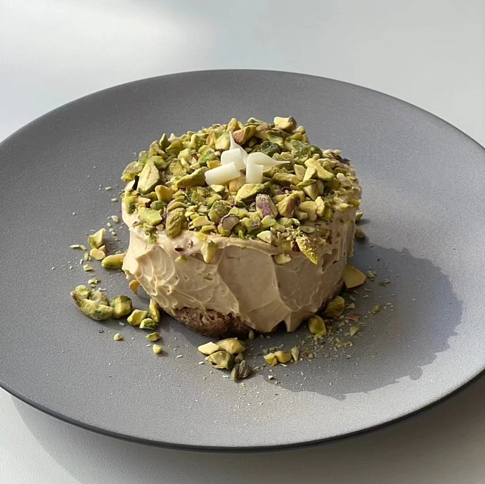
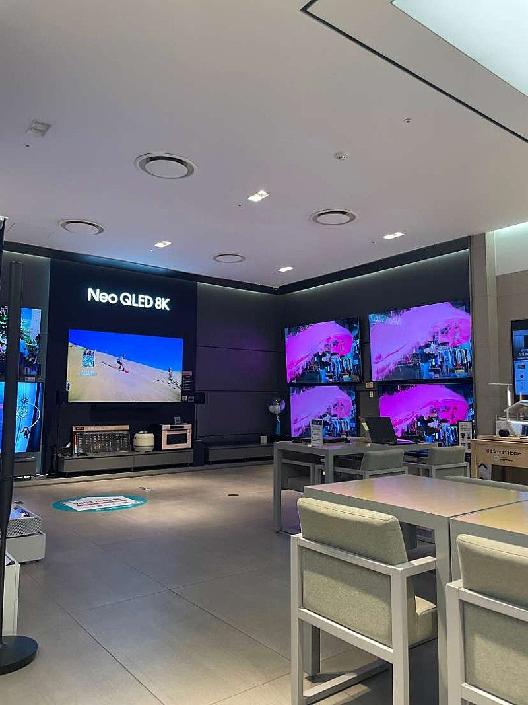

# 생일선물 주세요.

- 원천 ID: EPR-CAFE-21041
- 작성자: 주는사란
- 작성일: 2024-02-20T18:17:53.470000+09:00
- 원문: https://cafe.naver.com/ranschool/21041
- 수집일: 2026-09-21
- 텍스트 정리: HTML 문단 순서 유지, 빈 문단·제로폭 공백만 제거. 원본 HTML·JSON 별도 보존. 이미지는 아래에 모아 보관하며 원래 배치는 HTML에서 확인.

## 원문 본문

<!-- P001 -->
저 사실

<!-- P002 -->
오늘 생일이에요. 축하한다구요? 감사합니다:)

<!-- P003 -->
근데 좀 염치없지만 생일선물 부탁드려도 될까요?

<!-- P004 -->
다음주가 마지막 오프라인 강의예요. 강의 수강생분은 총 51명입니다. 이분들에게 생일 선물 받고싶어요.

<!-- P005 -->
그게 뭐냐면요. 제가 사실 tv가 고장났거든요.그래서 tv를 사고 싶어서 백화점에 갔는데요.

<!-- P006 -->
가격이 거의 800만원 하더라구요.

<!-- P007 -->
근데 제게는 이 800만원짜리 tv를 받는 것보다 51명 모두가 과제를 80%이상 해오면 더 행복할것 같아요. 800%까지는 바라지 않구요. 80% 정도요.

<!-- P008 -->
정말이지 그럼 너무너무 행복할 것 같아요. 혹시 제게 이런 생일선물 주실 수 있을까요...?여러분?🙃

<!-- P009 -->
만약 여러분이 다 해오면 제게 셀프선물로 tv를 12개월 할부로 살게요 ㅋㅋㅋㅋㅋㅋㅋㅋㅋㅋㅋ

## 본문 이미지

## 원문에 포함된 링크

- #
