# 5주간의 블로그 오프라인 강의 후기

- 원천 ID: EPR-CAFE-21444
- 작성자: 주는사란
- 작성일: 2024-02-28T11:05:26.940000+09:00
- 원문: https://cafe.naver.com/ranschool/21444
- 수집일: 2026-09-21
- 텍스트 정리: HTML 문단 순서 유지, 빈 문단·제로폭 공백만 제거. 원본 HTML·JSON 별도 보존. 이미지는 아래에 모아 보관하며 원래 배치는 HTML에서 확인.

## 원문 본문

<!-- P001 -->
'블로그로 돈 벌기'

<!-- P002 -->
누구에게는 철 없는 어린아이의 꿈처럼 들릴 수도 있구요. 누구에게는 당연한 이야기일 수도 있습니다. 심지어는 매순간마다도 바뀌기도 하죠. 당연한 이야기인줄 알고 시작했지만, 막상 해보니 철없는 어린아이의 꿈이었다는걸 알게 될수도 있구요. 철없는 어린아이의 꿈이라 생각했지만, 막상 해보니 진짜 될수도 있습니다.

<!-- P003 -->
제가 14개월간 총 8개의 오프라인 강의를 했는데요.

<!-- P004 -->
2022년 12월

<!-- P005 -->
블로그 강의 1기

<!-- P006 -->
2023년 01월

<!-- P007 -->
블로그 강의 2기

<!-- P008 -->
2023년 03월

<!-- P009 -->
블로그 강의 3기

<!-- P010 -->
2023년 04월

<!-- P011 -->
블로그 강의 4기

<!-- P012 -->
2023년 07월

<!-- P013 -->
부업스파르타 1기

<!-- P014 -->
2023년 09월

<!-- P015 -->
부업스파르타 2기

<!-- P016 -->
2023년 10월

<!-- P017 -->
마케팅대행창업반 1기

<!-- P018 -->
2024년 01월

<!-- P019 -->
블로그 강의 5기

<!-- P020 -->
아마 이 8개의 강의를 수강하신 분들은 '블로그로 돈벌기'가 당연한 이야기라고 생각해서 시작하셨을거예요. 모든 강의가 끝난 지금은 어떠신가요?

<!-- P021 -->
저도 강의가 끝나면 항상 생각해봅니다. 어떤 분이 과연 살아남으실까 ㅋㅋㅋㅋㅋㅋㅋㅋㅋㅋㅋㅋ 여러분도 강의가 끝난 시점에 가장 걱정되는 건 딱 한가지이실거예요.

<!-- P022 -->
"나 혼자서도 할 수 있을까?"

<!-- P023 -->
어떤 일을 혼자하는데 가장 중요한건 두가지라고 생각합니다. 시작하는 것과 하는 순서를 기억하는 것. 이중에서도 저는 시작할때 힘든 부분이 "그래서 어떻게 하라고?" 이거인 것 같아요. 순서를 모르는거죠. "헬스장 가야지"라는 마음 먹기도 힘든데 가서 어떤 운동부터 해야할지 모르니 더 가기 싫은 거죠.

<!-- P024 -->
그래서 이번 오프라인 강의에서도 제가 가장 초점에 맞췄던건 이거였던것 같아요. 블로그를 하기로 책상에 앉아 컴퓨터를 켰을 때 '뭘 해야할지'를 방황하지 않을 수 있도록 하는 것. 매일 / 매주 / 매월 어떤 루틴으로 해야하는지 등이요.

<!-- P025 -->
다 기억나시죠? 흠흠

<!-- P026 -->
강의가 끝난 지금은 이제 뭐부터 해야하는지 어떤 시점에 어떤걸 해야하는지는 아셨을거라고 생각합니다. 그럼 이제 남은 문제는 '시작하는 것' 인데요. 솔직히 저는 의지력부분에 있어서 스스로를 믿는건 바보같은 일이라고 생각합니다.

<!-- P027 -->
그래서 마지막 시간에는 어떻게든 '크루'를 만들어 드리려고 했던것 같아요. 제가 굳이 브블인에게 블로그를 알려주면서 같이 하자고 했던 것 처럼요.

<!-- P028 -->
근데 같이하다보면 굉장히 안 맞는 부분이 보이실거예요. 내가 블로그에 투자하려는 시간과 같이하는 사람들의 시간이 다를거구요. 의지도 다를거구요. 심지어는 같은 블로그 안에서 방향성이 다를 수도 있습니다. 그렇다면 쿨하게 헤어지세요 ㅋㅋㅋㅋㅋㅋ

<!-- P029 -->
부퇴사 카페에 하루에도 20명 가까이 가입하고 있습니다. 요즘 제가 유튜브를 안올려서 그런데, 영상업로드 날이면 많을때는 하루 100명씩도 가입하기도 하거든요.

<!-- P030 -->
특히나 카페에 자주 활동하는 멤버분들이 있습니다. 글이나 활동스타일을 보시고 점 찍어두세요. 3개월에 한번씩 열리는 분기별 모임에 오셔서 제게 조용히 말해주시면 도와(?) 드리겠습니다.

<!-- P031 -->
마지막으로 한분한분 제대로 인사를 드리지 못한 것 같아 적어봅니다.

<!-- P032 -->
매번 저희보다 일찍 오셔서 항상 맨 앞자리를 차지하신 무긍님팀, 제말 한마디 한마디에 집중하며 들어주셔서 저도 덕분에 힘을 내서 5주간 강의할 수 있었습니다.

<!-- P033 -->
항상 맨 첫번째로 오셔서 누구보다 열심히 따라와주신 원석님, 시크하지만 강의는 열심히 들어주신 현정님, 기차타고 매주 오시느라 힘드신데도 항상 밝게 웃으시며 과제도 다하신 서윤님(성심당 튀김소보로 클리어했습니다ㅎㅎ감사합니다), 묵묵히 스마일 파워를 뽑내시며 열심히 과제 해주신 병희님, 알고계신 모든 노하우를 팀원에게 베풀어주신 춘하님, 어려워도 어떻게든 따라와주시려는 종문님까지 모두 감사합니다.

<!-- P034 -->
분위기만큼은 어느 팀에 뒤지지 않는 빌리맘팀, 활기찬 분위기 덕분에 저도 조별활동시간이 너무 재밌었습니다.

<!-- P035 -->
글을 기가막히게 쓰시는 다현님, 맑은 눈빛으로 열심히 하시는 다혜님, 늦게 들어오셨어도 하나하나 열심히 따라하시는 상헌님, 조별활동시간에 최선을 다하시는 효원님, 눈빛 반짝거리며 열심히 들어주신 은빈님(꿀 잘먹었습니다), 묵묵히 웃으시며 따라와주신 나영님, 궁금한거 하나하나 질문하시며 해나가셨던 민정님까지 모두 감사합니다.

<!-- P036 -->
끝까지 서로 어색해 했던 미진님팀, 어색하지만 각자 열심히 해주셔서 감사했습니다ㅎㅎㅎㅎ

<!-- P037 -->
진짜 가려진 매력의 창규님, 멀리서 매주 오시느라 고생 많으셨던 보람님, 자주 못 오셨던 슬아님, 팀에서 유일하게 과제를 끝까지 해주신 은정님, 강의 도중에 계약하신 도윤님, 수줍게 대답하시던 혜란님, 뭐든 척척 잘 해내시는 미리님, 수줍게 질문하시던 윤님까지 모두 감사합니다.

<!-- P038 -->
가장 모범조였던 성원님팀, 1주차 과제 96%, 2주차 과제 83% 강의 여러번 했지만 이런 조는 처음 봤습니다. 대박이예요.

<!-- P039 -->
큰 눈으로 항상 열심히 들어주셔서 눈에 띄였던 윤서님, 강의 들으면서 바로 연기학원 대행 맡아버리신 은진님, 착실하게 따라와주신 윤호님, 말이 필요 없이 과제와 강의 마지막 상장까지 휩쓸어버린 미애님, 은혜님, 정은님, 세분은 정말 제가 만난 수강생중 가장 완벽했습니다. 드린 피드백 어떻게든 반영하려뎐 미애님, 밝게 웃으면서 따라와주신 은혜님, 질문할때마다 수줍어하시던 정은님, 밝게 안녕하십니까 인사하시던 태인님, 멀리서 오신만큼 더더 열심히 해주신 미정님, 마지막에 아쉽게 조금 못하셔서 상장 못받으셨던 정미님, 남자들의 워너비 키인 건식님, 강의때마다 항상 질문 열심히 해주시고 새벽2시까지 풍선까지 감동을 주신 지영님(사무실에 전시해놨습니다. 감사합니다!), 이제는 열심히 할거라고 말씀하신 지민님까지 모두 감사합니다.

<!-- P040 -->
어색하지만 열심히에서는 뒤지지 않았던 20대 가영님팀, 마지막에야 친해져서 너무 아쉬워요.

<!-- P041 -->
다가가면 항상 어색하게 웃으시던 현성님, 받은 피드백을 열심히 따라하려고 했던 일홍님, 팀원들에게 항상 잘 알려주시던 재준님, 귀여운 막내 나운님, 매번 늦지만 조별활동은 열심히 하시는 희찬님, 뭐든 열심히 대답해주신 아연님, 또랑또랑 질문하시는게 귀여우셨던 송희님, 과제부터 포스까지 너무 멋있었던 윤미님, 피드백 드릴게 없었을 정도로 항상 열심히와 잘해주신 예은님, 제일 일찍 오셔서 과제부터 강의까지 100%로 흡수하시는 혜원님, 시키는건 제대로 해내시는 은솜님까지 모두 감사합니다.

<!-- P042 -->
그외에도 5주간 강의 뿐 아니라 매일 단톡방에서 고생해주신 조장님인 무긍님, 빌리맘님, 미진님, 성원님, 가영님까지 고생 많으셨습니다. 우리 팀 민석님 원빈님까지도 너무 고생하셨습니다.

<!-- P043 -->
5주간 저도 너무 행복했습니다. 오프라인 강의가 체력적으로 힘들어서 매번 하기 전에는 망설여지면서도 끝나기만 하면 너무 아쉽네요. 다들 직접 뵙지는 못하더라도 카페를 통해 주기적으로 도움드릴 수 있도록 하겠습니다.

<!-- P044 -->
진심으로 감사합니다.

<!-- P045 -->
다음 오프라인 강의 여쭤보시는 분들이 있는데, 다음 강의는 4월은 되야 할것 같습니다. 부업스파르타 예상하고 있는데, 이후 강의 공지는 다음달 말(확실하지는 않음) 정도에 올릴 것 같습니다!

## 본문 이미지

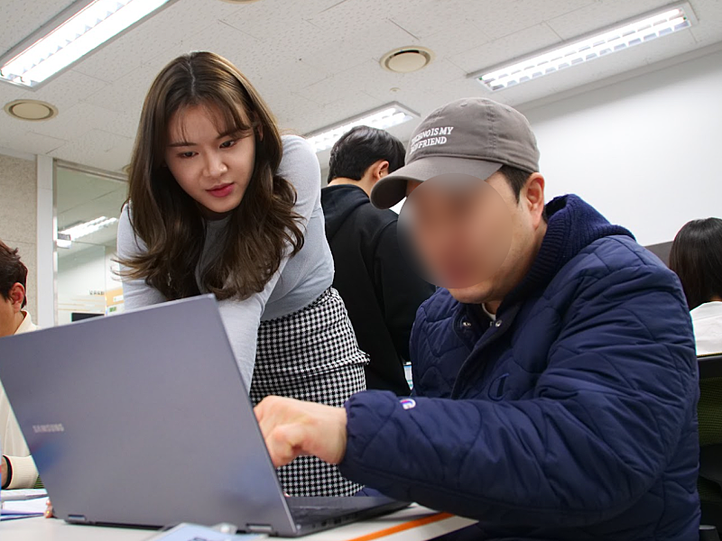

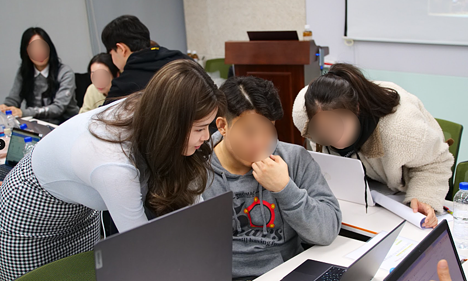

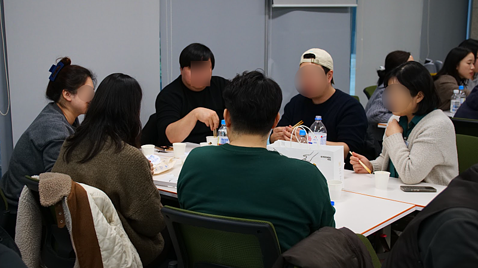

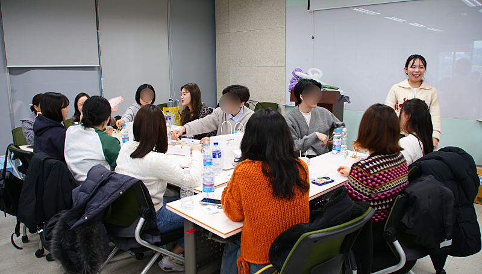

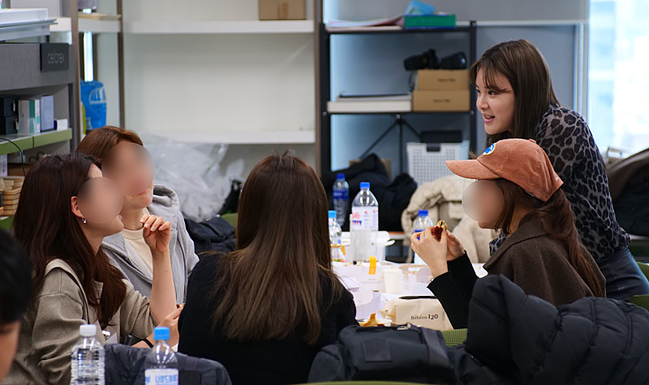

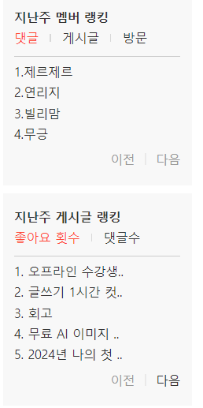

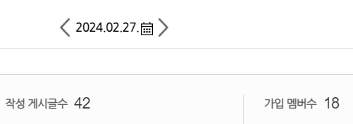

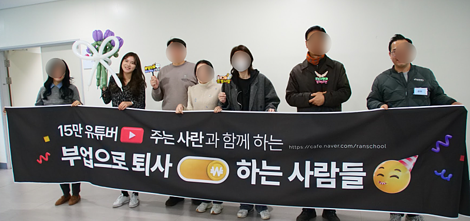

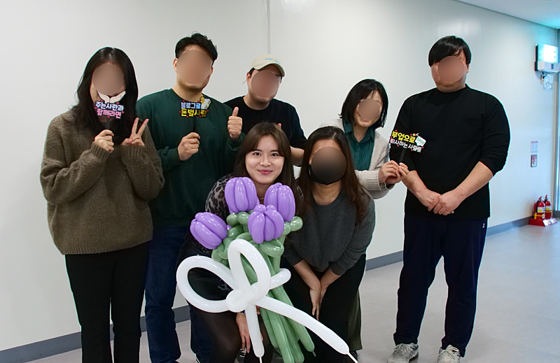

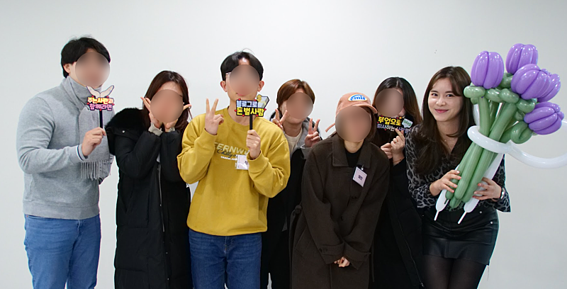

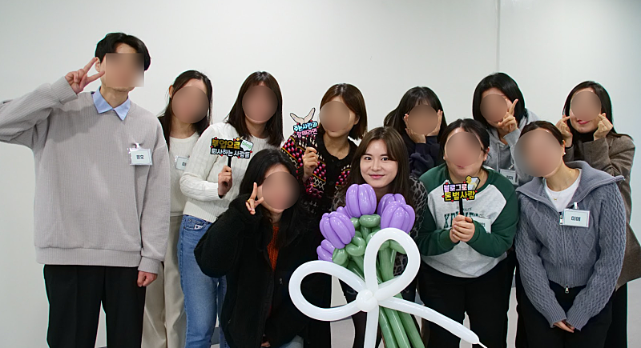

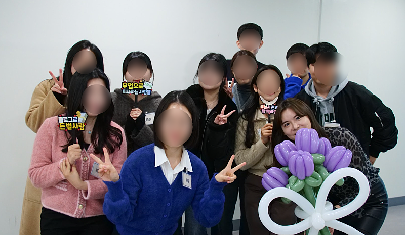

## 원문에 포함된 링크

- #
