# 내가 만약 파티룸을 한다면

- 원천 ID: EPR-CAFE-21522
- 작성자: 주는사란
- 작성일: 2024-02-29T16:40:20.953000+09:00
- 원문: https://cafe.naver.com/ranschool/21522
- 수집일: 2026-09-21
- 텍스트 정리: HTML 문단 순서 유지, 빈 문단·제로폭 공백만 제거. 원본 HTML·JSON 별도 보존. 이미지는 아래에 모아 보관하며 원래 배치는 HTML에서 확인.

## 원문 본문

<!-- P001 -->
내가 만약 시리즈 3탄입니다.

<!-- P002 -->
(1탄) 달고나편

<!-- P003 -->
오늘 운동하러 가는 길에 학교앞에서 달고나 파는 아저씨를 보았다. 이런생각을 했다. "나라면 저렇게 안 팔 것 같은데..." 내가 만약 지금 가진 머릿속 지식 외에 모...

<!-- P004 -->
cafe.naver.com

<!-- P005 -->
(2탄) PT편

<!-- P006 -->
대한민국 모임의 시작, 네이버 카페

<!-- P007 -->
cafe.naver.com

<!-- P008 -->
내가 만약 파티룸을 한다면 인데요.

<!-- P009 -->
내일은 2024년 1분기 수강생 모임이 있는 날입니다. 수강생 모임은 내일 홍대에 있는 한 파티룸에서 하는데요.

<!-- P010 -->
매번 분기별 모임마다 파티룸을 예약하면서 "이걸 하면 얼마나 벌까?" 생각을 하게 되더라구요. 그래서 "내가 만약 파티룸을 한다면"이라는 주제로 내일 30분 특강을 해볼 예정입니다.

<!-- P011 -->
내일 특강을 기대하셨으면 하는 마음에서 맛보기로 보여드립니다.

<!-- P012 -->
파티룸을 찾다보니 크게 두가지 유형으로 나뉘더라구요. 소형 / 스튜디오형 / 대형 이렇게요.

<!-- P013 -->
보통 소형은 최대 10인 이하 모임을 위주로 운영되구요. 20평 이하 파티룸으로 오픈합니다. 타겟은 브라이덜 샤워 혹은 술집 대신 프라이빗하게 모임을 하고 싶은 사람들입니다. 아예 숙박도 할수 있도록 제공하기도 합니다. 에어비엔비 시간 나눈 버전이라고 생각하시면 됩니다.

<!-- P014 -->
두번째 스튜디오형인데요. 렌탈스튜디오와 동시에 운영됩니다. 규모는 다양하나 먹고놀자분위기의 모임은 불가하고 사진찍는 목적으로 사용됩니다. 저도 종종 이런 곳에서 촬영했었거든요.

<!-- P015 -->
마지막으로 세번째 대형 파티룸입니다. 50평 이상의 파티룸으로 최소 40명 이상부터 최대 100명까지도 수용가능한 파티룸입니다. 신년회 / 송년회 / 각종 대형 모임을 타겟으로 합니다. 현재 대형 파티룸은 개인이 하기에는 최소 투자금이 2억이상 필요하다보니 회사형태로 하는 듯 합니다. 한 3개 업체가 서울시에서 여러개 운영하는 것 같고, 그 외에는 호텔 내부에 있는 연회장형태로 있습니다.

<!-- P016 -->
이번 파티룸이 대형파티룸에서 진행되는만큼, 내일 특강때는 "대형파티룸을 한다면" 을 기준으로 이야기 해보려고 합니다. 위치까지 비교하기에는 너무 광범위해서 위치는 홍대를 전제로 하구요.

<!-- P017 -->
내일 진행되는 파티룸 근처에서 대형파티룸을 했을때,

<!-- P018 -->
월세는 얼마정도인지부터

<!-- P019 -->
그래서 투자금은 얼마 필요한지

<!-- P020 -->
매달 최소 얼마정도 수익이 나야 운영이 가능한지

<!-- P021 -->
이런 운영을 위해 마케팅 비용은 얼마나 들지 등을 이야기해보려 합니다.

<!-- P022 -->
기대되시죠? ㅎㅎ

<!-- P023 -->
현재 분기별 모임 신청자는 스텝 제외하고 59명입니다. "혹시나 내가 제일 나이 많은거 아닌가?" 걱정하실 필요 없습니다. 50대까지도 계세요 ㅎㅎ

<!-- P024 -->
혹시나 모르고 신청 못하셨다면 아래 링크 참고해주세요

<!-- P025 -->
분기별모임 안내사항

<!-- P026 -->
안녕하세요. 부퇴사 매니저입니다. 벌써 이번 주 금요일이면 24년 1/4 분기별 모임인데요. 오늘은 분기별 모임에서 어떤 활동을 진행하고 어떤 이벤트들이 있는지 간략히 알려드...

<!-- P027 -->
cafe.naver.com

## 본문 이미지

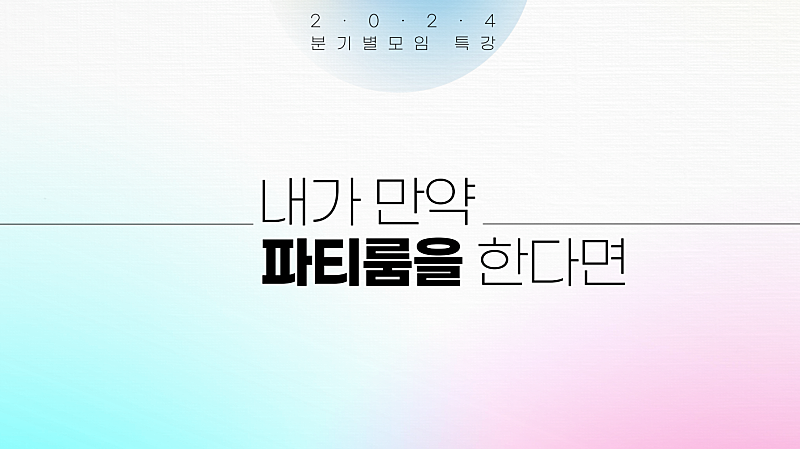

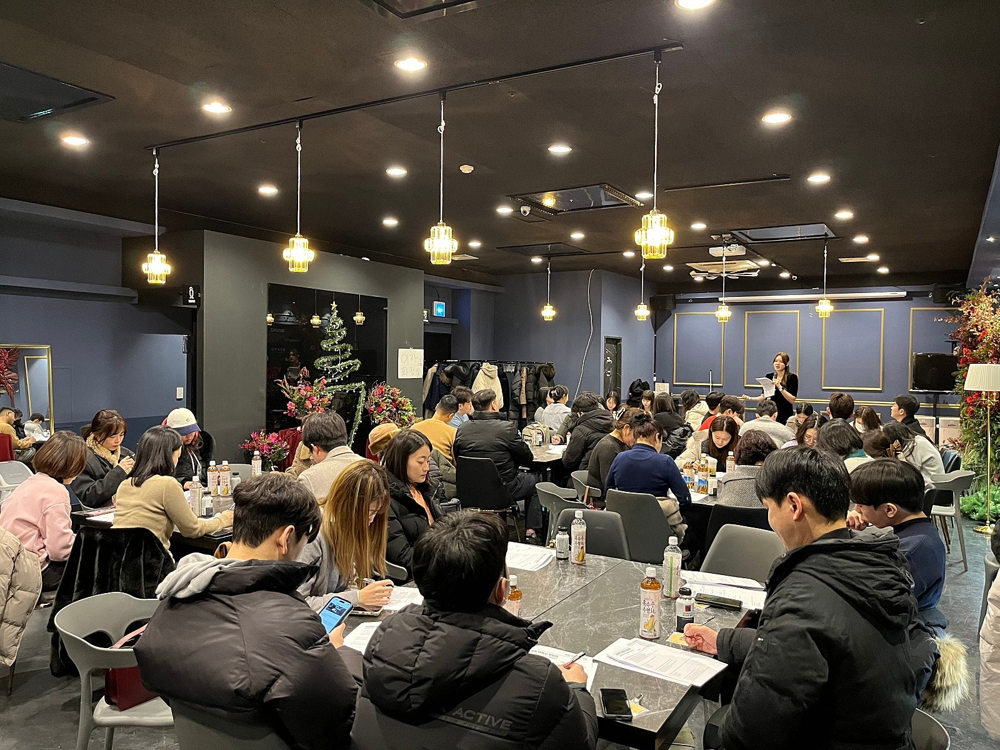

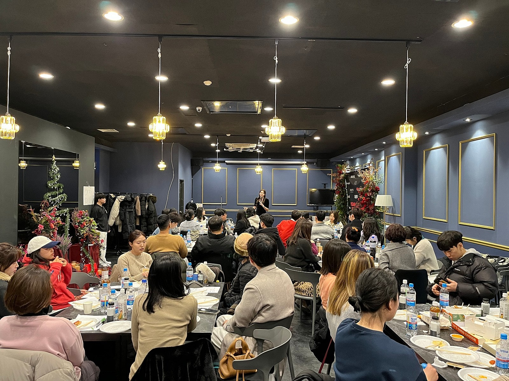

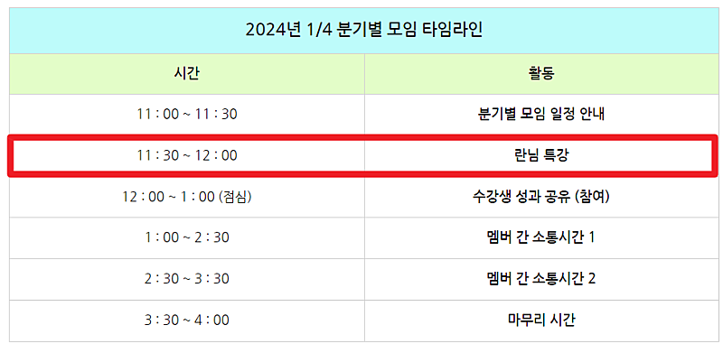

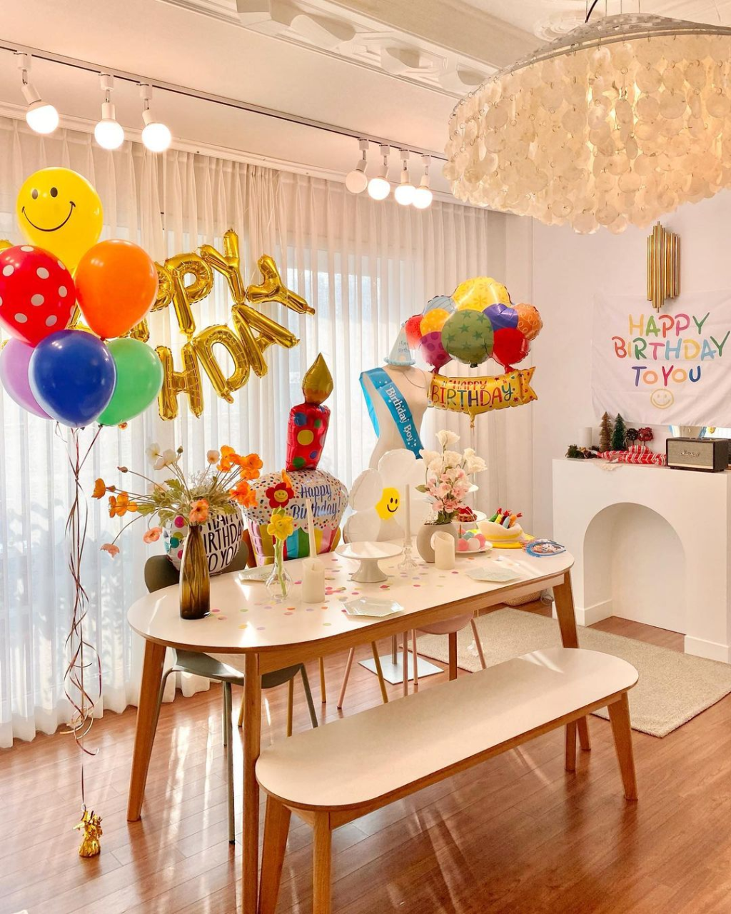

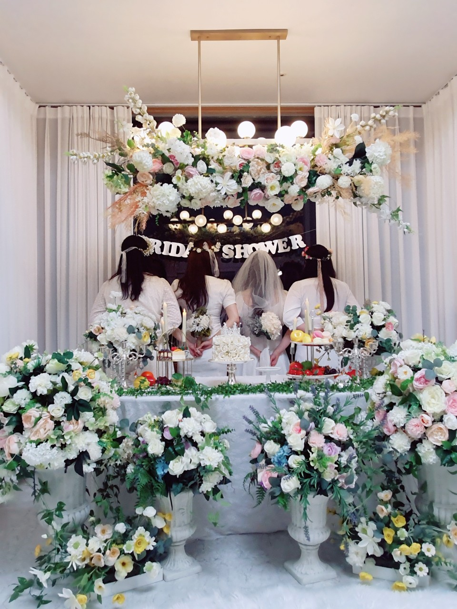

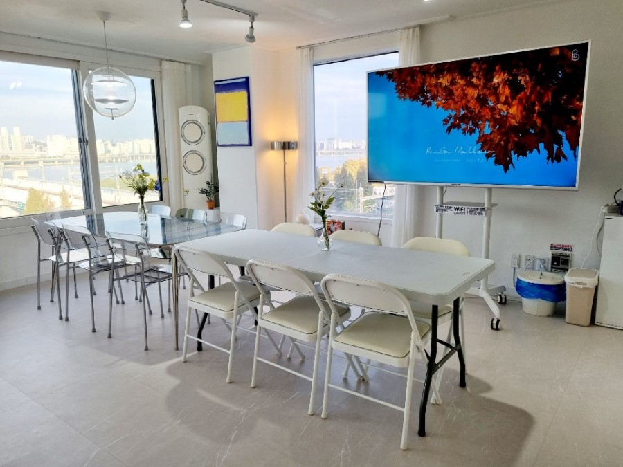

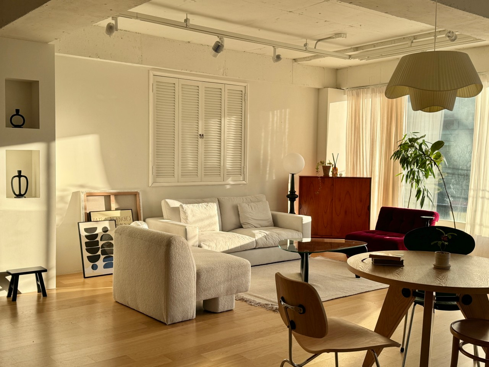

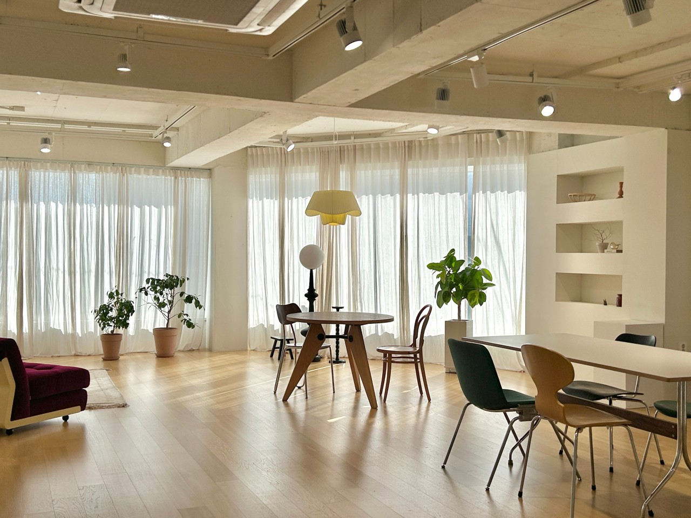

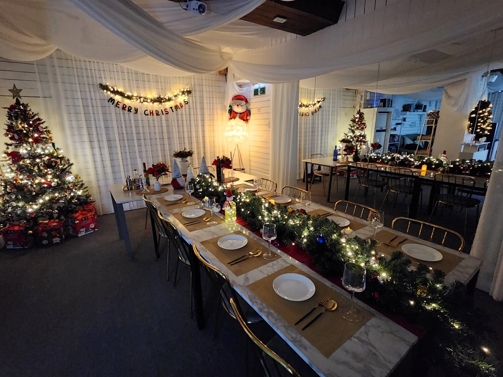

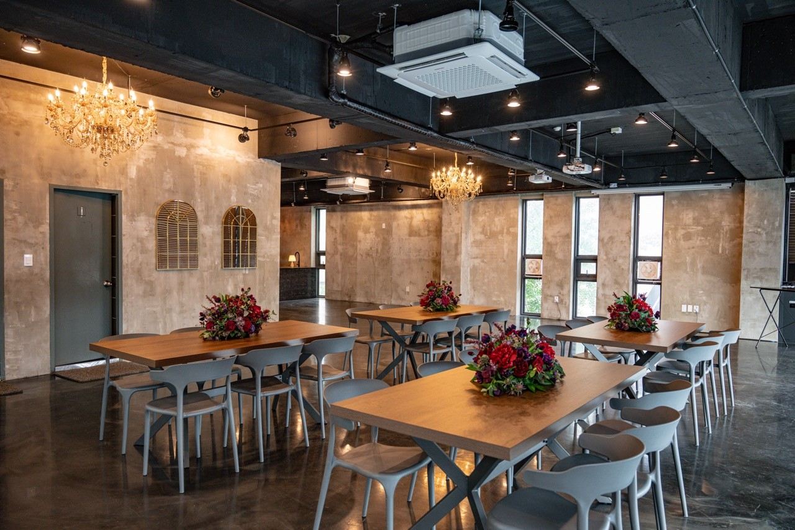

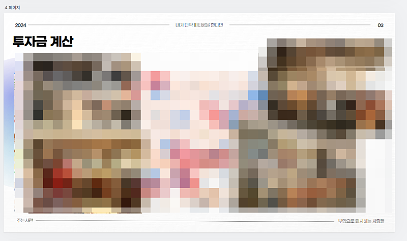

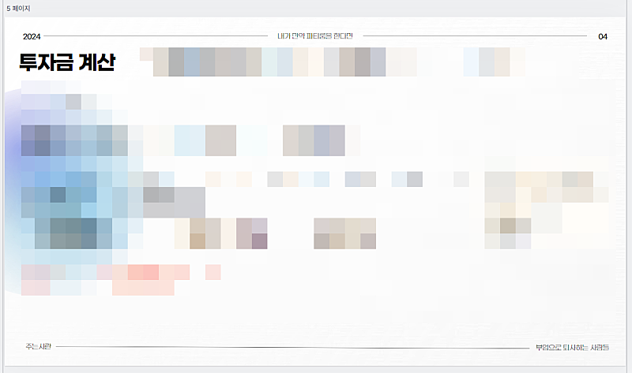

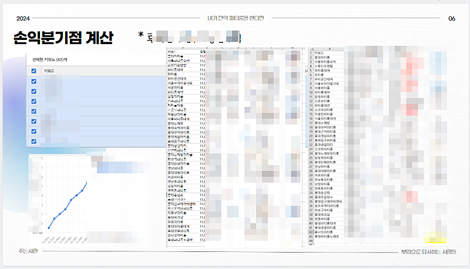

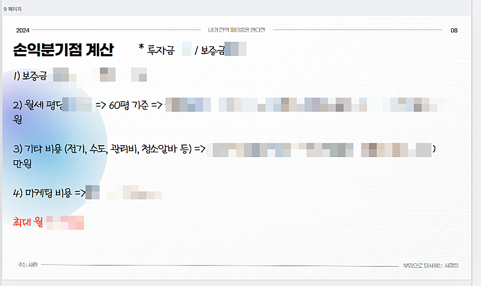

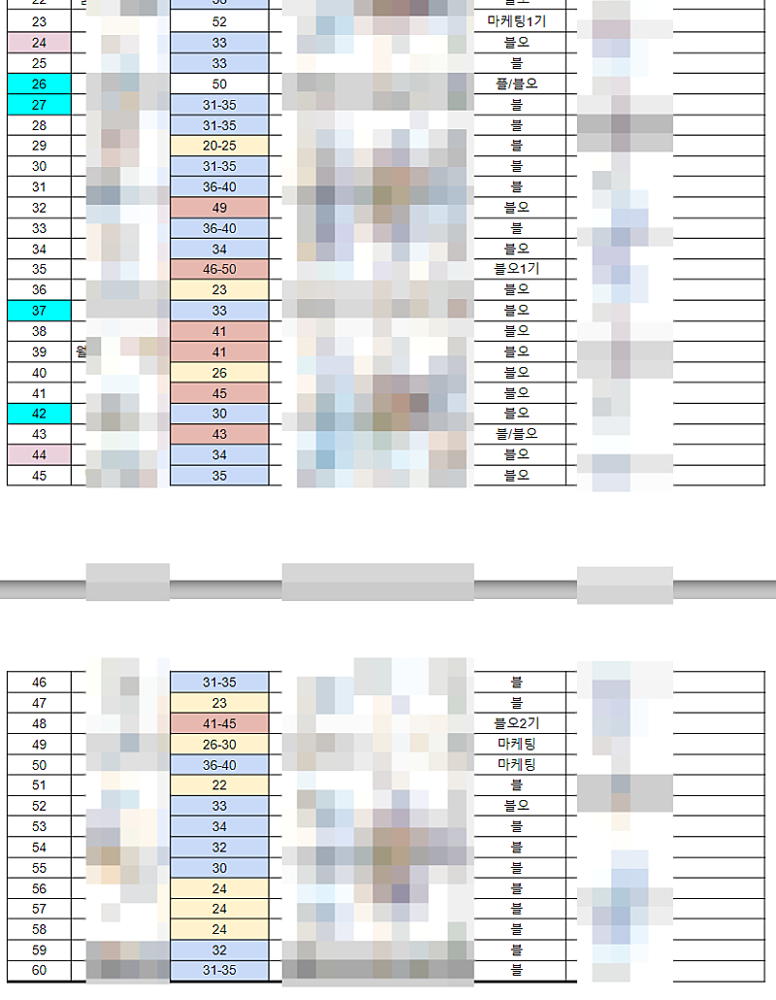

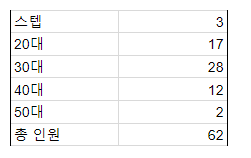

## 원문에 포함된 링크

- https://cafe.naver.com/ranschool/4860
- https://cafe.naver.com/ranschool/18672
- #
- https://cafe.naver.com/ranschool/21468
