# 블로그 연습, 돈 받으면서 하는 방법

- 원천 ID: EPR-CAFE-21947
- 작성자: 주는사란
- 작성일: 2024-03-08T17:29:08.940000+09:00
- 원문: https://cafe.naver.com/ranschool/21947
- 수집일: 2026-09-21
- 텍스트 정리: HTML 문단 순서 유지, 빈 문단·제로폭 공백만 제거. 원본 HTML·JSON 별도 보존. 이미지는 아래에 모아 보관하며 원래 배치는 HTML에서 확인.

## 원문 본문

<!-- P001 -->
저는 블로그 수익화까지 가장 중요한 한가지를 뽑으라고 하면 이걸 뽑을 것 같아요.

<!-- P002 -->
'일단 그냥 써보는 것'

<!-- P003 -->
설득하는 글쓰기를 한다거나 브랜드 블로그여야 한다거나 이런거 다 필요없고, 그냥 일단 글을 써보는거요. 말을 못하는 어린아이에게 일기를 쓰라고 할 순 없으니까요.

<!-- P004 -->
그래서 제가 블로그 활동 카테고리에서 1번 활동을 블로그 100개 챌린지로 해놓은거거든요.

<!-- P005 -->
근데 이렇게 말씀드리면, 이런 질문들을 하세요.

<!-- P006 -->
어떤 글을 쓰나요?

<!-- P007 -->
제 아이디에 쓰나요?

<!-- P008 -->
무슨 내용으로 써야하나요?

<!-- P009 -->
그래서 여러분이 블로그를 연습할 수 있는 치트키를 가져왔습니다. 소액이지만 돈을 받으면서요. 그래서 오늘 글에서는 돈을 받으면서 블로그를 연습할 수 있는 3가지 방법과 각 방법을 잘 할 수 있는 꿀팁까지 알려드려볼게요.

<!-- P010 -->
가장 많이 하시고 뻔한 방법부터 가겠습니다.

<!-- P011 -->
1. 체험단 블로그

<!-- P012 -->
모두들 알고 계시는 체험단 블로그입니다. 최근에는 빌리맘님이 블로그 100개 챌린지를 이 방법으로 성공하셨습니다. 빌리맘님 축하드립니다!

<!-- P013 -->
빌리맘님처럼 체험단을 블로그 연습삼아 해보시는 분들도 계시는데요. 아직 모르시는 분들이 있어서 말씀드려요. *블로그 체험단이란? 제품이나 서비스를 제공받는 대신 블로그를 작성해주는 활동을 의미합니다.

<!-- P014 -->
체험단을 하는 방법은 체험단 사이트에 가서 응모를 하시면 됩니다. 체험단 사이트는 레뷰 / 디너의 여왕 / 서울오빠 / 강남 맛집 / 놀러와 / 이음체험단 등이 있습니다. 체험단 사이트 비교와 체험단 사이트에 신청하는 방법은 곧 카페 매니저님이 정리해서 올려주실겁니다! 조금만 기다려주세요!

<!-- P015 -->
블로그 체험단 선정되는 꿀팁 블로그 퍼옴

<!-- P016 -->
하지만 아쉽게도 블로그 체험단도 블로그를 개설하자마자는 할 수가 없어요. 최소한 글을 15개 이상은 쓰셔야 당첨확률이 올라갑니다. 15개 이상이라는 것도 정확한 기준은 아니구요. 대략적으로 15개 이상이면 당첨확률이 높다는 이야기입니다. 15개를 써도 당첨이 안된다면 좀 더 검색량이 낮은 사이트와 업종을 공략하셔야 됩니다. 이부분은 체험단 사이트 글에서 말씀드리는거로 할게요.

<!-- P017 -->
한두번 당첨된 이후로는 체험단을 하면서 글을 쌓으면 되니 당연히 당첨 확률은 더 높아질겁니다.

<!-- P018 -->
그럼 일단 15개는 써야 할텐데, 이걸 뭘로 써야 하나? 이런 고민을 또 하실거예요. 그래서 15개를 어떻게 쓰면 그 뒤로 당첨확률이 올라가는지 팁을 드릴게요.

<!-- P019 -->
저라면 제가 체험단을 하고 싶은 업종의 글을 먼저 써볼 것 같아요. 예를 들어, 내가 디저트 카페를 체험단으로 가고 싶다? 그러면 내가 갔던 디저트 카페들을 후기로 써보는거죠. 만약 사진을 찍어 놓은게 없다면, 해당 네이버 플레이스에 가면 여러 후기가 있으니 그 사진을 가져와서 보정한 후 작성할 것 같습니다.

<!-- P020 -->
여기서 주의하실점은 사진은 퍼왔을경우 출처를 반드시 입력해야 한다는 점과, 가져온 사진은 보정이 필요하다는 점입니다. 사진 편집하는 법에 대해서는 카페에 유사이미지라고 검색하시면 하는 법을 알수 있습니다.

<!-- P021 -->
갔던 곳들만 후기로 다 써도 15곳은 넘을테지만, 혹시나 15곳을 도저히 못 채우신다면 "가고 싶어요" 라는 글도 쓸 것 같아요. 어짜피 글 갯수는 채워야 하고, 당장은 체험단을 목표로 한다면 블로그에 이런 곳 가고 싶다고 글을 쓰는거죠.

<!-- P022 -->
제목 :  XX디저트카페 연차를 써서라도 가고 싶은곳

<!-- P023 -->
내용 : 여기에 파는 까눌레 사진을 첨부하며, 겉에 코팅이 아주 바삭한게 너무 맛있어보여요. 아직 먹지 못했지만, 사진으로만 봐도 바삭한게 보입니다. 침나오네요.

<!-- P024 -->
이런식으로요. 개인적으로 까눌레를 참 좋아해서 예시로 써봤습니다 ㅋㅋㅋㅋㅋㅋㅋㅋㅋㅋㅋ

<!-- P025 -->
가고 싶은 카페를 쓸 때도, 이미 체험단 사이트에 올라와 있는 카페를 가고 싶다고 하는 것도 방법이겠죠?

<!-- P026 -->
그래도 채워지지 않는다면, 부퇴사카페에 관련해서 써봐주시면 참 감사드리겠습니다 :) ㅎㅎ 독일행님, 핑크카우님, 까뮤님, 혜원님 모두 감사합니다 :)

<!-- P027 -->
그렇게 15개를 채우시면 이제 체험단을 본격적으로 하실텐데요. 체험단을 하실때는 두가지만 주의하시면 좋습니다.

<!-- P028 -->
첫번째는 우리의 목표는 체험단에서 끝나는게 아니라 '블로그 수익화'가 목적이라는 점을 잊지 마셔야 합니다. 그냥 후기만 쓰는 것 보다는 '설득하는 글쓰기'를 노력해보셔야해요. 처음에는 제목만 이라도요. 나눠드린 마케팅부업입문서 무료 PDF 에 제목 템플릿 있는거 아시죠? 입문서에 있는 내용 조금만이라도 적용해보려 노력해봐주세요.

<!-- P029 -->
그리고 스댓체공을 하지 않으면 글 레벨이 올라가기 어렵습니다. 스댓체공은 잊지 말고 해주세요.

<!-- P030 -->
여기서 하나 더 팁을 드리자면, 저라면 음식점 이런 업종보다는 내가 진짜 마케팅 대행을 맡을 수 있는 업종 체험단 위주로 할 것 같아요. 업종 추천은 이미 했으니 링크로 대신하겠습니다. 그렇게 해당 업종 체험단으로 가면 사장님과 이야기 할 수 있는 기회가 있으실거예요. 그때 한번 영업 해보시는 것도 좋을 것 같습니다. 사장님과 말 할 수 있는 기회니까요.

<!-- P031 -->
두번째로는 아무 체험단이나 맞지 말자는건데요. 체험단으로 저품질 왔다는 분들도 종종 있습니다. 그 이유 중 대표적으로는 유사 이미지와 유사 문서가 있어요. 유사 이미지는 아까 말씀드렸듯이 사진을 넣으실때 보정하는거 잊지 마시구요.

<!-- P032 -->
체험단을 신청해서 당첨이 되면 "블로그 쓸 때 이런 말 넣어주세요" 라는 가이드라인을 줍니다. 근데 이때 가이드라인은 나 뿐 아니라 당첨된 모든 사람이 똑같이 받는거예요. 이 때 쓰는 사람이 너무 비슷한 사진과 너무 비슷한 글을 쓰면 바로 모두 저품질이 옵니다. 그래서 가이드라인을 봤을때 비슷한 문서가 너무 많이 나올 것 같은 항목은 하지 않는게 좋습니다.

<!-- P033 -->
2. 알바몬 / 알바천국

<!-- P034 -->
혹시 여러분 알바몬이나 알바천국에서 블로그 글 쓸 수 있는 사람을 구하는거 알고 계셨나요? 건당 비용이 크지는 않으나 꽤 있습니다.

<!-- P035 -->
직접 출퇴근 하면서 블로그 쓰는 곳들은 의미가 없을 것 같구요. (우리는 블로그 마케팅 대행을 위해 수익화 하는게 목적이기 때문에 공부하는 시간 치고는 시간이 너무 많이 들어감) 건별로 블로그 원고를 써달라는 곳들은 괜찮다고 생각합니다.

<!-- P036 -->
일단 원고의 장점은 말 그대로 원고이기 때문에 내 블로그에 글을 쓰지 않아도 되고, 사진 보정등 귀찮은 작업 없이 '글만' 연습해 볼수 있다는 점입니다.

<!-- P037 -->
당연히 단점도 있는데요. 일단 채용 공고상의 내용만 가지고는 정확히 어떤 업종의 어떤 글을 쓰는지 알 수가 없습니다. 요즘 알바몬이나 알바천국에 올라온 공고글 중 이상한게 많다고 해서 하시기 전에 업종등을 확인하는건 중요할 것 같습니다.

<!-- P038 -->
그렇게 원고를 쓰는 연습을 하면 블로그 100개 챌린지는 금방 하시겠죠?

<!-- P039 -->
알바몬 알바천국보다 좀더 쉬운 영업방법도 있습니다.

<!-- P040 -->
3. 당근 알바

<!-- P041 -->
얼마 전에 노란튤립님이 당근마켓 들어갔다가 계약하셨다는 후기가 올라왔었는데요. 노란튤립님은 수강생 분기별 모임에 오셔서 해당 사연에 대해서 자세히 말씀해주시기도 했습니다.

<!-- P042 -->
그 이야기가 생각나서 오늘 당근마켓 알바를 검색해봤는데요. 저희 지역에도 있었습니다.

<!-- P043 -->
한번 검색해 보시면 좋을 것 같습니다.

<!-- P044 -->
영업을 어떻게 해야할지 모르겠다면

<!-- P045 -->
대한민국 모임의 시작, 네이버 카페

<!-- P046 -->
cafe.naver.com

<!-- P047 -->
블로그 자체를 어떻게 해야할지 모르겠다면

## 본문 이미지

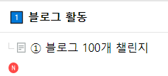

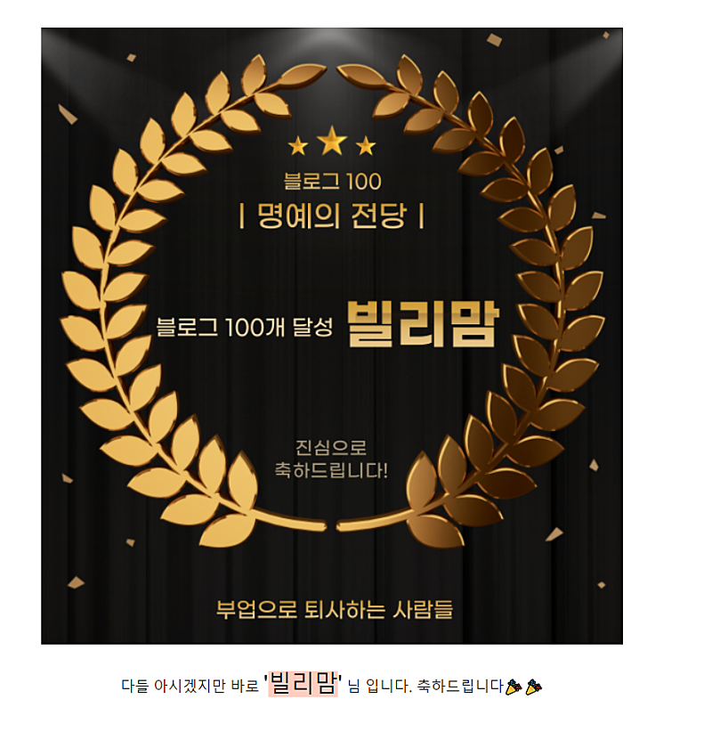

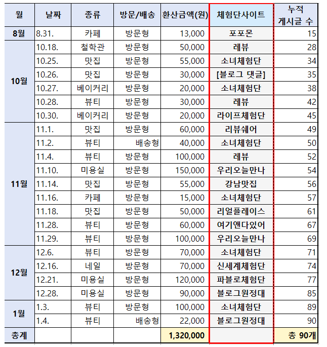

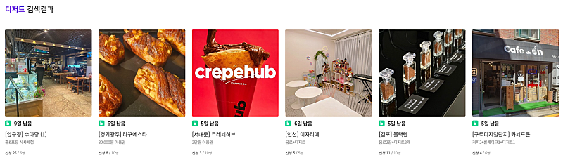

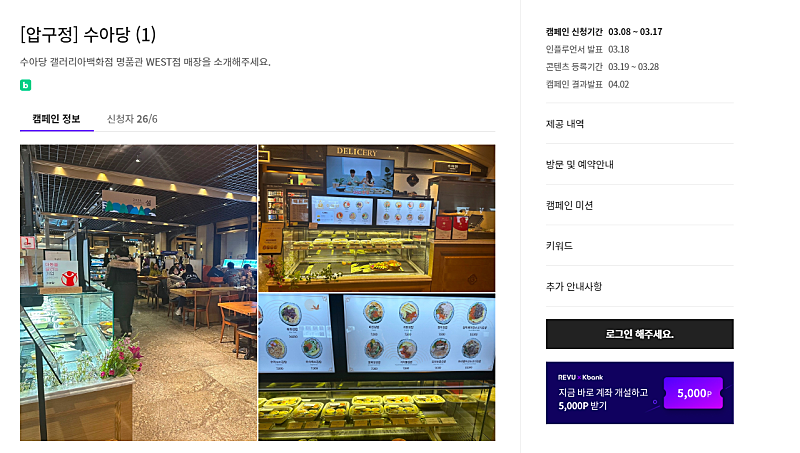

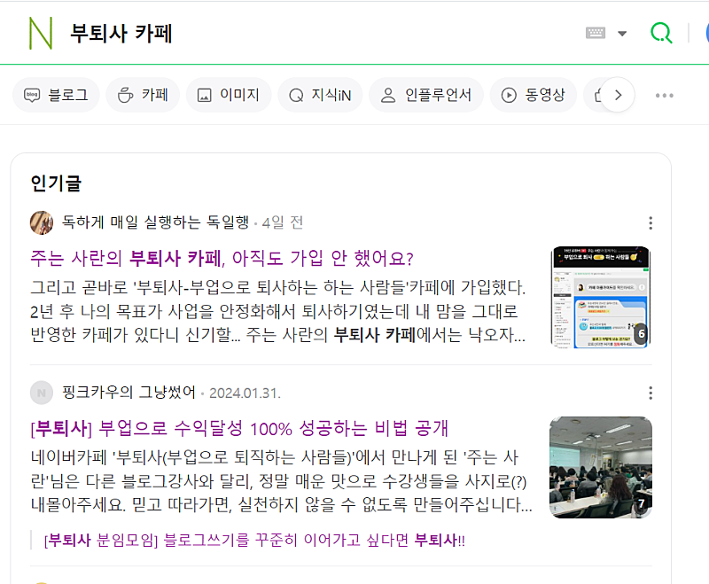

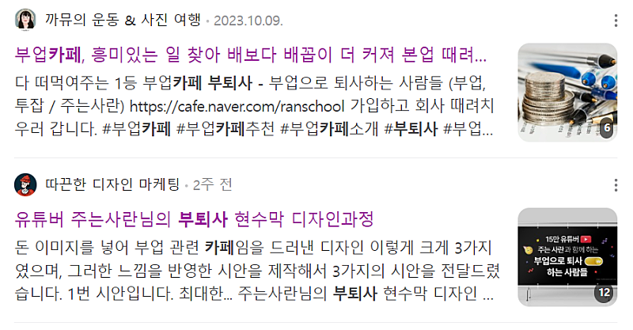

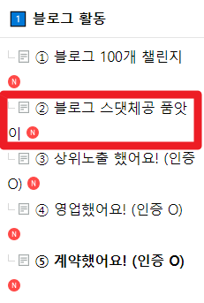

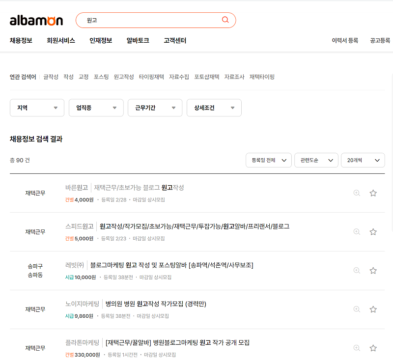

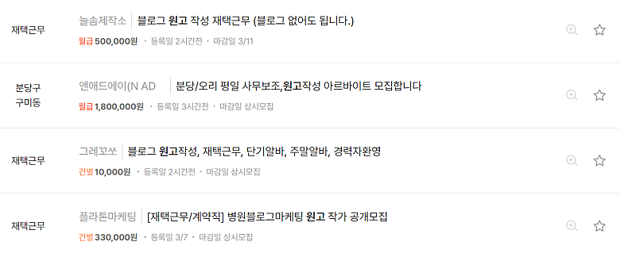

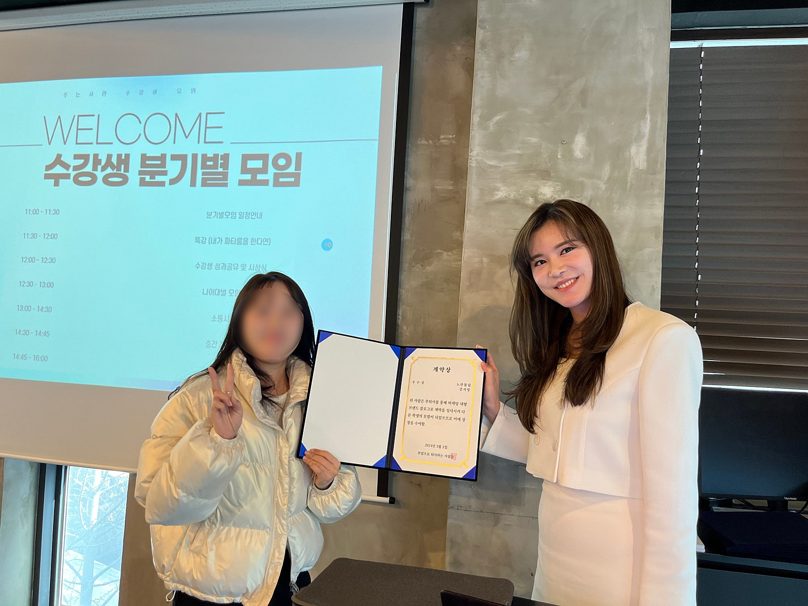

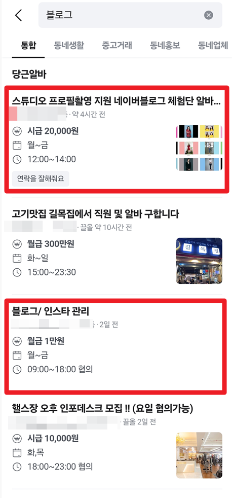

## 원문에 포함된 링크

- #
- https://cafe.naver.com/ranschool/15688
- https://cafe.naver.com/ranschool/26276
