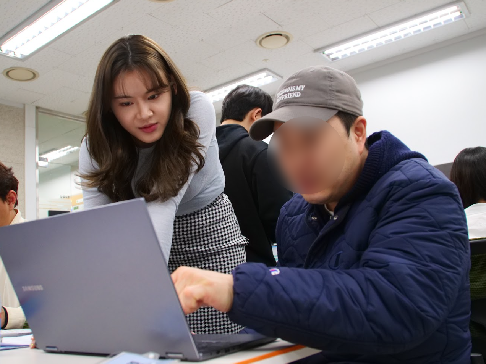
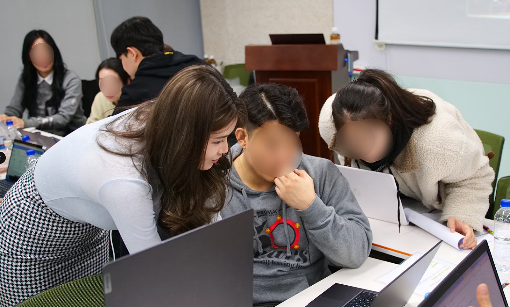
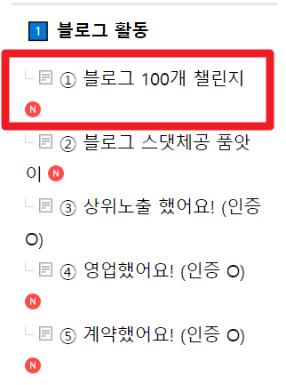
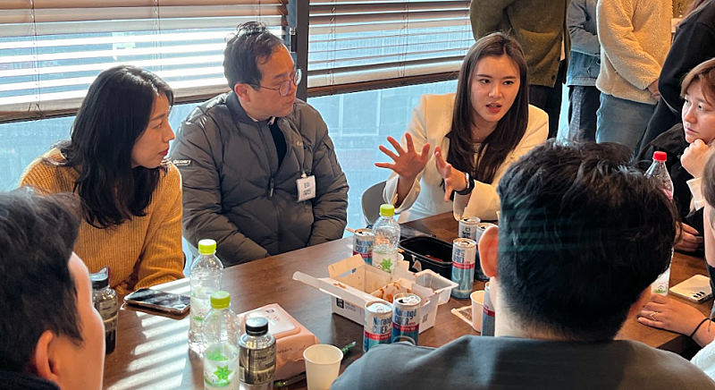
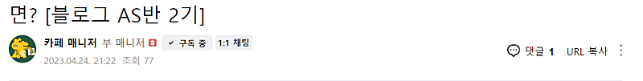
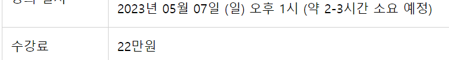

# 곧 '블로그데이' 가 찾아옵니다.

- 원천 ID: EPR-CAFE-22339
- 작성자: 주는사란
- 작성일: 2024-03-15T14:36:22.117000+09:00
- 원문: https://cafe.naver.com/ranschool/22339
- 수집일: 2026-09-21
- 텍스트 정리: HTML 문단 순서 유지, 빈 문단·제로폭 공백만 제거. 원본 HTML·JSON 별도 보존. 이미지는 아래에 모아 보관하며 원래 배치는 HTML에서 확인.

## 원문 본문

<!-- P001 -->
저는 여러분이 블로그를 쓰시는데 어려워하는 점을 하나하나 해결해드리려고 노력하고 있어요. 생색은 아니구요. 그냥 제가 뿌듯해서요. (이게 생색인가요? ㅎㅎ)

<!-- P002 -->
오늘은 🎁수강생 감동서비스🎁 중 하나를 살포시 꺼내볼까합니다. 🎉

<!-- P003 -->
바로 '블로그데이'입니다. 여러분들이 블로그를 더 빨리 더 잘 더 쉽게 쓸 수 있도록 하기 위한 프로젝트 중 하나인 '블로그데이'를 오픈할 예정이예요.

<!-- P004 -->
'블로그데이'란?

<!-- P005 -->
저와 만나 '시간 맞춰' 블로그를 써보고 제게 피드백 받는 시간이예요. (소수정예)

<!-- P006 -->
▼ 이런식으로요 ▼

<!-- P007 -->
블로그데이의 목표는요. '글쓰기 시간 단축' 입니다.

<!-- P008 -->
블로그를 하는 분들이 힘들어하는 것 중 하나가 바로 "글쓰는데 시간이 너무 오래걸린다"는 점입니다. 보통 4가지 이유때문인데요.

<!-- P009 -->
1. 글 쓰는 것 자체가 익숙하지 않다.

<!-- P010 -->
2. 어떤 내용을 써야할지 고민된다.

<!-- P011 -->
3. 블로그 발행 전 신경써야 할 것이 많다.

<!-- P012 -->
4. 볼때마다 부족하니깐 계속 추가한다.

<!-- P013 -->
1번 문제는 많이 써봐야 해결되기때문에 앞으로는 계속 쓰실수 있도록 압박(?)을 넣어드릴거예요. 2번 문제는 키워드 마이닝이 잘 안되서 그런건데요. 사실 그날 블로그를 얼마나 쓸지는 2번에서 기획을 얼마나 잘해놨냐에따라 시간이 달라집니다. 마지막 3번 문제는 체크리스트가 없으셔서 그래요. 뭘 확인하고 발행해야 하는지 헷갈려서 그렇습니다. 그래서 강의 자료에서 이 부분도 보완하고 있어요. 4번 문제는 시간대비 효율을 계산하지 못해서예요. 물론 초보자입장에서 시간이 오래걸리더라도 연습해봐야할 부분은 있는데요. 시간을 써서라도 연습해야하는 것과 적당히 만족해야하는 것의 경계를 익히는게 필요합니다. 그 기준을 아래서 알려드릴게요.

<!-- P014 -->
보시면 아시겠지만 결국 4가지 모두 '연습'이 답이예요. 근데 혼자서는 시간 맞춰 연습하기가 어렵다는걸 잘 알고 있어서요. 모의고사를 보듯이 같이 만나서 해보는 날이 바로 블로그데이입니다. 말 그대로 만나서 '블로그'를 하는거죠.

<!-- P015 -->
제가 아이들을 가르칠때도 보면 꼭 문제는 잘 푸는데 시간내로 못 푸는 아이들이 있어요. 성적은 풀 줄 아는 것과 관련이 없습니다. '시간내'에 풀어야 성적에 반영이 되죠.

<!-- P016 -->
우리는 시험을 보진 않습니다. 그럼 "굳이 시간을 단축해야해?" 라고 생각하실수도 있는데요. 우리한테는 이 시간이 돈입니다. 글쓰기 시간이 단축된다면 업체를 더 받을 수 있는거죠. 블로그 시간 단축은 곧 돈입니다. 돈을 더 벌기 위해서 하는거예요. 초보자분들에게도 반드시 이 연습이 필요하죠. 처음부터 블로그 글쓰기 습관 자체를 제대로 만드는게 좋으니까요.

<!-- P017 -->
문제 풀 줄 모르는 아이에게 시험을 보는게 의미가 없듯, 블로그를 써보지 않고 시간을 단축하는 건 의미가 없습니다. 오히려 대충 쓰실테니 최악이죠. 그래서 최소한의 기준이있습니다.

<!-- P018 -->
본 '블로그데이'를 참석하시려면 블로그 100개 챌린지에 글 5개 이상 쓰셔야 참석이 가능합니다. 어떤 글이어도 괜찮습니다. 정말 아무 글이어도 괜찮아요. 도저히 쓰실게 없다면 부퇴사 카페 관련된 글을 쓰셔도 좋구요. 제 영상과 관련된 글을 쓰셔도 좋습니다. 상위노출, 스댓체공등 이런거 아무것도 안 해도 괜찮습니다. 일단 우리는 '글쓰기' 이거 먼저 연습할거거든요. 설마 이것도 안하시는건...아니시죠?ㅎㅎㅎ

<!-- P019 -->
아까 제가 시간을 써서라도 연습해야하는 것과 적당히 만족해야하는 것의 경계를 익혀야 한다고 했는데요. 제 경험적인 기준을 제시해 드리겠습니다. 기준이 없으면 어디까지 노력해야하는지 모르니까요. 근데 조심해야 할 건 어떤 분은 이 시간을 맞추겠다고 '대충' 쓰시는 경우가 있어요. 제 수강생이라면 당연히 아시겠지만 가장 중요한건 '마케팅 대행하는 업체의 매출을 올려줄수 있는 글쓰기' 입니다. 매출을 올려주지 못하면 아무리 시간을 단축해서 많이 쓴다해도 의미가 없습니다. 아시죠? ㅎㅎ

<!-- P020 -->
블로그를 '업'을 삼아 돈을 벌기 위해서 가장 이상적인 글쓰기 시간과 초보자들이 최대 넘기면 안되는 시간은 이렇습니다.

<!-- P021 -->
블로그 본업자

<!-- P022 -->
목표시간

<!-- P023 -->
초보자

<!-- P024 -->
글 50개 이상 작성자

<!-- P025 -->
쌩초보자

<!-- P026 -->
글 50개 이하 작성자

<!-- P027 -->
① 키워드마이닝

<!-- P028 -->
30분

<!-- P029 -->
50분

<!-- P030 -->
1시간

<!-- P031 -->
② 제목 짓기

<!-- P032 -->
5분

<!-- P033 -->
5분

<!-- P034 -->
10분

<!-- P035 -->
③ 대충 글쓰기

<!-- P036 -->
20분

<!-- P037 -->
40분

<!-- P038 -->
1시간

<!-- P039 -->
④ 살 붙이기

<!-- P040 -->
20분

<!-- P041 -->
40분

<!-- P042 -->
40분

<!-- P043 -->
⑤ 체크리스트 확인

<!-- P044 -->
10분

<!-- P045 -->
20분

<!-- P046 -->
20분

<!-- P047 -->
블로그데이에서는 여러분이 글 50개 이상 썼다는 가정하에 '초보자' 기준으로 시간을 잡고 글 쓰는 연습을 할겁니다. 빔프로젝트에 스톱워치를 띄울거구요. 여러분이 쓰는 동안에 제가 돌아다니면서 볼겁니다. 어려워하시는 분들은 한분한분 도와드릴거예요.

<!-- P048 -->
키워드를 똑바로 이해 못 한다? 될때까지 설명드릴거구요. 제목을 못 짓는다? 그럼 옆에서 제목을 같이 지어드릴거구요. 대충글쓰기를 못한다? 그럼 대충 제가 써드릴거구요. 살 붙이기를 못한다? 자료를 찾아드릴게요. 체크리스트 확인을 못한다? 설마 이런분은 없으시겠죠...?ㅎㅎㅎㅎ

<!-- P049 -->
본 블로그데이는 반응이 좋으면(?) 분기별모임(3개월에 한번)보다는 자주 할 예정입니다. 어느 주기로 할지는 이번에 해보고 말씀드리겠습니다. 근데 아쉽게도 한번 할 때마다 많은 분을 받지는 못할 것 같아요.

<!-- P050 -->
제가 돌아다니면서 받을수 있는 인원만 받아야 하니까요. 그리고 죄송하게도 평일에 진행할 예정입니다. 반차를 쓰게해서 죄송하지만ㅠㅠ 주말에는 오프라인강의와 겹쳐서요. 평일 1시부터 할 예정이구요. 반차를 미리 쓸수 있도록 2주전에 공지해드리겠습니다. 정확한 공지는 장소를 예약 후 안내드릴 수 있도록 하겠습니다.

<!-- P051 -->
위 내용을 정리해보겠습니다.

<!-- P052 -->
블로그데이 안내

<!-- P053 -->
1. 블로그데이 소개

<!-- P054 -->
: 저와 오프라인에서 시간 맞춰 글써보고 피드백 받고 발행까지 하고 집 가는 날

<!-- P055 -->
- 미리 어떤 내용 쓰실건지 정해오셔야 합니다.

<!-- P056 -->
- 평일 1시~5시에 진행 예정입니다. (날짜는 최소 2주전에 공지하며, 시간은 일부 변동이 있을수 있으나, 반차로 해결할 수 있도록 하겠습니다)

<!-- P057 -->
- 서울시 양천구, 강서구 인근 장소에서 진행합니다.

<!-- P058 -->
- 마무리 후 간단한 티타임 할 예정입니다.

<!-- P059 -->
- 예상인원 20명 내외입니다. 선착순 마감입니다.

<!-- P060 -->
- 예상날짜는 : 4월 12일 (금) / 4월 19일 (금) / 4월 26일 (금) ★★★평일입니다★★★

<!-- P061 -->
2. 신청하면 좋을 분

<!-- P062 -->
- 뭘 써야 할지 몰라 글 쓰기가 힘든분

<!-- P063 -->
- 블로그 글쓰는데 오래 걸리는 분

<!-- P064 -->
- 키워드 잡기가 어려운 분

<!-- P065 -->
- 제목이 도저히 생각 안나는 분

<!-- P066 -->
- 그냥 제가 보고 싶은 분 ㅋㅋㅋㅋㅋㅋㅋㅋㅋㅋ

<!-- P067 -->
3. 신청조건

<!-- P068 -->
: 브랜드블로그 강의 수강생 + 블로그 100개 챌린지 글 5개 이상

<!-- P069 -->
-블로그데이날 전날 밤 10시까지 5개이상 있으면 참석 가능

<!-- P070 -->
-참석신청 후 전날 밤 10시까지 작성 안되어있으면 참석 불가

<!-- P071 -->
4. 블로그데이 일정표

<!-- P072 -->
*일정표는 변동될 수 있습니다.

<!-- P073 -->
1:00 - 2:00

<!-- P074 -->
자기소개 및 블로그 쓸 내용 이야기 나누기

<!-- P075 -->
2:00 - 3:00

<!-- P076 -->
① 키워드마이닝 (50분) / 쉬는시간 (10분)

<!-- P077 -->
3:00 - 3:10

<!-- P078 -->
② 제목 짓기 (5분)

<!-- P079 -->
3:10 - 4:00

<!-- P080 -->
③ 대충 글쓰기 (40분)

<!-- P081 -->
4:00 - 5:00

<!-- P082 -->
④ 살 붙이기 (40분) / 쉬는시간 (20분)

<!-- P083 -->
5:00 - 5:30

<!-- P084 -->
⑤ 체크리스트 확인 (20분) / 발행 (10분)

<!-- P085 -->
5:30 - 6:00

<!-- P086 -->
티타임 및 마무리

<!-- P087 -->
5. 참가비용

<!-- P088 -->
5만원 (신청인원에 따라 참가비는 오를 수도 있습니다)

<!-- P089 -->
블로그데이에서 하는 건 사실 이전에 블로그 실전반에서 했던 내용인데요. 1년전에 22만원을 받고 했던 서비스입니다. 하지만 블로그데이는 🎁수강생 감동서비스🎁 이기 때문에 비용을 낮췄습니다. 물론 참가비용은 신청인원에 따라 오를수도 있는점 참고해주세요.

<!-- P090 -->
신청하기

<!-- P091 -->
안녕하세요 부퇴사 매니저 입니다. '블로그 데이' 신청 당일 입니다.😊 바로 신청 방법 말씀 드릴게요! * 입금 확인 후 신청이 완료 되면, 장소 안내 드리겠습니다:) (목...

<!-- P092 -->
cafe.naver.com

## 본문 이미지

## 원문에 포함된 링크

- #
- https://cafe.naver.com/ranschool/22945
