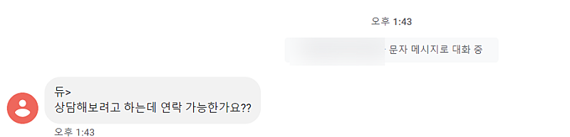
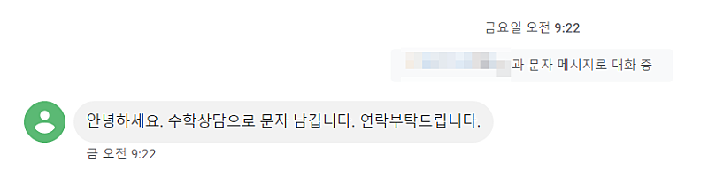
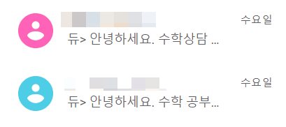
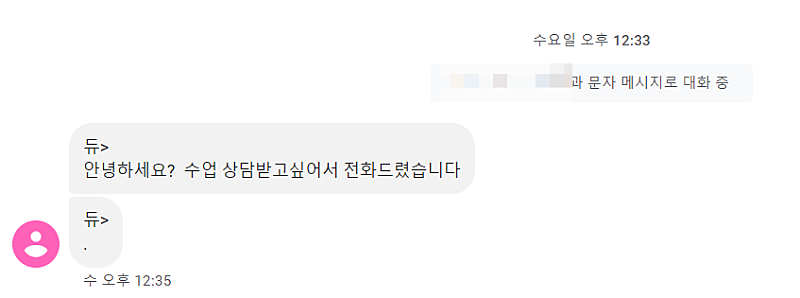
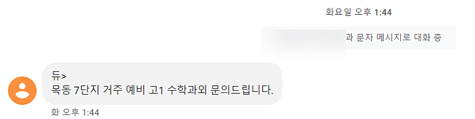

# 진지하게 할까말까 고민중인 아이템 1번

- 원천 ID: EPR-CAFE-2237
- 작성자: 주는사란
- 작성일: 2023-01-29T16:19:53.700000+09:00
- 원문: https://cafe.naver.com/ranschool/2237
- 수집일: 2026-09-21
- 텍스트 정리: HTML 문단 순서 유지, 빈 문단·제로폭 공백만 제거. 원본 HTML·JSON 별도 보존. 이미지는 아래에 모아 보관하며 원래 배치는 HTML에서 확인.

## 원문 본문

<!-- P001 -->
*참고로 저는 제가 직접 수업하던 공부방을 2개월 전에 접었습니다.

<!-- P002 -->
수학 공부방 or 학원

<!-- P003 -->
1) 하려는 이유

<!-- P004 -->
- 지금 진짜 미친듯이 문의 오는중. 아마 방학이라서 그런듯

<!-- P005 -->
- 3개월전에 차린 수학쌤도 개 잘되는 중.

<!-- P006 -->
- 무조건 6개월 내로 월 천만원씩 벌수 있음

<!-- P007 -->
- 강의 수강생, 유튜브 구독자에게 실력검증?을 할수 있다??

<!-- P008 -->
- 강의자료로 쓸수 있음 ㅎㅎ

<!-- P009 -->
2) 망설이는 이유

<!-- P010 -->
- 내가 수업은 못함. 시간이 없음.

<!-- P011 -->
- 그럼 선생님을 구해야되는데 또 구하러 다녀야됨;;

<!-- P012 -->
- 내가 수업을 안하기 때문에 선생님을 고용해서 아이들을 맡기면, 잘 되면 아이들을 데리고 나가서 그 선생님이 차림. 물론 이건 비율을 조정하면 되긴 함.

<!-- P013 -->
- 사실 가장 망설여지는 이유는 내 시간을 초반에 많이 투자해야 할것 같음. 상담하는 법, 아이들 다루는법, 시스템 이런거 다시 갖춰야 함

<!-- P014 -->
한다면 세가지 방법중에 하나를 할 예정.

<!-- P015 -->
1. 내가 상가건 오피스텔이건 구하고, 선생님(2명?정도) 하고 수익쉐어를 한다. (이 경우 양천구에서 합니다)

<!-- P016 -->
2. 그냥 초반에 컨설팅료로 천만원이상 받고 월 500이상 벌때까지 우리가 알아서 마케팅 해준다.

<!-- P017 -->
3. 1번 2번 중간 버전으로, 컨설팅료는 2번의 반정도만 받고, 수익쉐어도 10~20%정도만 받는다.

<!-- P018 -->
*2,3번방법 장소는 선생님과 조율 예정

<!-- P019 -->
혹시나 제가 시작하게 되면, 유튜브에 다마고치처럼 올리겠습니다 ㅋㅋㅋㅋ

<!-- P020 -->
*수학공부방 저랑 같이 하고 싶은분은 제게 이메일로 학력,경력, 타겟, 대상, 과목, 하고 싶은 이유 등등 보내주시면 제가 할까말까 고민하는데 큰 도움이 될것 같습니다 ㅎㅎ isanghanad@gmail.com 입니다. 물론 제가 안하게 될수도 있음을 양해부탁드립니다;;

## 본문 이미지

## 원문에 포함된 링크

- #
