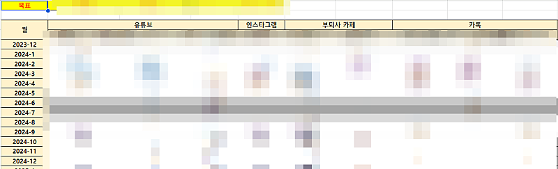
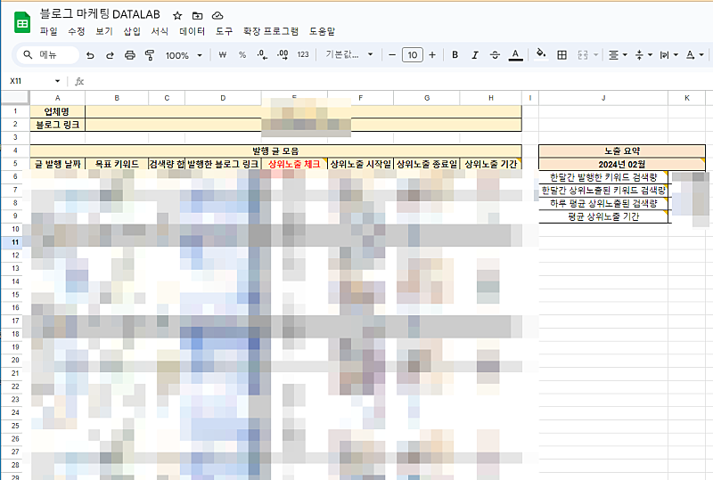
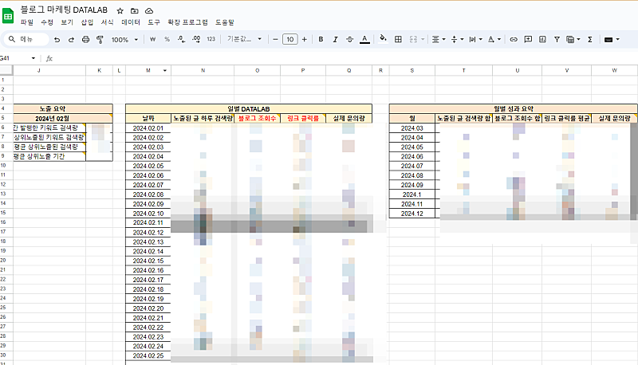
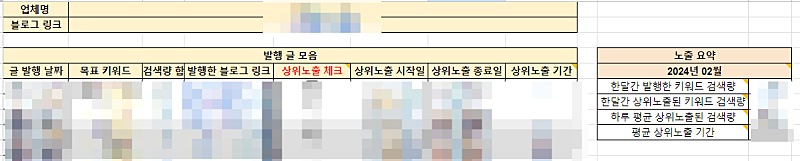

# 블로그 마케팅 부업, 내 수입을 예측할 수 있는 방법

- 원천 ID: EPR-CAFE-23049
- 작성자: 주는사란
- 작성일: 2024-03-28T12:07:08.760000+09:00
- 원문: https://cafe.naver.com/ranschool/23049
- 수집일: 2026-09-21
- 텍스트 정리: HTML 문단 순서 유지, 빈 문단·제로폭 공백만 제거. 원본 HTML·JSON 별도 보존. 이미지는 아래에 모아 보관하며 원래 배치는 HTML에서 확인.

## 원문 본문

<!-- P001 -->
마케팅 대행을 맡기 전까지의 걱정은 "영업을 어떻게 하지?" 인데요. 마케팅 대행을 맡는 순간 걱정이 이렇게 바뀝니다.

<!-- P002 -->
내가 이 업체를 책임질 수 있나?

<!-- P003 -->
너무 맡고 싶었지만 막상 맡게 되면 불현듯 걱정이 올라오거든요.

<!-- P004 -->
회사에 취직을 했습니다. 약속한 날짜에 출근을 했어요. 그리곤 월급날이 되었습니다. 월급은 들어올겁니다. 근데 만약 여러분이 계속 지각하거나 마음대로 출근을 안했습니다. 그럼 당연히 월급은 못받겠죠.

<!-- P005 -->
마케팅대행사도 똑같습니다. 내가 마케팅 하는 가게 매출을 올리면 됩니다. 그럼 나도 돈을 벌겁니다. 회사에 출근을 했으니까요.

<!-- P006 -->
여기서 또 다른 문제가 발생합니다. 내가 마케팅하고 있는 가게 매출이 오를지 안 오를지 '미리' 알수가 없다는거죠. 마케팅을 하고 매출은 나중에 알게 되니까요. 당연히 매출이 오를줄 알았는데 떨어지면 낭패인데요. 이게 바로 망하는 마케팅대행사가 하는 말입니다.

<!-- P007 -->
마케팅을 잘한다는건 마케팅 하고 있는 상품과 서비스가 '필요한 사람에게만' 갈 수 있도록 하는 것입니다. 원래 그 사람은 내 상품이 필요했고, '마침' 내 가게가 보인것 입니다. 내가 아무리 설득해도 필요 없는 물건을 사게 할 순 없습니다. 그런 물건을 사게 하려면 책임감을 같이 팔아야 합니다. 그리고 책임을 못지면 사기죠. 그래서 매출을 올리려면, 마케팅을 잘하려면, 내 상품이나 서비스를 필요로 하는 사람을 가능한 많이 찾는 것이 중요합니다. 그게 끝입니다.

<!-- P008 -->
위 모든 문제를 해결할 수 있는 한가지 방법이 있습니다. 매출이 얼마 나올지 미리 예측할 수 있구요. 내 상품이 필요한 사람에게 가고 있는지 알 수 있습니다.

<!-- P009 -->
바로 이렇게요.

<!-- P010 -->
부퇴사 DATALAB입니다.

<!-- P011 -->
저는 지금 온라인 / 오프라인 강의를 판매하고 있습니다. 그리고 주는사란 유튜브와 인스타그램 그리고 지금 이 부퇴사 카페를 운영하고 있죠. 매일 카페 매니저님에게 유튜브 조회수와 인스타그램 조회수 카페 가입자수 문의량을 적어달라고 말씀드립니다.

<!-- P012 -->
왜냐면 저는 제 강의가 필요한 분에게만 가길 원하거든요. 제가 도움을 드릴 수 있는 분만 듣길 원하거든요. 제가 가치 있다고 생각하는 것들의 가치를 아는 분만 듣기 원하거든요. 그래야 진짜 가치가 생기니까요.

<!-- P013 -->
저는 요즘 유튜브를 업로드 하지 않고 있습니다. 강의가 더 팔리지 않도록 하기 위함입니다. 필요한 분에게만 가려면 조절이 필요하다고 생각했습니다. 그리고 좀더 도움을 드리기 위해 블로그 강의를 리뉴얼하고 있습니다. 1년동안 4번째네요ㅠㅠ 힘들어요ㅠㅠ 물론 지금 강의도 부족하다고 생각하진 않습니다. 그래도 더더더 쉽게 알려드릴 수 있다는 자신이 있습니다. 그래서 또 수정하고 싶었어요.

<!-- P014 -->
강의를 시작한지 1년이 되었습니다. 이제 최소한의 데이터를 갖게 되었습니다. 진짜 너무 재밌어요. 데이터가 쌓일 때마다, 데이터가 맞아 떨어질 때마다 희열감이 미쳤습니다 ㅎㅎㅎㅎ 행복해요.

<!-- P015 -->
제가 작년에 마케팅대행창업반을 했었습니다. 계속 강조했던 것 중 하나인데요. 데이터를 모아야 합니다.

<!-- P016 -->
8월 12일에 시작해서 4개월간 부업스파르타반 1기, 2기, 어제 끝난 마케팅대행창업반까지 총 31명과 함께 보냈습니다. "아예 내가 부업하는 모든 과정을 도와줘볼까?...

<!-- P017 -->
cafe.naver.com

<!-- P018 -->
데이터를 모으면 "당장 다음달에 수입이 끊기면 어쩌죠?" 라는 질문을 하지 않을수 있습니다. 불안하지 않을 수 있습니다. 이 데이터가 쌓이면 언제든 쉴수 있고 언제든 다시 일할 수가 있습니다. 물론 코로나 같은 큰 변수만 아니라면요. 데이터만 믿을 순 없지만, 데이터로 다음 계획 정도는 할 수 있습니다. 저는 이 데이터랩의 완성도가 곧 마케터의 역량이라 생각합니다. 그리고 자영업을 데이터랩 없이 한다는건 도박이랑 똑같다고 생각하구요.

<!-- P019 -->
TMI일 수도 있지만, 저는 나중에 자영업을 다시 해볼 생각입니다. 그게 어떤 업종일지 후보군 몇개 정도만 있는 상태지만요. 사실 처음 주는사란을 시작한건 내가 뭘 하든 함께할 팀원을 구하기 위함이었었거든요. 곧 다시 팀원도 구해야 할것 같습니다. 지금은 데이터를 조절하는 단계지만, 데이터를 회복하면 팀원이 더 필요하거든요.

<!-- P020 -->
다시 돌아와서 그럼 이제 모아야하는 데이터를 말씀드릴게요. 거의 대부분은 블로그 마케팅을 하실테니 블로그 마케팅 데이터를 말씀드리겠습니다. 사실 이것만 쌓이면 나중에는 굳이 사장님께 물어보지 않아도 "이번달에 매출 이정도 나오셨죠?" 라고 역으로 질문하실수 있는 수준이 될 수 있습니다. 저도 나중에 자영업을 한다면 돈 말고 이 데이터랩을 쌓아서 자랑하고 싶어요 ㅎㅎㅎ이런게 너무 좋그든요 ㅎㅎㅎ

<!-- P021 -->
자꾸 딴 이야기를 하네요. 이걸 알려드릴 생각에 너무 신나서 그런가봐요. 양해부탁드립니다. 여튼 블로그 마케팅에서 모아야 하는 데이터는 이렇습니다.

<!-- P022 -->
이걸 일일히 확인해서 넣어야 합니다. 제가 마케팅대행창업반에서 했던 내용인데요. 다들 쌓고 계신지 모르겠네요. 최근 시트를 새로 만들었습니다.

<!-- P023 -->
이 데이터의 목적은 '한달에 노출된 키워드의 검색량이 몇 정도 됐을 때, 내 블로그 글 조회수가 몇이고, 이때 문의량이 몇건 온다' 이 평균치를 알기 위함입니다. 사진에서 '월별 성과 요약' 이게 핵심이죠. 이래야 월 매출을 올리기 위해서는 키워드 검색량 얼마정도를 더 올려야 한다 라는 예상을 할 수 있거든요. 그래야 내가 돈을 얼마나 더 벌수 있는지도 알 수 있구요.

<!-- P024 -->
몇달만 데이터를 쌓으면 정확도가 굉장히 올라갑니다. 블로그 지수가 올라가면 문의 비율은 훨씬 올라가구요. 이게 유튜브는 손으로 해도 할 수 있도록 편하게 되어있어서 저희 매니저님이 해주시는데요. 블로그는 너무 불친절합니다. 하나하나 검색해서 상위노출 됐는지 확인해야 합니다. 그래서 프로그램으로 만드려고 하는데 비용이 너무 비싸네요. 그래서 지금 고민중입니다. 이걸 만들어서 같이 비용을 내고 쓰실분이 얼마나 될지도 확인해 봐야하구요.

<!-- P025 -->
만약 자영업을 하는 분이라면 이걸 블로그 마케팅 뿐 아니라 모든 마케팅의 데이터를 가지고 있어야 합니다. 제 부퇴사 DATALAB처럼요. 그래야 내 상품과 서비스가 '필요한 사람'에게만 가구요. 그래야 마케팅 비용 낭비없이 매출을 올릴 수 있습니다.

<!-- P026 -->
마케팅 대행을 하는 분이라면 저 데이터가 있어야 사장님께 당당하게 마케팅대행료를 올려달라고 할 수 있구요. 저게 있으면 내가 잘 마케팅을 해서 문의는 많이 왔는데 사장님이 상담을 못해서 매출이 안오른건지 누가 문제인지를 알수 있습니다. 너무 좋지 않나요? ㅎㅎㅎㅎㅎㅎ

<!-- P027 -->
제가 만약 자영업을 한다면 초반 3개월간 DATALAB을 집중해서 모을 것 같습니다. 저 DATALAB은 하는 마케팅마다, 업체마다 바꿀수 있습니다.

<!-- P028 -->
이 DATALAB에 대해서는 마케팅대행창업반 말고는 따로 언급하진 않았었는데요. 왜냐면 저도 저정도 구축한지 얼마 안됐거든요. 초보단계를 넘어선 진짜 저 데이터를 얻을 수 있는 분들과 같이 해보려고 합니다. 저와 이런 마케팅 이야기를 정기적으로 하는 모임 이런거요. 본인 사업체건 아니면 마케팅 대행을 하는 업체건 상관없이요. 참 아이디어는 많아서 하고 싶은 건 많은데.....일단 블로그 강의 수정부터 하러 가야겠습니다. ㅎㅎㅎ

<!-- P029 -->
일단 지금 이 글을 보신 분들은 저 말이 다 무슨 말인지 몰라도 괜찮으니 저 중에서 이해가 되는걸 하나하나 손으로 해보시면 좋을것 같습니다. 이정도는 손으로 해보실 수 있을거예요.

## 본문 이미지

## 원문에 포함된 링크

- #
- https://cafe.naver.com/ranschool/15370
