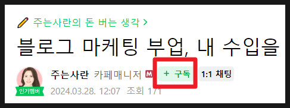

# '주는사란의 돈 버는 생각' 정주행 시리즈 (ver 24.03)

- 원천 ID: EPR-CAFE-23134
- 작성자: 주는사란
- 작성일: 2024-03-30T13:13:26.060000+09:00
- 원문: https://cafe.naver.com/ranschool/23134
- 수집일: 2026-09-21
- 텍스트 정리: HTML 문단 순서 유지, 빈 문단·제로폭 공백만 제거. 원본 HTML·JSON 별도 보존. 이미지는 아래에 모아 보관하며 원래 배치는 HTML에서 확인.

## 원문 본문

<!-- P001 -->
주는사란과 부퇴사 카페를 시작한지 20개월이 되었습니다. 오랜만에 제가 이 카페에 쓴 예전 영상과 글을 읽어봤습니다. 다시 읽기 거북합니다.

<!-- P002 -->
20개월전, 솔직히 스스로 꽤나 잘나가는 사람이라고 생각했습니다. 그리고 자랑하고 싶었습니다. 내가 이만큼 하고 있다고, 나처럼 살라고 말하고 싶었습니다. 유튜브에서는 "돈보다 사람이더라"라고 말했지만 사람보다 돈을 위해 살고 있었습니다. 돈을 많이 벌고, 자랑하는 삶이 '잘 사는 삶'이라고 생각했습니다. 자랑할 것이 얼마 안되는 돈과 가진 것정도라고 생각했습니다.

<!-- P003 -->
10년간 학원, 부동산, 이자카야등 여러 일을 했습니다. 고생을 많이 했습니다. 그래서 그 고생을 인정받고 싶었습니다. 어린나이에 대단하다는 이야기를 들었습니다. 그래서 더 빨리 돈을 벌고 싶었습니다. 더 대단하고 싶었거든요. 대단하지 않은 나 자신을 인정하기 싫었던 것 같습니다.

<!-- P004 -->
잘 살기 위해서, 대단해지기 위해서는 버튼만 누르면 되는 줄 알았습니다. 방에 불이 켜지기 위해서는 그 전에 전봇대부터 전선을 끌어와 버튼까지 연결해야한다는 걸 몰랐습니다. 그냥 누군가 전선을 연결해 놓은 버튼을 누르기만 하면 불이 켜지는 줄 알았습니다. 매일 수업을 했지만, 열심히 하진 않았습니다. 아이들 성적을 올려줄 수 있는 더 많은 방법이 생각났지만 수업시간이 끝나면 귀찮았습니다. 매일 가게에 가서 청소를 하고 재료준비를 했지만, 오꼬노미야끼를 좋아하진 않았습니다. 족발과 보쌈 냄새가 역했습니다.

<!-- P005 -->
20개월간 많은 분들이 사랑을 주셨습니다. 사랑을 받으면서, 저는 다르게 살고 싶다는 생각이 들었습니다. 제 팀원을 만들고 싶어졌습니다. 저와 일 자체를 함께할 팀원뿐 아니라 더 넓은 범위에서 방향성을 나눌 팀원을요. 제가 성장하는 만큼 저와 함께하는 분도 성장하길 바라게 되었습니다.

<!-- P006 -->
사랑에 보답하고 싶다는 생각이 들었습니다. 받은 사랑에 비하면 부족하지만, 저는 제 성공과 실패를 모두 보여드리고 싶다는 생각이 들었습니다. 제 실패로 위안을 받으셨으면 좋겠습니다. 제 성공으로 희망을 보셨으면 좋겠습니다. 아래 글은 제 성공과 실패 목록입니다. 아래 글들이 여러분의 희망과 위안이 되길 바랍니다.

<!-- P007 -->
저도 제 글을 다시 보며 항상 마음을 다 잡으며 살아가겠습니다. 혹시나 제 글이 희망과 위안이 되었다면 자주 제 글을 봐주시면 감사하겠습니다.

<!-- P008 -->
제가 드릴 수 있는 것

<!-- P009 -->
마케팅 부업 시작하려는 분들께

<!-- P010 -->
블로그 마케팅 부업으로 수익 예측하는 법

<!-- P011 -->
블로그가 싫어졌다는건

<!-- P012 -->
블로그 연습, 돈 받으면서 하는 법

<!-- P013 -->
저는 진짜 목표를 이뤄볼 생각입니다.

<!-- P014 -->
주는사란이 직접 보여주는 마케팅

<!-- P015 -->
마케팅 부업으로 10만원 벌고 있는 사람의 실체

<!-- P016 -->
마케팅 부업으로 월 500넘으려면 해야하는 아침루틴

<!-- P017 -->
강의 10년차가 말하는, 결국 수익 내는 사람들의 특징

<!-- P018 -->
부업을 실패하는 사람들이 하는 부업

<!-- P019 -->
하루에 부자는 XX명씩 늘고 있다.

<!-- P020 -->
실행하면서 힘들 때

<!-- P021 -->
많이 하기 VS 오래하기

<!-- P022 -->
영업을 많이 해도 계약이 안될 때

<!-- P023 -->
전 재산을 투자해서라도 사고 싶은 것

<!-- P024 -->
의지력이 안 올라올 때

<!-- P025 -->
중수에서 고수로 올라가는 법

<!-- P026 -->
3시간 만에 마케팅 대행 계약 따내는 법

<!-- P027 -->
부업 성공 확률 높이는 법

<!-- P028 -->
해야지 병에 걸린 분들에게

<!-- P029 -->
성과가 잘 안나올 때 계산해 보세요

<!-- P030 -->
주는사란의 돈 버는 생각

<!-- P031 -->
내가 만약 파티룸을 한다면

<!-- P032 -->
내가 만약 PT트레이너를 한다면

<!-- P033 -->
글쓰기로 돈 벌수 있는 아이템 (블로그 아님)

<!-- P034 -->
10년차 사업가가 학교앞에서 달고나를 판다면?

<!-- P035 -->
주는사란의 진짜 생각

<!-- P036 -->
정신 차린 뒤로 쓴 생각

<!-- P037 -->
제겐 꿈이 있습니다.

<!-- P038 -->
최근에 가장 행복했던 일 3가지

<!-- P039 -->
아무도 보지 않았으면 하는 글

<!-- P040 -->
목표를 이루기 전에 알았으면 좋았을 것들

<!-- P041 -->
내가 부자가 될 확률 계산해 보는 법

<!-- P042 -->
부퇴사 카페 분위기

<!-- P043 -->
성인되면 친구 만들기 힘든 이유

<!-- P044 -->
내 강의에 대해 내가 쓰는 후기

<!-- P045 -->
부업스파르타반, 중도포기자 발생

<!-- P046 -->
+구독 버튼을 누르면 빠르게 제 글을 보실수 있습니다

## 본문 이미지

## 원문에 포함된 링크

- https://cafe.naver.com/ranschool/23049
- https://cafe.naver.com/ranschool/22182
- https://cafe.naver.com/ranschool/21947
- https://cafe.naver.com/ranschool/17677
- https://cafe.naver.com/ranschool/20383
- https://cafe.naver.com/ranschool/20234
- https://cafe.naver.com/ranschool/20038
- https://cafe.naver.com/ranschool/19541
- https://cafe.naver.com/ranschool/17927
- https://cafe.naver.com/ranschool/18037
- https://cafe.naver.com/ranschool/14748
- https://cafe.naver.com/ranschool/22100
- https://cafe.naver.com/ranschool/18961
- https://cafe.naver.com/ranschool/17492
- https://cafe.naver.com/ranschool/17205
- https://cafe.naver.com/ranschool/12849
- https://cafe.naver.com/ranschool/12285
- https://cafe.naver.com/ranschool/12148
- https://cafe.naver.com/ranschool/4447
- https://cafe.naver.com/ranschool/21522
- https://cafe.naver.com/ranschool/18672
- https://cafe.naver.com/ranschool/20705
- https://cafe.naver.com/ranschool/4860
- https://cafe.naver.com/ranschool/23019
- https://cafe.naver.com/ranschool/22770
- https://cafe.naver.com/ranschool/19672
- https://cafe.naver.com/ranschool/18743
- https://cafe.naver.com/ranschool/6360
- https://cafe.naver.com/ranschool/16109
- https://cafe.naver.com/ranschool/21444
- https://cafe.naver.com/ranschool/9911
- #
