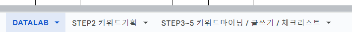
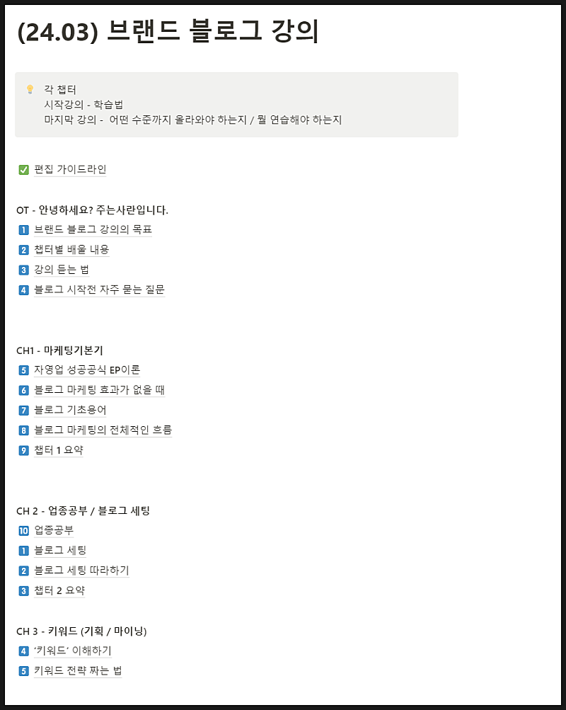

# 블로그 강의 개편 안내

- 원천 ID: EPR-CAFE-23336
- 작성자: 주는사란
- 작성일: 2024-04-03T16:45:02.787000+09:00
- 원문: https://cafe.naver.com/ranschool/23336
- 수집일: 2026-09-21
- 텍스트 정리: HTML 문단 순서 유지, 빈 문단·제로폭 공백만 제거. 원본 HTML·JSON 별도 보존. 이미지는 아래에 모아 보관하며 원래 배치는 HTML에서 확인.

## 원문 본문

<!-- P001 -->
블로그 강의를 싹 바꾸고 있어요. 그냥 아예 하나하나 따라할 수 있는 순서별로 업무 시트지까지 만들었어요.

<!-- P002 -->
이걸 좀더 빨리 할 수 있도록 프로그램도 제작중이예요. 프로그램은 제작하는데 좀 오래 걸릴 것 같지만요. 저 시트 하나면 키워드 찾기 => 글쓰기 => 보고서 작성까지 모두 다 해결할 수 있도록 만들고 있습니다. 위 시트로 블로그 마케팅 대행 주입식 연습 과정인 '블로그 그룹 PT' 도 5월중으로 오픈할 예정이예요.

<!-- P003 -->
블로그 강의 개편은 이제 반정도 완료 됐어요. 진짜 죽을것 같아요. 강의 시간도 거의 1.5배 정도는 늘것 같아요. 추가할게 생각이 너무 많이 나요ㅠㅠ

<!-- P004 -->
편집 완료되는대로 기존 강의 영상에서 수정해 놓을 예정입니다. 수정이 완료되면 수강생분들에게는 안내 카톡드리겠습니다 :)

## 본문 이미지

## 원문에 포함된 링크

- #
