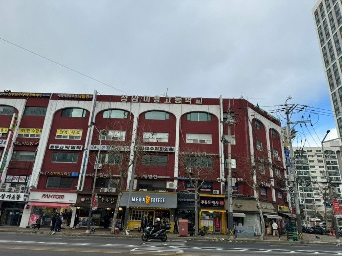
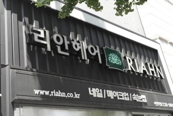

# 내가 존경하는 멍청이 (1탄)

- 원천 ID: EPR-CAFE-23356
- 작성자: 주는사란
- 작성일: 2024-04-03T23:17:33.457000+09:00
- 원문: https://cafe.naver.com/ranschool/23356
- 수집일: 2026-09-21
- 텍스트 정리: HTML 문단 순서 유지, 빈 문단·제로폭 공백만 제거. 원본 HTML·JSON 별도 보존. 이미지는 아래에 모아 보관하며 원래 배치는 HTML에서 확인.

## 원문 본문

<!-- P001 -->
제 여동생은 학생 때 소위 날라리(?)였어요. 어디서 주웠는지 오토바이 타고 다니다가 걸려서 엄마가 학교에 불려갔구요. 가출도 한두번이지 친구집 돌아나니니깐 친구 엄마가 화나셔서 제발 애 좀 데려가라고 새벽에 전화도 받았습니다. 뭐 더이상 말하기엔 동생 혼사에 문제가 생길수도 있으니 그만하게 이야기 하겠습니다.

<!-- P002 -->
제겐 여동생 말고 남동생도 있습니다. 여동생만 사고치면 다행인데 남동생도 사고를 매일 쳤어요. 그래서 덕분에(?) 저는 사고칠 마음이 안 들었어요. 매일 우는 엄마를 달래주기 바빴거든요. 그리곤 "절대 나는 아이를 낳지 않으리라!!" 다짐한 날이 많았죠.

<!-- P003 -->
그렇게  참 사고를 많이 친 여동생이 고등학교에 입학하게 됐어요. 엄마 아빠가 학군 때문에 좁은 집에서 10년넘게 버텨왔건만, 그걸 여동생은 아는지 모르는지 근처에 좋다는 고등학교는 내팽겨치고 자기 맘대로 노량진에 있는 2년제 정암미용고 라는 곳을 지원해버렸어요.

<!-- P004 -->
그날 집안 분위기를 생각하면 정말 끔찍하네요. 아빠는 "고등학교가 3년인데 2년제가 학교냐며" 난리를 치고 엄마는 "제발 이러지 말라고" 울고, 남동생은 "니가 그렇지 뭐" (참고로 남동생이 더 어림) 라며 한숨을 쉬고, 저는 우는 엄마를 달래면서 아빠를 말리느라 힘들었어요.

<!-- P005 -->
저는 진짜 동생편을 들어주고 싶어서 학교를 검색해봤는데요. 이렇게 나왔어요.

<!-- P006 -->
왠 상가 건물 위에 있는거예요. 기겁했죠. 진짜 동생이 이제 끝판왕을 달리는구나 생각했어요. 이게 진짜 학교가 맞는지 교육청에 전화해볼 정도였으니까요.

<!-- P007 -->
다행히도 그 학교는 동생에게 도움이 많이 됐어요. 최악이라 생각했는데, 동생 말로는 그 학교가 자기를 살렸데요. 자기도 우리 지역에서 날라리였는데, 가니깐 더 (?) 날라리가 많아서 친해질 수가 없다나 뭐라나. 그러면서 이렇게 살면 안되겠다고 생각했다네요. 참 고맙다고 해야할지ㅋㅋㅋㅋ

<!-- P008 -->
여동생은 2년제 미용고를 다행히도 무사히 졸업하고, 동네에 나름 큰 ‘리안헤어’라는 프랜차이즈 미용실에 취직을 했어요. 제 동생 말에 의하면 그 사장님은 돈에 미친 사람이었어요. 주 6일 하루 12시간(오전 9시부터 오후 9시) 스탭으로 근무하는데 월급 150만원을 받았습니다. "미용 알려줄게" 라는 달콤한 말로요.

<!-- P009 -->
미용업계에서 초반에 배울때 다 이런식인 것 같습니다. 그때도 지금도 저 시간을 일 시키는 것 자체가 불법이고, 최저시급으로 해도 200이 넘었는데 어린 아이들이다보니 신고하는 사람 한명 없었죠. 지금도 여전히 그렇게 하고 있다고 하네요ㅠㅠ

<!-- P010 -->
사장만 그랬으면 다행인데, 그곳 미용실 선생님들은 더 했어요. 스탭을 시종부리듯 부려서 매일 끝나고도 청소하느라 집 오면 12시였죠. 동생은 매일 울며 그만두고 싶다고 했어요. 실제로 그 미용실 스탭은 2개월 이상 다니는 사람이 제 동생밖에 없었어요. 그렇게 1년을 버텼죠.

<!-- P011 -->
미용실에서 1년을 다녀보더니 도저히 이렇게 인생은 못살겠다며 갑자기 대학을 가겠다고 하더라구요. 그렇게 하라고 할 때는 안하더니....그때는 제가 이제 막 수학과외를 할 때라 제가 수학을 가르쳤었는데요. 정말 놀랐어요. 너무 바...... ㅂ....;;;;; 진짜 가르치기 너무 힘들었어요. 이건 수능이고 뭐고 답이 없었어요. 엄청 싸웠죠. 역시 가족은 가르치면 안 되는 것 같아요.

<!-- P012 -->
제가 처음에 수능을 볼거면 하루 15시간씩 해도 될까 말까라고 얘기했거든요. 근데 동생이 그게 미용보다는 낫데요. 그러더니 진짜 10개월을 그렇게 했어요. 그때 알았죠. 얘가 진짜 의지력 하나는 미친애구나. 그렇게 공부해서 수능을 봤습니다.

<!-- P013 -->
성적이... (2탄에서)

<!-- P014 -->
대한민국 모임의 시작, 네이버 카페

<!-- P015 -->
cafe.naver.com

## 본문 이미지

## 원문에 포함된 링크

- #
- https://cafe.naver.com/ranschool/23406?tc=shared_link
