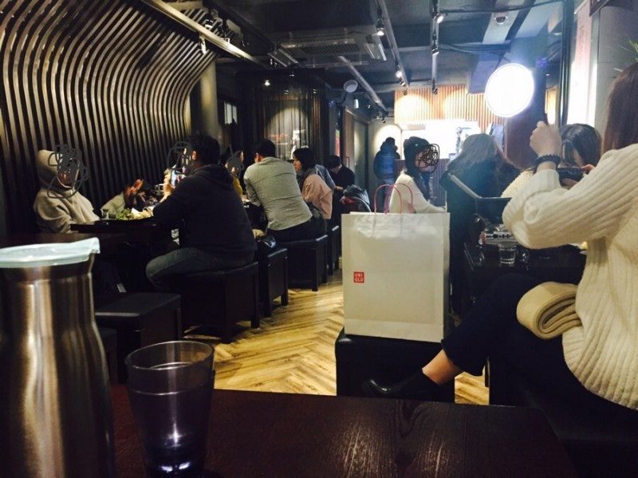
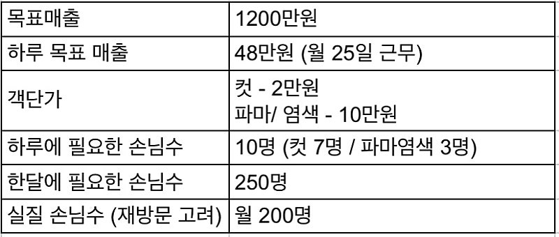
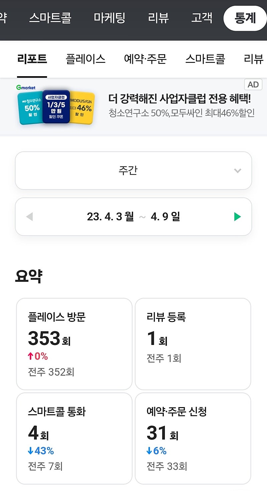
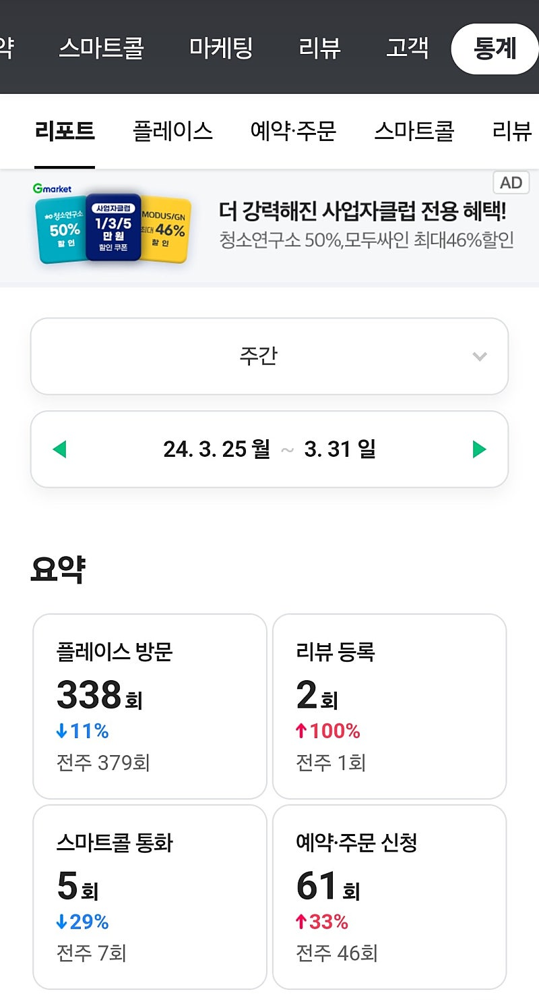
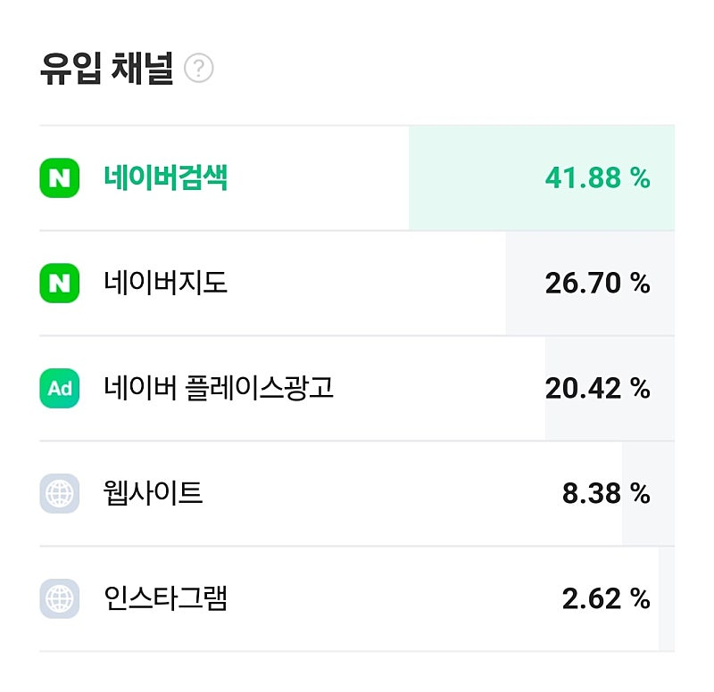
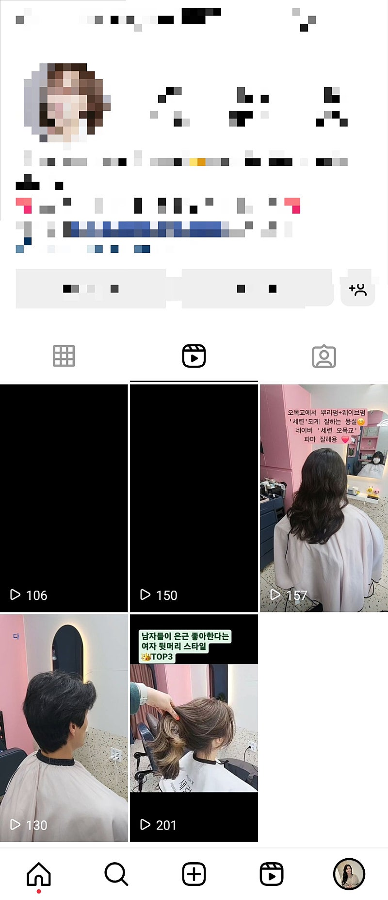
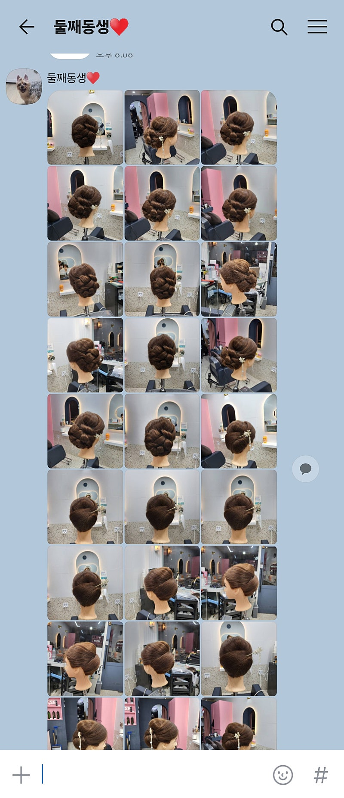

# 내가 존경하는 멍청이 (2탄)

- 원천 ID: EPR-CAFE-23406
- 작성자: 주는사란
- 작성일: 2024-04-04T23:46:15.263000+09:00
- 원문: https://cafe.naver.com/ranschool/23406
- 수집일: 2026-09-21
- 텍스트 정리: HTML 문단 순서 유지, 빈 문단·제로폭 공백만 제거. 원본 HTML·JSON 별도 보존. 이미지는 아래에 모아 보관하며 원래 배치는 HTML에서 확인.

## 원문 본문

<!-- P001 -->
대한민국 모임의 시작, 네이버 카페

<!-- P002 -->
cafe.naver.com

<!-- P003 -->
동생은 태어나서 공부를 한 적이 없었지만,

<!-- P004 -->
1년간 하루 15시간씩 공부를 했어요.

<!-- P005 -->
결국 성적이 잘 나와서 원하는 대학에 합격했죠

<!-- P006 -->
드라마라면 이렇게 말했을거예요. 현실은 아니더라구요 ㅋㅋㅋㅋㅋㅋ현실은 5등급대였어요. 인서울 대학을 가기에는 성적이 한참 모자랐죠. 그나마 영어는 3등급을 받았다는게 나름의 노력의 성과랄까요?  안타깝지만 회복이 불가했어요......태어나서 한번도 해보지 않은 공부를 1년간 한 후 동생은 이렇게 말하더라구요.

<!-- P007 -->
"언니 역시 나는 미용인이야"

<!-- P008 -->
ㅋㅋㅋㅋㅋㅋㅋㅋㅋㅋㅋㅋㅋㅋㅋㅋㅋㅋㅋㅋㅋㅋㅋㅋㅋㅋㅋㅋㅋㅋㅋㅋㅋㅋㅋㅋㅋㅋㅋㅋㅋㅋㅋㅋㅋㅋㅋㅋㅋㅋㅋㅋㅋㅋㅋㅋㅋㅋㅋㅋㅋㅋㅋㅋㅋㅋㅋㅋㅋㅋㅋㅋㅋㅋㅋ

<!-- P009 -->
그렇게 여동생은 다시 그 돈에 미친 미용실에 들어가서 2년을 더 했어요. 지금 생각해보면 굳이 그 미용실을 갈 필요가 없는데 1년간 거기서 버틴 그 경력을 버리기가 아까웠나봐요. 다시 돌아가서도 매일 울었지만 미용을 안하겠다는 이야기는 한번도 안했어요. 그렇게 2년째 결국 ‘디자이너’ (손님을 받을 수 있는 수준) 까지 왔죠. 그뒤로 몇몇 미용실들을 거쳐 마지막에는 마포구에 한 미용실에 있었는데요. 그 미용실에서 매출 1위를 찍었어요.

<!-- P010 -->
그 말을 듣고 저는 지금 차려야 한다고 생각했어요. 저도 동생에게 계속 머리를 했지만 실력은 충분했어요. 미용실에 더 있는다고 실력이 늘어나는 것도 아니었고 마포구에서 차릴 것도 아닌데 더 지체할 이유가 없었죠. 저는 차라리 본인 가게를 일찍 차려서 단골층을 만들어 놓는게 유리하다고 생각했어요. 무엇보다 제가 상권을 볼 줄 알고 마케팅을 할 줄 아니까요.

<!-- P011 -->
동생은 싫다고 했어요. 아직 모아둔 돈이 많지 않고, 좀더 자리를 잡은 뒤에 차린다구요. 그래서 제가 "돈은 내가 낼테니깐 해" 라고 했죠. 다시 생각해봐도 좀 제가 멋졌어요 ㅋㅋㅋㅋㅋㅋㅋㅋㅋㅋㅋㅋㅋㅋㅋ

<!-- P012 -->
동생 미용실의 위치부터 간판, 인테리어 모든 과정을 제가 반셀프로 다 했어요. 왜냐면 제 돈이 들어갔으니까요ㅋㅋㅋㅋ오히려 동생은 본인 미용실 인테리어 할 때 제주도 여행을 갔어요. 제가 가라고 했거든요. 어짜피 의견이 안 맞아서 있어도 싸우거든요. 제 돈 회수.... 해야되잖아요. 덕분에 그 당시 간판을 알아보면서 느꼈던 경험이 유튜브에 찍었던 0원에서 300만원 30일 챌린지가 됐던거예요. 제게도 좋은 경험이었죠.

<!-- P013 -->
동생 미용실을 창업하면서 놀랐던게 있어요. 원래 동생은 마포구에서 미용실에서 일했는데요. 제 여동생이 미용실을 차린 곳은 양천구예요. 차로 30분 거리 정도인데 고객중 30%가 동생 미용실로 찾아왔다는 거예요. 그만큼 동생 실력이나 응대가 마음에 들었다는 소리겠죠.

<!-- P014 -->
다행히도 미용실은 차리자마자 첫달부터 매출이 잘 나왔어요. 2가지 이유가 있었던것 같은데요. 첫번째는 자리가 좋아서 오픈빨이 꽤 좋았어요. 제가 그 지역에서 부동산을 했어서 장사 잘되는 자리가 나올 때까지 기다렸거든요. 자리 구할때도 진짜 많이 싸웠어요......저는 제 돈이 들어가니, 제가 딱 찝어놓은 그 자리 아니면 들어가지 말자는 주의였어요. 근데 동생은 그 자리가 권리금이 비싸서 들어가기 싫다고 난리었죠. 동생 설득하랴 자리 알아보랴 정신 없었습니다.

<!-- P015 -->
두번째는 마포구에서 넘어온 고객도 있었어요. 그렇게 두가지 덕분에 첫번째 고비인 창업 첫달을 무사히 마쳤어요.

<!-- P016 -->
첫달에 매출이 잘 나온건 다행이었지만, 저는 두번째 고비가 기다린다는걸 알고 있었어요. 제가 이자카야 할때도 세번째 달까지는 줄 설 정도로 사람이 많았어요. 그래서 이 ‘오픈빨’이라는 녀석한테 제대로 속았죠. 그때는 이 장사가 영원할 거라 생각했어요. 근데 그때 재방문을 못 만들었어요. 신규 고객을 꾸준히 유입해야 된다는 필요성도 못 느꼈죠. 그냥 당연히 지나가다가 보면 들어올줄 알았어요. 위치가 나쁘지 않았거든요. 그렇게 ‘오픈빨’이라는 녀석은 3-4개월간 그렇게 친하게 굴더니 바로 절 버리고 떠났어요. 정확히 오픈하고 5개월째 되던 시점에 매출이 반토막 났거든요. 이자카야 할때만이 아니었어요. 저는 도시락집 할때 또 속았어요. 이번만큼은 안 속을 자신이 있었어요. '오픈빨' 이 ㅅㄲ를 안 믿을거거든요.

<!-- P017 -->
이자카야 했던 곳 사진

<!-- P018 -->
전 준비를 해놔야 했어요. 그래서 동생한테 신규고객이 얼마나 오는지 50만원짜리 정액권(미리 돈을 결제해 놓는 것, 다음에 또 오겠다는 의미)은 얼마나 결제하는지 매일 물어봤어요. 단골 전환 비율을 알아야 한달에 신규고객이 몇명이 더 와야할지를 계산해 놓을 수 있으니까요. 저는 자영업할 때 이걸 모르면 망한다고 생각해요. 제가 망했거든요ㅠㅠㅠㅠㅠㅠㅠㅠㅠㅠㅠㅠㅠㅠㅠㅠㅠㅠㅠㅠㅠㅠㅠㅠㅠㅠㅠㅠㅠㅠㅠㅠ 다시 생각해도 슬프네요.....하

<!-- P019 -->
첫 시작 목표는 이랬어요.

<!-- P020 -->
마케팅을 미친듯이 하기 시작했어요. 어차피 제 돈이었기 때문에 ㅋㅋㅋㅋ 한달에 약 50만원씩 광고비를 태웠죠. 아마 동네 미용실에서 월 50만원씩 광고 하는 곳은 없었을거예요. 제가 공격적으로 하다보니 빠르게 데이터가 쌓였어요.

<!-- P021 -->
마케팅은 여러방법을 썼는데, 모든 마케팅을 다 네이버 플레이스로 랜딩 시켰어요. 인스타건 네이버 플레이스건 당근이건 블로그건 모두 다 플레이스로 가서 네이버 예약을 할 수 있도록요.

<!-- P022 -->
목표매출을 채우려면 매월 200명의 손님이 필요했어요. 첫달 기준으로 평균 전환율 (플레이스 방문한 사람이 예약하는 비율) 이 10%였어요. 그럼 월 200명의 손님한테 실제 예약을 받으려면, 플레이스 주간 방문자를 최소 300명을 넘겨야 했죠.

<!-- P023 -->
일주일에 300명, 한달에 1200명이요. 왜냐면 여기서 10%가 예약한다고 하면 약 120명 정도가 실제 고객이 되는니까요. 여기에 로드손님 (지나가다가 들어오는 손님)과 정액권 손님 합치면 딱 월 200명이 되거든요.

<!-- P024 -->
동생이 지금은 오픈한지 2년이 됐는데요. 2년 내내 딱 이 목표를 유지하고 있어요.  매주 방문자수 300명 이상, 평균 전환율 10% 이상이요. 네이버 플레이스 통계가 1년치 밖에 조회가 안되서 작년꺼랑 지난달꺼를 비교해 봤어요. 심지어 지난달에는 평균 전환율이 20%가 됐네요.

<!-- P025 -->
저는 이렇게 제가 생각한대로 했는데, 맞아 떨어질때 기분이 너무 좋아요. 너무 재밌어요. 동생이 잘 되서 좋기도 하지만 목표로 한걸 이룰 때, 데이터가 맞아 떨어질 때의 희열감이 더 좋아서 계속 이 숫자를 보는 것 같아요.

<!-- P026 -->
2년을 유지했다고 안심할 때는 아니라고 생각해요. 이제 딱 먹고 살 정도 된거죠. 굶어죽지 않을 정도요. 다음 단계를 넘을 차례예요. 객단가를 올려야죠. 지난달에 여동생 미용실을 다녀간 사람만 총 236명이었어요. 잘되서 좋긴 하지만 컷트 손님이 많다보니 팔이 많이 아프다고 하더라구요.

<!-- P027 -->
객단가를 높이려면 일단 수요를 더 늘려야 한다고 했어요. 수요가 늘어야 객단가를 올려도 손님 수를 유지할 수 있으니까요. 그래서 제가 첫 영상을 만들어서 동생 인스타에 올렸어요. 나랑 똑같이 만들어서 앞으로 올리라고 했죠. 근데 또 그걸 참 열심히도 올리더라구요. 이 것도 좀 놀랐어요. 하란다고 계속 올리는 사람 잘 없거든요. 동생도 스스로 영상 편집하고 이런게 재밌었는지 꾸준히 올렸어요.

<!-- P028 -->
당연히 이제 막 만든 계정이라 조회수는 잘 안 나왔죠. 다 합쳐서 1000회도 안되는데요. 조회수도 잘 안나왔고 영상 갯수도 5개 밖에 안되는데 벌써 인스타로 플레이스 주간 방문자 수가 6명씩 늘었어요.

<!-- P029 -->
정액권은 2명이나 결제했다고 하더라구요. 너무 재밌었어요. 제 동생은 참 시키는 맛(?)이 나요.

<!-- P030 -->
이 글을 작성한 이유는 지금까지의 이야기 때문은 아니에요. 어제 동생한테 받은 사진 때문이었는데요.

<!-- P031 -->
동생은 일주일에 하루 쉬어요. 2달전인가? 제가 이제는 객단가를 높여야 한다고 말했거든요. 본인도 고민을 해봤나봐요. 그러더니 객단가를 높이겠다고 올림머리를 배우겠다고 하더라구요. 일주일에 하루 쉬는데 그날에도 ‘올림머리’를 배우러 다니고 있다는거예요. 미치지 않았나요?

<!-- P032 -->
심지어 어제 밤 8시에 카톡이 왔어요. 이렇게요.

<!-- P033 -->
아침 9시에 출근해서 저녁 8시에 끝났는데, 이제 올림머리를 연습하고 있다는거예요. 솔직히 친동생한테 이런 말 하기 싫은데 진짜 존경스럽다고 했어요.

<!-- P034 -->
제 여동생은 이런 아이예요.

<!-- P035 -->
뭐 하나를 시작하면 제대로 하는 아이예요. 참 바보 같은데….. 그래서 바보같이 열심히 해요. 제가 뭘 하라고 하면 그냥 그대로 해요. 의도는 묻지도 않고 그냥 저를 믿고 그대로 해요. 그렇다고 또 잘하진 않아요. 뭘 시작하건 항상 좀 뒤처지는 아이인데 (공부,미용포함) 본인이 잘 못한다는걸 알아서 잘 하는 척 하지 않아요. 못 하니깐 도와달라고 해요. 그렇게 도와주면 또 귀신같이 잘 따라해요. 그래서 어찌저찌 평균 이상 하는 아이예요.

<!-- P036 -->
동생 미용실을 지나가다가 볼 때가 있어요. 그럴때면 너무 고생하는 것 같아 참 마음이 아파요. 근데 그 모습을 보면 저도 다시 다짐하게 돼요. 나도 저렇게 열심히 살아야겠다구요. 그래서 가끔은 전 일부러 여동생 미용실을 지나쳐요. 다시 열심히 살기 위해서요. 제 여동생은 제가 존경하는 멍청이이자 제 선생님 같은 존재예요. 물론 본인 바쁘다고 제 머리를 대충 해줄 때는 짜증나긴 하지만요 ㅎ

<!-- P037 -->
살면서 주위에 이런 사람은 꼭 필요한 것 같아요. 혹시 이 글을 읽는 분에게 그런 존재가 없으시다면 제가 해드릴게요. 제가 또 그런거 전문이그든요 ㅎㅎㅎㅎㅎㅎㅎ

<!-- P038 -->
끝

## 본문 이미지

## 원문에 포함된 링크

- https://cafe.naver.com/ranschool/23356?tc=shared_link
- #

## 원본 HTML에 포함된 외부 게시물 메타데이터

외부 게시물의 현재 본문을 재수집한 것이 아니라, 카페 게시 당시 함께 저장된 제목·설명이다. 잘린 문구는 보완하지 않았다.

- 원문 링크: https://youtu.be/j0wbcJDczWI

0원에서 300만원 챌린지 1편 (부업스파르타반)

▼ (하루 50권 무료) 블로그, 지도 부업 입문서 & 5일 체험강의 ▼https://bit.ly/3HzAk8P위와 같이 해보는 강의는 1년에 한번 '부업스파르타반'이라는 이름으로 오픈됩니다. 강의 오픈시 부퇴사 카페를 통해 안내 드리고 있으며, 위 입문서 링크를 클릭하시면 카페 ...

