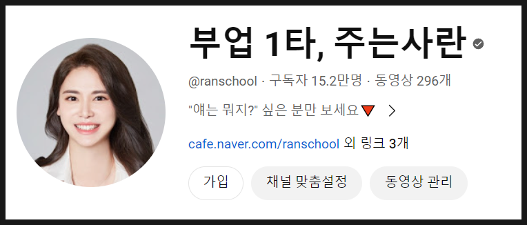
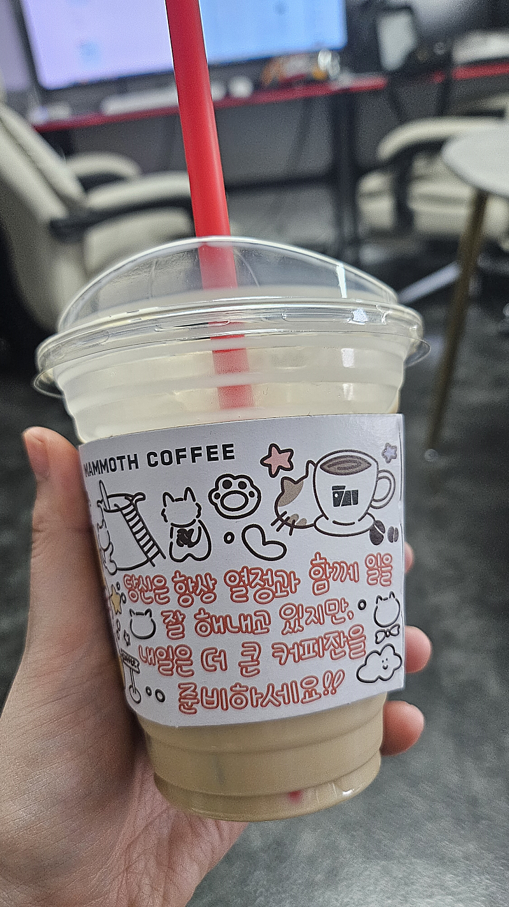
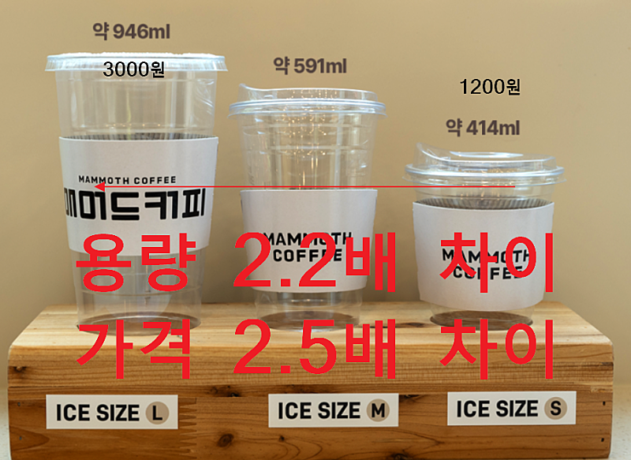

# 설득하는 글쓰기, 후킹하려다가 훅 가는 경우

- 원천 ID: EPR-CAFE-23424
- 작성자: 주는사란
- 작성일: 2024-04-05T16:41:00.957000+09:00
- 원문: https://cafe.naver.com/ranschool/23424
- 수집일: 2026-09-21
- 텍스트 정리: HTML 문단 순서 유지, 빈 문단·제로폭 공백만 제거. 원본 HTML·JSON 별도 보존. 이미지는 아래에 모아 보관하며 원래 배치는 HTML에서 확인.

## 원문 본문

<!-- P001 -->
가끔 글이나 영상을 보면 후킹하기 위해 선을 넘는 경우가 있다. 바로 과거의 나다. 그래서 이전에도 말했듯 나는 내 과거의 영상을 보기가 거북하기도 하다.

<!-- P002 -->
그런 영상들은 모두 비공개했다. 현재 내 채널에 영상이 본영상과 쇼츠 합쳐서 296개 업로드 되어있다고 나온다.

<!-- P003 -->
하지만 실제로 업로드했던 영상은 쇼츠 310개 본영상 110개 총 420개 영상이다. 30% 이상은 도저히 거북해서 남겨둘수가 없었다. 여기에 업로드 했다가 꼴도 보기 싫어서 아예 삭제한 영상까지 합치면 아마 촬영한 영상의 40%는 버린 것이다.

<!-- P004 -->
유튜브 초보(?) 시절과 마찬가지로 블로그 초보시절에도 똑같았다. "내 글을 보는 사람은 무조건 문의하게 만들겠노라" 라며 의지가 넘치다 보니 후킹이 과했다. 문제는 이 과함이 지나고 나면 보이는데, 그 시절에는 안 보인다는 것이다.

<!-- P005 -->
설득하는 글쓰기에서 설득력을 높이려면 이 경계를 지켜야 한다. 아니면 후킹하려다가 훅 가버리는 수가 있다. 보통 후킹하다가 훅가는 경우는 크게 두가지로 나뉜다.

<!-- P006 -->
첫번째는 양의 문제다. 나한테 문의하게 하기 위해서는 좀 더 내가 마케팅 하고 있는 가게 이야기를 써야 할 것 같은 생각에 글을 읽고자 하는 사람이 원하는 이야기 보다 내가게 홍보 이야기를 더 많이한다. 글을 읽는 사람들은 "뭐야 광고잖아?" 하고 나가게 되고, 글은 아무런 소용이 없어진다. 후킹하려다가 고객을 훅 보내버린 것이다.

<!-- P007 -->
두번째는 수위의 문제다. 경력을 과하게 부풀리기도 하고, 있어 보이는 척 보이게 하기도 한다. "이 정도는 괜찮겠지" 하는 그 애매한 경계를 줄다리기 하는 것이다. 솔직히 고백하자면 나도 그랬다. 내 지난 영상들을 보면, 서울시에 50평짜리 땅을 가지고 있는 것을 26억짜리 건물주라고 표현했다. 물론 그 당시 실제로 건물을 짓기 위해 대출을 알아봤고, 건축허가까지 완료해서 진짜 지으려고 했다. 하지만 정확히 말하자면 26억 중 아주 극히 일부만이 내 돈이며, 나머지는 다 대출이다. 순자산 26억이라는 말을 한 것도 아니고 그냥 26억짜리 건물주라는 표현을 한건 틀린 말까진 아니겠지만 맞는 말도 아니었다. 그 애매한 경계를 줄다리기 한 영상을 모두 내렸다.

<!-- P008 -->
수위를 조절하지 못하면 신뢰에 금이 간다. 나도 참 어리석었는데 유튜브를 막 시작 할때만해도 빠르게 성장하고 싶은 마음에 훅 갈 수 있을만한 워딩을 많이 썼던 것 같다. 수위를 조절하지 못한 영상을 모두 내린 후로는 영상을 만들 때 굉장히 조심하는 부분 중 하나다.

<!-- P009 -->
문제는 이 2가지의 경계가 애매하다는 것이다. 어느 정도 양의 홍보를 해야 사람들이 광고라고 느끼지 않으면서도 홍보가 되는 것인지, 어느정도 수위로 적어야 신뢰에 금이 가지 않을지 말이다.

<!-- P010 -->
요즘 유튜버의 가장 중요한 역량 중 하나가 '광고 같지 않은 광고 영상을 얼마나 잘 만드느냐'이다. 조회수 수익으로만 유튜브를 업으로 하기는 쉽지 않다. 그럼 결국 본인의 것을 팔거나 광고를 해야한다. 보통은 본인의 것이 있는 유튜버들이 많지 않기 때문에 광고를 하게 된다. 문제는 광고를 하면 할 수록 시청자는 떠난다는 것이다. 지금 당장이야 광고비로 먹고 살수 있겠지만 매달 광고를 받기도 어려울  뿐 더러 매번 시청자가 광고를 봐주지도 않는다. 너무 찐팬이 많아 광고를 봐준다고 해도 말 그대로 '봐준' 광고는 광고주한테 도움이 될리가 없다. 그럼 곧 광고는 끊긴다.

<!-- P011 -->
유튜브나 블로그나 모든 컨텐츠 마케팅의 핵심은 광고를 광고 같지 않게 하는 것이다. 광고를 광고 같지 않게 하는데 있어서 후킹의 경계를 지키는 것이 중요하다.

<!-- P012 -->
우연히 오늘 커피를 마시는데 이 경계를 참 잘 지킨 멘트를 봐서 기분이 좋았다.

<!-- P013 -->
나는 커피를 못 마신다. 아메리카노는 맛이 없고, 달달한 커피는 그나마 낫긴 하지만 그 것도 쓰다. (애기 입맛이예요ㅎㅎㅎ) 그러다 요즘 꽤 괜찮은 커피를 발견했다. 메머드 커피에서 파는 돌체라떼다. 물론 이것도 한 10 모금 마시면 더 땡기진 않는다. (입이 짧아요 ㅎㅎㅎ) 우리 사무실에는 커피광 대환님이 계시는데, 거의 매일 커피를 1L 가까이 드신다. 매번 본인 것 사오실 때마다 항상 내 애기 입맛을 어떻게든 맞춰주시려고 다양한 종류의 음료를 사다주시는데 오늘은 돌체라떼 스몰 사이즈를 사다주셨다.

<!-- P014 -->
맛있게 마시면서 일을 하고 있었는데, 문득 이런 문구가 보였다.

<!-- P015 -->
너무 센스있다고 생각했다. 먹는 사람 기분 좋게 하면서 결에 벗어나지 않는 멘트로 더 큰 사이즈를 유도하는 멘트다.

<!-- P016 -->
메머드 커피는 저가형 브랜드인데, 보통 저가형 브랜드는 사이즈가 작을 수록 남는게 별로 없다. 사이즈가 커질 때마다 추가 비용을 받는데 그 추가비용에서 이윤이 훨씬 많이 남는 구조다. 그래서 그런지 컵 홀더에 이런 멘트를 써놓은 것 같다. (추측)

<!-- P017 -->
실제로 내가 생각한 의도로 저런 멘트를 써 놨는지는 모르겠지만, 그냥 이 멘트를 쓴 사람은 최소한의 마케팅적 이해를 가진 사람인 것 같아 기분이 좋았다.

<!-- P018 -->
경계를 지키려면 이렇게 경계를 잘 지킨 사례를 학습하는게 중요할 것 같습니다. 물론 그렇다고 저는 내일 더 큰 사이즈를 먹진 않습니다 ㅋㅋㅋㅋㅋㅋㅋㅋㅋㅋㅋㅋㅋㅋㅋ스몰로도 충분해용ㅎㅎㅎ

## 본문 이미지

## 원문에 포함된 링크

- #
