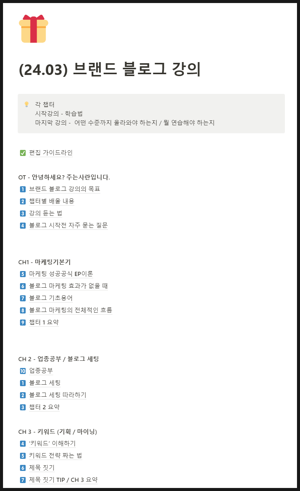
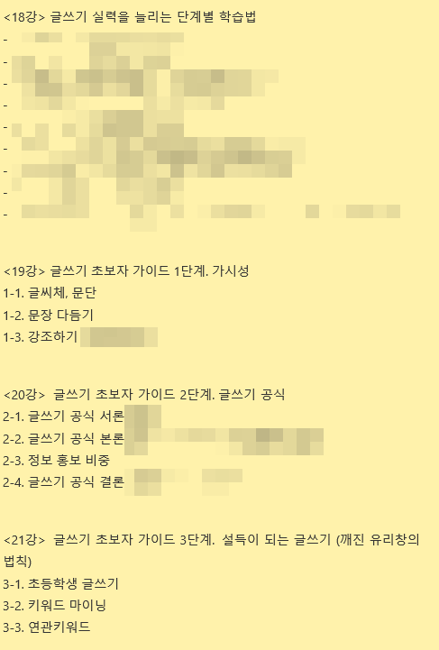
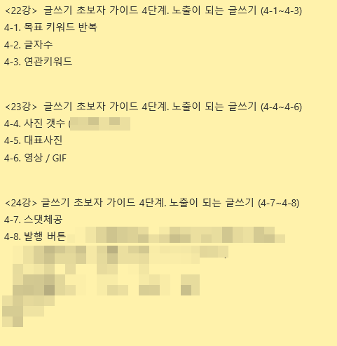
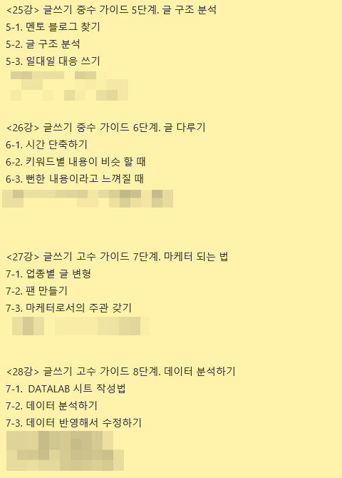

# 초등학생에게 블로그 글쓰기를 가르쳐야한다면?

- 원천 ID: EPR-CAFE-23576
- 작성자: 주는사란
- 작성일: 2024-04-09T12:38:26.713000+09:00
- 원문: https://cafe.naver.com/ranschool/23576
- 수집일: 2026-09-21
- 텍스트 정리: HTML 문단 순서 유지, 빈 문단·제로폭 공백만 제거. 원본 HTML·JSON 별도 보존. 이미지는 아래에 모아 보관하며 원래 배치는 HTML에서 확인.

## 원문 본문

<!-- P001 -->
라는 마음으로 블로그 강의를 수정하고 있습니다.

<!-- P002 -->
이제 드디어 17강 키워드 챕터까지 마무리 했습니다. 오늘부터 블로그 글쓰기 챕터를 쓰고 있는데요. 블로그 글쓰기 강의를 아주 세세하게 쪼개고 하나하나 다 다루는게 좋을것 같아 강의를 나누다 보니 굉장히 많아졌네요ㅠㅠㅠ

<!-- P003 -->
아~주 세세한것 까지 단계를 쪼개서 가르치면 가능할 것도 같습니다. 이렇게요. 글쓰기를 18단계로 쪼개봤어요.

<!-- P004 -->
추가로 중수랑 고수가이드도 내용을 업데이트 할 예정입니다.

<!-- P005 -->
각 단계 연습하는 법에 대해 블로그 강의에 넣어 놓을 예정이구요. 혼자 해보시고 안되는 분들만 모아 블로그 그룹 PT를 할 예정입니다. 그룹 PT 안내는 강의를 다 수정하고 다시 공지 예정입니다.

<!-- P006 -->
강의 수정은 5월 초까지 마무리할 예정이구요. 완료되는 대로 수강생 분들에게 알림톡 드리겠습니다 :) 뿅

## 본문 이미지

## 원문에 포함된 링크

- #
