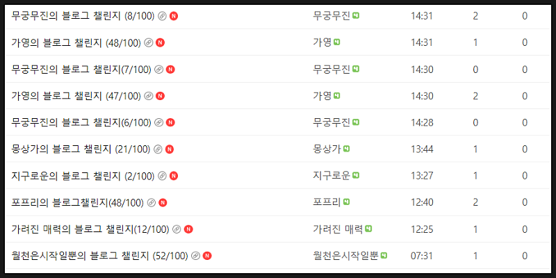
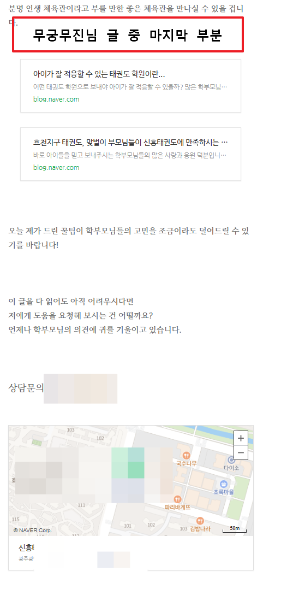
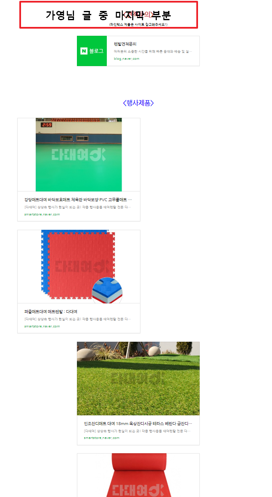
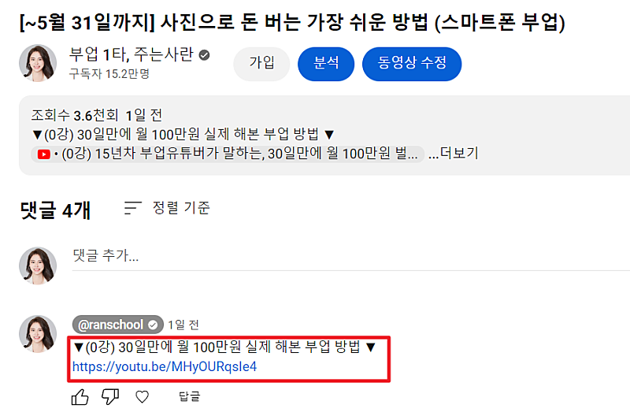
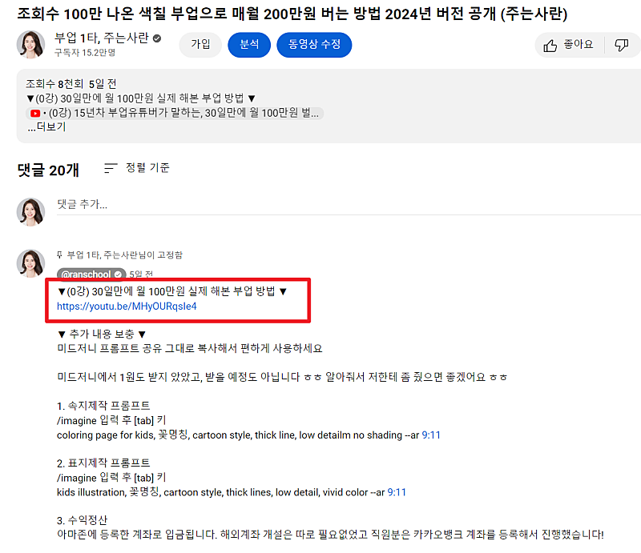
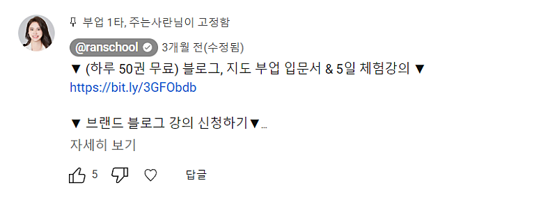
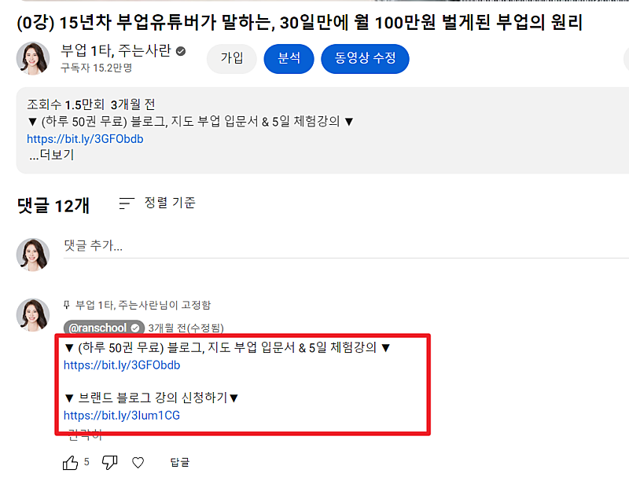
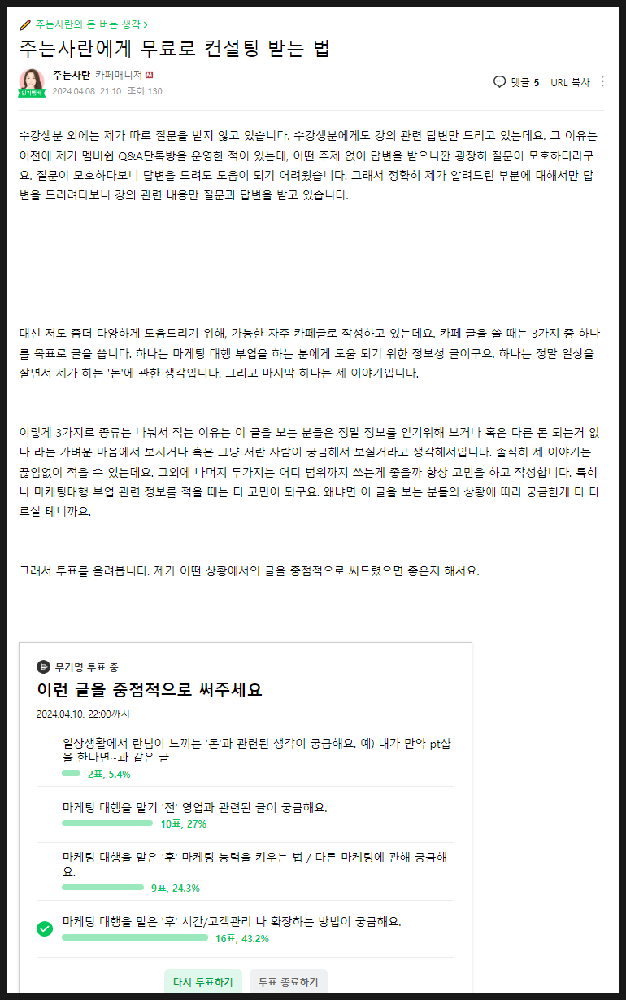

# 문의 받기 위해, 블로그 글 퀄리티보다 더 중요한 것

- 원천 ID: EPR-CAFE-23598
- 작성자: 주는사란
- 작성일: 2024-04-09T16:24:16.817000+09:00
- 원문: https://cafe.naver.com/ranschool/23598
- 수집일: 2026-09-21
- 텍스트 정리: HTML 문단 순서 유지, 빈 문단·제로폭 공백만 제거. 원본 HTML·JSON 별도 보존. 이미지는 아래에 모아 보관하며 원래 배치는 HTML에서 확인.

## 원문 본문

<!-- P001 -->
블로그 마케팅 대행의 목적은 '내가 마케팅 하고 있는 가게의 매출을 올려주는 것' 입니다.

<!-- P002 -->
그럼 매출을 올리기 위해 블로그가 어떻게 돼야하는지 생각해 볼게요. 일단 내 글이 '노출' 되어있어야 합니다. 그래야 고객이 내 글을 볼 수 있으니까요. 하지만 네이버에는 내 글 말고도 여러 글이 보입니다. 그 중에서도 내 글이 '클릭' 할 만한큼 매력적이어야겠죠. 클릭 전에는 제목과 대표사진 두 개가 클릭률에 영향을 줍니다. 내 글로 들어왔다면 내 글이 얼마나 '설득'이 되느냐에 따라 내 글을 끝까지 볼수도 있고 중간에 나갈 수도 있습니다. 만약 끝까지 봤다면 이제 고객은 선택을 하게 됩니다.

<!-- P003 -->
"여기에 연락해볼까? 말까?"

<!-- P004 -->
이걸 단계로 나눠보면 이렇습니다.

<!-- P005 -->
1. 노출

<!-- P006 -->
2. 클릭

<!-- P007 -->
3. 설득

<!-- P008 -->
4. 문의

<!-- P009 -->
여러분은 어느 단계에 가장 신경쓰고 계시나요?

<!-- P010 -->
보통 초보자분들은 1번을 가장 많이 신경씁니다.

<!-- P011 -->
초보

<!-- P012 -->
"오늘 내 글 노출 됐나?"

<!-- P013 -->
"아씨 안됐네" => "짜증나

<!-- P014 -->
혹은

<!-- P015 -->
"오 오늘 노출 됐다" => "대박. 신기하다"

<!-- P016 -->
중수가 되면 3번에 신경쓰기 시작합니다.

<!-- P017 -->
중수

<!-- P018 -->
"내 글이 고객이 문의할만한 글인가?"

<!-- P019 -->
"아.. 이런게 좀 부족하네" => "다음에 글 쓸때 좀더 보완해야겠다"

<!-- P020 -->
혹은

<!-- P021 -->
"오늘은 좀 잘 쓴것 같네" => "이런 부분을 조사한게 도움이 된것 같다"

<!-- P022 -->
그다음 고수가 되기 시작하면 2번이 보입니다.

<!-- P023 -->
고수

<!-- P024 -->
"글 조회수랑 비교했을때, 문의량이 매달 적절한가?"

<!-- P025 -->
"이번달은 클릭률이 좀 떨어진것 같다" => "대표사진을 이런걸 추가로 요청해야겠다"

<!-- P026 -->
혹은

<!-- P027 -->
"이번달은 문의량이 조회수에 비해 늘었네" => "이런 글이 조회수가 높구나. 이런 내용의 글을 추가로 써야겠다"

<!-- P028 -->
근데요.

<!-- P029 -->
초고수가 되면 4번이 보입니다. 4번이 보인다는 의미는요. 이런거예요. 저는 여러분이 블로그 100개 챌린지 올리신 글은 거의 들어가서 봅니다.

<!-- P030 -->
방금 블로그 챌린지에 올려주신 분 글을 몇개 봤어요.

<!-- P031 -->
제가 위 글들에서 마지막 부분 일부를 잘라왔어요. 혹시 아래 사진을 보시고 어떤걸 수정하면 좋을지 생각해보세요

<!-- P032 -->
🔽 생각을 다 하신 후 아래로 내려주세요🔽

<!-- P033 -->
1. 노출

<!-- P034 -->
2. 클릭

<!-- P035 -->
3. 설득

<!-- P036 -->
4. 문의

<!-- P037 -->
글의 마지막 부분은 아까 말씀드렸던 1~4단계중 3단계에서 4단계로 넘어가게 하는 역할을 하는 곳입니다. 글을 다 보고 문의를 할까 말까 고민하는 단계죠. 여기서 문의로 이어지게 하려면, 선택지를 줄여줘야 합니다.

<!-- P038 -->
예를 들어보겠습니다. 얼마전에 제가 수분크림 하나를 사려고 유튜브를 봤습니다. 어떤 유튜버는 A를 추천하고 또 다른 유튜버는 B를 추천합니다. 친구에게 A와 B 중에 뭐가 났냐고 물어봤습니다. 친구는 C 를 추천했습니다. 저는 뭘 샀을까요?

<!-- P039 -->
못 샀습니다 ㅋㅋㅋㅋㅋㅋㅋㅋㅋㅋㅋㅋㅋㅋㅋㅋㅋㅋㅋ

<!-- P040 -->
선택지가 많으면 선택을 못합니다. 특히나 글을 마지막까지 읽은 사람은 내 글이 이미 '꽤나' 마음에 든 상태입니다. 그렇다면 문의 확률이 굉장히 높은데요. 이 상태에서 선택지를 너무 많이 주면 어지럽습니다. 오히려 고민하다가 선택을 못 하게 되는거죠. 여러분은 이런 경험 없으신가요? ㅎㅎㅎ

<!-- P041 -->
설득에서 문의로 이어지는데 "선택지를 줄이자" 라는 방법 만 있는건 아니지만, 문의량에 영향을 주는건 맞습니다. 제가 테스트를 해봤거든요.

<!-- P042 -->
혹시 눈치채셨는지 모르겠지만, 제 유튜브와 부퇴사 카페는 처음부터 끝까지 '다음 단계는 뭐로 가면 되는지' 단계가 아주 상세하게 나와있습니다. 그리고 각 단계별로 '하나의 클릭'만을 제안합니다.

<!-- P043 -->
부퇴사 카페와 제 유튜브 영상이 모두 그렇게 되어있다는걸 알고 계셨나요? 한번 찾아보시면 공부가 되실겁니다.

<!-- P044 -->
유튜브 영상을 예로 들어서 보여드릴게요. 최근에 올린 영상 2개 입니다. 고정댓글에는 딱 하나의 링크만 있습니다. 모두 다 '빨간테두리 영상 0강' 으로 가게 하는 걸 목표로 제작되었거든요.

<!-- P045 -->
빨간 테두리 영상만 두개의 링크가 있습니다. 이것 조차도 너무 복잡하지 않도록 자세히 보기를 누르지 않는 이상 링크가 한개만 보이도록 했습니다.

<!-- P046 -->
제가 영상 댓글에 링크를 3개 / 2개 / 1개 모두 클릭률을 테스트 해보았거든요 ㅎㅎㅎ

<!-- P047 -->
부퇴사 카페에 적는 제 모든 글도 마찬가지입니다. 한번 쭉 봐보세요. 글마다 딱 '한가지 액션' 만 요청하고 있습니다. 아래는 제가 어제 쓴 글입니다.

<!-- P048 -->
투표해주세요! 한 가지만 요청하고 있습니다.

<!-- P049 -->
결론

<!-- P050 -->
관련 글을 넣는 것은 좋지만 굳이 '마지막' 부분에 넣을 필요가 없습니다. 결론에서는 이 글을 읽고 마음에 들면 뭘 하면 되는지만 알려주면 됩니다.

<!-- P051 -->
지금 이 글도 마찬가지입니다. 이 글에서 저는 딱 한가지만 말씀드리고 있습니다. 저는 여러분께 뭘 요청하고 있죠?? 댓글로 적어봐주세요. (똑바로 이해하셨나~~ 확인해보는겁니다 😎)

## 본문 이미지

## 원문에 포함된 링크

- #
