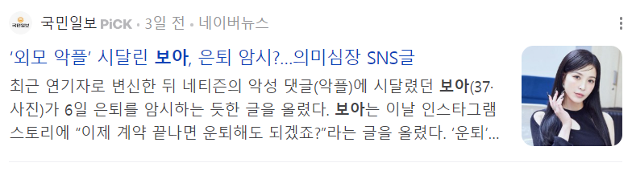
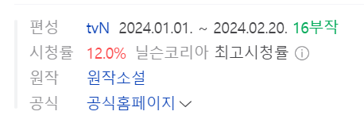

# 연예인이 갑자기 나락가는 '마케팅적' 이유

- 원천 ID: EPR-CAFE-23628
- 작성자: 주는사란
- 작성일: 2024-04-10T09:12:18.967000+09:00
- 원문: https://cafe.naver.com/ranschool/23628
- 수집일: 2026-09-21
- 텍스트 정리: HTML 문단 순서 유지, 빈 문단·제로폭 공백만 제거. 원본 HTML·JSON 별도 보존. 이미지는 아래에 모아 보관하며 원래 배치는 HTML에서 확인.

## 원문 본문

<!-- P001 -->
학폭/빚투/성폭행/음주운전 이 4가지는 주기적으로 연예인들이 나락가는 이유 중 하나입니다. 요즘 다시 연예계에는 학폭 논란인데요. 좋은 일은 아니니 어떤 분인지 구체적으로 언급하진 않겠습니다.

<!-- P002 -->
위 4가지 이유 외에도 악플이 갑자기 늘어날 때가 있습니다. 제가 초등학생 때, 여자들의 워너비는 보아였습니다. 수련회에서 보아 노래로 춤췄던 기억이 나네요...ㅎㅎ 진짜 오랜기간 연예인을 한 보아조차도 악플에 많이 시달리는 것 같습니다.

<!-- P003 -->
이렇게 논란이 되는 분들을 보면 의아한 경우가 있습니다.

<!-- P004 -->
원래 유명했던 사람이었다는 겁니다. 원래도 유명했는데 갑자기 4가지 문제를 이슈삼아 문제가 되는 경우가 있구요. 원래도 악플이 많았는데, 갑자기 악플이 훨씬 많아질 때가 있습니다.

<!-- P005 -->
근데 왜 이제야 이런 논란이 생겼을까요? 왜 갑자기 악플이 증가할까요? 여기에 마케팅적 이유가 있어서 이야기해보려고 합니다.

<!-- P006 -->
어떤 계기로 '무작위' 노출이 늘어나서입니다. 연예인들은 특히 무작위적인 노출에 열악합니다. 최근에 논란이 된 연예인의 시작점은 한 여자분입니다. 그 여자분이 출연한 드라마를 보니 시청률이 12%가 나왔더라구요. 보아 역시 이 드라마에 출연했구요.

<!-- P007 -->
OTT 전성시대에 심지어 종편에서 12%가 나왔다는건 사실상 전국민 중 드라마를 본다는 사람은 거의 다 봤다는 이야기입니다. 무작위적으로 노출이 된거죠. 그외에 논란이 된 다른 분들도 보면 갑자기 CF 출연이 많아지는 등의 무작위 노출이 늘어날만한 계기가 있었습니다.

<!-- P008 -->
제가 강의에서 자주 하는 말이 있는데요. 마케팅이란 내 상품이 필요한 사람에게'만' 가게 만드는 기술이라고 말합니다. 필요 없는 사람에게 가면 그냥 욕 먹거든요. 영업을 할 때도 마찬가지입니다. 아무리 영업을 해도 99%이상은 응답도 없습니다. 당연하죠. 그 사람이 내 서비스를 필요로 하는지 모르고 그냥 영업을 했으니까요. 무작위 노출을 늘린겁니다.

<!-- P009 -->
무작위 노출을 하다보면 어쩔 수 없이 나를 좋아할만한 사람 외에도 노출이 됩니다. 어쩔수 없죠. 연예인들은 특히나 "나 예뻐" "나 잘생겼어" "나 노래 잘해" "나 춤 잘춰" 라는 이유가 그 사람을 좋아하게 되는 시작점입니다. 아주 주관적인 분야죠. 전국민 중 누군가는 "전지현도 너무 과하게 생겨서 별로야" 라고 생각할 수 있거든요. (아닌가?ㅎㅎㅎㅎㅎㅎ)

<!-- P010 -->
정리하자면, 원래 유명했던 연예인들이 갑자기 나락가는 이유는 트래픽(노출)이 늘었기 때문입니다. 특히 무작위 노출이요. 반대로 생각하면 그만큼 날 좋아해줄 사람을 만날 확률도 늘었다는 의미입니다. 이 사실이 아마 연예인들 스스로를 더 힘들겁니다. 내가 출연한 드라마가 잘 됐으면 좋겠지만, 나는 욕을 먹고 싶지 않고 논란이 되지 않길 바라니까요. 불가능한 일이죠.

<!-- P011 -->
영업도 마찬가지입니다. 계약이 되길 바라지만, 욕은 먹고 싶지 않다는건 불가능한 일을 꿈꾸는 거죠.

<!-- P012 -->
딱 이런 면에서 아직 네이버와 블로그가 살아남아 있는건데요. 유튜브와 인스타그램은 좋아할만한 영상을 추천해줍니다. 무작위 노출이 아닌듯해 보이죠. 근데 그 사람의 정확한 취향을 캐치하기까지는 무작위 노출이 기본입니다. 네이버도 그렇게 따라가려고 하고 있지만, 최소한 블로그만큼은 완전 무작위 노출을 하긴 어려울겁니다. 사람들이 검색을 해야 블로그가 보이니까요.

<!-- P013 -->
블로그는 누군가가 검색을 하기 때문에, 필요한 사람에게'만' 내 상품이 보인다면 욕도 안 먹고 매출도 오를 수 있게 합니다. 키워드 라는게 존재하니까요.

<!-- P014 -->
근데 이 말은 반대로 생각해보면 이런 말입니다. 키워드를 잘 못 잡으면 욕도 안 먹지만, 필요한 사람에게도 안간다는 거죠. 나는 사실 무인도에 있는데 무인도에 있는 줄 몰라 sos 조차 못하는 상황인겁니다. 그러면 안되겠죠? ㅎㅎ문의가 안 온다면 키워드를 다시 점검해볼 필요가 있습니다. 어떻게 점검할지는 강의 리뉴얼에 반영해 놨습니다.

<!-- P015 -->
결론 -

<!-- P016 -->
1. 무작위 노출을 하면 욕을 먹는다.

<!-- P017 -->
2. 내 상품을 필요로 하는 사람에게'만' 노출을 해야 욕을 안 먹으면서 매출을 올릴 수 있다.

<!-- P018 -->
3. 블로그에서는 키워드가 그 역할을 한다. 키워드 잘 못 잡으면 골로 간다 ㅎㅎ

## 본문 이미지

## 원문에 포함된 링크

- #
