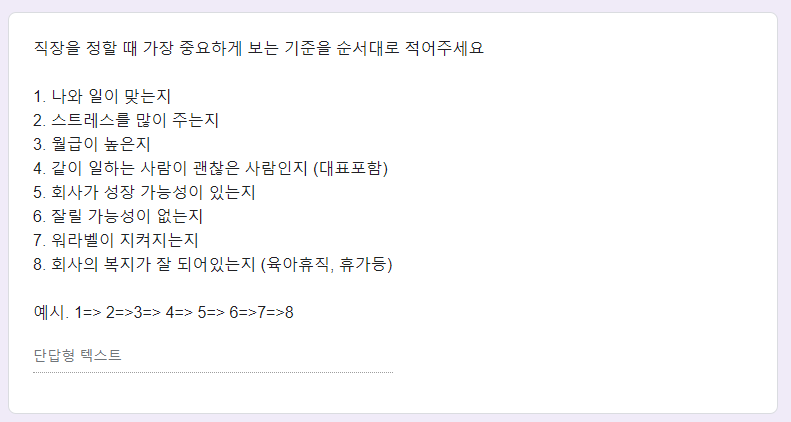
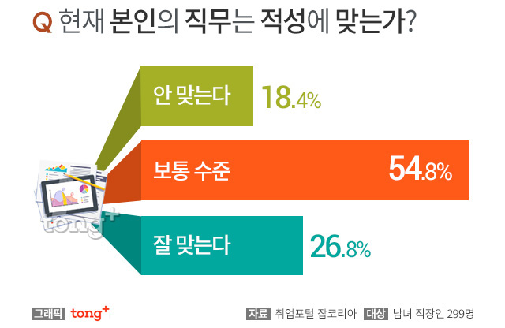

# 내가 만약 직장인이라면

- 원천 ID: EPR-CAFE-23779
- 작성자: 주는사란
- 작성일: 2024-04-14T22:03:59.870000+09:00
- 원문: https://cafe.naver.com/ranschool/23779
- 수집일: 2026-09-21
- 텍스트 정리: HTML 문단 순서 유지, 빈 문단·제로폭 공백만 제거. 원본 HTML·JSON 별도 보존. 이미지는 아래에 모아 보관하며 원래 배치는 HTML에서 확인.

## 원문 본문

<!-- P001 -->
얼마전 주는사란 매니저 채용 공고를 올렸습니다. 지난주 화요일이 마감일이었는데요. 유튜브나 인스타에 한번도 언급 하지 않고, 카페에만 올렸는데 20명내외의 꽤 많은 분들이 지원해주셨습니다.

<!-- P002 -->
지원자분들의 나이부터 경력까지 다양했습니다. 이미 연봉이 5-6천만원 이상 받고 있는데도 연봉을 낮춰서라도 오시겠다는 분도 계셨구요. 10년차 이상의 pd경력을 갖고 계신 분부터 대본 작가 경력 등 방송업계에 종사하셨던 분도 지원해주셨습니다. 그외에도 카지노에서 근무하셨던 분, 자영업을 폐업하고 지원하신 분 등도 계셨습니다. 나이도 최연소 26살부터 50대까지도 계셨구요.

<!-- P003 -->
여러 이력서를 보면서 저도 이런 생각이 들더라구요. "내가 만약 직장인 이라면 어떤 회사에 취직할까?" 라구요.

<!-- P004 -->
저라면 회사를 지원할 때 이런걸 볼것 같습니다.

<!-- P005 -->
위 질문은 지원자 분 중 좀더 궁금한 6분에게 드린 설문지 문항 중 하나인데요. 좀더 지원자 분에 대해 알기 위해 몇가지 설문을 만들어 여쭤봤습니다.

<!-- P006 -->
혹시 이 글을 보는 분도 댓글로 적어봐주세요. 궁금합니다 ㅎㅎ회사를 안 다니는 분이라면 "만약 직장인이라면"으로 생각해보시면 나중에 회사를 만드실 때 도움이 되실거예요.

<!-- P007 -->
저도 8가지에 대해 생각해 봤습니다.

<!-- P008 -->
1. 나와 일이 맞는지

<!-- P009 -->
저는 솔직히 내 성향과 52%이상 맞는 일을 찾기 어렵다고 생각합니다. 그런 일이란 사실 존재하지도 않구요. 어떤 일이던 맞는 부분과 맞지 않는 부분은 공존하게 되어있습니다. 보통 "이 일은 나랑 잘 맞을 거야" 라고 착각하는 이유는 일의 겉모습만 봤기 때문입니다. 수박 껍질은 초록색이지만 우리가 진짜 먹을 수 있는 수박은 빨간 부분인 것 처럼요.

<!-- P010 -->
A 업무

<!-- P011 -->
좋은 부분 51%

<!-- P012 -->
싫은 부분 49%

<!-- P013 -->
보통은 "이 일이 나와 맞는다" 는 딱 이정도입니다. 하기 싫은 부분보다 딱 1~2%정도 좋은 부분이 커서 하기 싫은 부분을 상쇄시켜주는거죠. 육아를 해보진 않았지만, 아이 키우기가 너무 힘들지만 아이가 주는 기쁨이 커서 버틸수 있다고 하더라구요...??? 일도 그렇다고 생각합니다.

<!-- P014 -->
실제로 잡코리아에서 조사한 자료에 따르면 과반수 이상이 직무에 불만족 한다고 합니다.

<!-- P015 -->
하지만 그럼에도 나와 맞는 일을 찾아보는건 굉장히 중요하다고 생각합니다. 맞는걸 놓쳐보는 경험도 안 맞는걸 버티는 경험도 중요하니까요. 또 안 맞다고 생각한게 돌이켜 보면 맞을 때도 있거든요.

<!-- P016 -->
제가 이자카야를 했었다고 말씀드렸는데요. 그때는 너무 최악이었습니다. 밤 늦게까지 장사하는 것도 싫었고, 술도 못 마시는데 매일 술 마시는 사람을 이해하기 어려웠습니다. 저는 오꼬노미야끼를 싫어합니다. 근데 오꼬노미야끼가 맛있다며 파는 것도 싫었습니다. 그래서 마지막 음식점을 정리할 때는 "다시는 음식점하는 사람하고는 만나지도 말아야지ㅋㅋㅋㅋㅋ" 마음을 먹었죠. 근데 요즘 다시 드는 생각인데요. 어쩌면 저는 그 일이 참 잘 맞았던 것 같습니다. 사실 싫은게 아니라 잘 하고 싶었던거죠. 못하니깐 그게 "안 맞아" 라는 핑계가 필요했었습니다.

<!-- P017 -->
저라면 나와 맞는 일을 찾아보겠지만, 안 맞는 일을 버티는 연습도 할 것 같습니다. 맞는 일만 하고 살 수 없으니까요. 어쩌면 버틸 줄 알게 되면 맞는 일의 범위가 더 늘어날 지도 모르구요.

<!-- P018 -->
2. 스트레스를 많이 주는지

<!-- P019 -->
저는 스트레스를 좀 잘 받는 편입니다. 별거 아닌 일도 부풀려 생각해서 스트레스를 쉽게 받죠. 그래서 사실 제게 2번은 좀 중요한 기준이 될 것 같아요. 근데 스트레스 '양' 보다는 '질'을 좀 더 볼 것 같습니다. 왜 스트레스를 받는지에 대해서 생각해보고 노력해볼지를 정할거예요.

<!-- P020 -->
만약 인간관계에서 오는 스트레스라면 취직 하지 않을 것 같습니다. 사람에 대한 배려가 없는 사람과 미래를 꿈꾼다는건 말이 안되니까요.

<!-- P021 -->
근데 만약 업무적 스트레스라면 저는 환영입니다. 오히려 업무적 스트레스가 없다면 그런 회사는 들어가지 않을 것 같아요. 직원이 업무적으로 스트레스를 안 받는다는건 회사가 앞으로 나가지를 않는다는 말 같거든요. 회사가 성장이 안되면 매출이 안 오를거고, 그럼 내 월급도 안 오를 테니까요.

<!-- P022 -->
2번에는 3번 월급이 높은지 / 4번 같이 일하는 사람이 괜찮은 사람인지 / 5번 회사가 성장 가능성이 있는지와 다 연관이 되어 있긴 하네요.

<!-- P023 -->
3. 월급이 높은지

<!-- P024 -->
저는 회사를 다니는 이유에는 월급 받기 위해 다니는게 크다고 생각합니다. 근데 그렇다고 내가 하는 일 보다 높은 월급을 받고 싶진 않아요. 제 보상시스템을 망가뜨리고 싶지 않거든요.

<!-- P025 -->
예를 들면 이런거예요. 제가 20살 초반에 과외할 때 일입니다. 과외는 보통 시간당 페이가 굉장히 비싼 편입니다. 그 나이에 어디서 받기 어려운 시급을 벌게 되죠. 그렇다고 과외 문의가 많은 것도 아니었어요. 근데 과외를 하다보니 최저시급 주겠다는 아르바이트는 하기가 싫더라구요. "아 이거 과외보다 못한건데" 라는 생각이 계속 드니까요. 보통 도박을 못 벗어나는 이유가 이렇다고 하더라구요.

<!-- P026 -->
한번 보상시스템이 무너지면 일한 것 대비 계속 더 높은 돈을 받고 싶습니다. 그럼 일자리를 구하기 어려워지죠. 몸값을 높이기 위해 노력도 안할 거구요. 그렇게 되고 싶진 않습니다.

<!-- P027 -->
근데 요즘은 참 일한 것 만큼도 제대로 주는 곳이 없는 것 같습니다. 그래서 월급이 높은지의 기준은 내가 일한 것에 대한 성과를 '정확하게' 보상해 주는지를 본다는 의미입니다.

<!-- P028 -->
4. 같이 일하는 사람이 괜찮은지

<!-- P029 -->
여러번 언급했던 것 같은데요. 저는 일을 같이 하는건 연애를 하는 것과 똑같다고 생각합니다.

<!-- P030 -->
처음에는 설레지만 오래 가지 못합니다. 대신 익숙함이 주는 편안함이 오죠. 처음에 보였던 장점이 시간이 지나면 단점으로 변합니다. 서로가 단점으로 보이는 부분을 맞춰가는 과정에서 신뢰가 쌓이죠. 저는 이런 사람과 연애를 하고 있구요. 저는 이런 사람과 일하고 싶습니다.

<!-- P031 -->
설레는 것보다는 익숙함이 주는 소중함을 아는 사람이요. 서로에게 단점으로 보이는 부분이 장점이 될수도 있다는걸 아는 사람이요. 그리고 그 단점을 보완하기 위해 노력하는 사람이요.

<!-- P032 -->
그런 대표가 있는 회사를 만났다면, 저는 창업하지 않았을겁니다. 그냥 저는 그 사람의 팀원으로 역할을 충실히 하고 싶거든요. 솔직히 저는 직접 운영하는 것 보다 2인자 자리를 더 좋아하는 사람입니다. 근데 회사가 어려워도 "어떻게든 내 월급 만큼은 챙겨줄게" 라는 믿음이 있는 사람과 일해보고 싶었는데 못 만났던 것 같습니다. 그래서 저는 그렇게 살고 싶어요.

<!-- P033 -->
5. 회사가 성장 가능성이 없는지

<!-- P034 -->
회사의 성장 가능성을 측정하는 기준이 매출만은 아니라고 생각해요. 다음 스텝을 위해 투자를 하려면 기존 사업의 매출을 줄어들수도 있으니까요.

<!-- P035 -->
제가 생각하는 회사의 성장 가능성은 팀이 바라보는 목표라고 생각합니다. 지금 매출이 계속 늘지 않아도 앞으로 어떤 순서로 나아갈건지만 명확히 보이면 버텨줄수 있거든요. 기다려줄수 있거든요.

<!-- P036 -->
근데 그 목표 없이 그냥 돈만 보고 달리는 사람은..........예전에는 좋았는데..........지금은 좀 별로예요. 그런 사람은 잠깐 잘나온 매출로 취해있을 가능성이 높거든요. 저도 그랬을 때가 있구요.

<!-- P037 -->
6. 잘릴 가능성이 없는지

<!-- P038 -->
얼마전 대기업에 다니는 제 친구가 그러더라구요. 솔직히 "너랑 같이 일 해보고 싶은데, 지금 대기업을 버리고 가기는 좀 무서워" 라구요. 제가 같이 일하고 싶다고 한적은 없었는데 말이죠 ㅎㅎㅎㅎㅎㅎㅎㅎㅎㅎㅎㅎ

<!-- P039 -->
개인적으로는 그렇게 보여서 더 좋긴 합니다.

<!-- P040 -->
잘릴 가능성이라는게 대기업에서는 '내가' 잘릴 가능성 일거구요. 작은 회사에서는 '회사가' 망할 가능성일겁니다. 대기업은 회사가 망할 일은 없겠죠. 근데 나는 잘릴 수 있습니다. 작은 회사 아니 저처럼 아주 작디 작은 회사는 그냥 아이들 소꿉놀이 처럼 보일 수도 있죠. 망해서 어쩔 수 없이 나가야 하는 상황이 생길 것 같이 보일지도 모릅니다.

<!-- P041 -->
근데 제가 마케팅을 해보니깐 회사의 망할 가능성은 데이터가 없어서 그렇습니다. 그냥 어느 정도 트래픽이 있을 때 어느정도 매출이 나오는지를 모르니깐 망하는 거예요. 사실 다 대비를 할 수 있습니다. 코로나 같은 아주 특수한 경우도 있겠지만, 솔직히 저는 그것조차도 망하지 않을만큼의 대비는 가능하다고 봅니다.

<!-- P042 -->
제가 학원할 때 코로나가 터졌습니다. 코로나 때문에 학교도 등원을 안했죠. 그러니 학부모님들은 당연히 학원도 불안해서 안 보내려 하셨습니다. 저는 코로나 터지자마자부터 준비했어요. 곧 학교를 안 갈수도 있다는 뉴스가 많이 나왔거든요. 그래서 저는 이때 '원격 학습관리 프로그램'을 한 아이당 매달 60만원씩 받았습니다. 학교와 학원을 못 가면 아이들은 집에서 공부를 해야하는데, 그 당시만 하더라도 줌이라는게 잘 알려지지도 않았거든요. 그때 학원 아이들 대상으로 원격 학습관리 프로그램을 했습니다. 그리곤 코로나로 아이들 학교를 안가게된 순간 주위 친구들 소개가 미친듯이 들어왔습니다. 덕분에 코로나가 끝난 뒤에는 관리 받았던 아이들이 학원을 다니게 되서 더 잘되기 시작했죠.

<!-- P043 -->
근데 저는 제 회사가 불안해보이는게 좋습니다. 아무도 모르게 잘되고 싶거든요 ㅎㅎㅎㅎㅎㅎㅎㅎㅎ

<!-- P044 -->
제가 만약 직장인이라면 대기업은 한 4-5년 정도 다니고 이후에는 작은 회사를 갈겁니다. 일단 대기업에서 시스템과 어떤 사람들이 어떻게 일하는지를 보고 싶구요. 그 뒤로는 작은 회사를 갈 것 같아요. 데이터가 있다면 가능한 작을 수록 좋습니다. 대표한테 직접 배울수 있고, 내 성과도 바로 보일거고, 인정받기도 좋으니까요. 팀원 한명한명에 영향력이 클수 밖에 없으니까요. 그럼 몸값을 높이기도 월급을 더 받기도 좋을테니까요.

<!-- P045 -->
7. 워라벨이 지켜지는지

<!-- P046 -->
워라벨은 제게 좀 중요한 요소입니다. 저는 일이 좋지만 그만큼 주기적으로 쉬는 것과 여행다니는 것도 중요해서요. 개인적으로는 연차 갯수가.... 좀 중요할 것 같습니다. ㅎㅎㅎㅎㅎㅎㅎㅎ 여행은 포기 못해!!

<!-- P047 -->
8. 복지가 잘 되어있는지

<!-- P048 -->
개인적으로 복지는 신경쓰는 부분이 아니긴 합니다. 차라리 월급 보상체계가 제대로 되어있는게 좋아요. ㅎㅎㅎ

<!-- P049 -->
분명 글을 짧게 쓰려고 했는데 길어졌네요. 여러분은 어떤 기준으로 회사를 정하시나요? 댓글로 순서 적어봐주세요. 저는요.

<!-- P050 -->
5=> 3=> 4=> 7=> 1,6,8 (세개는 별로 안 중요함)

## 본문 이미지

이미지 2: 로컬 보관 실패. [원래 이미지 주소](https://post-phinf.pstatic.net/20160104_217/jobkorea_co_1451888985853co3Fh_JPEG/mug_obj_145188898037663915.jpg?type=w800_q75) — 수집 응답은 `_관리/이미지수집.json`에 기록.

## 원문에 포함된 링크

- #
