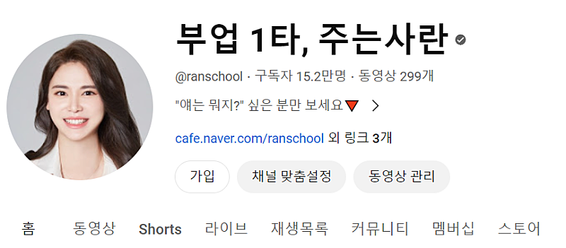
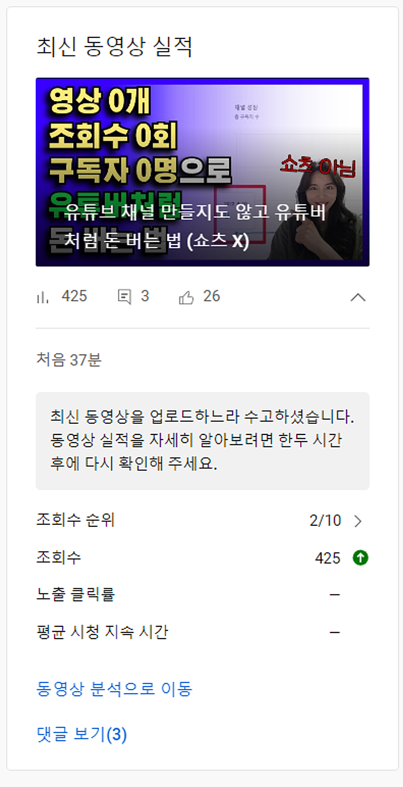
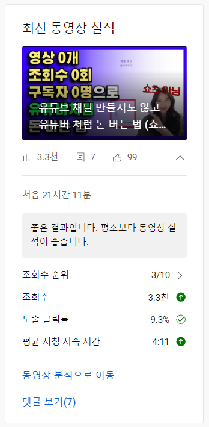

# 마케팅 실력이 늘려면?

- 원천 ID: EPR-CAFE-23887
- 작성자: 주는사란
- 작성일: 2024-04-17T16:57:37.623000+09:00
- 원문: https://cafe.naver.com/ranschool/23887
- 수집일: 2026-09-21
- 텍스트 정리: HTML 문단 순서 유지, 빈 문단·제로폭 공백만 제거. 원본 HTML·JSON 별도 보존. 이미지는 아래에 모아 보관하며 원래 배치는 HTML에서 확인.

## 원문 본문

<!-- P001 -->
한달 전에 비해 마케팅 실력이 늘었나요?

<!-- P002 -->
생각해보시고 아래로 내려주세요

<!-- P003 -->
5

<!-- P004 -->
4

<!-- P005 -->
3

<!-- P006 -->
2

<!-- P007 -->
1

<!-- P008 -->
가끔 '마케팅을 잘한다' 라는걸 경쟁업체를 이기는 것이라고 생각하는 분들이 있습니다. 많은 경쟁업체를 이기고 내 업체만 살아남아서 돈을 많이 벌겠다는거죠. 현실적으로 불가능한 이야기입니다.

<!-- P009 -->
마케팅을 잘한다는건 사실 경쟁업체와는 크게 상관 없는 이야기 일지도 모릅니다. 나 스스로만 이기면 되거든요.

<!-- P010 -->
예를 들면 이렇습니다. 내가 공부를 안해서 대학에 떨어져놓고, 대학에 합격한 친구가 꼴보기가 싫은겁니다. 친구를 경쟁자라고 느끼는 거죠. 물론 경쟁자는 맞습니다. 상대평가니까요. 근데 대학에 떨어진 이유는 '친구가 공부를 열심히 해서'가 아니라 '내가 공부를 안해서' 입니다. 이걸 착각하는 경우가 있습니다.

<!-- P011 -->
마케팅도 마찬가지입니다. 가끔 너무 잘하는 곳들이 보이기도 합니다. 무력감이 들기도 하죠. 저도 처음에 그랬습니다. 블로그를 처음 시작했을 때, 잘 쓴 사람 글을 보면 답답해 미칠 것 같았습니다. 나도 잘 쓰고 싶은데 잘 안 되더라구요. 유튜브 시작할 때도 그랬습니다. 잘 하는 사람을 보면 과연 내가 저 정도 할 수 있을까? 싶었구요. 구독자가 늘긴 늘어나는데 하루에 10명씩 늘어나니깐 "이게 되는거 맞아?" 싶었습니다.

<!-- P012 -->
솔직히 아직도 그럴 때가 있습니다. 몇몇 유튜버들 보면 정말 잘하는 분들이 보입니다. 금방 따라잡힐 것 같은 느낌이 들기도 하죠.

<!-- P013 -->
그들과 내가 경쟁한다고 착각이 될 때가 있습니다. 근데 생각보다 멀리 떨어져 있습니다. 그들이 잘하는 것이 나와 그렇게 상관 없는거죠. 그냥 어제의 나보다만 잘하면, 덤으로 남을 이기고 있을 때가 있더라구요.

<!-- P014 -->
그리고 재밌는건 제가 막상 남을 앞서간 순간을 봤더니, 남을 의식할 때가 아니더라구요.

<!-- P015 -->
아시겠지만 제 유튜브명은 '부업1타, 주는 사란'입니다.

<!-- P016 -->
사실 이 '부업 1타' 라는 말을 앞에 붙일 때 고민을 많이 했습니다. 왜냐면 1타가 아니었거든요. ㅋㅋㅋㅋㅋㅋㅋㅋㅋㅋㅋㅋㅋㅋ 1타는 물론이고 2타 3타도 아니었습니다. 아마 다른 부업 유튜버는 제 채널명을 보고 황당했을 겁니다. "쟤는 뭐지?" 라구요.

<!-- P017 -->
근데 저 이름을 붙이고, 얼마 안돼서 부업 2타 (구독자 기준) 가 되었습니다. 1타는 곧 되겠죠?ㅎㅎㅎ

<!-- P018 -->
저는 과거의 저를 이기는 것 '만' 을 목표로 합니다. 예전에 내가 잘 했을 때, 과거에 가장 잘 했던 때의 나보다 조금 더 잘하는 것에 집중합니다. 그러니깐 어느 순간 남을 이기고 있더라구요.

<!-- P019 -->
과거의 나를 이기려면 일단 과거의 내가 어땠는지를 알아야 합니다. 그리고 지금 나는 어떤것에 집중하는 지를 알아야 합니다. 그리곤 매달, 매일, 매시간 나 스스로를 이겨야 합니다.

<!-- P020 -->
블로그로 예를 들자면 이렇습니다.

<!-- P021 -->
1. 같은 시간에 쓸 수 있는 글의 갯수가 달라져야 합니다.

<!-- P022 -->
2. 상위노출 하는 글이 늘어나야 합니다.

<!-- P023 -->
3. 각 글의 조회수가 늘어야 합니다.

<!-- P024 -->
4. 글을 더 오래 보도록 할수 있어야 합니다.

<!-- P025 -->
5. 목표하는 키워드의 검색량이 늘어야 합니다.

<!-- P026 -->
6. 글마다의 내용 퀄리티가 유지 돼야 합니다.

<!-- P027 -->
7. 같은 내용의 글도 다양하게 바꿔 쓸 수 있어야 합니다.

<!-- P028 -->
8. 뻔한 내용을 뻔하지 않게 말할 수 있어야 합니다.

<!-- P029 -->
9. 내 (내가 마케팅하고 있는 사장님) 이야기를 넣을 수 있어야 합니다.

<!-- P030 -->
10. 문의가 안 온다면, 뭐가 문제인지 찾을 수 있어야 합니다.

<!-- P031 -->
한번 생각해보세요. 이번달에 위 10가지 중 어떤 실력을 높일 건가요? 댓글을 달아주세요.

<!-- P032 -->
그리고 한달 뒤 2024.05.17에 제가 다시 여쭤볼게요 ㅎㅎ 잘 하고 계시는지 ㅎㅎ

<!-- P033 -->
처음에는 글 한개당 하나씩도 신경쓰기 어렵겠지만, 곧 동시에 다 높일 수 있게 됩니다. 바로 저처럼요ㅋㅋㅋㅋㅋㅋㅋㅋㅋㅋㅋㅋㅋㅋㅋㅋ

<!-- P034 -->
(왼쪽) 어제 올리자마자 / (오른쪽) 오늘

<!-- P035 -->
자랑 죄송합니다.ㅎㅎㅎㅎㅎㅎㅎㅎㅎ 기분이 너무 좋네요. ㅎㅎㅎㅎㅎㅎㅎㅎㅎㅎㅎ 거의 한달 넘게 영상을 안올렸더니 요즘 영상 반응이 별로였습니다. 근데 어제 오랜만에 유튜브한테 칭찬 받았습니다.

<!-- P036 -->
저는 매일 저와 싸웁니다. 유튜브도 그렇구요. 다른 마케팅도 모두 그렇습니다. 어제의 나보다 오늘 위 10가지를 더 잘하려고 합니다. 그리고 어제 올린 영상이 과거의 저를 이겼습니다.

<!-- P037 -->
유튜브에서도 위 10가지는 똑같이 적용이 됩니다. 더 많은 영상을 올려야 하구요. 같은 기간에 더 많은 조회수를 기록해야 하구요. 사람들이 더 오래 볼 수 있도록 해야 합니다. 이전 영상보다 앞의 모든 데이터가 더 높아야 하죠. 그리고는 매번 순위를 매겨줍니다. 오늘 기준으로 3위로 떨어지긴 했지만, 모든 데이터가 좋습니다.

<!-- P038 -->
어제 올린 영상 대본은 정말 잘 썼다고 생각합니다. 많은 유튜버들이 다뤘던 내용이지만 아무도 말하지 않은 방식으로 이야기 했습니다. 누구나 할 수 있지만 누구도 생각하지 못하는 방법을 소개했습니다.

<!-- P039 -->
혹시 안 보신 분이라면 한번 봐보세요. 글쓰는데 어떤 포인트로 어떻게 쓰면 좋을지 도움이 되실겁니다.

## 본문 이미지

## 원문에 포함된 링크

- #

## 원본 HTML에 포함된 외부 게시물 메타데이터

외부 게시물의 현재 본문을 재수집한 것이 아니라, 카페 게시 당시 함께 저장된 제목·설명이다. 잘린 문구는 보완하지 않았다.

- 원문 링크: https://youtu.be/nSS_s2OSWQ4?si=lV7RjBbOhIaEeJOt

유튜브 채널 만들지도 않고 유튜버 처럼 돈 버는 법 (쇼츠 X)

▼(0강) 30일만에 월 100만원 주는사란이 실제 하는 부업 방법 ▼https://youtu.be/MHyOURqsIe4

