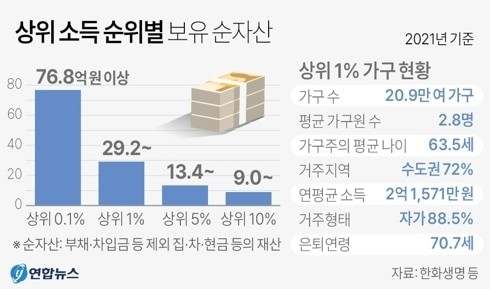
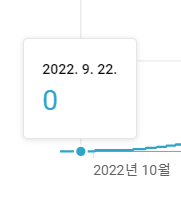
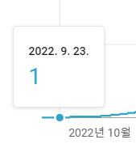
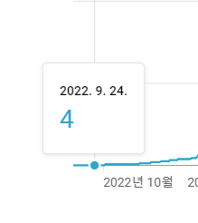
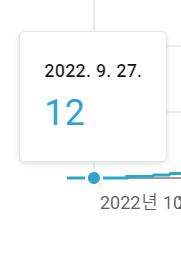
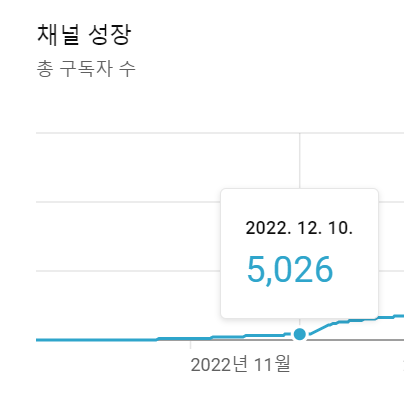
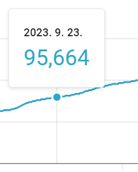
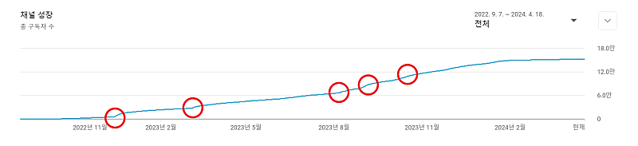
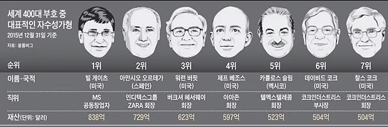
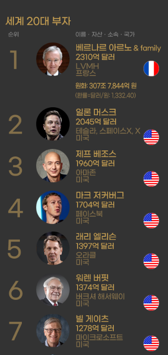

# 쫄지마세요. 제발

- 원천 ID: EPR-CAFE-23990
- 작성자: 주는사란
- 작성일: 2024-04-19T21:03:14.917000+09:00
- 원문: https://cafe.naver.com/ranschool/23990
- 수집일: 2026-09-21
- 텍스트 정리: HTML 문단 순서 유지, 빈 문단·제로폭 공백만 제거. 원본 HTML·JSON 별도 보존. 이미지는 아래에 모아 보관하며 원래 배치는 HTML에서 확인.

## 원문 본문

<!-- P001 -->
10년간 학원, 이자카야, 도시락 전문점, 프랜차이즈, 부동산, 유튜버까지 여러일을 하면서 느낀게 있다. 뭐든 굳이 빨리할 필요는 없다는 것이다. 나도 그랬지만 사람들은 성공하려면 뭐든 조금이라도 이른 나이에 빨리 배우는게 이득이라고 생각한다.

<!-- P002 -->
2021년에 한화생명이 조사한 자료에 따르면 상위 1% 부자들의 평균 나이는 63.5세였다.

<!-- P003 -->
물론 요즘에는 젊은 부자들도 많아졌다는 기사가 많으나, 상위 1% 부자들의 평균 나이에는 큰 영향을 주지 못한다. 심지어 평균 나이가 63.5세라는 말은 70대들도 많다는 이야기다. 생각보다 이른 나이에 부자가 되는 경우는 많지 않다.

<!-- P004 -->
두번째로 부자들은 생각보다 단기간에 돈을 벌었다는 것을 알게 됐다.

<!-- P005 -->
대부분의 사람들에게 "1억을 모으는데 얼마나 걸릴 것 같으세요?" 라고 물어보면 이렇게 대답한다. "한달에 50만원씩 100만원씩 몇년이요" 라고 말이다.

<!-- P006 -->
나도 1년전만 해도 그렇게 생각했다. 유튜브를 시작한 날 구독자는 0명이었다.

<!-- P007 -->
그 다음날은 1명이었다.

<!-- P008 -->
그 다음날은 3명이 늘어 4명이었다.

<!-- P009 -->
3일 뒤는 8명이 늘어 12명이었다.

<!-- P010 -->
답답해 죽을 뻔 했다. 그렇게 꼬박 3개월을 하루에 조금조금씩 모아 12월에 5천명대에 진입했다.

<!-- P011 -->
이때 나는 이렇게 생각했다.

<!-- P012 -->
3개월에 5천명이면 1년 뒤에 2만명이라는 소리네?

<!-- P013 -->
나 제대로 하고 있는거 맞아? 라고.

<!-- P014 -->
근데 1년뒤 나는 내 예상의 약 4.7배 더 성장해서 구독자 9만 5천명이 되었다.

<!-- P015 -->
기울기가 변했다.

<!-- P016 -->
왜 하루에 1억씩 벌 수 있을거라고 생각하지 못하는가?

<!-- P017 -->
왜 하루에도 10만명의 구독자를 모을거라고 생각하지 못하는가?

<!-- P018 -->
왜 인생의 그래프가 항상 똑같을거라고 생각하는가?

<!-- P019 -->
아래는 2007년에 세계 부자순위 1위~ 7위 이다.

<!-- P020 -->
2024년 세계부자순위 1위~7위 이다.

<!-- P021 -->
일론 머스크는 테슬라를 2003년에 창립했다. 마크 저커버그는 페이스북을 2004년에 창립했다. 일론머스크와 마크 저커버그는 빌게이츠와 워렌버핏을 따라잡는데 채 20년도 걸리지 않았다는 것이다.

<!-- P022 -->
누군가는 이렇게 말할지도 모른다. 그건 일론 머스크라서 한거라고. 그건 마크 저커버그라서 한거라고. 우리는 그 사람만큼 똑똑하지 않다고. 그래서 어쩌라고. 내 기울기가 얼마나 변할 줄 알고. 물론 기울기가 변하지 않을 수도 있다. 근데 지금까지 기울기가 변하지 않았다고 앞으로도 변하지 않는다는 뜻은 아니다.

<!-- P023 -->
쫄지마세요. 기울기는 변합니다.

## 본문 이미지

## 원문에 포함된 링크

- #
