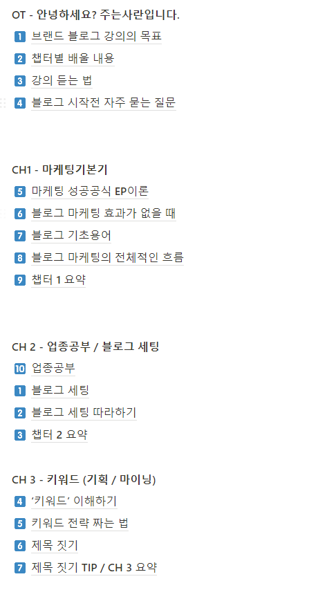
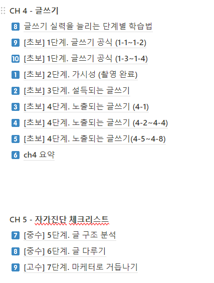
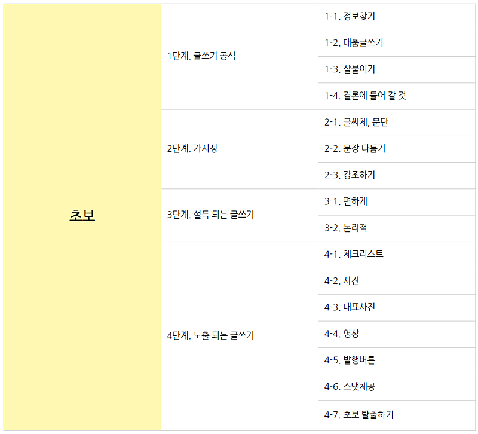
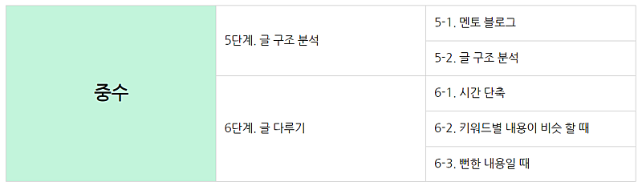
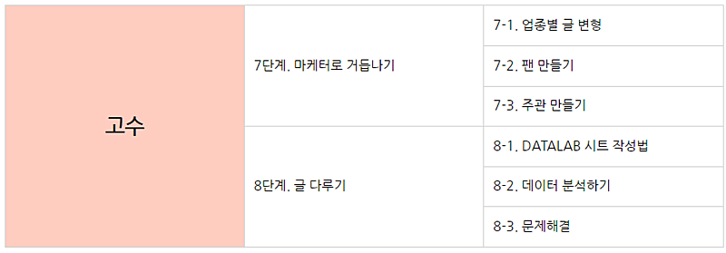
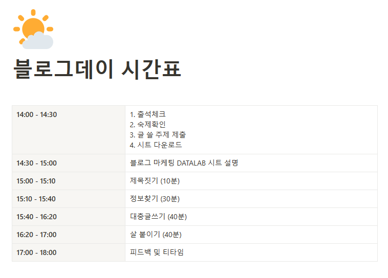
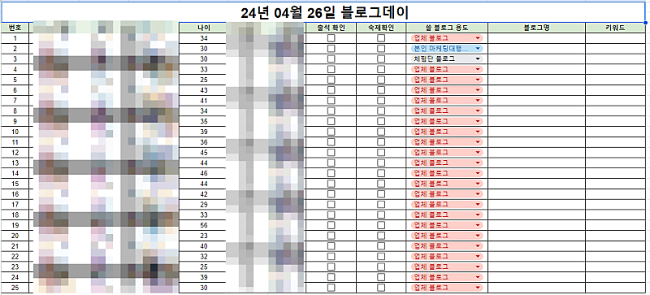
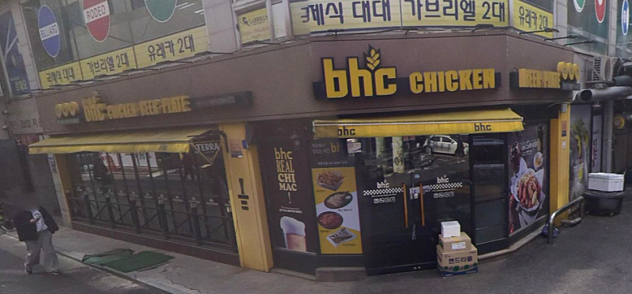

# 이번주 금요일에 하는 블로그데이에서는요.

- 원천 ID: EPR-CAFE-24160
- 작성자: 주는사란
- 작성일: 2024-04-24T15:25:36.017000+09:00
- 원문: https://cafe.naver.com/ranschool/24160
- 수집일: 2026-09-21
- 텍스트 정리: HTML 문단 순서 유지, 빈 문단·제로폭 공백만 제거. 원본 HTML·JSON 별도 보존. 이미지는 아래에 모아 보관하며 원래 배치는 HTML에서 확인.

## 원문 본문

<!-- P001 -->
혹시 블로그데이가 뭔지 모르시는 분은 아래 글을 참고해주세요~ 다음달에도 또 옵니다 ㅎㅎ

<!-- P002 -->
대한민국 모임의 시작, 네이버 카페

<!-- P003 -->
cafe.naver.com

<!-- P004 -->
드디어 블로그 강의 리뉴얼이 다음주면 대본이 완성이 됩니다!! 거의 두달동안 하루 4시간씩 수정을 했는데요.

<!-- P005 -->
글쓰기를 어려워하시는 것 같아서 글쓰기 단계를 아주 자세하게 나눴어요. 그래서 크게만 8단계 작게는 27단계로 나눠서 설명하고 있습니다.

<!-- P006 -->
이 모든 과정을 한번에 하기 위해 뭐 이런 시트를 만들었어요. 바로 이 시트를 이번주 금요일에 열리는 블로그 데이에서 해볼 예정입니다.

<!-- P007 -->
블로그 데이 시간표는 이렇습니다.

<!-- P008 -->
시간이 좀 빡셉니다.

<!-- P009 -->
블로그데이 신청한 25분은 꼭 숙제(블로그 100개 챌린지에 글 5개 쓰기)와 어디 블로그에 어떤 키워드로 글을 쓸건지 미리 정해와주세요.

<!-- P010 -->
숙제 안하시면 진짜 못 들어옵니다.

<!-- P011 -->
블로그데이 틈새이벤트

<!-- P012 -->
과제 가장 잘 하신 분

<!-- P013 -->
시간내에 글 작성 하신 분

<!-- P014 -->
글 가장 잘쓰신 분

<!-- P015 -->
중 5분을 뽑아 저와 함께 저녁식사를...🎁 요기에서 ▼

## 본문 이미지

## 원문에 포함된 링크

- https://cafe.naver.com/ranschool/22339
- #
