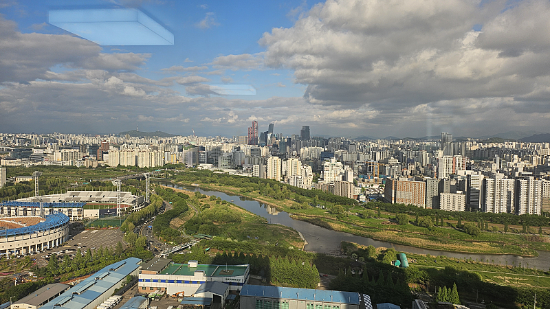

# 날씨가 참

- 원천 ID: EPR-CAFE-24167
- 작성자: 주는사란
- 작성일: 2024-04-24T17:29:30.863000+09:00
- 원문: https://cafe.naver.com/ranschool/24167
- 수집일: 2026-09-21
- 텍스트 정리: HTML 문단 순서 유지, 빈 문단·제로폭 공백만 제거. 원본 HTML·JSON 별도 보존. 이미지는 아래에 모아 보관하며 원래 배치는 HTML에서 확인.

## 원문 본문

<!-- P001 -->
아침에는 날씨가 안 좋아서 좀 우울했는데요. 다행히 지금은 다시 날씨가 좋아졌네요 :) 구름이 저 멀리 가서 그런가봐요. 문득 일하다가 창문을 보고서야 알았어요. 구름이 지나갔다는걸요.

<!-- P002 -->
구름은 언젠가 지나간다는걸 자꾸 까먹어요. 구름 아래에 있을 때는 구름 밖에 안보이잖아요. 그래서 다음에는 까먹지 않으려구요.

<!-- P003 -->
여러분도 저처럼 까먹지 마시라고 써봅니다 ㅎㅎ

## 본문 이미지

## 원문에 포함된 링크

- #
