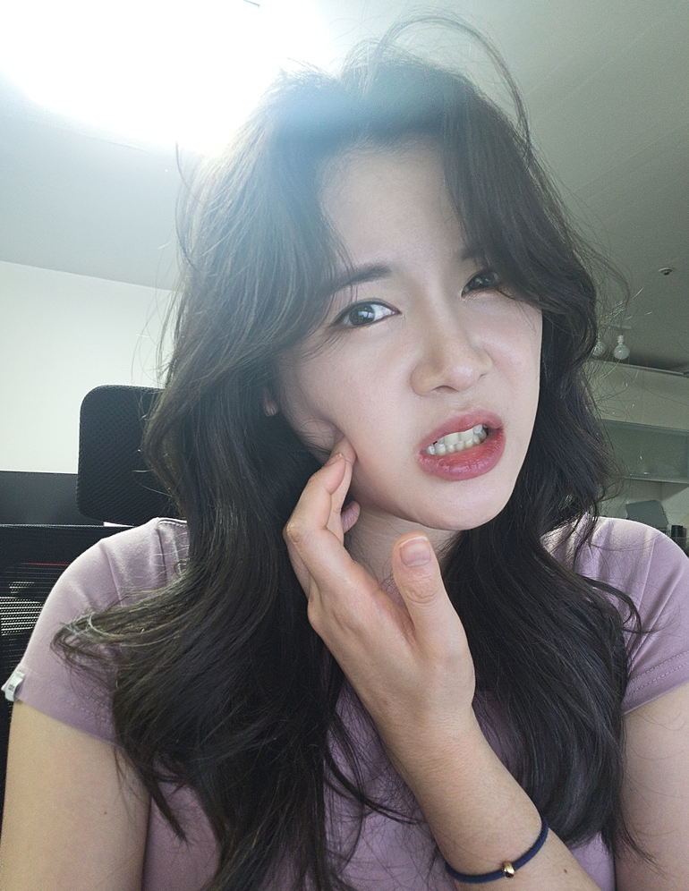

# 아파요

- 원천 ID: EPR-CAFE-24194
- 작성자: 주는사란
- 작성일: 2024-04-25T13:08:03.917000+09:00
- 원문: https://cafe.naver.com/ranschool/24194
- 수집일: 2026-09-21
- 텍스트 정리: HTML 문단 순서 유지, 빈 문단·제로폭 공백만 제거. 원본 HTML·JSON 별도 보존. 이미지는 아래에 모아 보관하며 원래 배치는 HTML에서 확인.

## 원문 본문

<!-- P001 -->
저는 오래 씹으면 턱에서 딱딱 소리가 나요. 특히나 입을 크게 벌리기가 좀 힘듭니다. 꽤 오래 됐어요. 근데 요즘은 좀더 심해진것 같아서 치과에 갔어요. 주사나 약을 받아오려구요.

<!-- P002 -->
그랬더니 의사분이 이렇게 말씀하시더라구요. "거북목이 심하시네요. 자세를 고치셔야 하구요. 아프겠지만 아프지 않는 선에서 계속 입 벌리는 연습을 하셔야 합니다. 입 근처 근육이 뭉쳐있어요~"

<!-- P003 -->
솔직히 뻔한 이야기 였어요. 다 알고 있었구요. 그러면서 이런 생각이 들더라구요. 어쩌면 나는 매번 내가 할 수 있는 최선은 안하면서 주사나 약을 바라지 않았나 싶더라구요. 주사나 약이 낫게 해주는게 아니라는걸 알면서도요. 매번 진통제만 찾았어요.

<!-- P004 -->
그래서 오늘은 진통제 대신 올바르게 앉기부터 시작했습니다. 그랬더니 참........불편......😅

## 본문 이미지

## 원문에 포함된 링크

- #
