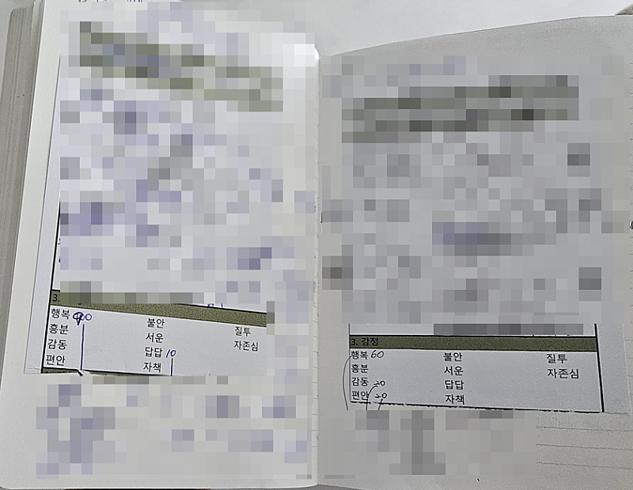
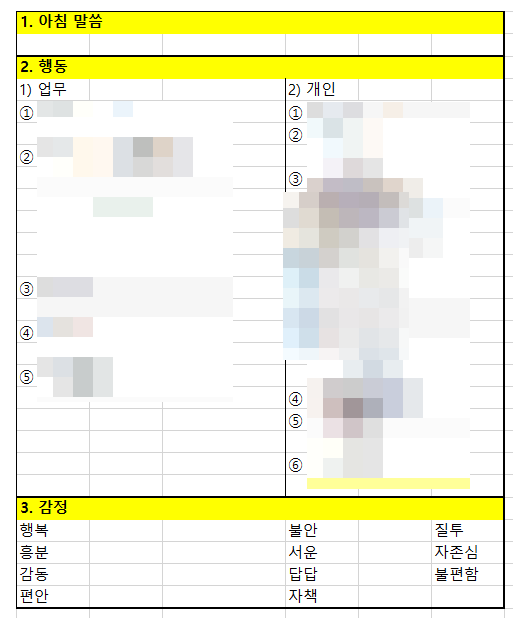
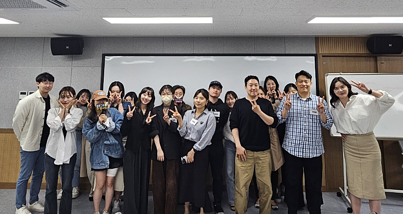
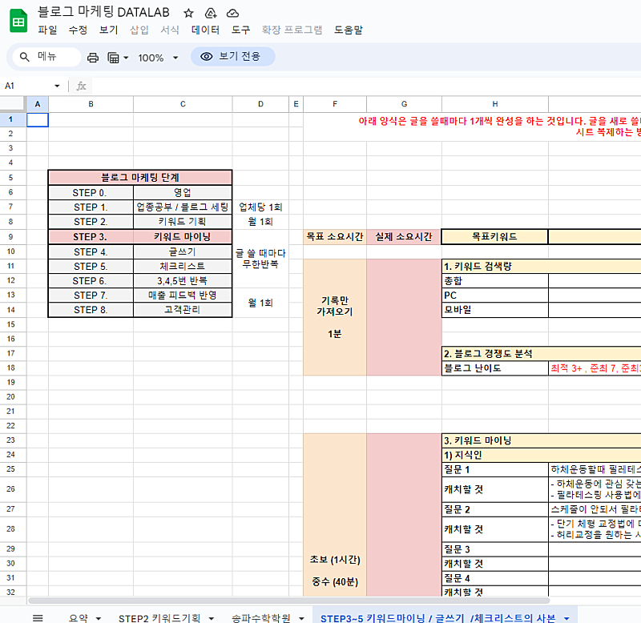
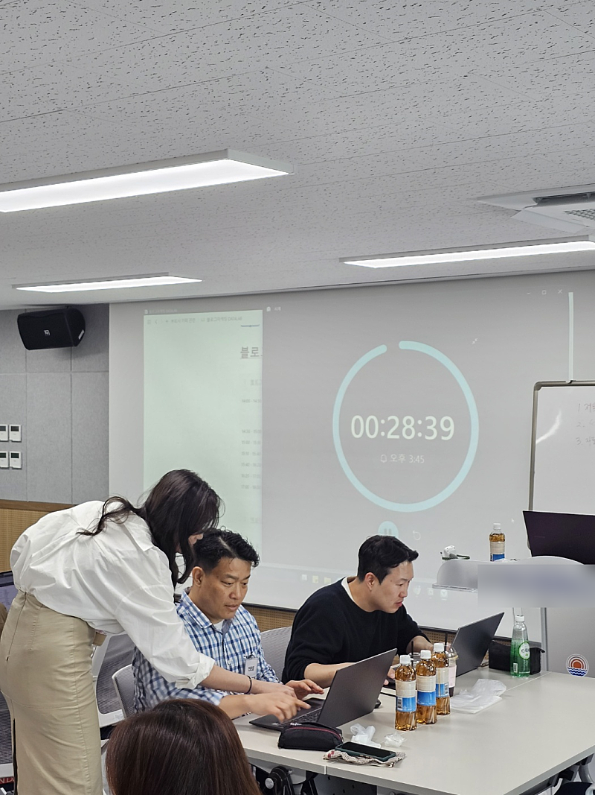
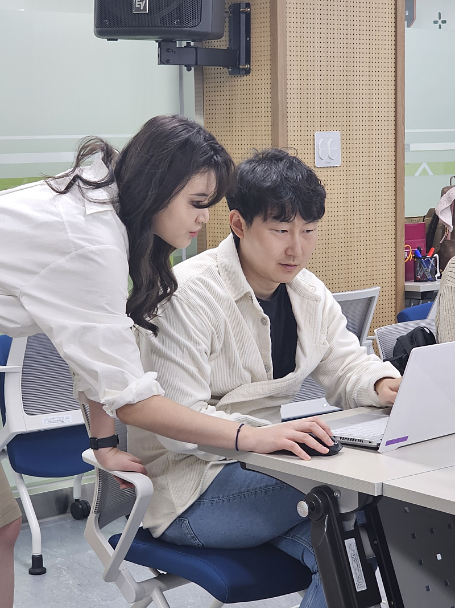
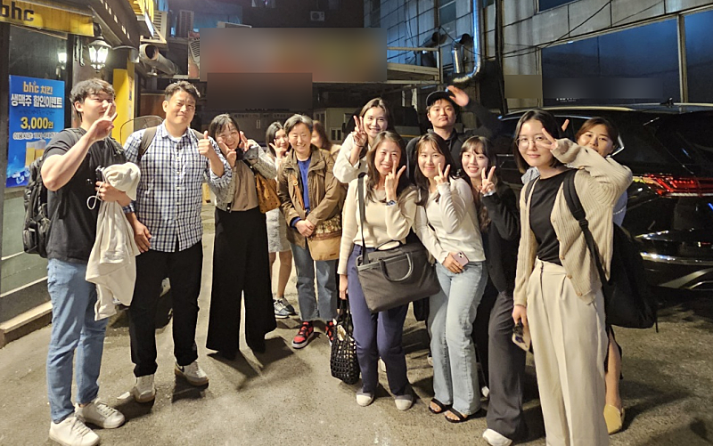
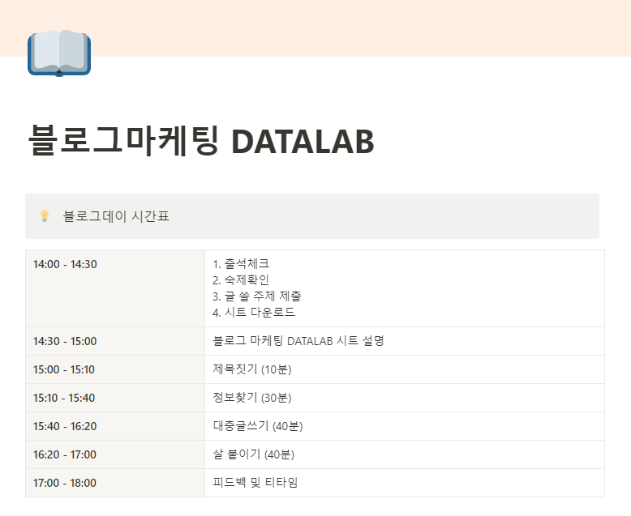

# 하루 평가표

- 원천 ID: EPR-CAFE-24284
- 작성자: 주는사란
- 작성일: 2024-04-27T16:11:47.137000+09:00
- 원문: https://cafe.naver.com/ranschool/24284
- 수집일: 2026-09-21
- 텍스트 정리: HTML 문단 순서 유지, 빈 문단·제로폭 공백만 제거. 원본 HTML·JSON 별도 보존. 이미지는 아래에 모아 보관하며 원래 배치는 HTML에서 확인.

## 원문 본문

<!-- P001 -->
저는 매일 밤 하루를 평가(?)합니다.

<!-- P002 -->
매일 하루를 평가하는 양식이 있거든요.

<!-- P003 -->
어제 제 감정은 행복 50 / 흥분 25 / 감동 25 이었습니다. 블로그데이(수강생분들 블로그 트레이닝)를 했거든요.

<!-- P004 -->
전 참 이런게 좋아요.

<!-- P005 -->
총 28분이 신청했고, 19분이 참석해주셨습니다. 이번에 블로그 강의를 리뉴얼하면서 아예 블로그를 작성하는 순서를 아주 자세하게 시트로 만들었는데요. 블로그데이에서 처음으로 공개할 생각에 흥분됐어요.

<!-- P006 -->
그리고 실제 어떻게든 해보려는 분들의 모습에 행복했어요.

<!-- P007 -->
그래서 원래 계획에도 없던 뒷풀이까지 했습니다.

<!-- P008 -->
40대부터 다시 뭘 배우려는 분들은 너무 멋있었어요. 저도 그 나이가 되어도 그 눈빛을 잃지 않고 싶어요.

<!-- P009 -->
2030은 이제 새로운 세계에 신기해 하시는 모습이 너무 귀여웠어요. 순수함(?)을 저도 잃지 말아야겠어요.

<!-- P010 -->
물론 처음이라 다들 힘들어하셨지만ㅎㅎ 뭐 그거야 다음에 할 때 좀더 천천히 하면 되죠. 어제는 글 하나를 작성하는 시간을 줄이기 위해 각 단계별로 글을 시간재고 써보는 연습을 했는데요.

<!-- P011 -->
다음에는 좀더 천천히~ 하루에 한단계씩 해봐야겠어요 ㅎㅎ

<!-- P012 -->
다음 블로그데이 예상일정

<!-- P013 -->
5월 15일 (부처님오신날)

<!-- P014 -->
5월 25일 (토)

<!-- P015 -->
5월 31일 (금)

<!-- P016 -->
6월 6일 (현충일)

<!-- P017 -->
위 4가지 일정 중 하루에 진행할 예정입니다.

<!-- P018 -->
그럼 모두들 다음에 봐요

## 본문 이미지

## 원문에 포함된 링크

- #
