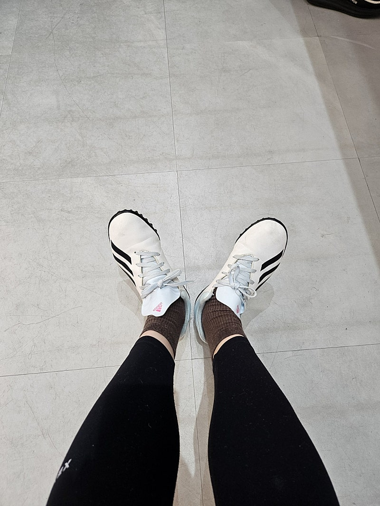

# 아무 것도 하기 싫은날

- 원천 ID: EPR-CAFE-24348
- 작성자: 주는사란
- 작성일: 2024-04-29T20:07:32.917000+09:00
- 원문: https://cafe.naver.com/ranschool/24348
- 수집일: 2026-09-21
- 텍스트 정리: HTML 문단 순서 유지, 빈 문단·제로폭 공백만 제거. 원본 HTML·JSON 별도 보존. 이미지는 아래에 모아 보관하며 원래 배치는 HTML에서 확인.

## 원문 본문

<!-- P001 -->
오늘은 정말 아무 것도 하기 싫었어요. 어떤 일이 있었던 건 아니예요. 아무 일도 없어서 아무 것도 하기 싫었어요.

<!-- P002 -->
이런 날이 두달에 한번 정도는 오는데요. 근데 저는 이런 날이면 꼭 아무거나 하는 편이예요. 이런 날에는 꼭 하려고 했던걸 어떻게든 하는 편이예요.

<!-- P003 -->
제가 아이들 가르치면서 느낀건데요. 공부 잘하는 애들은 남들이 많이 할 때 더 많이 하는 애들이 아니구요. 남들이 안할 때 좀 '덜' 안하는 애들이더라구요. 뭐라도 조금 하는거죠.

<!-- P004 -->
그래서 저는 아무 것도 하기 싫은 날에 좀 '덜' 안해요. 아무 것도 하기 싫은 날에는 아무거나 해요.

<!-- P005 -->
오늘 진짜 일 하기 싫어서 사무실에 조금 늦게 갔어요. 그래도 하려던 일은 꾸역꾸역 다했어요.

<!-- P006 -->
오늘 진짜 운동하기 싫어서 아침에 러닝 안했어요. 그래도 유산소는 하려고 지금 풋살 하러 왔어요.

<!-- P007 -->
가장 잘 할수 있을 때 많이 잘하는 것도 중요하지만, 가장 못 할 때 덜 못하는 것도 중요하잖아요. 저는 그냥 그런 사람이예요

## 본문 이미지

## 원문에 포함된 링크

- #
