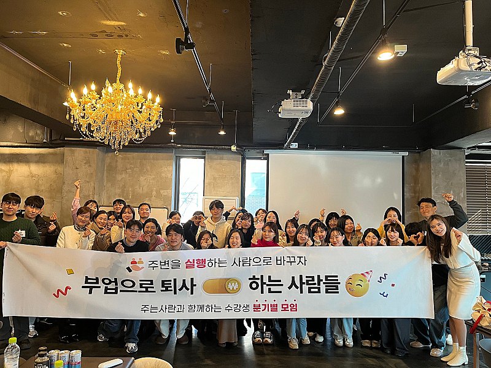

# 검이불루 화이불치

- 원천 ID: EPR-CAFE-24406
- 작성자: 주는사란
- 작성일: 2024-05-01T22:10:59.500000+09:00
- 원문: https://cafe.naver.com/ranschool/24406
- 수집일: 2026-09-21
- 텍스트 정리: HTML 문단 순서 유지, 빈 문단·제로폭 공백만 제거. 원본 HTML·JSON 별도 보존. 이미지는 아래에 모아 보관하며 원래 배치는 HTML에서 확인.

## 원문 본문

<!-- P001 -->
오늘 우연히 저에 대해 안좋게 적은 글을 봤습니다. 원래 저는 이런 글에 쉽게 힘들어 하는 성격인데 오늘은 오히려 힘이 생겼습니다. 내용도 다 말도 안되는 이야기만 적혀있었지만, 이런 댓글이 있더라구요.

<!-- P002 -->
"주는사란은 찐이예요"

<!-- P003 -->
"수강생인데, 저 사람은 진심이 느껴져요"

<!-- P004 -->
그 댓글 아래에는 이런 답글이 있더라구요. "너 주는사란이냐?ㅋㅋㅋㅋㅋㅋㅋㅋㅋㅋㅋ"

<!-- P005 -->
뭔가 인생을 살면서 진심이 제대로 전달되었다는 느낌을 거의 처음 받아본 것 같아요. 그래서 너무 행복했어요. 어떤 분인지 모르지만 두분 진심으로 감사합니다.

<!-- P006 -->
유튜브를 하다보면 억울할 때가 많아요. 분명 영상에서 말 한 내용인데 왜 설명 안했냐고 제대로 보지도 않고 욕하는 사람도 있구요. 내 의도를 잘못 파악하고 확대해석해서 욕하는 사람도 있습니다. 정보를 더 자세히 알려줘야만 한다는 식으로 반협박 하는 사람도 있구요.

<!-- P007 -->
처음에는 이런 사람들을 보면 황당했어요. 화도 났구요. 그 다음에는 "내가 이런 사람들까지 품어야 진짜가 되는거지" 라는 생각에 정성스럽게 답글을 다 달고 더 피드백을 하기도 했어요. 근데 이런 사람들은 끝이 없더라구요. 그리고 1년이 된 지금은 내 가치를 알아주는 사람에게만 최선을 다하자는 생각입니다.

<!-- P008 -->
검이불루 화이불치

<!-- P009 -->
검소하나 누추하지 않고, 화려하나 사치스럽지 않게 사려구요.

<!-- P010 -->
알려졌으나 유명하지 않고, 자랑스러우나 으스대지 않고 사려구요.

<!-- P011 -->
최선을 다하나 오바하지 않고, 진심을 전하나 부담스럼게 하지 않으려구요.

<!-- P012 -->
그렇게 살기로 마음먹은지 얼마 안됐는데.... 이미 제 마음을 알아주신 그 두분이 있어 너무 행복한 하루였습니다.

## 본문 이미지

## 원문에 포함된 링크

- #
